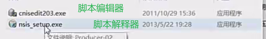

# QT

> 《Qt5.9C++开发指南》

## 第一章：认识Qt

### 1.4 编写一个HelloWorld程序

#### 1.4.1 新建一个项目

项目类型：

+ Widget：基于操作系统GUI的界面应用程序
+ Console：控制台应用程序，无GUI
+ Quick：可部署的Quick程序，Quick是Qt支持的一套GUI开发架构，界面采用QML语言，一般用于移动设备或者嵌入式设备上无边框的应用程序的设计

Windows开发一般就是Widget，创建项目后，需要选择基类：

+ QMainWindow：主窗口类，有主菜单栏，工具栏和状态栏
+ QWidget：所有可视界面类的基类，组件类
+ QDialog对话框类，可以建立一个基于对话框的界面

该界面会出现Generate from复选框，如果勾选，ide会创建用户界面文件（UI）

## 第三章：Qt类库概述

### 3.1 Qt核心特点

#### 3.1.1 概述

相比标准C++，Qt加入了**元对象编译器**(Meta-Object Compiler,MOC)。这是一个预处理器，在源程序被编译前先将这些Qt特性的程序转换为标准的C++兼容的新式。比如，如果使用信号和槽机制，就必须添加一个Q_OBJECT的宏。

#### 3.1.2 元对象系统

基本组成：

+ QObject类是所有使用元对象系统的基类

+ 在类的private部分声明Q_OBJECT宏，使得类可以使用元对象的特性，如动态属性、信号和槽

+ MOC(元对象编译器)为每个QObject的子类提供必要的代码来实现元对象系统的特性

  > 工作原理就是，MOC工具读取C++源文件，当发现类中有Q_OBJECT宏的时候，就会为这个类生成另外一个包含有元对象支持代码的C++源文件一起参与编译链接

除了信号和槽机制外，元对象还提供如下功能：

+ QObject::metaObject()函数返回类关联的元对象，元对象类QMetaObject包含了访问元对象的一些接口函数，比如（类似动态属性，元编程内容`typeid`...）：

  ```c++
  QObject *obj = new QPushButton;
  obj->metaObject()->className();//"QPushButton"
  ```

+ QMetaObject::newInstance()函数创建类的一个新的实例

+ QObject::inherits(const char*className)判断一个对象实例是否是名称为className的类或QObject的子类实例（类似`std::is_derived_of`）

  ```c++
  QTimer* timer = new QTimer;
  timer->inherits("QTimer");//true
  timer->inherits("QObject");//true
  timer->inherits("QPushButton");//false
  ```
  
+ QObject::tr()和QObject::trUtf8()可翻译字符串，用于多语言界面设计（16章）
  
+ QObject::setProperty()和QObject()函数通过属性名称动态设置和获取属性值。
  

动态投射`qobject_cast`实际上就是多态：

```c++
QObject *obj = new QDerivedWidget;
QWidget *widget = qobject_cast<QWidget*>(obj);//ok
QDerivedWidget* myWidget = qobject_cast<QDerivedWidget*>(obj);//ok
//实际上都是父类指针指向子类对象，父类指针可以转换为
```

#### 3.1.3 属性系统

##### 1.属性定义

Q_PROPERTY()宏可以定义属性，也是基于元对象系统实现的。使用格式如下：

```c++
Q_PROPERTY(type name
           (READ getFunction [WRITE setFunction] |
            MEMBER memberName [(READ getFunction | WRITE setFunction)])
           [RESET resetFunction]
           [NOTIFY notifySignal]
           [REVISION int]
           [DESIGNABLE bool]
           [SCRIPTABLE bool]
           [STORED bool]
           [USER bool]
           [CONSTANT]
           [FINAL])
```

该宏定义返回一个类型为type，名称为name属性，用READ、WRITE关键字定义属性的读取、写入函数。属性的类型可以是`QVariant`支持的任何类型。

关键字解释：

+ 如果MEMBER关键字没有被指定，则一个READ访问函数是必须的。它被用来读取属性值。理想的情况下，一个const函数用于此目的，并且它必须返回的是属性类型或const引用。比如：QWidget::focus是一个只读属性，通过READ函数QWidget::hasFocus()访问。
+ 一个WRITE访问函数是可选的，用于设置属性的值。它必须返回void并且只能接受一个参数，属性的类型是类型指针或引用，例如：QWidget::enabled具有WRITE函数QWidget::setEnabled()。只读属性不需要WRITE函数，例如：QWidget::focus没有WRITE函数。
+ 如果READ访问函数没有被指定，则MEMBER变量关联是必须的。这使得给定的成员变量可读和可写，而不需要创建READ和WRITE访问函数。如果需要控制变量访问，仍然可以使用READ和WRITE函数而不仅仅是MEMBER（但别同时使用）。
+ 一个RESET函数是可选的，用于将属性设置为上下文指定的默认值。例如：QWidget::cursor有READ和WRITE函数QWidget::cursor()和QWidget::setCursor()，同时也有一个RESET函数QWidget::unsetCursor()，因为没有可用的QWidget::setCursor()调用可以确定的将cursor属性重置为上下文默认的值。RESET函数必须返回void类型，并且不带任何参数。
+ 一个NOTIFY信号是可选的。如果定义了NOTIFY，则需要在类中指定一个已存在的信号，该信号在属性值发生改变时发射。与MEMBER变量相关的NOTIFY信号必须有零个或一个参数，而且必须与属性的类型相同。参数保存的是属性的新值。NOTIFY信号应该仅当属性值真正的发生变化时发射，以避免被QML重新评估。例如：当需要一个没有显式setter的MEMBER属性时，Qt会自动发射信号。
  一个REVISION数字是可选的。如果包含了该关键字，它定义了属性并且通知信号被特定版本的API使用（通常是QML）；如果没有包含，它默认为0。
+ DESIGNABLE属性指定了该属性在GUI设计器（例如：Qt Designer）里的编辑器中是否可见。大多数的属性是DESIGNABLE （默认为true）。除了true或false，你还可以指定boolean成员函数。
+ SCRIPTABLE属性表明这个属性是否可以被一个脚本引擎操作（默认是true）。除了true或false，你还可以指定boolean成员函数。
+ STORED属性表明了该属性是否是独立存在的还是依赖于其它属性。它也表明在保存对象状态时，是否必须保存此属性的值。大多数属性是STORED（默认为true）。但是例如：QWidget::minmunWidth()的STROED为false，因为它的值从QWidget::minimumSize()（类型为QSize）中的width部分取得。
  USER属性指定了属性是否被设计为用户可见和可编辑的。通常情况下，每一个类只有一个USER属性（默认为false）。例如： QAbstractButton::checked是（checkable）buttons的用户可修改属性。注意：QItemDelegate获取和设置widget的USER属性。
+ CONSTANT属性的出现表明属性是一个常量值。对于给定的object实例，常量属性的READ函数在每次被调用时必须返回相同的值。对于不同的object实例该常量值可能会不同。一个常量属性不能具有WRITE函数或NOYIFY信号。
  FINAL属性的出现表明属性不能被派生类所重写。有些情况下，这可以用于效率优化，但不能被moc强制执行。必须注意不能覆盖一个FINAL属性。

##### 2.属性的使用

只要知道属性的名称，就可以通过QObject::property()读取属性值，并且通过QObejct::setProperty()设置属性值。例如：

```c++
QPushButton *button = new QPushButton;
QObject* object = button;
object->setProperty("flast",true);
bool isFlat = object->property("flat");
```

##### 3.动态属性

QObject::setProperty()可以在运行时为类定义一个新的属性，使用方法和使用Q_PROPERTY定义的属性一样。

比如，如果一些字段是必填字段，就可以为这些字段设置一个新的属性，再根据属性将这些字段的样式定义为背景绿色（样式定义：16.2节）

```c++
editName->setProperty("required","true");
comboSex->setProperty("required","true");
checkAgree->setProperty("required","true");
//使用演示定义
*[required="true"]{background-color:green}
```

##### 4.类的附加信息

Q_CLASSINFO(),可以为类的议案对象定义键值对信息:

```c++
class QMyClass:public QObject{
  Q_OBJECT
  Q_CLASSINFO("author","hcc")
  Q_CLASSINFO("company","GPZN")
public:
    ....
};

//使用,该函数返回一个对象，有name()和value()两个函数
QMetaClassInfo QMetaObject::classInfo(int index) const;
```

#### 3.1.4 信号和槽

实现对象间的通信，“事件-响应”机制，虽然比回调函数相比执行较慢（开发级别，应用级别很难察觉），但是比回调函数灵活。

##### 信号和槽函数绑定`connect`：

```c++
//形式1,可读性好一些，但是括号太多
connect(sender,SIGNAL(signal(int,string)),receiver,SLOT(slot(int,string)));
//形式2,信号和槽函数都必须没有重载,相对简洁一些
connect(sender,&Sender::singal,reciever,&Reciever::slot);
```

两种形式的connect()函数最后都有一个默认参数`Qt::ConnectionType type=Qt::AutoConnection`。`Qt::ConnectionType`是一个枚举值，代表信号和槽之间的关联方式：

+ `Qt::AutoConnection`:如果接收者和发送者在同一个线程，就使用`Qt::DirectConnection`，否则使用`Qt::QueuedConnection`
+ `Qt::DirectConnection`：信号被发射后立刻执行，槽函数和信号在同一个线程中
+ `Qt::QueuedConnection`：在事件循环回到接收者线程后执行槽函数，槽函数和信号不在同一个线程。
+ `Qt::BlockingQueuedConnection`:和`Qt::QueuedConnection`的区别是，信号线程会阻塞直到槽函数执行完成。当信号和槽在同一个线程时，该方式会造成死锁

##### `sender()`获取信号发射者

在槽函数中，可以使用`QObject::sender()`获得信号发送者的指针。如果知道信号发射者的类型，可以将指针投射为确定的类型，然后使用这个确定类的接口函数。

##### `emit`发射自定义的信号

信号函数必须没有返回类型，信号函数无需实现

```c++
class Test::public QObject
{
  Q_OBJECT
signals:
    void mySignal(int);
public:
    void Func();
slots:
    void mySlot(int);
};
Test::Test(){
    connect(this,SIGNAL(mySignal(int)),this,SLOT(mySlot(int)));
}

void Test::Func(){
    int s{10};
    emit mySignal(s);
}

void Test::mySlot(int i){
    std::cout << "recv from signal:" << i << std::endl;
}

```

### 3.3 容器类

Qt的容器是隐式共享和可重入的，并且进行了速度和存储优化，可以减少可执行文件的大小，并且是线程安全的。

Qt容器类分为顺序容器和关联容器，提供了STL类型和Java类型的迭代器。前者更高效，后者更方便使用。

#### 3.3.2 顺序容器类

> QList,QLinkedList,QVector,QStack,QQueue

**QList**

本质上是一个动态数组的链表。

以数组列表的形式实现，基本上还是一个数组，支持下标访问。常用函数:insert(),replace(),removeAt(),move(),swap(),append(),prepend(),removeFirst(),removeLast()...

**QLinkedList**

真正的链式结构，数据并非连续存储的，基于迭代器访问数据，插入和删除时间复杂度相同。和QList基本相同，但是没有提供下标访问

**QVector**

动态数组，同vector

**QStack**

适配器，同STL

**QQueue**

适配器，同STL

#### 3.3.3 关联容器类

QMap,QMultiMap,QHash,QMultiHash,QSet都是基础的数据结构，只是实现和STL不同

### 3.4 容器类的迭代

STL形式的操作和STL一致，Java类型的形式如Python这种迭代器一样，使用next()等函数进行访问。

Qt提供了foreach(var,container),就是C++的范围for

## 第四章：常用界面设计组件

### 4.1字符串的输入和输出

#### 4.1.1 字符串与数值之间的转换

QLabel:显示字符串

QLineEdit:显示和输入字符串

### 4.2 SpinBox的使用

QSpinBox用于整数的显示和输入，默认显示十进制，也可以显示十六进制、二进制，并且可以在现实框增加前缀或者后缀

QDoubleSpinBox用于浮点数的显示和输入，可以设置显示小数的伪数，也可以设置前缀或者后缀

### 4.3 其他数值输入和显示组件

+ QSlider：滑动条，通过滑动来设置数值，可用于数值输入
+ QScrollBar：卷滚条，和QSlider功能类似，还可以用于卷滚区域
+ QProgressBar：进度条
+ QDial：表盘式数值输入组件，通过转动表针获得输入值
+ QLCDNumber:模仿LCD数字的显示组件

### 4.4 时间日期与定时器

#### 4.4.1 时间日期相关的类

+ QTime：仅表示时间
+ QDate：仅表示日期
+ QDateTime：日期以及时间

Qt中专门用于日期、时间编辑和显示的界面组件：

+ QTimeEdit：编辑和显示时间的组件
+ QDateEdit：编辑和显示日期的组件
+ QDateTimeEdit：编辑和显示日期和时间的组件
+ QCalendarWidget：通过日历形式选择日期的组件

定时器在设定的时间到达的时候，会发射定时器的timeout()信号，QTimer直接从QObject类继承来，不是界面组件类

#### 4.4.4 定时器的使用

QTimer的主要属性是interval，是定时中断的周期，单位毫秒。主要信号时timeout()

### 4.5 QComboBox和QPlainTextEdit

#### 4.5.1 功能概述

QComboBox是下拉列表框组件类，提供一个下拉列表供用户使用，每个item可以关联一个QVariant变量，存储一些不可见的数据。

QPlainTextEdit是一个多行文本编辑器，可以用来显示和编辑多行简单文本。

#### 4.5.3 QPlainTextEdit的使用

QPlainTextEdit的文字内容以QTextDocument类型存储，函数document()返回文档对象的指针。

QTextDocument是内存中的文本对象，以文本块的方式存储，一个文本块就是一个段落，每个段落以回车符结束

一个document有多个TextBlock

### 4.6 QListWidget和QToolButton

#### 4.6.1 功能概述

处理项的组件有两类，一类是Item Views；另一类是Item Widgets。

Item Views基于模型/视图(Model/View)结构（ch05）

Item Widgets是直接将数据存储在每一个项中，每个项存储各自的数据。

+ QTabWidget:设计多页工具，联想excel文件下的sheet1...:
  
+ QToolBox：多组工具箱：

+ Action:主工具栏点击动作，类似按钮，自动部署上位机的主工具栏

+ QToolButton:就是主菜单栏下的action可以当做按钮拉出到界面上面

### 4.7 QTreeWidget和QDockWidget

QTreeWidget：文件树

QDockWidget：可以在MainWindow窗口停靠，或者在桌面最上层浮动的界面组件

### 4.8 QTableWidget

表格类

## 第五章：Model/View结构

核心：model和数据直接交互，而view是model的一个视图，view和widget的区别是，没有太多的内存占用。

### 5.2 QFileSystemModel

QFileSystemModel提供了一个可用于访问本机文件系统的数据模型。QFileSystemModel和QTreeView结合使用，可以以目录树的形式显示本机上的文件系统，类似Windows的资源管理器

### 5.3 QStringListModel

QStringListModel用于处理字符串列表的数据类型，它可以作为QListView的数据模型，在界面上显示和编辑字符串列表

### 5.4 QStandardItemModel

以item为数据，可以和QTableView结合管理二维形式的数据。QStandardItemModel和QTableView的交互可以通过QItemSelectionModel来跟踪视图组件的单元格的选择状态。

## 第六章 ：对话框与多窗体设计

### 6.1 标准对话框

#### 6.1.2 QFileDialog对话框

就是windows中的文件资源管理器，可以选择文件，目录等。。。

工作中的选择todesk配置文件地址弹出的对话框

#### 6.1.3 QColorDialog

选择颜色的对话框，打开一个类似调色板的对话框

#### 6.1.4 QFontDialog对话框

选择字体的对话框，弹出界面类似word中的字体设置选项界面

#### 6.1.5 QInputDialog标准输入对话框

弹出一个单行输入的对话框

#### 6.1.6 QMessageBox

主要用于:

+ 简单消息提示，警告信息，错误信息等
+ 确认选择对话框(yes,no,cancel)

比工作中直接自定义一个Dialog(Tips)要快捷

### 6.2 自定义对话框

#### 调用和返回值

自定义对话框如果想要操作只能在对话框中，而不能返回主界面操作，可以使用exec()函数启动（以模态方式显示）,官网解释该函数

> Shows the dialog as a modal dialog, blocking until the user closes it. The function returns a DialogCode result
>
> 模态方式只能在当前界面操作，而show函数以非模态方式启动，可以返回主界面进行操作

对话框中的内容可以在用户点击确定(QDialog::Accept())后，通过自定义的getter获取对话框中组件获取到的值。------>比工作中自己通过信号传递可读性强

**`exec()+getter()` 或者`show()+emit`**都可以

#### 置顶显示和内存优化

```c++
// 对话框置顶
Qt::WindowFlags flags= class_name->windowFlags();
setWindowFlags(flags|Qt::WindowStaysOnTopHint);
// 对话框关闭自动删除
//经验教训：如果用户手动关闭，closeevent需要重写逻辑进行
setAttribute(Qt::WA_DeleteOnClose);
```

#### 调用父窗口

`parentWidget()`函数可以返回父窗口的指针

```c++
MainWindow* parentWindow = (MainWindow*)parentWidget();
```

## 第七章：文件系统和文件读写

###  7.1 文本文件读写

#### 7.1.1 实例功能概述

两种方式:

+ QFile直接读写
+ QFile和QTextStream结合，使用流进行读写

#### 7.1.2 QFile读写文本文件

QFile类直接和IO设备打交道。是对原生open,read,write,close的封装

#### 7.1.3 QFile和QTextStream结合读写文件

QTextStream可以和QFile,QtemporyFile,QBuffer,QTcpSocket等IO设备类结合使用

C++中的fstream差不多

### 7.2 二进制文件读写

#### 7.2.1 实例功能概述

QDataStream和QFile结合使用，QDataStream以数据流的方式读写文件内容

使用QDataStream保存文件时使用的数据编码的方式不同：

+ 文件后缀为`.stm`，即使用的是Qt自定义的序列化协议，即对每种数据类型都采用了Qt自己的编码，在读取的时候可以进行反序列化
+ 文件后缀为`.dat`，完全使用二进制数据序列化/反序列化

# Projected_based

## 小试牛刀

### 模块化exec和show

对于DIalog类，可以通过exec启动，并在类中通过done(Accept|Rejected)发送当前类返回结果


### 图标设置

打包前可以使用icon图片设置可执行程序的图标，需要再CMake中更改，构建之后在发布的时候就不需要原始的icon文件了。

### 打包

可以逐个动态库进行添加，这样可以精简整个软件的大小。缺失的动态库可以到编译器的bin目录下去找

 

###  软件安装和卸载

 工具： 
