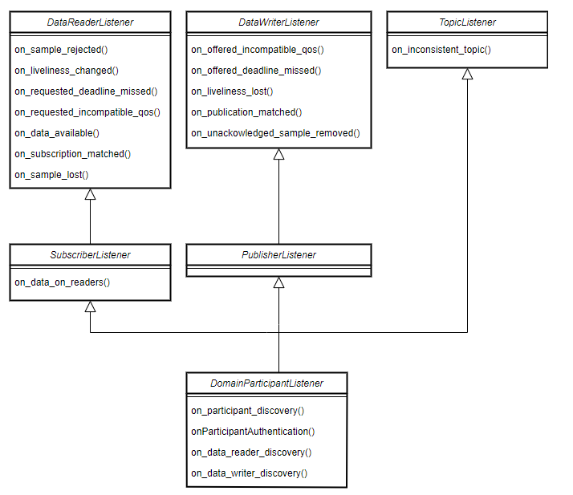

# fast DDS

> 仅C++版本

## ch01 开始

### 1.1 什么是DDS

数据分发服务(Data Distribution Service,DDS)是为分布式软件通信提供的一种以数据为中心的通信协议。该协议描述了支持数据提供者(data providers)和数据消费者(data consumers)之间通信的通信接口（APIs）以及通信语义(Communication Semantics)

因为DDS是一个以数据为中心的发布订阅模型(Data-Centric Publish Subscribe model,aka DCPS),所以它的实现中有三个应用实体：

+ 发布实体：负责定义信息生成对象以及属性
+ 订阅实体：负责定义信息消费对象以及属性
+ 配置实体：定义作为话题传输的消息类型，以及根据消息质量(Quality of Service,aka QoS)创建发布者和订阅者，并确保以上实体有正确的性能（即创建发布者和订阅者，并提供可靠的QoS）

DDS使用QoS来定义DDS实体的行为特征。QoS由独立的QoS策略（由QoSPolicy派生出来的类型对象）组成。这些内容在3.1.2策略章节描述

#### 1.1.1 DCPS概念模型

在DCPS模型中，为通信应用程序系统定义了四个基础元素：

+ **发布者(**Publisher)：DCPS中负责创建和配置*写数据者*(DataWriters)的实体。写数据者(DataWriters)是实际上负责发送数据的实体。每个实体都将在指定的话题(Topic)下发送数据。更多细节在3.3章节叙述
+ **订阅者**(Subscriber):DCPS中负责接收自己所订阅话题下的信息的实体。它提供一个或多个*数据接受者*(DataReader)对象,负责将新数据的有效性传递给应用程序。更多细节在3.4章节叙述
+ **话题**(Topic):DCPS中绑定发布和订阅的实体。在一个DDS范围内，话题是唯一的。通过*话题描述*(TopicDescription)，它统一了发布和订阅的数据类型。更多细节在3.5章节叙述
+ 域(Domain):这是用来连接所有在相同或者不同应用程序中，通过不同话题进行数据交换的发布者和订阅者的概念。参加同一个*域*的独立程序被称作*域成员*(DomainParticipant)。DDS域由域ID进行识别。域成员通过定义域ID来指定自己所属域。在网络中，两个不同ID的域成员，彼此并不知晓对方的存在。因此，可能会创建多条通信通道。这些是为了以下场景所设计的：当存在多个DDS应用程序参与时，彼此的域成员在相互交互时，不同的DDS应用程序不得相互干扰。域成员对于其他DCPS实体来说像一个容器，对于发布者、订阅者以及话题实体来说像一个工厂，并在域中提供管理服务。更多细节在3.2章节叙述

DDS域中的DCPS模型实体示例图如下：


### 1.2 什么是RTPS

*实时发布订阅*(Real-Time Publish Subscribe)协议是依赖最大努力交付传输协议（如UDP/IP），为DDS应用设计的一个发布-订阅通信中间件。此外，Fast DDS还提供TCP以及共享内存(Shared Memory,aka SHM)传输方式。

该协议是为了支持单播以及多播通信设计的。

RTPS的最顶层定义了一个单独的通信层，这点继承自DDS的域(Domain)概念。多个域可以在同一时间独立的共存。一个域包含任意数量的*RTPS成员*（RTPSParticipants,能够发送和接收数据）。为了实现这些，RTPS成员使用它们的*端点*(Endpoints):

+ RTPSWriter:发送数据的端点
+ RTPSReader:接收数据的端点

一个RTPS成员可以由任意数量的读写端点，RTPS抽象图如下：


通信围绕*话题*(Topics)展开，话题定义和标记要交换的数据。话题并不属于某个特定的成员。成员通过*写端点*(RTPSWriter)对某个话题下发布的数据进行修改，并通过*读端点*(RTPSReader)在相应的话题下接收该数据。通信单元称之为*变化*(Change),代表某个话题下的数据中的一次更新。读写端点在自己的*历史*(History，作为存储最近变化的一个缓存服务)中注册这些变化

在默认配置的Fast DDS中，当你使用写端点（RTPSWriter）发布一个变化，将发生以下步骤：

+ 将变化添加至写端点的历史中
+ 写端点将变化发送给所有自己记录的读端点
+ 在读端点接收到数据后，读端点根据新变化更新自己的历史缓存

但是，Fast DDS支持多种多样的配置，允许你更改读写端点的行为。对默认的RTPS实体配置进行修改，意味着读写端点之间的数据交换流将会发生改变。此外，你可以通过选择服务质量(QoS)策略来影响如何管理历史缓存，但通信流程不会变化。FastDDS中如何实现RTPS协议的细节，可以在第四章继续阅读。

### 1.3 写一个简单的C++发布者订阅者应用

本节手把手教学如何使用C++ API创建一个FastDDS的发布者订阅者应用。也可以使用Fast DDS-Gen工具自动生成该小节实现的应用。使用Fast DDS-Gen的方法在第三章介绍。

#### 1.3.1 背景

DDS是实现了DCPS模型的以数据为中心的通信中间件。该模型基于发布者（数据生产者）和订阅者（数据消费者）。这些实体通过话题（话题绑定上述两个实体，即绑定发布者和订阅者）进行通信。发布者在话题下发布数据，订阅者在同一话题下接收数据

#### 1.3.2 前置条件

首先，你需要根据安装手册安装eProsima Fast DDS以及其所有依赖。同时也要安装好eProsima Fast DDS-Gen工具。注意，本教程的所有命令都是基于Linux系统的。

#### 1.3.3 创建工作空间

应用工作空间的最后的结构应该如下。`build/DDSHelloWorldPublisher`和`build/DDSHelloWorldSubscriber`分别是发布者和订阅者的应用程序：


首先，创建目录树：

```shell
mkdir workspace_DDSHelloWorld && cd workspace_DDSHelloWorld
mkdir src build
```

#### 1.3.4 导入依赖以及链接库

DDS应用依赖Fast DDS以及Fast CDR库。不同环境安装这些依赖的步骤会有所不同。

##### 1.3.4.1 通过可执行文件安装和手动安装

如果已经通过可执行文件安装或者手动安装，这些库应该已经可以从工作空间进行访问。在Linux下，Fast DDS以及Fast CDR头文件应该分别在`/usr/include/fastdds`以及`/usr/include/fastcdr`。链接库应该在`/usr/lib`。（橙子注：官网教程中，源码安装的过程并没有直接安装在系统目录下，而是安装在了`~/Fast-DDS`目录下，所以对应头文件的目录应该是`~/Fast-DDS/install/include/fastdds`和`~/Fast-DDS/install/include/fastcdr`，链接库文件应该在`~/FastDDS/install/lib`，为了方便，最好重新编译并安装至系统目录）

##### 1.3.4.2 Colcon安装

> 橙子注：同ROS1的catkin一样，是CMake的更高一层封装

如果安装了Colcon，可以通过不同方式导入库。如果仅需要再当前会话中导入库，可执行一下命令：

```c++
source <path/to/Fast-DDS/workspace>/install/setup.bash
```

可以通过在使用以下命令，在shell配置文件中，将Fast DDS安装目录添加系统环境变量`$PATH`，使Fast DDS对所有会话生效：

```shell
echo 'source <path/to/Fast-DDS/workspace>/install/setup.bash' >> ~/.bashrc
```

系统变量将在每次用户登录后生效。

#### 1.3.5 配置CMake项目

教程中将使用原生的CMake管理和构建项目文件。使用自己顺手的文本编辑器，创建一个新的`CMakeLists.txt`并将下列代码粘贴进去。在自己工作空间的根目录下保存该文件。如果完全安装教程走的，根目录应该为`~/workspace_DDSHelloWorld`

```CMake
cmake_minimum_required(VERSION 3.20)

project(DDSHelloWorld)

# 寻找依赖库，注意，这里是安装在了系统目录下。
if(NOT fastcdr_FOUND)
    find_package(fastcdr 2 REQUIRED)
endif()

if(NOT fastdds_FOUND)
    find_package(fastdds 3 REQUIRED)
endif()

# 编译选项设置语言标准为C++11
include(CheckCXXCompilerFlag)
if(CMAKE_COMPILER_IS_GNUCXX OR CMAKE_COMPILER_IS_CLANG OR
        CMAKE_CXX_COMPILER_ID MATCHES "Clang")
    check_cxx_compiler_flag(-std=c++11 SUPPORTS_CXX11)
    if(SUPPORTS_CXX11)
        add_compile_options(-std=c++11)
    else()
        message(FATAL_ERROR "Compiler doesn't support C++11")
    endif()
endif()

message(STATUS "Configuring HelloWorld publisher/subscriber example...")
# src下所有.cxx文件作为源文件
file(GLOB DDS_HELLOWORLD_SOURCES_CXX "src/*.cxx")
```

后续会根据需要的头文件或者生成文件，逐步完善该文件

#### 1.3.6 构造话题数据类型

eProsima Fast DDS-Gen是一个用来通过*接口定义语言*(Interface Description Language,aka ID)生成源码的Java程序。这个程序可以做两件事：

+ 为自定义话题信息生成C++定义
+ 使用你的话题数据生成一个功能示例

教程将使用第一个功能。后者的应用示例可以在第三章看到。在Fast DDS-Gen的介绍中会有更详细的说明。本项目中，将使用Fast DDS-Gen定义用来发送和接收的话题数据类型。

在工作空间中，执行以下命令：

```shell
cd src && touch HelloWorld.idl
```

执行后将会在`src`目录下创建`HelloWorld.idl`文件。在文本编辑器下打开，并将下属内容粘贴进去：

```c++
struct HelloWorld
{
    unsigned long index;
    string message;
};
```

这个文件定义了`HelloWorld`数据类型，该类型有两个数据成员：一个`uint32_t`类型的index，以及一个`std::string`类型的message。剩下的工作就是在C++11中生成源代码。可以在`src`目录下执行（）：

```shell
<path/to/Fast DDS-Gen>/scripts/fastddsgen HelloWorld.idl
# 如果已经设置了环境变量
fastddsgen HelloWorld.idl
```

执行后会生成以下文件（橙子注：类似protobuf中的生成器）：

+ HelloWorld.hpp:HelloWorld类型定义
+ HelloWorldPubSubTypes.cxx:Fast DDS使用HelloWorld类型的接口
+ HelloWorldPubSubTypes.h:HelloWorldPubSubTypes.cxx的头文件
+ HelloWorldCdrAux.ipp:HelloWorld类型序列化以及反序列化代码
+ HelloWorldCdrAux.hpp:HelloWorldCdrAux.ipp的头文件
+ HelloWorldTypeObjectSupport.cxx:类型对象注册代码
+ HelloWorldTypeObjectSupport.hpp:HelloWorldTypeObjectSupport.cxx的头文件

##### 1.3.6.1 CMakeLists

在刚刚创建的`CMakeLists.txt`最后添加以下语句：

> 橙子注：这里如果在IDE或者vscode(配置了CMake插件的情况下)中添加会飘红，因为此时还不存在目标DDSHelloWorldPublisher。这里可以跳过，无伤大雅

```cmake
target_link_libraries(DDSHelloWorldPublisher fastdds fastcdr)
```

#### 1.3.7 编写Fast DDS发布者

在工作空间的`src`目录下，执行以下代码获取源文件：

```shell
wget -O HelloWorldPublisher.cpp \
    https://raw.githubusercontent.com/eProsima/Fast-RTPS-docs/master/code/Examples/C++/DDSHelloWorld/src/HelloWorldPublisher.cpp
```

下载后代码如下：

```c++
// Copyright 2016 Proyectos y Sistemas de Mantenimiento SL (eProsima).
//
// Licensed under the Apache License, Version 2.0 (the "License");
// you may not use this file except in compliance with the License.
// You may obtain a copy of the License at
//
//     http://www.apache.org/licenses/LICENSE-2.0
//
// Unless required by applicable law or agreed to in writing, software
// distributed under the License is distributed on an "AS IS" BASIS,
// WITHOUT WARRANTIES OR CONDITIONS OF ANY KIND, either express or implied.
// See the License for the specific language governing permissions and
// limitations under the License.

/**
 * @file HelloWorldPublisher.cpp
 *
 */

#include "HelloWorldPubSubTypes.hpp"

//standard cpp
#include <chrono>
#include <thread>


//third party 
#include <fastdds/dds/domain/DomainParticipant.hpp>
#include <fastdds/dds/domain/DomainParticipantFactory.hpp>
#include <fastdds/dds/publisher/DataWriter.hpp>
#include <fastdds/dds/publisher/DataWriterListener.hpp>
#include <fastdds/dds/publisher/Publisher.hpp>
#include <fastdds/dds/topic/TypeSupport.hpp>

//alias
using namespace eprosima::fastdds::dds;

class HelloWorldPublisher
{
private:
    ///@brief 消息的实际载体
    HelloWorld hello_;
    ///@brief 域成员
    DomainParticipant* participant_;
    /// @brief 发布者
    Publisher* publisher_;
    /// @brief 话题
    Topic* topic_;
    /// @brief 数据发送者
    DataWriter* writer_;
    /// @brief 类型管理者（负责消息类型的注册）
    TypeSupport type_;
    /// @brief 数据发送者的监听者，主要负责设置对应事件的回调，本例子中设置了发布消息是否配对，即存在订阅者订阅了该话题的该信息(matched)
    class PubListener : public DataWriterListener
    {
    public:

        PubListener()
            : matched_(0)
        {
        }

        ~PubListener() override
        {
        }

        void on_publication_matched(
                DataWriter*,
                const PublicationMatchedStatus& info) override
        {
            if (info.current_count_change == 1)
            {
                matched_ = info.total_count;
                std::cout << "Publisher matched." << std::endl;
            }
            else if (info.current_count_change == -1)
            {
                matched_ = info.total_count;
                std::cout << "Publisher unmatched." << std::endl;
            }
            else
            {
                std::cout << info.current_count_change
                        << " is not a valid value for PublicationMatchedStatus current count change." << std::endl;
            }
        }

        std::atomic_int matched_;

    } listener_;

public:

    HelloWorldPublisher()
        : participant_(nullptr)
        , publisher_(nullptr)
        , topic_(nullptr)
        , writer_(nullptr)
        , type_(new HelloWorldPubSubType())
    {
    }
    
    virtual ~HelloWorldPublisher()
    {
        if (writer_ != nullptr)
        {
            publisher_->delete_datawriter(writer_);
        }
        if (publisher_ != nullptr)
        {
            participant_->delete_publisher(publisher_);
        }
        if (topic_ != nullptr)
        {
            participant_->delete_topic(topic_);
        }
        DomainParticipantFactory::get_instance()->delete_participant(participant_);
    }

    //!Initialize the publisher
    bool init()
    {
        //设置消息内容
        hello_.index(0);
        hello_.message("HelloWorld");
        //设置域成员的服务质量，并创建域成员实体
        DomainParticipantQos participantQos;
        participantQos.name("Participant_publisher");
        participant_ = DomainParticipantFactory::get_instance()->create_participant(0, participantQos);

        if (participant_ == nullptr)
        {
            return false;
        }

        // Register the Type
        type_.register_type(participant_);

        // Create the publications Topic
        topic_ = participant_->create_topic("HelloWorldTopic", "HelloWorld", TOPIC_QOS_DEFAULT);

        if (topic_ == nullptr)
        {
            return false;
        }

        // Create the Publisher
        publisher_ = participant_->create_publisher(PUBLISHER_QOS_DEFAULT, nullptr);

        if (publisher_ == nullptr)
        {
            return false;
        }

        // Create the DataWriter
        writer_ = publisher_->create_datawriter(topic_, DATAWRITER_QOS_DEFAULT, &listener_);

        if (writer_ == nullptr)
        {
            return false;
        }
        return true;
    }

    //!Send a publication
    bool publish()
    {
        if (listener_.matched_ > 0)
        {
            hello_.index(hello_.index() + 1);
            writer_->write(&hello_);
            return true;
        }
        return false;
    }

    //!Run the Publisher
    void run(
            uint32_t samples)
    {
        uint32_t samples_sent = 0;
        while (samples_sent < samples)
        {
            if (publish())
            {
                samples_sent++;
                std::cout << "Message: " << hello_.message() << " with index: " << hello_.index()
                            << " SENT" << std::endl;
            }
            std::this_thread::sleep_for(std::chrono::milliseconds(1000));
        }
    }
};

int main(
        int argc,
        char** argv)
{
    std::cout << "Starting publisher." << std::endl;
    uint32_t samples = 10;

    HelloWorldPublisher* mypub = new HelloWorldPublisher();
    if(mypub->init())
    {
        mypub->run(samples);
    }

    delete mypub;
    return 0;
}
```

橙子注：贴图帮助理解，该实例中多了DataWriterListener,该类是数据生产者的监听者，可以用来对数据生产者的对应事件设置回调，本例子中是对话题发布成功设置了回调函数。


##### 1.3.7.1 代码解释

开头是Doxygen风格的注释内容，关键字file输命令文件名称

```C++
/**
 * @file HelloWorldPublisher.cpp
 *
 */
```

接着是C++的头文件。第一个导入的`HelloWorldPubSubTypes.h`包含了自定义类型的序列化和反序列化功能。

```c++
#include "HelloWorldPubSubTypes.hpp"
```

接下来是C++标准库`chrono`和`thread`以及fastDDS的API文件

+ DomainParticipantFactory:创建和销毁域成员
+ DomainParticipant:作为其他所有实体的容器存在，也作为发布者、订阅者以及话题的工厂
+ TypeSupport:向成员提供序列化、反序列化以及获取指定数据类型的关键字的功能
+ Publisher:负责创建DataWriters
+ DataWriters:允许用户对给定话题下的数据进行复制
+ DataWriterListener:允许对DataWriterListener的函数重定义

```c++
#include <chrono>
#include <thread>

#include <fastdds/dds/domain/DomainParticipant.hpp>
#include <fastdds/dds/domain/DomainParticipantFactory.hpp>
#include <fastdds/dds/publisher/DataWriter.hpp>
#include <fastdds/dds/publisher/DataWriterListener.hpp>
#include <fastdds/dds/publisher/Publisher.hpp>
#include <fastdds/dds/topic/TypeSupport.hpp>
```

接下来是使用fastdds的命名空间：

```c++
using namespace eprosima::fastdds::dds;
```

接下来是`HelloWorldPublisher`类的实现

```c++
class HelloWorldPublisher
```

接下来是私有数据成员定义：

```c++
private:
    ///@brief 消息的实际载体
    HelloWorld hello_;
    ///@brief 域成员
    DomainParticipant* participant_;
    /// @brief 发布者
    Publisher* publisher_;
    /// @brief 话题
    Topic* topic_;
    /// @brief 数据发送者
    DataWriter* writer_;
    /// @brief 类型管理者（负责消息类型的注册）
    TypeSupport type_;
```

接下来，`PubListener`继承自`DataWriterListener`。该类重写了一些DataWriter指定事件的回调函数。重载的函数`on_publication_matched()`允许定义当DataWriter发出的话题被某个DataReader监听时（即match）后的一系列行为。`info.current_count_change()`检测配对的DataReader**s**和DataWriter之间变化。这是`MatchedStatus`结构中的一个成员，可以用来追踪一个订阅的变化。最后`listener_`对象是`PubListener`的一个实例

```c++
class PubListener : public DataWriterListener
{
public:

    PubListener()
        : matched_(0)
    {
    }

    ~PubListener() override
    {
    }

    void on_publication_matched(
            DataWriter*,
            const PublicationMatchedStatus& info) override
    {
        if (info.current_count_change == 1)
        {
            matched_ = info.total_count;
            std::cout << "Publisher matched." << std::endl;
        }
        else if (info.current_count_change == -1)
        {
            matched_ = info.total_count;
            std::cout << "Publisher unmatched." << std::endl;
        }
        else
        {
            std::cout << info.current_count_change
                    << " is not a valid value for PublicationMatchedStatus current count change." << std::endl;
        }
    }

    std::atomic_int matched_;

} listener_;
```

`HelloWorldPublisher`的构造和析构定义如下。构造者将除了TypeSupprot对象外的所有的私有成员初始化为空指针`nullptr`，TypeSupport对象则初始化为`HelloWorldPubSunType`的一个实例。析构者负责回收内存。

```c++
HelloWorldPublisher()
    : participant_(nullptr)
    , publisher_(nullptr)
    , topic_(nullptr)
    , writer_(nullptr)
    , type_(new HelloWorldPubSubType())
{
}

virtual ~HelloWorldPublisher()
{
    if (writer_ != nullptr)
    {
        publisher_->delete_datawriter(writer_);
    }
    if (publisher_ != nullptr)
    {
        participant_->delete_publisher(publisher_);
    }
    if (topic_ != nullptr)
    {
        participant_->delete_topic(topic_);
    }
    DomainParticipantFactory::get_instance()->delete_participant(participant_);
}
```

接下来是`HelloWorldPublisher`类的公共成员方法，定义了发布者的初始化函数。该函数有以下作用：

+ 初始化HelloWorld类型成员`hello_`的的数据成员
+ 通过域成员的QoS为成员分配一个名称
+ 通过`DomainParticipantFactory`创建一个域成员
+ 在IDL中注册数据类型
+ 为发布者创建一个话题
+ 创建发布者
+ 创建DataWriter以及之前定义的监听者

如你所见，除了域成员的名字，QoS对所有实体设置了默认配置(`PARTICIPANT_QOS_DEFAULT`,`PUBLISHER_QOS_DEFAULT`,`TOPIC_QOS_DEFAULT`,`DATAWRITER_QOS_DEFAULT`)。每个实体的QoS值可以在[DDS标准](https://www.omg.org/spec/DDS/About-DDS/)中查看

```c++
//!Initialize the publisher
bool init()
{
    hello_.index(0);
    hello_.message("HelloWorld");

    DomainParticipantQos participantQos;
    participantQos.name("Participant_publisher");
    participant_ = DomainParticipantFactory::get_instance()->create_participant(0, participantQos);

    if (participant_ == nullptr)
    {
        return false;
    }

    // Register the Type
    type_.register_type(participant_);

    // Create the publications Topic
    topic_ = participant_->create_topic("HelloWorldTopic", "HelloWorld", TOPIC_QOS_DEFAULT);

    if (topic_ == nullptr)
    {
        return false;
    }

    // Create the Publisher
    publisher_ = participant_->create_publisher(PUBLISHER_QOS_DEFAULT, nullptr);

    if (publisher_ == nullptr)
    {
        return false;
    }

    // Create the DataWriter
    writer_ = publisher_->create_datawriter(topic_, DATAWRITER_QOS_DEFAULT, &listener_);

    if (writer_ == nullptr)
    {
        return false;
    }
    return true;
}
```

我们实现了成员函数`publish()`用以发布话题。在DataWriter的监听者中，会根据发布话题下DataWriter和DataReader是否有匹配来更新`matched_`的值。该值包含了有多少个DataReaders被发现。因此，只要有一个DataReader被发现，应用程序就开始发布话题。这就是DataWriter对象中变化(change,DDS术语)的写动作。

```c++
bool publish()
{
    if (listener_.matched_ > 0)
    {
        hello_.index(hello_.index() + 1);
        writer_->write(&hello_);
        return true;
    }
    return false;
}
```

`run`方法根据参数发布指定次数的话题。

```c++
//!Run the Publisher
void run(
        uint32_t samples)
{
    uint32_t samples_sent = 0;
    while (samples_sent < samples)
    {
        if (publish())
        {
            samples_sent++;
            std::cout << "Message: " << hello_.message() << " with index: " << hello_.index()
                        << " SENT" << std::endl;
        }
        std::this_thread::sleep_for(std::chrono::milliseconds(1000));
    }
}
```

最后，在主函数中运行`HelloWorldPublisher`

```c++
int main(
        int argc,
        char** argv)
{
    std::cout << "Starting publisher." << std::endl;
    uint32_t samples = 10;

    HelloWorldPublisher* mypub = new HelloWorldPublisher();
    if(mypub->init())
    {
        mypub->run(samples);
    }

    delete mypub;
    return 0;
}
```

##### 1.3.7.2 CMakeLists.txt

在之前创建的CMakeList.txt中粘贴以下内容。这些命令将需要构造可执行文件的依赖库以及源文件均整合在一起。

```cmake
add_executable(DDSHelloWorldPublisher src/HelloWorldPublisher.cpp ${DDS_HELLOWORLD_SOURCES_CXX})
target_link_libraries(DDSHelloWorldPublisher fastdds fastcdr)
```

此时，该项目已经支持构建，编译和运行发布者程序了。在build目录下执行以下语句：

```shell
cmake .. && cmake --build .
./DDSHelloWorldPublisher
```

#### 1.3.8 编写订阅者

在工作空间的`src`目录下，执行以下代码获取源文件：

```shell
wget -O HelloWorldSubscriber.cpp https://raw.githubusercontent.com/eProsima/Fast-RTPS-docs/master/code/Examples/C++/DDSHelloWorld/src/HelloWorldSubscriber.cpp
```

下载后代码如下：

```c++
// Copyright 2016 Proyectos y Sistemas de Mantenimiento SL (eProsima).
//
// Licensed under the Apache License, Version 2.0 (the "License");
// you may not use this file except in compliance with the License.
// You may obtain a copy of the License at
//
//     http://www.apache.org/licenses/LICENSE-2.0
//
// Unless required by applicable law or agreed to in writing, software
// distributed under the License is distributed on an "AS IS" BASIS,
// WITHOUT WARRANTIES OR CONDITIONS OF ANY KIND, either express or implied.
// See the License for the specific language governing permissions and
// limitations under the License.

/**
 * @file HelloWorldSubscriber.cpp
 *
 */

#include "HelloWorldPubSubTypes.hpp"

#include <chrono>
#include <thread>

#include <fastdds/dds/domain/DomainParticipant.hpp>
#include <fastdds/dds/domain/DomainParticipantFactory.hpp>
#include <fastdds/dds/subscriber/DataReader.hpp>
#include <fastdds/dds/subscriber/DataReaderListener.hpp>
#include <fastdds/dds/subscriber/qos/DataReaderQos.hpp>
#include <fastdds/dds/subscriber/SampleInfo.hpp>
#include <fastdds/dds/subscriber/Subscriber.hpp>
#include <fastdds/dds/topic/TypeSupport.hpp>

using namespace eprosima::fastdds::dds;

class HelloWorldSubscriber
{
private:
    /// @brief 域成员
    DomainParticipant* participant_;
    /// @brief 订阅者
    Subscriber* subscriber_;
    /// @brief 数据读取端点endpoint
    DataReader* reader_;
    /// @brief 话题
    Topic* topic_;
    /// @brief 类型管理者
    TypeSupport type_;
    /// @brief  数据接收监听者
    class SubListener : public DataReaderListener
    {
    public:

        SubListener()
            : samples_(0)
        {
        }

        ~SubListener() override
        {
        }

        void on_subscription_matched(
                DataReader*,
                const SubscriptionMatchedStatus& info) override
        {
            if (info.current_count_change == 1)
            {
                std::cout << "Subscriber matched." << std::endl;
            }
            else if (info.current_count_change == -1)
            {
                std::cout << "Subscriber unmatched." << std::endl;
            }
            else
            {
                std::cout << info.current_count_change
                          << " is not a valid value for SubscriptionMatchedStatus current count change" << std::endl;
            }
        }

        void on_data_available(
                DataReader* reader) override
        {
            SampleInfo info;
            if (reader->take_next_sample(&hello_, &info) == RETCODE_OK)
            {
                if (info.valid_data)
                {
                    samples_++;
                    std::cout << "Message: " << hello_.message() << " with index: " << hello_.index()
                              << " RECEIVED." << std::endl;
                }
            }
        }

        HelloWorld hello_;

        std::atomic_int samples_;

    }
    listener_;

public:

    HelloWorldSubscriber()
        : participant_(nullptr)
        , subscriber_(nullptr)
        , topic_(nullptr)
        , reader_(nullptr)
        , type_(new HelloWorldPubSubType())
    {
    }

    virtual ~HelloWorldSubscriber()
    {
        if (reader_ != nullptr)
        {
            subscriber_->delete_datareader(reader_);
        }
        if (topic_ != nullptr)
        {
            participant_->delete_topic(topic_);
        }
        if (subscriber_ != nullptr)
        {
            participant_->delete_subscriber(subscriber_);
        }
        DomainParticipantFactory::get_instance()->delete_participant(participant_);
    }

    //!Initialize the subscriber
    bool init()
    {
        DomainParticipantQos participantQos;
        participantQos.name("Participant_subscriber");
        participant_ = DomainParticipantFactory::get_instance()->create_participant(0, participantQos);

        if (participant_ == nullptr)
        {
            return false;
        }

        // Register the Type
        type_.register_type(participant_);

        // Create the subscriptions Topic
        topic_ = participant_->create_topic("HelloWorldTopic", "HelloWorld", TOPIC_QOS_DEFAULT);

        if (topic_ == nullptr)
        {
            return false;
        }

        // Create the Subscriber
        subscriber_ = participant_->create_subscriber(SUBSCRIBER_QOS_DEFAULT, nullptr);

        if (subscriber_ == nullptr)
        {
            return false;
        }

        // Create the DataReader
        reader_ = subscriber_->create_datareader(topic_, DATAREADER_QOS_DEFAULT, &listener_);

        if (reader_ == nullptr)
        {
            return false;
        }

        return true;
    }

    //!Run the Subscriber
    void run(
            uint32_t samples)
    {
        while (listener_.samples_ < samples)
        {
            std::this_thread::sleep_for(std::chrono::milliseconds(100));
        }
    }

};

int main(
        int argc,
        char** argv)
{
    std::cout << "Starting subscriber." << std::endl;
    uint32_t samples = 10;

    HelloWorldSubscriber* mysub = new HelloWorldSubscriber();
    if (mysub->init())
    {
        mysub->run(samples);
    }

    delete mysub;
    return 0;
}
```

##### 1.3.8.1 代码解释

由于发布者和订阅者应用存在大量重复，所以本节重点关注不同点，忽略已经解释过的代码

和发布者一样，先添加FastDDS依赖的头文件，在订阅者，这些头文件被替换成了这些类：

+ Subscriber:负责创建和配置DataReaders
+ DataReader:实际负责接收数据的对象。它在应用程序中通过话题注册订阅者需要接收和访问的数据
+ DataReaderListener:分配给DataReader的监听者
+ DataReaderQoS:DataReader的QoS
+ SampleInfo:每个被“读取”或者“采集”的数据附带的信息。

```c++
#include <fastdds/dds/domain/DomainParticipant.hpp>
#include <fastdds/dds/domain/DomainParticipantFactory.hpp>
#include <fastdds/dds/subscriber/DataReader.hpp>
#include <fastdds/dds/subscriber/DataReaderListener.hpp>
#include <fastdds/dds/subscriber/qos/DataReaderQos.hpp>
#include <fastdds/dds/subscriber/SampleInfo.hpp>
#include <fastdds/dds/subscriber/Subscriber.hpp>
#include <fastdds/dds/topic/TypeSupport.hpp>
```

接下来是`HelloWorldSubscriber`的实现

```c++
class HelloWorldSubscriber
```

在私有数据成员中，DataReaderListener值得注意。私有数据成员有：域成员，话题，DataReader，以及DataType。和发布者中的DataWriter一样，监听者一样实现了对对应事件的回调函数。SubListener第一个重载的函数是`on_subscription_matched()`,对应的是DataWriter中`on_publication_matched()`回调

```c++
void on_subscription_matched(
        DataReader*,
        const SubscriptionMatchedStatus& info) override
{
    if (info.current_count_change == 1)
    {
        std::cout << "Subscriber matched." << std::endl;
    }
    else if (info.current_count_change == -1)
    {
        std::cout << "Subscriber unmatched." << std::endl;
    }
    else
    {
        std::cout << info.current_count_change
                  << " is not a valid value for SubscriptionMatchedStatus current count change" << std::endl;
    }
}
```

第二个重载的回调是`on_data_available()`。在这里，下一个可以被DataReader读取的数据将被在这里接收以及处理，并展示数据内容。`SampleInfo`类在这里定义，该类决定一个样本(sample)是否已经被读取或者接收。每读到一个样本，读取样本的计数就会增加(samples_++)。

```c++
void on_data_available(
        DataReader* reader) override
{
    SampleInfo info;
    if (reader->take_next_sample(&hello_, &info) == RETCODE_OK)
    {
        if (info.valid_data)
        {
            samples_++;
            std::cout << "Message: " << hello_.message() << " with index: " << hello_.index()
                      << " RECEIVED." << std::endl;
        }
    }
}
```

发布者的构造和析构如下：

```c++
    HelloWorldSubscriber()
        : participant_(nullptr)
        , subscriber_(nullptr)
        , topic_(nullptr)
        , reader_(nullptr)
        , type_(new HelloWorldPubSubType())
    {
    }

    virtual ~HelloWorldSubscriber()
    {
        if (reader_ != nullptr)
        {
            subscriber_->delete_datareader(reader_);
        }
        if (topic_ != nullptr)
        {
            participant_->delete_topic(topic_);
        }
        if (subscriber_ != nullptr)
        {
            participant_->delete_subscriber(subscriber_);
        }
        DomainParticipantFactory::get_instance()->delete_participant(participant_);
    }
```

接下来是订阅者的初始化公共方法。和`HelloWorldPublisher`的初始化方法一样。除了域成员的名字，其他实体的QoS都是默认配置(`PARTICIPIANT_QOS_DEFAULT`,`SUBSCRIBER_QOS_DEFAULT`,`TOPIC_QOS_DEFAULT`,`DATAREADER_QOS_DEFAULT`),每个实体的QoS值可以在[DDS标准](https://www.omg.org/spec/DDS/About-DDS/)中查看。

```c++
//!Initialize the subscriber
bool init()
{
    DomainParticipantQos participantQos;
    participantQos.name("Participant_subscriber");
    participant_ = DomainParticipantFactory::get_instance()->create_participant(0, participantQos);

    if (participant_ == nullptr)
    {
        return false;
    }

    // Register the Type
    type_.register_type(participant_);

    // Create the subscriptions Topic
    topic_ = participant_->create_topic("HelloWorldTopic", "HelloWorld", TOPIC_QOS_DEFAULT);

    if (topic_ == nullptr)
    {
        return false;
    }

    // Create the Subscriber
    subscriber_ = participant_->create_subscriber(SUBSCRIBER_QOS_DEFAULT, nullptr);

    if (subscriber_ == nullptr)
    {
        return false;
    }

    // Create the DataReader
    reader_ = subscriber_->create_datareader(topic_, DATAREADER_QOS_DEFAULT, &listener_);

    if (reader_ == nullptr)
    {
        return false;
    }

    return true;
```

`run()`方法确保所有的样本被接收。这个方法使用忙等待，为了缓解CPU使用100ms的睡眠间隔

```c++
    void run(
            uint32_t samples)
    {
        while (listener_.samples_ < samples)
        {
            std::this_thread::sleep_for(std::chrono::milliseconds(100));
        }
    }
```

最后在main中执行订阅者。

```c++
int main(
        int argc,
        char** argv)
{
    std::cout << "Starting subscriber." << std::endl;
    uint32_t samples = 10;

    HelloWorldSubscriber* mysub = new HelloWorldSubscriber();
    if (mysub->init())
    {
        mysub->run(samples);
    }

    delete mysub;
    return 0;
}
```

##### 1.3.8.2 CMakeLists.txt

依旧是在CMakeLists.txt中添加以下代码：

```cmake
add_executable(DDSHelloWorldSubscriber src/HelloWorldSubscriber.cpp ${DDS_HELLOWORLD_SOURCES_CXX})
target_link_libraries(DDSHelloWorldSubscriber fastdds fastcdr)
```

此时，项目已经可以构建编译和运行订阅者程序了。在build目录下执行以下语句

```shell
cmake .. && cmake --build .
./DDSHelloWorldSubscriber
```

#### 1.3.9 执行程序

开启两个终端，分别执行发布者和订阅者：


#### 1.3.10 总结

本节讲解了基础的DDS发布者和订阅者项目的搭建以及CMake文件编写以及添加依赖库等。

#### 1.3.11 下一步

在eProsima Fast DDS Github中可以找到更多针对不同用例和场景的复杂示例。可以在[这里](https://github.com/eProsima/Fast-DDS/tree/master/examples/cpp)找到

## ch02 库概览

Fast DDS（前称Fast RTPS）是一个高效高性能的DDS规范的实现，一个为分布式软件设计的DCPS中间件。本节内容回顾Fast DDS的架构，操作和主要特性。

### 2.1 架构

fast DDS的层级结构模型如下图：

+ 应用层(Application layer):使用Fast DDS API实现分布式系统通信的用户应用。
+ Fast DDS layer:DDS通信中间件的强大实现。允许部署多个域，并且在相同域中的域成员可以通过话题进行发布/订阅
+ RTPS layer：支持与DDS应用的[实时发布-订阅协议](https://www.omg.org/spec/DDSI-RTPS/2.2)(RTPS)的实现。该层实现了传输层的抽象。
+ 传输层(Transport Layer):Fast DDS可以使用不同的传输协议，如UDP、TCP、SHM(共享内存)


#### 2.1.1 DDS层

FastDDS的DDS层定义了几个关键元素用来通信。用户需要在自己的应用程序中创建这些元素来与DDS进行交互以及创建以数据为中心的系统。Fast DDS根据DDS规范定义了这些通信元素，并称其为*实体*(Entities)。任何支持服务质量（QoS）以及监听者（Listener）的对象都是一个DDS实体。

+ QoS：每个实体的行为所依据的机制
+ Listener：实体在应用执行期间被通知某些事件已经发生的机制（其实就是回调函数的封装类）

下面列出了DDS实体及其描述和功能。对于每个实体的详细信息、QoS、以及listener会在第三章介绍。

+ 域(Domain)：一个标识唯一DDS domain的正整形值。每个域成员(DomainParticipant)都会被分配一个域(Domain)，这样相同域之间的成员可以互相沟通，不同域之间的成员则互相隔绝。
+ 域成员(DomainParticipant):包括诸如发布者、订阅者、话题以及多播话题等实体的对象。被包含的实体的创建以及行为的配置都需要通过该实体。
+ 发布者(Publisher)：发布者通过一个DataWriter在一个话题下发布数据。该实体可以有一个或者多个DataWriter实体，并负责创建以及配置他(们)
+ DataWriter:负责发布数据的实体。用户在创建该实体的时候必须指定数据发布在哪个话题中。将数据对象作为change写入缓存(DataWriterHistory)中就标志着一次发布结束。
+ DataWriterHistory:数据对象的一系列变换(changes).当DataWriter在指定话题发送数据的时候，实际上就是在这个数据中写入一个change。History中注册的其实是change。这些changes接下来被发送给订阅了指定话题的DataReader
+ 订阅者(Subscriber)：订阅者通过一个DataReader在一个话题下接收数据。该实体可以有一个或者多个DataReader实体，并负责创建以及配置他(们)
+ DataReader:订阅话题并接收发布的实体。用户创建该实体的时候必须指定需要订阅的话题。DataReader将消息作为changes存储在DataReaderHistory中
+ DataReaderHistory:DataReader订阅了指定话题后接收的数据对象都作为changes存储在这里
+ 话题(Topic)：绑定发布者DataWriter以及订阅者DataReader的实体。

#### 2.1.2 RTPS层

就像上面提及的一样，Fast DDS中的RTPS协议是将DDS应用实体从传输层抽象出来。在上面的图中，RTPS图有四个主要的实体(Entities)

+ RTPS域(RTPSDomain):DDS 域(domain)的RTPS协议扩展
+ RTPS成员(RTPSParticipant)：包含其他RTPS实体的实体。负责创建其包含的实体以及他们的配置
+ RTPSWriter:消息源。负责从DataWriterHistory中读取changes，并转发给所有之前配对的RTPSReader
+ RTPSReader：接收信息的实体。将从RTPSWriter中读取的changes写入DataReaderHistory

这些实体的详细解释、属性以及监听这，将会在第四章介绍

#### 2.1.3 传输层

Fast DDS支持多种协议。分别是UDPv4，UDPv6，TCPv4，TCPv6以及共享内存(SHM,Shared Memory)。默认的域成员使用UDPv4以及共享内存。所有配置以及支持的传输协议在第六章介绍。

### 2.2 编程和执行模型

Fast DDS是一个并发的事件驱动模型。下面将介绍Fast DDS中管理操作的多线程模型以及可能的事件。

#### 2.2.1 并发以及多线程

Fast DDS实现了一个并发的多线程模型。每个域成员(DomainParticipant)会拥有一组线程，负责诸如日志，消息接收，异步通信等背景任务。这些并不影响你使用库，也就是说，Fast DDS的API是线程安全的，所以你可以尽情的在同一个域成员的不同线程中调用任意方法。但是，这种多线程实现需要考虑当外界函数访问库内线程修改过的数据这种情况。举个例子，监听者回调函数中被修改过的资源。

Fast DDS创建的线程列表如下。传输线程(标记为UDP、TCP、SHM类型)仅仅在对应的传输方式被使用时创建。

| 名称                                   | 类型               | 基数                          | 系统线程名                                                   | 描述                                                         |
| -------------------------------------- | ------------------ | ----------------------------- | ------------------------------------------------------------ | ------------------------------------------------------------ |
| 事件(Event)                            | 常规               | 每个域成员一个                | `dds.ev.<participant_id>`                                    | 处理周期性以及被处罚的事件。<br />参考3.2.1小节              |
| 探索服务器事件(Discovery Server Event) | 常规               | 每个域成员一个                | `dds.ds_ev.<participant_id>`                                 | 同步对探索服务器的访问<br />参考3.2.1小节                    |
| 异步写(Asynchronous Writer)            | 常规               | 每个异步流控制者一个，最小为1 | `dds.asyn<paricipant_id>.<async_flow_controller_index>`      | 管理异步写。对于异步writers，一些形式的通信也需要再后台进行初始化<br />参考3.2.1小节 |
| 数据共享监听者(Datasharing Listener)   | 常规               | 每个DataReader一个            | `dds.dsha.<reader_id>`                                       | 处理通过共享数据接收到的信息的线程<br />参考3.4.1.1小节      |
| 接收(Reception)                        | UDP                | 每个端口一个                  | `dds.udp.<port>`                                             | 负责处理从UDP接收的数据<br />参考3.1.2.2.13以及6.2.1小节     |
| 接收(Reception)                        | TCP                | 每个TCP连接一个               | `dds.tcp.<port>`                                             | 负责处理从TCP接收的数据<br />参考6.3.1小节                   |
| 接受(Accept)                           | TCP                | 每次TCP传输一个               | `dds.tcp_accept`                                             | 负责处理TCP连接请求<br />参考6.3.1小节                       |
| 保活(Keep Alive)                       | TCP                | 每次TCP传输一个               | `dds.tcp_keep`                                               | 负责TCP连接的保活<br />参考6.3.1小节                         |
| 接收(Reception)                        | SHM                | 每个端口一个                  | `dds.shm.<port>`                                             | 负责处理通过共享内存段接收的消息<br />参考3.1.2.2.13以及6.4.2小节 |
| 日志(Logging)                          | SHM                | 每个端口一个                  | `dds.shmd.<port>`                                            | 将传输的数据包存储和转储到文件中<br />参考3.1.2.2.13以及6.4.2小节 |
| 看门狗(Watchdog)                       | SHM                | 一个                          | `dds.shm.wdog`                                               | 监控共享内存段的健康<br />参考3.1.2.2.13以及6.4.2小节        |
| 常规日志(General Logging)              | Log                | 一个                          | `dds.log`                                                    | 累加或者写入到合适的日志实体<br />参考9.3小节                |
| 安全日志(Security Logging)             | Log                | 每个域成员一个                | `dds.slog.<participant_id>`                                  | 累加或者写入安全日志实体<br />参考3.2.1小节                  |
| 看门狗(Watchdog)                       | Filewatch          | 一个                          | `dds.fwatch`                                                 | 跟踪被监控日志的修改状态<br />参考3.2.3.1小节                |
| 回调                                   | Filewatch          | 一个                          | `dds.fwatch.cb`                                              | 当被监控文件发生改变时，执行被注册的回调函数<br />参考3.2.3.1小节 |
| 接收(Reception)                        | TypeLookup Service | 每两个域成员一个              | `dds.tls.replies.<participant_id>`<br />`dds.tls.requests.<participant_id>` | 当远程端点(endpoint)发现了未知类型的数据时执行               |

部分线程仅在特定条件下创建：

+ 数据共享监听者(Datasharing listener)线程仅在数据共享使用时创建
+ 探索服务事件线程(Discovery Server Event)仅在域成员被配置为发现服务的服务器时创建
+ TCP保活(Keep alive)线程仅在保活周期(keep alive period)被配置为正数时创建
+ 安全日志以及共享内存包日志线程都需要在配置中配置进行激活
+ 文件监控线程仅在`FASTDDS_ENVIRONMENT_FILE`(第十一章会介绍该环境变量)被使用时激活

对于传输线程，Fast DDS默认使用UDP和共享内存。可以通过配置端口配置来适应特定的部署要求，但是默认是使用元流量(metatraffic)端口以及单播(unicast)用户端口。由于TCP不支持多播，所以这使用于UDP以及共享内存。更多信息在6.8.2小节介绍。

Fast DDS通过3.1.2.2.12小节所提及的线程配置来改变自己创建的线程的对应属性。

#### 2.2.2 事件驱动结构

时间驱动模型可以使Fast DDS对特定条件做出反应，并安排定期操作。因为绝大多数和DDS以及RTPS元数据有关，所以用户只能看到很小一部分。但是，用户可以通过继承`TimeEvent`类来实现周期性的事件。

### 2.3 功能

Fast DDS有一些用户可以在自己应用程序来实现以及配置的特性。大致如下

#### 2.3.1 探索协议(Discovery Protocols)

探索协议定义了DataWriters在指定话题下发布数据以及DataReaders在对应的话题订阅数据，以此来实现数据分享的机制。这适用于通信进程中的任何点。Fast DDS提供了一下探索机制：

+ 简单探索(Simple Discovery)：这是默认的探索机制，在[RTPS标准](https://www.omg.org/spec/DDSI-RTPS/2.2)中定义并兼容其他DDS实现。该协议中域成员(DomainParticipants)在早期被发现，并在随后对DataWriter以及DataReader进行配对
+ 探索服务器(Discovery Server):该机制使用集中化探索结构，即服务器充当元流量发现的中心。
+ 静态探索(Static Discovery):这实现了域成员之间的相互探索，但是如果远程域成员已经预先知道了每个域成员(DataReader/DataWriter)实体，则可以跳过这些实体的探索
+ 手动探索(Manual Discovery)：该机制仅兼容RTPS层。它允许用户使用自己选择的任何外部原信息通道手动匹配和取消匹配RTPSParticipant、RTPSWriters以及RTPSReaders

探索协议的配置以及详情在第五章介绍

#### 2.3.2 安全

可以通过在三个级别上实现安全插件来配置Fast DDS提供安全的通信：

+ 远程域成员认证。`DDS:Auth:PKI_DH`插件通过使用受信任的证书颁发机构(CA)和ECDSA数字签名算法提供双向认证。它还使用椭圆曲线 Diffie-Hellman （ECDH） 密钥协议建立共享密钥。
+ 实体访问控制。`DDS:Access:permissions`插件提供了在域(Domain)和话题(Topic)级别上域成员访问控制。
+ 数据加密。`DDS:Cryprto:AES-GCM-GMAC`插件使用AES以及AES-GCM提供身份验证的加密

更多信息关于Fast DDS的安全配置在第八章介绍

#### 2.3.3 日志

Fast DDS提供了一个扩展的日志模块。`Log`类是日志系统的入口。它暴露了三个宏定义来简化使用:`EPROSIMA_LOG_INFO`,`EPROSIMA_LOG_WARNING`以及`EPROSIMA_LOG_ERROR`。除了已经定义好的(`INFO_MSG`,`WARN_MSG`以及`ERROR_MSG`)，它还运行自定义新类型。它通过正则表达式来过了消息以及日志系统的行为。日志系统配置的细节可以在第九章阅读。

#### 2.3.4 XML配置文件

Fast DDS通过使用XML配置文件提供修改默认配置的可能性。因此，DDS实体的行为可以在不需要用户实现任何代码或者重新构建已存在的程序的情况下进行修改。

用户拥有每个API功能对应的XMLtag。因此，可以使用`<participant>`来修改域成员(DomainParticipant)或者`<data_writter>`和`<data_reader>`来分别修改DataWriter和DataReader

如何更好的使用XML配置文件，可以阅读第10章

#### 2.3.5 环境变量

环境变量是通过系统功能，将变量定义在程序之外。由于Fast DDS依赖于环境变量，因此用户可以轻松的定制DDS应用。请阅读第十一章来了解环境变量的更多细节。

## ch03 DDS层

eProsima Fast DDS 提供了两套不同的API来提供不同级别的通信。主要的API是数据分发服务(DDS)以数据为中心的发布订阅(DCPS)平台独立模型(Platform Independent Model,aka PIM)API，简称DDS DCPS PIM。该API依据Fast DDS遵守的DDS1.4规范定义。该模块主要解释Fast DDS中该API的主要特性以及用法，深入解释它划分的五个模块：

+ 核心(Core)：定义了从其他模块提取出的抽奖类以及接口。它也定义了服务质量(QoS)，同时支持中间件的基于提示(notification-based)交互风格
+ 域(Domain)：包含了作为服务的入口点(entry-point)的域成员(DomainParticipant)类，同时作为许多类的工厂。域成员也作为其他组成服务的对象的容器。
+ 发布者(Publisher)：描述了发布方的发布者(Publisher)和DataWriter以及其对应的监听者(PublisherListener,DataWriterListener)接口。
+ 订阅者(Subscriber)：描述了订阅方的订阅者(Subscriber)和DataReader以及其监听者(SubscriberListener,DataReaderListener)接口
+ 话题(Topic)：描述了通信中的话题(topic)以及数据类型(data type)，包括话题(Topic)和话题描述(TopicDescription)类以及类型支持(TypeSupport)和监听者(TopicListener)接口

### 3.1 核心(Core)

该模块定义了其他模块将要使用的基础类。包含了实体类(Entity)，服务质量策略(QoS policies)以及状态(Status)

+ 实体(Entity)：实体是拥有状态(Status)以及策略(Policies)的DDS通信对象
+ 策略(Policy)：管理实体(Entity)的配置类
+ 状态(Status)：每个对象与一个实体关联，其值代表实体(Entity)的通信状态(communication status)。

#### 3.1.1 实体(Entity)

`Entity`是DDS entities的抽象基类，代表着一个支持服务质量策略(QoS policies)，监听者(listener)，以及状态(statuses)的对象

##### 3.1.1.1 实体的类型

+ 域成员(DomainParticipant)：该实体是服务的入口点，同时也是发布者、订阅者以及话题的工厂。更多细节在3.2.1小节介绍
+ 发布者(Publisher)：可以创建任意个数的DataWriters。更多细节在3.3.1小节介绍
+ 订阅者(Subscriber)：可以创建任意个数的DataReaders。更多细节在3.4.1小节介绍
+ 话题(Topic)：该实体类似一个通道(channel)关联发布和订阅。更多细节在3.5.3小节介绍
+ DataWriter：负责分发数据的对象。更多细节在3.3.4小节介绍
+ DataReader：负责接收数据的对象。更多细节在3.4.4小节介绍

下图演示了所有DDS实体的等级关系：


##### 3.1.1.2 常见实体特征

实体概念中，所有的实体类型都有一些共性的特性。比如：

###### 3.1.1.2.1 实体标识(Entity Identifier)

每个实体都被一个唯一ID标识，该标识在DDS实体以及对应的RTPS实体中共享。这个ID存储在实体基类中的一个可以通过getter函数`get_instance_handle()`访问的*实例句柄对象*(Instance Handle object declared on Entity base class)

##### 3.1.1.2.2 服务质量策略(QoS policy)

每个实体的行为可以通过一组配置策略进行配置。对于每个实体类型，都有一个服务质量类（QoS class）将所有影响到该实体类型的策略进行分组。用户可以通过创建一个QoS类，在实体的创建前或者创建后通过实体暴露的接口`set_qos()`(`DomainParticipant::set_qos()`,`Publisher::set_qos()`,`Subscriber::set_qos()`,`Topic::set_qos()`,`DataWriter::set_qos()`,`DataReader::set_qos()`)对实体的策略按需进行更改或者添加。可用的策略以及描述在3.1.2小节描述。QoS类以及其包含的策略将在每个实体类的文档中解释。

##### 3.1.1.2.3 监听者(Listener)

监听者是一个对象，包含了实体在对事件作反应的时候进行调用的函数。因此，监听者扮演一个异步通知系统，允许实体在实体的状态(Status)发生变化时通知应用。

> 橙子注：实际就是回调函数的集合，和muduo库中的TcpServer中的setMsgCallback一样

所有的实体类型都定义了一个监听者接口，包含了当状态(Status)变化时将会触发的回调函数来和应用进行通信。用户可以通过继承这些接口来实现自己应用需要的回调函数。然后可以在实体的创建前或者创建后通过实体暴露的接口`set_listener()`(`DomainParticipant::set_listener()`,`Publisher::set_listener()`,`Subscriber::set_listener()`,`Topic::set_listener()`,`DataWriter::set_listener()`,`DataReader::set_listener()`)将自己定义的监听者链接到每个实体上。每种实体的监听者以及其回调函数将在各实体类型的文档中介绍。当事件发生时，拥有非空监听者并被通过`StatueMask`激活的最低等级实体(lowest level entity)的对应回调函数将被执行。高等级的监听者继承自低等级的监听者，其关系如图：



> 提示：
>
> `on_data_on_readers()`回调函数会在`on_data_available()`之前拦截消息。这就意味着，如果`DomainParticipantListener`被激活，用户应该考虑到默认情况下该监听者使用的是`StatusMask::all()`。正如上图所示，这种情况下`on_data_readers()`将会被调用。如果应用程序想要使用`on_data_available()`，对应的`StatusMask`比特位应该被置否。

> **注意**
>
> 使用`StatusMask::none()`创建`Entity`的时候只会禁止标准DDS回调函数：
>
> + `on_sample_rejected()`
> + `on_liveliness_changed()`
> + `on_requested_deadline_missed()`
> + `on_requested_incompatible_qos()`
> + `on_data_available()`
> + `on_subscription_matched()`
> + `on_sample_lost()`
> + `on_offered_incompatible_qos()`
> + `on_offered_deadline_missed()`
> + `on_liveliness_lost()`
> + `on_publication_matched()`
> + `on_inconsistent_topic()`
> + `on_data_on_readers()`
>
> Fast DDS中独有的回调函数永远保持激活：
>
> + `on_participant_discovery()`
> + `onParticipantAuthentication()`
> + `on_data_reader_discovery()`
> + `on_data_writer_discovery()`
> + `on_unacknowledged_sample_removed()`

> 警告：
>
> + 仅有一个线程负责监听所有的监听者，所以应该保持监听者函数简单，将信息的处理留给合适的类。
> + 不要在任何监听者的成员函数范围内对任何实体进行delete，这会导致未定义行为。建议将监听者类作为一个信息通道，并在上层实体类中对这种行为进行封装。(It is recommended instead to use the Listener class as an information channel an the upper Entity class to encapsulate such behaviour)

##### 3.1.1.2.4 状态(Status)

每个实体类都有一组状态对象，其值代表该实体的通信状态。这些状态值的变化是激活监听者合适的回调函数来异步通知应用程序的诱因。状态对象以及其文字描述在3.1.3小节介绍。在那里你也可以找到那些状态适用于哪些实体。

##### 3.1.1.2.5 状态条件(StatusCondition)

每个实体都有一个StatusCondition，只要被激活的状态发生了变化都会收到通知。StatusCondition提供了实体与等待集(Wait-set)之间的关联。在3.1.4小节会详细介绍。

##### 3.1.1.2.6 激活实体(Enabling Entities)

所有实体不管是否被激活，都可以被创建。默认情况下，工厂被配置为创建被激活的实体。但是可以通过EntityFactoryQosPolicy（3.1.2.1小节）对激活工厂(enabled factory)进行改变。非激活工厂(disbled factory)会忽略其QoS创建非激活实体。非激活实体被限制为仅支持以下操作：

+ 设置/获取实体的QoS策略
+ 设置/获取实体的监听者
+ 创建/删除 子实体(subentities)
+ 获取实体的状态，尽管状态值不会发生变化
+ 查找操作（Lookup operations）

任何其他的函数调用，将会返回`NOT_ENABLED`。

#### 3.1.2 策略(Policy)

服务质量(QoS)用来定义服务的行为，允许用户来定义每个实体的行为。为了增加系统的灵活性，QoS被细分为几个可以单独配置的QoS策略。然而，会存在集中策略发生冲突的情况。这些冲突会通过QoS的设置函数(setter functions)的返回代码(ReturnCodes)通知用户。

每个QoS策略都在`QosPolicyId_t`枚举值中有一个唯一的ID。这个ID在某些Status实例中用来标识Status所指定的某些QoS策略。

有一些QoS策略是不变的，这些策略只能在实体创建或者在调用激活操作之前指明。

每个DDS实体都有一组特定的QoS策略，该策略可以是标准QoS策略、XTypes扩展和eProsima扩展的混合策略。

##### 3.1.2.1 标准QoS策略

###### 3.1.2.1.1 限期QoS策略(DeadlineQosPolicy)

当新样本的频率低于特定频率时，该策略会发出警告。适用于数据需要周期性的更新这种情况。（参考19.1.1.7.5小节）

在发布方，限期定义了应用程序应该提供新样本的最大期限。在订阅方，则是定义了接收新样本的最大期限。

对于带键（key）的话题，这种QoS通过键（key）来应用。假设一些汽车的位置需要周期性的发布。这种情况下，可以将汽车的ID设置为数据类型的键（key），使用限期QoS来设置期望的发布周期。

QoS策略的数据成员有：

| 数据成员名 | 类型         | 默认值           |
| ---------- | ------------ | ---------------- |
| `period`   | `Duration_t` | `c_TimeInfinite` |

> 提醒：
>
> 该QoS策略应用在Topic,DataReader以及DataWriter实体上
>
> 在已激活的实体上是可以被更改的

> 警告：
>
> DataReaders和DataWriters的匹配，必须遵守兼容性原则。

**兼容性原则**

为了保持DataReaders和DataWriters中限期QoS策略之间的兼容性，提供的限期时长（在DataWriter上配置的）必须小于等于请求的限期时长（在DataReader上配置的），否则，这些实体被认为不兼容的。（橙子注：简言之就是我想读的时候必须要有数据）

限期QoS策略必须和*基于时间过滤QoS策略*（TimeBasedFilterQosPolicy,3.1.2.1.18）保持一致，意味着限期时长必须大于等于最小间隔。

**示例**

```c++
//该示例使用DataWriter示例，但是所有内容同样适用于DataReader和Topic
DataWriterQos writer_qos;
// 限期QoS策略默认期限是无穷
// 将期限设置为1s
writer_qos.deadline().period.seconds = 1;
writer_qos.deadline().period.nanosec = 0;
// 在对应的实体创建中使用修改过的QoS
writer_ = publisher_->create_datawriter(topic_,writer_qos);
```

```XML
<data_writer profile_name="writer_xml_conf_deadline_profile">
    <qos>	
        <deadline>
            <period>
                <sec>1</sec>
            </period>
        </deadline>
    </qos>
</data_writer>

<data_reader profile_name="reader_xml_conf_deadline_profile">
    <qos>
        <deadline>
            <period>
                <sec>1</sec>
            </period>
        </deadline>
    </qos>
</data_reader>
```

###### 3.1.2.1.2 目的地顺序QoS策略(DestinationOrderQoSPolicy)

> 警告：
>
> 该策略将在未来版本中实现

多个DataWriter可以使用同一个键（key）在相同的Topic发送信息，同时在DataReader中，所有这些信息被存储在相同的数据实例中（参考19.1.1.7.6）（橙子注：FIXME：Multiple DataWriters can send messages in the same Topic using the same key,and on the DataReader side all those messages are stored within the same instance of data）。该QoS策略用来作为决定这些消息的逻辑顺序的准则。体系的行为依赖于*目的地顺序QoS策略种类*（DestinationOrderQosPolicyKind）的值。

QoS策略数据成员如下：

| 数据成员名称 | 类型                          | 默认值                                        |
| ------------ | ----------------------------- | --------------------------------------------- |
| `kind`       | DestinationOrderQosPolicyKind | `BY_RECEPTION_TIMESTAMP_DESTINATIONORDER_QOS` |

> 提醒：
>
> 该QoS策略应用在Topic,DataReader以及DataWriter实体上
>
> 在已激活的实体上是**不**可以被更改的

> 警告：
>
> DataReaders和DataWriters的匹配，必须遵守兼容性原则。

**目的地顺序QoS策略种类(DestinationOrderQosPolicyKind)**

两个可能的值：

+ `BY_RECEPTION_TIMESTAMP_DESTINATIONORDER_QOS`:该策略使用DataReader中的接收时间作为依据，这意味着，最后一个接收的数据则是被保留的数据。这个选项可能会导致每个DataReader最后以不同的最终值结束，因为DataReaders可以在不同的时间接受数据
+ `BY_SOURCE_TIMESTAMP_DESTINATIONORDER_QOS`:该策略使用DataWriter中的发送时间戳作为依据。该选项确保最终值的一致性。

两个选项都依赖于*所有权策略*（OwnershipQosPolicy）以及*所有权长度策略*（OwnershipStrengthQosPolicy），意味着如果所有权(Ownership)设置为EXCLUSIVE，同时最后一个从DataWriter中获取的值带有较低的所有权，那么该数据将会被忽略。

**兼容性原则**

为了在DataReaders和DataWriters拥有不同值时保持*目的地顺序策略*(DestinationOrderQosPolicy)的兼容性,DataWriter类型必须大于等于DataReader类型。不同类型之间的顺序为：

`BY_RECEPTION_TIMESTAMP_DESTINATIONORDER_QOS` < `BY_SOURCE_TIMESTAMP_DESTINATIONORDER_QOS`

可能的组合：

| DataWriter类型                                | DataReader类型                                | 兼容性 |
| --------------------------------------------- | --------------------------------------------- | ------ |
| `BY_RECEPTION_TIMESTAMP_DESTINATIONORDER_QOS` | `BY_RECEPTION_TIMESTAMP_DESTINATIONORDER_QOS` | 是     |
| `BY_RECEPTION_TIMESTAMP_DESTINATIONORDER_QOS` | `BY_SOURCE_TIMESTAMP_DESTINATIONORDER_QOS`    | 否     |
| `BY_SOURCE_TIMESTAMP_DESTINATIONORDER_QOS`    | `BY_RECEPTION_TIMESTAMP_DESTINATIONORDER_QOS` | 是     |
| `BY_SOURCE_TIMESTAMP_DESTINATIONORDER_QOS`    | `BY_SOURCE_TIMESTAMP_DESTINATIONORDER_QOS`    | 是     |

###### 3.1.2.1.3 持续策略（DurabilityQosPolicy）

即使没有DataReader，DataWriter也可以通过话题发送消息。此外，DataReader也可以在话题已经被写入了一些数据时加入话题，并对感兴趣的信息进行访问（参考19.1.1.7.9）

*持续策略*（DurabilityQosPolicy）定义了在DataReader加入话题之前系统如何处理这些样本。该体系的行为依赖于*持续策略类型*（DurabilityQosPolicyKind）

策略数据成员：

| 数据成员 | 类型                    | 默认值                                                       |
| -------- | ----------------------- | ------------------------------------------------------------ |
| `kind`   | DurabilityQosPolicyKind | DataReader为`VOLATILE_DURABILITY_QOS`，DataWriter为`TRANSIENT_LOCAL_DURABILITY_QOS` |

> 提醒：
>
> 该QoS策略应用在Topic,DataReader以及DataWriter实体上
>
> 在已激活的实体上是**不**可以被更改的

> 重点：
>
> 为了能够在DataReader中获取过去的样本，除了设置这个策略，还需要将*可靠性策略*(ReliabilityQosPolicy)设置为`RELIABLE_RELIABILITY_QOS`

> 警告：
>
> DataReaders和DataWriters的匹配，必须遵守兼容性原则。

**持续策略类型（DurabilityQosPolicyKind）**

四个可能的值：

+ `VOLATILE_DURABILITY_QOS`：（挥发性）过去的样本会被忽略，新加入的DataReader只会接收到匹配之后生成的消息
+ `TRANSIENT_LOCAL_DURABILITY_QOS`：（短暂的）当新的DataReader加入后，它的缓存(History)将会填入旧样本
+ `TRANSIENT_DURABILITY_QOS`：当新的DataReader加入后，它的缓存(History)将会填入存储在*持久存储区*(persistent storage)的旧样本
+ `PERSISTENT_DURABILITY_QOS`：当新的DataReader加入后，它的缓存(History)将会填入存储在*持久存储区*(persistent storage)的旧样本

**兼容性原则**

为了保持DataReader和DataWriter之间拥有不同类型值时的*持久策略*(DurabilityQosPolicy)，DataWriter的类型必须要大于等于DataReader的类型。不同类型的顺序为：

`VOLATILE_DURABILITY_QOS`<`TRANSIENT_LOCAL_DURABILITY_QOS`<`TRANSIENT_DURABILITY_QOS`<`PERSISTENT_DURABILITY_QOS`

可能的组合：

| DataWriter种类                   | DataReader种类                   | 兼容性 |
| -------------------------------- | -------------------------------- | ------ |
| `VOLATILE_DURABILITY_QOS`        | `VOLATILE_DURABILITY_QOS`        | 是     |
| `VOLATILE_DURABILITY_QOS`        | `TRANSIENT_LOCAL_DURABILITY_QOS` | 否     |
| `VOLATILE_DURABILITY_QOS`        | `TRANSIENT_DURABILITY_QOS`       | 否     |
| `TRANSIENT_LOCAL_DURABILITY_QOS` | `VOLATILE_DURABILITY_QOS`        | 是     |
| `TRANSIENT_LOCAL_DURABILITY_QOS` | `TRANSIENT_LOCAL_DURABILITY_QOS` | 是     |
| `TRANSIENT_LOCAL_DURABILITY_QOS` | `TRANSIENT_DURABILITY_QOS`       | 否     |
| `TRANSIENT_DURABILITY_QOS`       | `VOLATILE_DURABILITY_QOS`        | 是     |
| `TRANSIENT_DURABILITY_QOS`       | `TRANSIENT_LOCAL_DURABILITY_QOS` | 是     |
| `TRANSIENT_DURABILITY_QOS`       | `TRANSIENT_DURABILITY_QOS`       | 是     |

**示例**

```c++
//该示例使用DataWriter示例，但是所有内容同样适用于DataReader和Topic
DataWriterQos writer_qos;
// 持续策略使用默认值VOLATILE_DURABILITY_QOS构造
// 将类型设置为TRANSIENT_LOCAL_DURABILITY_QOS
writer_qos.durability().kind = TRANSIENT_LOCAL_DURABILITY_QOS;
// 在对应的实体创建中使用修改过的QoS
writer_ = publisher_->create_datawriter(topic_,writer_qos);
```

```xml
<data_writer profile_name="writer_xml_conf_durability_profile">
    <qos>
        <durability>
            <kind>TRANSIENT_LOCAL</kind>
         </durability>
    </qos>
</data_writer>

<data_reader profile_name="reader_xml_conf_durability_profile">
    <qos>
        <durability>
            <kind>VOLATILE</kind>
        </durability>
    </qos>
</data_reader>
```

###### 3.1.2.1.4 持久服务策略（DurabilityServiceQosPolicy）

> 警告
>
> 该策略将在未来版本中实现

该策略是在*持久策略*(DurabilityQosPolicy)被设置为`TRANSIENT_DURABILITY_QOS`或者`PERSISTENT_DURABILITY_QOS`时，对虚构的(fictitious)DataReader和DataWriter的*缓存策略*（HistoryQosPolicy）和*资源限制策略*（ResourceLimitsQosPolicy）进行配置。

这些实体被用来模拟持久化存储。虚构的DataReader读取写入Topic的数据并存储，这样如果用户的DataWriter没有收到用户的DataReader的请求时，虚构的DataWriter就会负责发送那些信息。（The fictitious DataReader reads the data written on the [Topic](https://fast-dds.docs.eprosima.com/en/latest/fastdds/dds_layer/topic/topic.html#dds-layer-topic) and stores it, so that if the user DataWriter does not have the information requested by the user DataReaders, the fictitious DataWriter takes care of sending that information.）（橙子注：个人理解，简而言之就是，为了模拟这个持久策略，实际上是服务底层创建了DataReader和DataWriter，但是对用户透明而已。这样，用户使用起来看起来是没有配对的endpoint也可以正常的操作）

策略中的数据成员：

| 数据成员名                 | 类型                 | 默认值                  |
| -------------------------- | -------------------- | ----------------------- |
| `service_cleanup_deplay`   | `Duration_t`         | `c_TimeZero`            |
| `history_kind`             | HistoryQosPolicyKind | `KEEP_LAST_HISTORY_QOS` |
| `history_depth`            | `int32_t`            | 1                       |
| `max_samples`              | `int32_t`            | -1(Length Unlimited)    |
| `max_instances`            | `int32_t`            | -1(Length Unlimited)    |
| `max_samples_per_instance` | `int32_t`            | -1(Length Unlimited)    |

+ `service_cleanup_delay`：该成员控制服务何时可以清除某个数据实例的所有相关信息。信息会在遇到如下所有条件时清除（必须满足所有条件才会清除）：
  - 实例被显式的释放（explicitly disposed），并且其*实例状态*(InstanceState)变为`NOT_ALIVE_DISPOSED_INSTANCE_STATE`
  - 没有存活的DataWriter正在向该实例写数据，意味着所有存在的writers要么被注销（unregister）了，要么就是挂掉了（lose their liveliness）
  - 自从上述两个条件满足后，已经过了比`service_cleanup_delay`建立的时间间隔更长的事件。
+ `history_kind`：控制和*持久服务*(Durability Service)*虚构实体*(fictitious entities)相关的HistoryQosPolicy种类
+ `history_depth`：控制和*持久服务*(Durability Service)*虚构实体*(fictitious entities)相关的HistoryQosPolicy深度
+ `max_samples`：控制和*持久服务*(Durability Service)*虚构实体*(fictitious entities)相关的*资源限制策略*(ResourceLimitsQosPolicy)设置的最大样本数量。该值必须必每个实例的最大样本数量更高。
+ `max_instances`：控制和*持久服务*(Durability Service)*虚构实体*(fictitious entities)相关的*资源限制策略*(ResourceLimitsQosPolicy)的实例个数
+ `max_samples_per_instance`：控制和*持久服务*(Durability Service)*虚构实体*(fictitious entities)相关的单个*资源限制策略*(ResourceLimitsQosPolicy)实例的最大样本数量。该值必须低于最大样本数量。

> 提示：
>
> 该策略同样适用于Topic以及DataWriter实体
>
> 该策略**不**能在已激活实体上改变

###### 3.1.2.1.5 实体工厂策略(EntityFactoryQosPolicy)

该策略控制作为其他实体的工厂的实体的行为。默认情况下，所有的实体都是以激活(enabled)方式创建的，但是如果你将`autoenable_created_entities`设置为`false`，新的实体将会以非激活方式(disalbed)创建。

策略数据成员：

| 数据成员名                    | 类型   | 默认值 |
| ----------------------------- | ------ | ------ |
| `autoenable_created_entities` | `bool` | `true` |

> 提示：
>
> 该策略适用于*域成员工厂*(DomainParticipantFactory)（作为域成员的工厂），*域成员*(DomainParticipant)（作为Publisher,Subscriber和Topic的工厂），Publisher（作为DataWriter的工厂）以及Subscriber（作为DataReader的工厂）。
>
> 该策略可以在已激活的实体上更改，但是仅作用于在更改后创建的实体。

**示例**

```c++
//该实例使用Participant，但是该示例同样适用DomainParticipantFactory，Publisher以及Subscriber实体
DomainParticipantQos participant_qos;
//EntityFactoryQosPolicy默认以autoenable_created_entities = true创建，这里改为false
participant_qos.entity_factory().autoenable_created_entities = false;
// 通过修改过的策略创建对应的实体
participant_ = factory_->create_participant(domain,participant_qos);
```

> 该策略暂时不能以XML形式配置

###### 3.1.2.1.6 组数据策略(GroupDataQosPolicy)

允许用户在创建Publisher或者Subscriber时添加附带信息。该数据对Publisher/Subscriber拥有的所有DataWriter/DataReader都一样，该数据通过内置的话题进行传播。

该策略可以和DataReader和DataWriter的监听者结合，来实现一个类似*划分策略*(PartitionQosPolicy)的配对策略(matching policy).

策略的数据成员:

| 数据成员名 | 类型                 | 默认值 |
| ---------- | -------------------- | ------ |
| collection | std::vecotr<`octet`> | 空     |

> 提示：
>
> 该策略适用于Publisher和Subscriber实体
>
> 该策略可以在激活实体上改变

**示例**

```c++
//该实例使用Publisher，但是同样适用于Subscriber
PublisherQos publisher_qos;
// 默认情况下组数据策略（GroupDataQosPolciy）使用空的collection创建
// Collection是一个私有成员，所以需要通过setter以及getter获取和访问。

//初始化向collection中添加数据
std::vector<eprosima:fastdds::rtps::octet> vec;
// 向数组职工添加两个数据
eprosima::fastdds::rtps::octet val = 3;
vec.push_back(val);
val = 10;
vec.push_back(val);
publisher_qos.group_data().data_vec(vec); //setter
// 使用修改过的策略创建对应的实体
publisher_ = participant_->create_publisher(publisher_qos);

// 在运行时向collection添加数据
vec = publisher_qos.group_data().data_vec();
val = 31;
vec.push_back(val);
publisher_qos.group_data().data_vec(vec);//setter
// 对对应的实体进行更新
publiser_->set_qos(publisher_qos);
```

```xml
<data_writer profile_name="writer_xml_conf_groupdata_profile">
    <qos>
        <groupData>
            <value>3.a</value>
        </groupData>
    </qos>
</data_writer>

<data_reader profile_name="reader_xml_conf_groupdata_profile">
    <qos>
        <groupData>
            <value>3.a</value>
        </groupData>
    </qos>
</data_reader>
```

###### 3.1.2.1.7 历史策略(HistoryQosPolicy)

该策略控制在成功和已经存在的DataReader实体进行通信前实例的数据发生了一次或多次变化时系统的行为。

策略的数据成员：

| 数据成员名 | 类型                 | 默认值                  |
| ---------- | -------------------- | ----------------------- |
| `kind`     | HistoryQosPolicyKind | `KEEP_LAST_HISTORY_QOS` |
| `depth`    | `int32_t`            | 1                       |

+ `kind`：控制服务是否仅发送最近的值，所有的中间值还是在中和举措。参考HistoryQosPolicyKind获取更多细节
+ `depth`：控制历史中样本可存储的最大数量。仅当类型被设置为`KEEP_LAST_HISTORY_QOS`时以及和*资源限制策略*(ResourceLimitsQosPolicy)一致（这意味着该值必须小于等于max_samples_per_instance）时才有效。

> 提示：
>
> 该策略适用于Topic、DataWriter以及DataReader实体
>
> 该策略**不**能在已激活的实体上改变

**历史策略类型（HistoryQosPolicyKind）**

两个可能的值：

+ `KEEP_LAST_HISTORY_QOS`：该服务将只保存实例最近的值而忽略旧值。可以保存和发送的最大样本数量由*历史策略*（HistoryQosPolicy）的`depth`定义（`depth`必须和*资源限制策略*（ResourceLimitsQosPolicy）一致）。如果达到了`depth`定义的限制，系统会丢弃最旧的数据来存储新的数据。
+ `KEEP_ALL_HISTORY_QOS`：该服务会在可以发送给所有现存的Subscriber之前尝试存储实例的所有值。如果选择了该选项，`depth`就没有任何作用，*历史*（History）的仅被*资源限制策略*（ResourceLimitsQosPolicy）所限制。

**一致性原则（Consistency rule）**

HistoryQos必须和*资源限制策略*（ResourceLimitsQosPolicy）、*持久策略*（DurabilityQosPolicy）以及*可靠性策略*（ReliabilityQosPolicy）设置一致。所以有以下情形需要考虑：

+ `depth`仅在`kind`被设置为`KEEP_LAST_HISTORY_QOS`时需要考虑

+ `depth`必须和*资源限制策略*(ResourceLimitsQosPolicy)一致（这意味着该值必须小于等于max_samples_per_instance）。同样的，`max_samples`必须大于等于`max_samples_per_instance`和`max_instances`的乘积。

+ `depth`不能小于或等于0。如果需要设置无限制的`depth`，请考虑将`kind`设置为`KEEP_ALL_HISTORY_QOS`。

+ 将`kind`设置为`KEEP_ALL_HISTORY_QOS`需要*资源限制策略*（ResourceQosPolicy）设置了限制(`max_samples_per_instance`比`max_samples`早)

+ 当*可靠性策略*（ReliabilityQosPolicy）的`ReliabilityQosPolicyKind`被设置为`RELIABLE_RELIBILITY_QOS`，*历史策略*的`kind`被设置为`KEEP_ALL_HISTORY_QOS`时，如果到达了资源限制，服务的行为取决于*持久策略*（DurabilityQosPolicy）：

  + 如果*持久策略*（DurabilityQosPolicy）的`kind`被设置为`VOLATILE_DURABILITY_QOS`，DataWriter的`write()`调用将会忽略历史中的最旧样本。请注意，已删除的示例可能属于与新写入的示例不同的实例。
  + 如果*持久策略*（DurabilityQosPolicy）的`kind`被设置为`TRANSIENT_LOCAL_DURABILITY_QOS`或者`TRANSIENT_DURABILITY_QOS`，DataWriter的`write()`调用将会阻塞，直到历史中有存储新样本的空间

  **示例**

  ```c++
  //该实例使用DataWriter，但是也同样适用于DataReader和Topic实体
  DataWriterQos writer_qos;
  // HistoryQosPolicy默认使用kind = KEEP_LAST并且depth = 1 构造
  // 可以调整depth并将kind保持为KEEP_LAST
  writer_qos.history().depth = 20;
  // 或者将kind设置为KEEP_ALL（depth就没用了）
  writer_qos.history().kind = KEEP_ALL_HISTORY_QOS;
  // 使用修改过的策略创建对应的实体
  writer_ =  publisher_->create_datawriter(topic_,writer_qos);
  ```

  ```xml
  <topic>
      <historyQos>
          <kind>KEEP_LAST</kind> <!-- string -->
          <depth>20</depth> <!-- uint32 -->
      </historyQos>
  </topic>
  ```

###### 3.1.2.1.8 延迟预算策略（LatencyBudgetQosPolicy）

  > 注意：
  >
  > 该策略将在未来版本中实现

  该策略指明数据从写入到插入DataReader的历史（History）中并发出通知的最大可接受延迟。为了优化内部行为，延迟默认设置0

  策略的数据成员：

  | 数据成员名 | 类型         | 默认值       |
  | ---------- | ------------ | ------------ |
  | `duration` | `Duration_t` | `c_TimeZero` |

  > 提示
  >
  > 该策略适用于Topic、DataWriter以及DataReader
  >
  > 该策略可以在已激活的实体上更改

  > 警告
  >
  > 为了DataWriters和DataReaders匹配，必须遵守兼容性原则。

  **兼容性原则（Compatibility Rule）**

  为了保持DataReaders和DataWriters之间*延迟预算策略*（LatencyBudgetQosPolicy）的兼容性，DataWriter的延迟必须小于等于DataReader的延时（简言之就是读数据的时候一定要有已经写了的数据）。

###### 3.1.2.1.9 寿命策略（LifespanQosPolicy）

  每个DataWriter写入的数据样本都有一个与之关联的过期时间，超过该时间，数据将会从DataWriter和DataReader的瞬息或者持久信息缓存(transient and persistent information caches)中清除。

默认的持续时间(duration)是无穷，意味着DataWriter写入的样本没有最大的有效时长（即，永久有效）。

过期时间通过将持续时间(duration)和源时间戳(source timestamp)相加来计算，持续时间可以在应用程序通过`write_w_timestamp()`成员函数调用或者提供`write()`成员方法时自动计算。DataReader允许使用接收到的时间戳替换源时间戳。

策略数据成员：

| 数据成员名 | 类型         | 默认值           |
| ---------- | ------------ | ---------------- |
| `duration` | `Duration_t` | `c_TimeInfinite` |

> 提示：
>
> 该策略使用于Topic，DataReader和DataWriter实体
>
> 该策略可以在已激活的实体上更改

**示例**

```c++
//该实例使用DataWriter，但是也同样适用DataReader和Topic实体
DataWriterQos writer_qos;
//寿命策略默认设置持续时间为无穷
//将持续时间更改为5s
writer_qos.lifespan().duration = {5,0};
//用修改过的策略创建对应的实体
writer_ = publisher_->create_datawriter(topic_,writer_qos);
```

```xml
<data_writer profile_name="writer_xml_conf_lifespan_profile">
    <qos>
        <lifespan>
            <duration>
                <sec>5</sec>
            </duration>
        </lifespan>
    </qos>
</data_writer>

<data_reader profile_name="reader_xml_conf_lifespan_profile">
    <qos>
        <lifespan>
            <duration>
                <sec>5</sec>
            </duration>
        </lifespan>
    </qos>
</data_reader>
```

###### 3.1.2.1.10 存活策略（LivelinessQosPolicy）

该策略是服务用来确认网络上的特定实体仍然存活的机制。有不同的设置允许区分定期更新数据的应用程序和偶尔更新数据的应用程序。也可以通过该活力策略定制哪些类型的失败需要被检测到。

策略数据成员

| 数据成员名            | 类型                    | 默认值                     |
| --------------------- | ----------------------- | -------------------------- |
| `kind`                | LivelinessQosPolicyKind | `AUTOMATIC_LIVELINESS_QOS` |
| `lease_duration`      | `Duration_t`            | `c_TimeInfinite`           |
| `announcement_period` | `Duration_t`            | `c_TimeInfinite`           |

+ `kind`：该数据成员确认服务是否需要自动断言其存活性(assert the liveliness automatically)或者服务是否需要等待发布方断言存活性。参考*存活策略类型*(LivelinessQosPolicyKind)获取更多细节
+ `lease_duration`：在DataWriter最后一次断言不再存活之后等待的时长。
+ `announcement_period`：DataWriter发送的连续存活消息之间的时长。该数据成员仅在类型设置为`AUTOMATIC_LIVELINESS_QOS`或者`MANUAL_BY_PARTICIPANT_LIVELINESS_QOS`时有效，并且需要比`lease_duration`小

> 提示：
>
> 该策略适用于Topic，DataReader和DataWriter实体
>
> 该策略**不**能在已激活实体上进行更改。

> 警告：
>
> 为了DataWriters和DataReaders匹配，必须遵守兼容性原则

**存活策略类型(LivelinessQosPolicyKind)**

三种可能的值：

+ `AUTOMATIC_LIVELINESS_QOS`：服务负责在指定的频率中续约(renewing the leases)，只要成员运行的本地进程仍在运行，并且和远程成员的连接还存在，那么远程成员的实体将被视为存活。该类型适用于那些只需要确定对端应用是否仍在运行的应用。
+ 两种手动模式要求发布方的应用程序在*租约时长*(lease_duration)定时器失效前，周期性的断言存活性。发布任何新数据都隐式断言其存活性，但是可以通过显式调用`assert_liveliness`成员函数完成断言。
  + `MANUAL_BY_PARTICIPANT_LIVEINESS_QOS`：如果发布方的一个实体断言其存活性，服务会推断相同域成员的所有其他实体也都存活。
  + `MANUAL_BY_TOPIC_LIVEINESS_QOS`：该模式更加严格，要求DataWriter里至少要有一个实例断言，才会认为该DataWriter存活。

为了保持DataWriter和DataReader之间*存活策略*(LivelinessQosPolicy)的兼容性，DataWriter的类型必须大于等于DataReader类型。这些类型的大小顺序为:

`AUTOMATIC_LIVELINESS_QOS`<`MANUAL_BY_PARTICIPANT_LIVEINESS_QOS`<`MANUAL_BY_TOPIC_LIVEINESS_QOS`

可能的组合：

| DataWriter类型                        | DataReader类型                        | 兼容性 |
| ------------------------------------- | ------------------------------------- | ------ |
| `AUTOMATIC_LIVELINESS_QOS`            | `AUTOMATIC_LIVELINESS_QOS`            | 是     |
| `AUTOMATIC_LIVELINESS_QOS`            | `MANUAL_BY_PARTICIPANT_LIVEINESS_QOS` | 否     |
| `AUTOMATIC_LIVELINESS_QOS`            | `MANUAL_BY_TOPIC_LIVEINESS_QOS`       | 否     |
| `MANUAL_BY_PARTICIPANT_LIVEINESS_QOS` | `AUTOMATIC_LIVELINESS_QOS`            | 是     |
| `MANUAL_BY_PARTICIPANT_LIVEINESS_QOS` | `MANUAL_BY_PARTICIPANT_LIVEINESS_QOS` | 是     |
| `MANUAL_BY_PARTICIPANT_LIVEINESS_QOS` | `MANUAL_BY_TOPIC_LIVEINESS_QOS`       | 否     |
| `MANUAL_BY_TOPIC_LIVEINESS_QOS`       | `AUTOMATIC_LIVELINESS_QOS`            | 是     |
| `MANUAL_BY_TOPIC_LIVEINESS_QOS`       | `MANUAL_BY_PARTICIPANT_LIVEINESS_QOS` | 是     |
| `MANUAL_BY_TOPIC_LIVEINESS_QOS`       | `MANUAL_BY_TOPIC_LIVEINESS_QOS`       | 是     |

还有，DataWriter的`lease_duration`不能比DataReader的`lease_duration`大。

**示例**

```c++
//该示例使用DataWriter，但是也同样适用于DataReader和Topic实体
DataWriterQos writer_qos;
//存活策略默认以AUTOMATIC类型构造
//将类型改为MANUAL_BY_PARTICIPANT
writer_qos.liveliness().kind = MANUAL_BY_PARTICIPANT_LIVEINESS_QOS;
//默认租约时长为无穷
//改为1s
writer_qos.liveliness().lease_duration = {1,0};
//默认声明周期为无穷
//改为1ms
writer_qos.liveliness().announcement_period = {0, 1000000};
//通过修改过的策略创建对应的实体
writer_ = publiser_->create_datawriter(topic_,writer_qos);
```

```xml
<data_writer profile_name="writer_xml_conf_liveliness_profile">
    <qos>
        <liveliness>
            <announcement_period>
                <nanosec>1000000</nanosec>
            </announcement_period>
            <lease_duration>
                <sec>1</sec>
            </lease_duration>
            <kind>AUTOMATIC</kind>
        </liveliness>
    </qos>
</data_writer>

<data_reader profile_name="reader_xml_conf_liveliness_profile">
    <qos>
        <liveliness>
            <lease_duration>
                <sec>1</sec>
            </lease_duration>
	    <kind>AUTOMATIC</kind>
        </liveliness>
    </qos>
</data_reader>
```

###### 3.1.2.1.11 所有权策略（OwnershipQosPolicy）

该策略指明多个DataWriter是否可以对同一数据的实例进行更新，如果可以，这写修改改如何决断。

策略数据成员：

| 数据成员名 | 类型                   | 默认值                 |
| ---------- | ---------------------- | ---------------------- |
| `kind`     | OwnershipQosPolicyKind | `SHARED_OWNERSHIP_QOS` |

> 提示
>
> 该策略适用于Topic，DataReader和DataWriter实体
>
> 该策略**不**能在已激活实体上更改

> 警告
>
> 为了DataWriter和DataReader匹配，必须遵守兼容性原则

**所有权策略类型（OwnershipQosPolicyKind）**

两种可能值：

+ `SHARED_OWNERSHIP_QOS`：该选项表明服务并不强制要求每个实例拥有唯一的所有权。这种情况下，对于同一数据实例，可以有多个DataWriter进行更新，并且所有更新对于现存的DataReader都是有效的。这些更新也受制于*基于时间过滤策略*（TimeBasedFilterQosPolicy）或者*历史策略*（HistoryQosPolicy）来进行过滤
+ `EXCLUSIVE_OWNERSHIP_QOS`：该选项表明每个实例只能被一个DataWriter更新，意味着在任何时间点，只有一个DataWriter拥有这个实例，且只有该DataWriter的修改对现存DataReader可见。拥有者可以根据存活的DataWriter中最高*强度*(strength)且没有违反相关实例的截止日期合同而进行改变( The owner can be changed dynamically according to the highest strength between the alive DataWriters, which has not violated the deadline contract concerning the data instances)。*强度*(strength)可以通过*所有权强度策略*（OwnershipStrengthQosPolicy）进行改变。为了防止两个DataWriter有相同的*强度*值，拥有更小GUID值的DataWriter将会是话题的拥有者。

**兼容性原则**
为了保持DataReaders和DataWriters之间*所有权策略*（OwnershipQosPolicy）的兼容性，DataWriter的种类必须等于DataReader的种类。

可能的组合：

| DataWriter种类            | DataReader种类            | 兼容性 |
| ------------------------- | ------------------------- | ------ |
| `SHARED_OWNERSHIP_QOS`    | `SHARED_OWNERSHIP_QOS`    | 是     |
| `SHARED_OWNERSHIP_QOS`    | `EXCLUSIVE_OWNERSHIP_QOS` | 否     |
| `EXCLUSIVE_OWNERSHIP_QOS` | `SHARED_OWNERSHIP_QOS`    | 否     |
| `EXCLUSIVE_OWNERSHIP_QOS` | `EXCLUSIVE_OWNERSHIP_QOS` | 是     |

**示例**

```c++
// 该实例使用DataWriter，但是也适用于DataReader以及Topic实体
DataWriterQos writer_qos;
// 所有权策略默认以kind = SHARED构造
// 将其改为EXCLUSIVE
writer_qos.ownership().kind = EXCLUSIVE_OWNERSHIP_QOS;
// 通过修改过的策略创建对应的实体
writer_ = publisher_->create_datawriter(topic_,writer_qos);
```

```xml
<data_writer profile_name="writer_xml_conf_ownership_profile">
    <qos>
      <ownership>
	    <kind>EXCLUSIVE</kind>
      </ownership>
    </qos>
</data_writer>

<data_reader profile_name="reader_xml_conf_ownership_profile">
    <qos>
        <ownership>
	    <kind>EXCLUSIVE</kind>
        </ownership>
    </qos>
</data_reader>
```

###### 3.1.2.1.12 所有权强度策略（OwnershipStrengthQosPolicy）

该策略指明了用来在多个DataWriter尝试修改相同的数据实例时用来决断的*强度*值。仅适用于*所有权策略*(OwnershipQosPolicy)的种类设置为`EXCLUSIVE_OWNERSHIP_QOS`

策略数据成员：

| 数据成员名 | 类型       | 默认值 |
| ---------- | ---------- | ------ |
| `value`    | `uint32_t` | 0      |

> 提示
>
> 该策略适用于DataWriter实体
>
> 该策略可以在已激活实体上更改

**示例**

```c++
// 该实例仅适用于DataWriter实体
DataWriterQos writer_qos;
// 所有权强度策略默认以0值创建
// 将强度改为10
writer_qos.ownership_strength().value = 10;
// 通过修改过的策略创建对应DataWriter
writer_ = publisher_->create_datawriter(topic_,writer_qos);
```

```xml
<data_writer profile_name="writer_xml_conf_ownership_strength_profile">
    <qos>
        <ownershipStrength>
	    <value>10</value>
        </ownershipStrength>
    </qos>
</data_writer>
```

###### 3.1.2.1.13 分区策略（PartitionQosPolicy）

该策略允许在*域*中引入的物理分区中引入逻辑分区。DataReader要读取DataWriter制作的改变，不仅需要Topic匹配，它们也必须在至少一个逻辑分区中

空字符串也被视为一个有效的分区，并且空字符串和其他分区名使用相同的字符串匹配以及正则表达式匹配规则。

策略数据成员：

| 数据成员名 | 类型                  | 默认值        |
| ---------- | --------------------- | ------------- |
| `max_size` | `uint32_t`            | 0（长度不限） |
| `names`    | `SerializedPayload_t` | 空列表        |

+ `max_size`：分区名列表的最大长度
+ `names`：分区名的列表

> 提示
>
> 该策略适用于Publisher和Subscriber实体
>
> 分区也可以在*端点*(endpoint)层级中定义来覆盖这个配置。具体做法在12.1.4小节
>
> 该策略可以在已激活的实体上更改

**示例**

```c++
//该实例使用Publisher，但是也同样使用Subscriber
PublisherQos publisher_qos;
//分区策略默认以max_size = 0创建
//max_size是一个私有成员，所以需要通过setter以及getter进行访问
//将max_size设置为20
publisher_qos.partition().set_max_size(20);//setter
//分区策略默认以空列表创建
//partitions是一个私有成员，所以需要通过setter以及getter进行访问

// 初始化一个新的分区列表
std::vector<std::string> part;
part.push_back("part1");
part.push_back("part2");
publisher_qos.partition().names(part);//setter
//通过修改过的策略创建对应的实体
publisher_ = participant_->create_publisher(publisher_qos);

//在运行时添加新分区
part = publisher_qos.partition().names(); //getter，保存旧值
part.push_back("part3");
publisher_qos.partition().names(part);//setter
//在对应实体中更新策略
publisher_->set_qos(publisher_qos);
```

```xml
<data_writer profile_name="pub_partition_example">
    <qos>
        <partition>
            <names>
                <name>part1</name>
                <name>part2</name>
            </names>
        </partition>
    </qos>
</data_writer>

<data_reader profile_name="sub_partition_example">
    <qos>
        <partition>
            <names>
                <name>part1</name>
                <name>part2</name>
            </names>
        </partition>
    </qos>
</data_reader>
```

###### 3.1.2.1.14 演示策略（PresentationQosPolicy）

> 警告
>
> 该策略将在未来版本中实现

该策略指明表示数据实例变化的样本如何展现给订阅程序。它控制了数据实例之间的变化可以相互依赖的程度，以及可以传播和维护的依赖类型。（This QoS Policy specifies how the samples representing changes to data instances are presented to the subscribing application. It controls the extent to which changes to data instances can be made dependent on each other, as well as the kind of dependencies that can be propagated and maintained.）

策略数据成员

| 数据成员名        | 类型                                 | 默认值                      |
| ----------------- | ------------------------------------ | --------------------------- |
| `access_scope`    | PresentationQosPolicyAccessScopeKind | `INSTANCE_PRESENTATION_QOS` |
| `coherent_access` | `bool`                               | `false`                     |
| `ordered_access`  | `bool`                               | `false`                     |

+ `access_scope`:决定顺序以及一致性在跨实体时可以保存的最大范围
+ `coherent_access`：控制服务是否将发布方的改变分组，以便在接收方以一个单元进行接收
+ `ordered_access`：控制服务是否支持 订阅者看到的变化和发布方发生的改变的顺序一致 的能力

> 提示
>
> 该策略适用于Publisher和Subscriber实体
>
> 该策略**不**能在已激活的实体上改变

> 警告
>
> 为了DataWriter和DataReader匹配，必须遵守兼容性原则

**演示策略访问范围类型（PresentationQosPolicyAccessScopeKind）**

三种不同的值会根据`coherent_access`和`ordered_access`变量值有不同的行为：

+ `INSTANCE_PRESENTATION_QOS`：对于数据实例的改变，不需要和任何其他实例保持一致或者保持顺序，这就意味着，顺序性或者一致性对于每个实例单独生效。
  + 激活`coherent_access`的情况下，

> TODO 策略过多，一刷暂不继续翻译，二刷补齐


#### 3.1.3 状态(Status)

每个实体都有一个`status`对象集合，其值代表该实体的通信状态。当相关实体的通信事件发生时，status值会发生改变。比如新数据到达时、发现了新的成员时或者对端丢失。状态被分为几个status对象，每个对象关心通信的不同方面，这样每个状态对象的变化都独立于其他对象。

status对象的每个改变会触发对应的监听者(Listener)的回调函数，应用程序因此获得通知。对于一个名为`fooStatus`的status对象，当状态发生改变时，listener实体实现的回调函数`on_foo()`将会被调用。注意有些状态的数据成员会在每次对应listener被调用之后重置。改规则的唯一例外就是实体没有依附的listener，也就不可能有回调被调用。各种Status详细信息参考文档。

条件和等待集(Conditions and Wait-sets)通过*状态条件*(StatusCondition)为发现状态对象的改变提供了可选择的机制。该机制的优点是，应用程序可以在几个实体上同时等待改变。它也会帮助你的系统进行决策，因为在内部线程中通知还没有像listener那样被处理。（橙子注：可以通过官方示例理解，wait-set和listener实际上是触发事件的两种处理方式）

实体通过函数提供访问其status的入口。如果一个status名为`fooStatus`，实体会提供一个`get_foo()`函数用来提供访问`fooStatus`内的数据。唯一的例外是DataOnReaders和DataAvailiable。这些getter函数将返回一个只读对象，其所有的数据成员在应用程序内都是public的。注意一些status的数据成员会在应用程序每次调用getter函数后重置。各种Status详细信息参考文档。

status对象概览

| 状态名                         | 实体       | Listener回调                     | 访问接口                                 | 比特位 |
| ------------------------------ | ---------- | -------------------------------- | ---------------------------------------- | ------ |
| InconsistentTopicStatus        | Topic      | `on_inconsistent_topic()`        | `get_inconsistent_topic_status()`        | 0      |
| OfferedDeadlineMissedStatus    | DataWriter | `on_offered_deadline_missed()`   | `get_offered_deadline_missed_status()`   | 1      |
| RequestedDeadlineMissedStatus  | DataReader | `on_requested_deadline_missed()` | `get_requested_deadline_missed_status()` | 2      |
| OfferedIncompatibleQosStatus   | DataWriter | `on_offered_incompatible_qos()`  | `get_offered_incompatible_qos_status()`  | 5      |
| RequestedIncompatibleQosStatus | DataReader | on_requested_incompatible_qos()  | get_requested_incompatible_qos_status()  | 6      |
| SampleLostStatus               | DataReader | on_sample_lost()                 | get_sample_lost_status()                 | 7      |
| SampleRejectedStatus           | DataReader | on_sample_rejected()             | get_sample_rejected_status()             | 8      |
| DataOnReaders                  | Subscriber | on_data_on_readers()             | N/A                                      | 9      |
| DataAvailable                  | DataReader | on_data_available()              | N/A                                      | 10     |
| LivelinessLostStatus           | DataWriter | on_liveliness_lost()             | get_liveliness_lost_status()             | 11     |
| LivelinessChangedStatus        | DataReader | on_liveliness_changed()          | get_liveliness_changed_status()          | 12     |
| PublicationMatchedStatus       | DataWriter | on_publication_matched()         | get_publication_matched_status()         | 13     |
| SubscriptionMatchedStatus      | DataReader | on_subscription_matched()        | get_subscription_matched_status()        | 14     |

> TODO 具体状态文档，待二刷翻译

#### 3.1.4 条件与等待集(Condition and Wait-sets)

Conditions（与wait-sets一起用）提供了一个可选机制，该机制允许中间件通知应用程序通信状态的改变（包括数据到达）

该机制是基于等待的(wait-based)。一般使用模式如下（橙子注：可以联想epoll的使用模式）：

+ 应用程序通过将Condition对象（GuardCondition、StatusCondition或者ReadCondition）通过函数`attach_condition()`依附在Wait-set实现相关通知的获取。
+ 接下来Wait-set通过调用`wait()`进行等待，直到一个或者多个Condition对象的触发值变为true
+ 然后通过下述步骤使用`wait()`的结果（即，trigger_value为true的Condition对象列表）来获取信息：
  - 当condition是StatusCondition并且status变化指向一个普通的通信状态时，调用`get_status_changes()`然后通过在结果上使用`StatusMask::is_active()`方法来检查哪些改变是相关的，最后在对应的实体上调用`get_<communication_status>`（原文:`get_status_changed()`,then checking if any of the changes is relevant using the `StatusMask::is_active()`method on the result and finally calling `get_<communication_status>` on the relevant Entity,when the condition is a StatusCondition and the status changes refer to plain communication status.）更多信息查看status章节
  - 当condition是StatusCondition并且status变化指向DataOnReaders时，调用`get_status_changes()`然后在相关订阅者上调用`Subscriber::get_datareaders()`
  - 当condition是StatusCondition并且status变化指向DataAvailable时，调用`get_status_changes()`然后在相关的DataReader上调用`DataReader::read()`或者`DataReader::take()`
  - 当是一个ReadCondition时，直接调用`DataReader::read_w_condition()`或者`DataReader::take_w_condition()`，并将Condition作为参数
+ 当一个Condition没有任何相关性时，可以通过`detach_condition()`将其从Wait-set上分离

第一步通常是在初始化阶段完成的，其他步骤则是在程序的主循环中。

```c++
class ApplicationJob
{
    WaitSet wait_set_;
    GuardCondition terminate_condition_;
    std::thread thread_;

    void main_loop()
    {
        // 在terminate_condition_被触发之前，main_loop一直执行
        while (false == terminate_condition_.get_trigger_value())
        {
            // 等待任何被触发的条件，类似epoll_wait
            ReturnCode_t ret_code;
            ConditionSeq triggered_conditions;
            // triggered_conditions类似于epoll_event
            ret_code = wait_set_.wait(triggered_conditions, eprosima::fastdds::dds::c_TimeInfinite);
            if (RETCODE_OK != ret_code)
            {
                // ... handle error
                continue;
            }

            // 处理被触发的条件
            for (Condition* cond : triggered_conditions)
            {
                StatusCondition* status_cond = dynamic_cast<StatusCondition*>(cond);
                if (nullptr != status_cond)
                {
                    //通过条件获取对应的实体
                    Entity* entity = status_cond->get_entity();
                    //获取对应实体的状态变化
                    StatusMask changed_statuses = entity->get_status_changes();

                    // Process status. Liveliness changed and data available are depicted as an example
                    //处理变化的状态，这里用Liveliness changed 和 data available作为示例
                    if (changed_statuses.is_active(StatusMask::liveliness_changed()))
                    {
                        std::cout << "Liveliness changed reported for entity " <<
                            entity->get_instance_handle() <<
                            std::endl;
                    }
				
                    if (changed_statuses.is_active(StatusMask::data_available()))
                    {
                        std::cout << "Data avilable on reader " << entity->get_instance_handle() << std::endl;

                        FooSeq data_seq;
                        SampleInfoSeq info_seq;
                        //这里为什么转化为reader，可以参见status章节的对应关系
                        DataReader* reader = static_cast<DataReader*>(entity);

                        // Process all the samples until no one is returned
                        while (RETCODE_OK == reader->take(data_seq, info_seq,
                                LENGTH_UNLIMITED, ANY_SAMPLE_STATE,
                                ANY_VIEW_STATE, ANY_INSTANCE_STATE))
                        {
                            // Both info_seq.length() and data_seq.length() will have the number of samples returned
                            for (FooSeq::size_type n = 0; n < info_seq.length(); ++n)
                            {
                                // Only samples with valid data should be accessed
                                if (info_seq[n].valid_data &&
                                        reader->is_sample_valid(&data_seq[n], &info_seq[n]))
                                {
                                    // Process sample on data_seq[n]
                                }
                            }

                            // must return the loaned sequences when done processing
                            reader->return_loan(data_seq, info_seq);
                        }
                    }
                }
            }
        }
    }

public:
	//初始化阶段，将终止条件以及所有关注的reader和writer的状态条件attach到wait_set中
    //类似epoll_ctl(EPOLL_ADD)
    ApplicationJob(
            const std::vector<DataReader*>& readers,
            const std::vector<DataWriter*>& writers)
    {
        // Add a GuardCondition, so we can signal the processing thread to stop
        wait_set_.attach_condition(terminate_condition_);

        // Add the status condition of every reader and writer
        for (DataReader* reader : readers)
        {
            wait_set_.attach_condition(reader->get_statuscondition());
        }
        for (DataWriter* writer : writers)
        {
            wait_set_.attach_condition(writer->get_statuscondition());
        }

        thread_ = std::thread(&ApplicationJob::main_loop, this);
    }

    ~ApplicationJob()
    {
        // Signal the GuardCondition to force the WaitSet to wake up
        terminate_condition_.set_trigger_value(true);
        // Wait for the thread to finish
        thread_.join();
    }

};

// Application initialization
ReturnCode_t ret_code;
std::vector<DataReader*> application_readers;
std::vector<DataWriter*> application_writers;

// Create the participant, topics, readers, and writers.
ret_code = create_dds_application(application_readers, application_writers);
if (RETCODE_OK != ret_code)
{
    // ... handle error
    return;
}

{
    ApplicationJob main_loop_thread(application_readers, application_writers);

    // ... wait for application termination signaling (signal handler, user input, etc)

    // ... Destructor of ApplicationJob takes care of stopping the processing thread
}

// Destroy readers, writers, topics, and participant
destroy_dds_application();
```

在Wait-set调用`wait()`，如果所有依附的条件触发值都为false，那么该线程会阻塞。任何依附条件的触发值变为true时，`wait()`返回RETCODE_OK，线程将被唤醒。

##### 3.1.4.1 GuardCondition

该条件完全由应用程序通过`set_triggered_value()`操作来控制

##### 3.1.4.2 StatusCondition

任何实体的通信状态发生变化时触发。

StatusCondition对于特定通信状态的敏感性是通过`set_enabled_statuses()`操作在该condition上设置enabled_statuses set控制的。（原文：The sensitivity of the StatusCondition to a particular communication status is controlled by the list of enabled_statuses set on the condition by means of the set_enabled_statuses() operation.）

##### 3.1.4.3 ReadCondition

只要创建该condition的DataReader至少包含了一个SampleState、ViewState和InstanceState与这些ReadCondition匹配的样本就会触发（原文：A condition that triggers whenever the DataReader that created it contains at least a sample with SampleState, ViewState, and InstanceState matching those of the ReadCondition.）


# GitHub示例

## HelloWorld

### 示例描述

每个实例程序（发布者和订阅者）创建了不同的嵌套DDS实体：域成员，发布者，DataWriter（发布者程序）；域成员，订阅者，DataReader（订阅者程序）。两个实例中，DDS实体都从环境中读取默认配置。如果环境没有指定配置，每个实体将使用默认配置。关于环境配置的更多信息，参考*XML文件*小节

该实例中包含两种订阅范式；监听回调以及wait-set:

+ 监听回调机制会声明一个监听者类依附于DataReader。当DataReader被事件触发时，它将运行与实践对应的监听者成员方法（以回调形式执行）。以该实例来讲，订阅者类继承自监听者类，并重写了对应的回调函数。
+ wait-set机制会有一个专门的线程一直等待到状态条件触发。此时，状态条件触发的事件会用来评估采取哪个具体动作来处理。(类似epoll，该机制会记录触发的事件，wait-set类成员方法wait似epoll_wait,会将就绪的事件存储在ConditionSeq中)

在该示例中，监听者程序以及wait-set程序对于触发事件都会运行相同的代码，生成相同的输出：订阅匹配以及可用新数据

