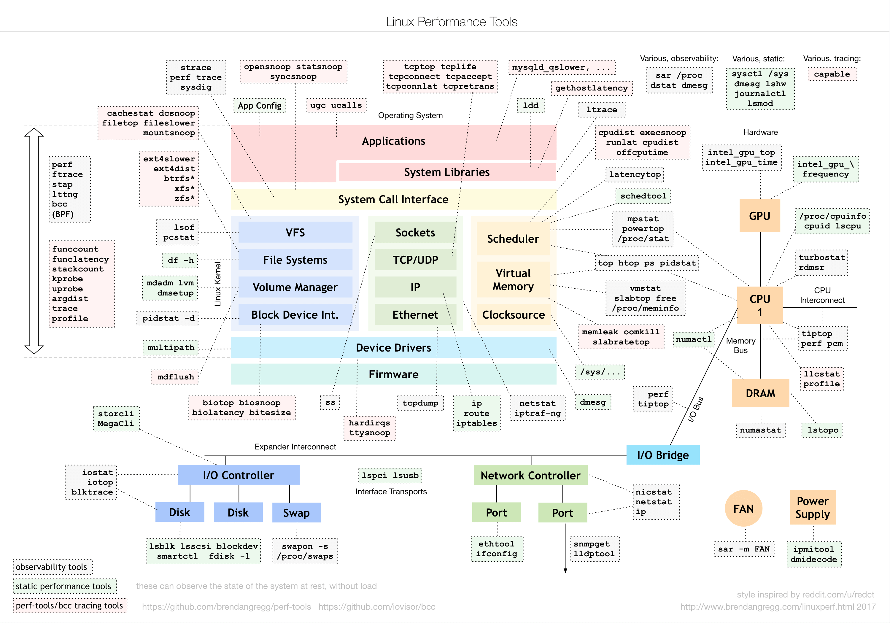

# 前言

## 性能指标

性能相关的最常见的词语应该就是**高并发**和**响应快**，对应的也就是性能优化的两个核心指标：**吞吐**和**延时**。这两个指标是从应用负载的视角类考察性能的，直接影响了产品终端的用户体验。与之对应的，是从系统资源角度出发的指标，，比如资源使用率、饱和度等。


所以，性能问题的本质，还是系统资源达到瓶颈，但是处理的请求不够快，无法支撑更多的请求。

## 性能分析常见步骤

+ 选择指标评估应用程序和系统的性能
+ 为应用程序和系统设置性能目标
+ 进行性能基准测试
+ 性能分析定位瓶颈
+ 优化系统和应用程序
+ 性能监控和告警

在性能分析中，工具是必要的，性能领域的大师布伦丹·格雷格（Brendan Gregg）描绘的Linux性能分析工具图谱：



## 性能分析方向概览


# CPU性能篇

## 平均负载

```bash
$ uptime
08:32:42 up 2 days, 20:15,  1 user,  load average: 0.26, 0.20, 0.23
# 当前时间	系统运行时间		登陆用户数	平均负载：	1	5	15
```

平均负载是指单位时间内，系统处于**可运行状态**和**不可中断状态**的平均**进程数**，也就是**平均活跃进程数**，它和 CPU 使用率并没有直接关系

可运行状态：正在使用CPU或者正在等待CPU的进程，也就是我们常用ps命令看到的处于R(Running或Runnable)的进程

不可中断状态：处于内核态关键流程中的进程，这些流程是不可打断的，最常见的是等待硬件设备的I/O响应的进程，也就是我们在ps命令中看到D状态(Uninterruptible Sleep，也称为 Disk Sleep)的进程。

> 比如，当一个进程向磁盘读写数据时，为了保证数据的一致性，在得到磁盘回复前，它是不能被其他进程或者中断打断的，这个时候的进程就处于不可中断状态。如果此时的进程被打断了，就容易出现磁盘数据与进程数据不一致的问题
>
> 所以，不可中断状态实际上是系统对进程和硬件设备的一种保护机制

**所以平均负载的计算**，应该考虑的是正在使用或者等待CPU的进程，以及正在读写硬件或者CPU读写硬件结束，但是硬件还未响应的进程（即等待I/O的进程）

### 平均负载的合理值

理想情况下，平均负载应该等于CPU个数。所以在评价平均负载的时候，我们需要使用`top`或者从文件`/proc/cpuinfo`中读取，比如：

```bash
$ grep 'model name' /proc/cpuinfo | wc -l
4
# 意味着4个CPU
```

`uptime`或者`top`第一行或者`/proc/loadavg`中的三个平均负载值一定程度反应了**系统的负载趋势**

> 假设我们在一个**单** CPU 系统上看到平均负载为 1.73，0.60，7.98，那么说明在过去 1 分钟内，系统有 73% 的超载，而在 15 分钟内，有 698% 的超载，从整体趋势来看，系统的负载在降低。

在实际生产环境中，一般的做法是**平均负载高于cpu数量70%**时候，就应该排查负载高的问题了，否则容易导致进程响应慢，影响服务的正常功能。

更推荐的做法是将系统的平均负载监控起来。

### 平均负载和CPU使用率

注意，平均负载的计算包括等待CPU的，使用CPU的，等待I/O的进程。更通俗一点说是进程对CPU的需求量

而CPU使用率是单位时间内CPU繁忙情况的统计。即CPU的工作时长。

> 抽象的例子,假如到银行办理业务，在营业厅等待的以及在和柜员交互的人，都算作平均负载。
>
> 而柜员在处理请求的时间，则是CPU的使用率

所以，CPU使用率和平均负载并不一一对应：

+ CPU 密集型进程，使用大量 CPU 会导致平均负载升高，此时这两者是一致的；
+ CPU 密集型进程，使用大量 CPU 会导致平均负载升高，此时这两者是一致的；
+ 大量等待 CPU 的进程调度也会导致平均负载升高，此时的 CPU 使用率也会比较高。

### 实践案例

工具介绍：

+ stress 是一个 Linux 系统压力测试工具，用作异常进程模拟平均负载升高的场景。
+ sysstat 包含了常用的 Linux 性能工具，用来监控和分析系统的性能。案例中使用mpstat和pidstat
  - mpstat 是一个常用的多核 CPU 性能分析工具，用来实时查看每个 CPU 的性能指标，以及所有 CPU 的平均指标。
  - pidstat 是一个常用的进程性能分析工具，用来实时查看进程的 CPU、内存、I/O 以及上下文切换等性能指标

#### 场景一：CPU密集型进程

终端一模拟模拟一个CPU使用率达到100%的场景

```bash
$ stress --cpu 1 --timeout 600 
```

终端二使用uptime查看平均负载的变换情况

```bash
# -d 参数表示高亮显示变化的区域
$ watch -d uptime
..., load average: 1.00, 0.75, 0.39
```

终端三使用mpstat查看CPU使用率的变换情况

```bash
# -P ALL 表示监控所有CPU，后面数字5表示间隔5秒后输出一组数据
$ mpstat -P ALL 5
Linux 4.15.0 (ubuntu) 09/22/18 _x86_64_ (2 CPU)
13:30:06     CPU    %usr   %nice    %sys %iowait    %irq   %soft  %steal  %guest  %gnice   %idle
13:30:11     all   50.05    0.00    0.00    0.00    0.00    0.00    0.00    0.00    0.00   49.95
13:30:11       0    0.00    0.00    0.00    0.00    0.00    0.00    0.00    0.00    0.00  100.00
13:30:11       1  100.00    0.00    0.00    0.00    0.00    0.00    0.00    0.00    0.00    0.00
```

> 从终端二可以看到，1分钟平均负载会增加到1，从终端三可以看出一个CPU使用率为100，但是iowait为0.这就说明平均负载的升高是因为CPU使用率高导致的

终端四使用pidstat查询具体哪一个进程导致CPU使用率升高

```bash
# 间隔5秒后输出一组数据
$ pidstat -u 5 1
13:37:07      UID       PID    %usr %system  %guest   %wait    %CPU   CPU  Command
13:37:12        0      2962  100.00    0.00    0.00    0.00  100.00     1  stress
```

#### 场景二：I/O密集型进程

终端一模拟I/O压力

```bash
$ stress -i 1 --timeout 600
```

其他三个终端命令一致，可以看出1 分钟的平均负载会慢慢增加到 1.06，其中一个 CPU 的系统 CPU 使用率升高到了 23.87，而 iowait 高达 67.53%。这说明，平均负载的升高是由于 iowait 的升高。

#### 场景三：大量进程的场景

终端一模拟8进程

```bash
$ stress -c 8 --timeout 600
```

系统只有4个CPU，可以使用uptime查看平均负载

```bash
$ uptime
...,  load average: 7.97, 5.93, 3.02
```

在使用pidstat查看以下进程情况：

```bash\
# 间隔5秒后输出一组数据
$ pidstat -u 5 1
14:23:25      UID       PID    %usr %system  %guest   %wait    %CPU   CPU  Command
14:23:30        0      3190   25.00    0.00    0.00   74.80   25.00     0  stress
14:23:30        0      3191   25.00    0.00    0.00   75.20   25.00     0  stress
14:23:30        0      3192   25.00    0.00    0.00   74.80   25.00     1  stress
14:23:30        0      3193   25.00    0.00    0.00   75.00   25.00     1  stress
14:23:30        0      3194   24.80    0.00    0.00   74.60   24.80     0  stress
14:23:30        0      3195   24.80    0.00    0.00   75.00   24.80     0  stress
14:23:30        0      3196   24.80    0.00    0.00   74.60   24.80     1  stress
14:23:30        0      3197   24.80    0.00    0.00   74.80   24.80     1  stress
14:23:30        0      3200    0.00    0.20    0.00    0.20    0.20     0  pidstat
```

可以看出，8 个进程在争抢 2 个 CPU，每个进程等待 CPU 的时间（也就是代码块中的 %wait 列）高达 75%。这些超出 CPU 计算能力的进程，最终导致 CPU 过载。

## 上下文切换

> 过多的上下文切换，会把CPU时间消耗在寄存器、内核栈以及虚拟内存等数据的保存和恢复上。我们可以使用vmstat这个工具来查询系统的上下文切换情况。

### vmstat命令

```bash
# 每隔5秒输出1组数据
$ vmstat 5
procs -----------memory---------- ---swap-- -----io---- -system-- ------cpu-----
 r  b   swpd   free   buff  cache   si   so    bi    bo   in   cs us sy id wa st
 0  0      0 7005360  91564 818900    0    0     0     0   25   33  0  0 100  0  0
```

各行字段解释：

procs：

+ 「r」: 运行的和等待(CPU时间片)运行的进程数，返回值长期大于1时建议增加CPU。
+ 「b」: 处于不可中断状态的进程数，常见的情况是由IO引起的。

Memory：

+ 「swpd」: 切换到交换内存上的内存(默认以KB为单位)

  > 如果 swpd 的值不为0，或者比较大，比如超过了100M，但是 si, so 的值长期为 0，这种情况我们可以不用担心，不会影响系统性能

+ 「free」: 空闲的物理内存

+ 「buff」: 作为buffer cache的内存，块设备读写缓冲

+ 「cache」: 作为page cache的内存, 文件系统的cache

  > 如果 cache 的值大的时候，说明cache住的文件数多，如果频繁访问到的文件都能被cache住，那么磁盘的读IO bi 会非常小

  **真正可用内存=free + buffer + cached**

swap:

+ 「si 」: 交换内存使用，由磁盘调入内存

+ 「so」: 交换内存使用，由内存调入磁盘

  > 内存够用的时候，返2个值都是0，如果返2个值长期大于0 时，系统性能会受到影响。磁盘IO和CPU资源都会被消耗。
  >
  > 看到空闲内存(free)很少或者接近0时，不能单纯认为内存不够用。实际上不能光看返一点，还要结合si,so，如果 free很少，但是si,so也很少(大多时候是0)，那么不用担心，系统性能这时不会受到影响。

IO:

+ bi」: 从块设备读入的数据总量(读磁盘) (KB/s)
+ 「bo」: 写入到块设备的数据总理(写磁盘) (KB/s)

system:

+ 「in」: 每秒产生的中断次数
+ 「cs」: 每秒产生的上下文切换次数 上面返2个值越大，会看到由内核消耗的CPU时间会越多

CPU:

+ 「us」: 用户进程消耗的CPU时间百分比

  > us 的值比较高时，说明用户进程消耗的CPU时间多，但是如果长期超 过50% 的使用，需要考虑性能优化

+ 「sy」: 内核进程消耗的CPU时间百分比

  > sy 的值高时，说明系统内核消耗的CPU资源多

+ 「wa」: IO等待消耗的CPU时间百分比

  > wa 的值高时，说明IO等待比较严重，这可能是由于磁盘大量作随机访问造成，也有可能是磁盘的带宽出现瓶颈

+ 「id」: CPU处在空闲状态时间百分比

#### 重点关注

+ [system] cs（context switch）是每秒上下文切换的次数。
+ [system] in（interrupt）则是每秒中断的次数。
+ [procs] r（Running or Runnable）是就绪队列的长度，也就是正在运行和等待 CPU 的进程数。
+ [procs] b（Blocked）则是处于不可中断睡眠状态的进程数。

### pidstat -w

vmstat只给出了系统总体的上下文切换，想要查看每个进程的详细情况，需要使用pidstat -w

#### 重点关注

+ cswch:表示每秒自愿上下文切换的次数（即，进程无法获取所需资源导致的上下文切换，如I/O、内存不足等）
+ nvcswch：每秒非自愿上下文切换的次数（即，时间片到了，被强制调度）

### sysbench

> sysbench 是一个多线程的基准测试工具，一般用来评估不同系统参数下的数据库负载情况。这里我们只把它当成一个异常进程来看，作用是模拟上下文切换过多的问题。

#### 实战操作

首先查看空闲系统（2核8G）的上下文切换次数：

```bash
# 间隔1秒后输出1组数据
$ vmstat 1 1
procs -----------memory---------- ---swap-- -----io---- -system-- ------cpu-----
 r  b   swpd   free   buff  cache   si   so    bi    bo   in   cs us sy id wa st
 0  0      0 6984064  92668 830896    0    0     2    19   19   35  1  0 99  0  0
```


终端一运行sysbench，模拟系统多线成调度的瓶颈：

```bash
# 以10个线程运行5分钟的基准测试，模拟多线程切换的问题
$ sysbench --threads=10 --max-time=300 threads run
```

终端二运行vmstat，观察上下文切换：

```bash
# 每隔1秒输出1组数据（需要Ctrl+C才结束）
$ vmstat 1
procs -----------memory---------- ---swap-- -----io---- -system-- ------cpu-----
 r  b   swpd   free   buff  cache   si   so    bi    bo   in   cs us sy id wa st
 6  0      0 6487428 118240 1292772    0    0     0     0 9019 1398830 16 84  0  0  0
 8  0      0 6487428 118240 1292772    0    0     0     0 10191 1392312 16 84  0  0  0
```

这个时候cs（context switch）达到了百万级别

同时r（running or runnable）就绪队列达到8，远超CPU个数2，所以会有大量的系统竞争

us和sy加起来达到了100%，其中系统CPU达到84%，说明CPU主要是被内核占用

in也达到了1W左右，说明中断处理也是个潜在问题

终端三使用pidstat来观察具体是哪个进程导致了这些问题：

```bsh
# 每隔1秒输出1组数据（需要 Ctrl+C 才结束）
# -w参数表示输出进程切换指标，而-u参数则表示输出CPU使用指标
$ pidstat -w -u 1
08:06:33      UID       PID    %usr %system  %guest   %wait    %CPU   CPU  Command
08:06:34        0     10488   30.00  100.00    0.00    0.00  100.00     0  sysbench
08:06:34        0     26326    0.00    1.00    0.00    0.00    1.00     0  kworker/u4:2

08:06:33      UID       PID   cswch/s nvcswch/s  Command
08:06:34        0         8     11.00      0.00  rcu_sched
08:06:34        0        16      1.00      0.00  ksoftirqd/1
08:06:34        0       471      1.00      0.00  hv_balloon
08:06:34        0      1230      1.00      0.00  iscsid
08:06:34        0      4089      1.00      0.00  kworker/1:5
08:06:34        0      4333      1.00      0.00  kworker/0:3
08:06:34        0     10499      1.00    224.00  pidstat
08:06:34        0     26326    236.00      0.00  kworker/u4:2
08:06:34     1000     26784    223.00      0.00  sshd
```

从 pidstat 的输出你可以发现，CPU 使用率的升高果然是 sysbench 导致的，它的 CPU 使用率已经达到了 100%。但上下文切换则是来自其他进程，包括非自愿上下文切换频率最高的 pidstat ，以及自愿上下文切换频率最高的内核线程 kworker 和 sshd。

当前显示的是进程切换的数据，如果要看线程切换的数据，需要加上-t参数

```bash
# 每隔1秒输出一组数据（需要 Ctrl+C 才结束）
# -wt 参数表示输出线程的上下文切换指标
$ pidstat -wt 1
08:14:05      UID      TGID       TID   cswch/s nvcswch/s  Command
...
08:14:05        0     10551         -      6.00      0.00  sysbench
08:14:05        0         -     10551      6.00      0.00  |__sysbench
08:14:05        0         -     10552  18911.00 103740.00  |__sysbench
08:14:05        0         -     10553  18915.00 100955.00  |__sysbench
08:14:05        0         -     10554  18827.00 103954.00  |__sysbench
...
```

这里只能看到上下文切换的数据，如果要查看**中断**发生的类型，需要从`/proc/interrupts`这个只读文件中读取。`/proc` 实际上是 Linux 的一个虚拟文件系统，用于内核空间与用户空间之间的通信。`/proc/interrupts `就是这种通信机制的一部分，提供了一个只读的中断使用情况。

在终端三中观察中断的变化情况：

```bash
# -d 参数表示高亮显示变化的区域
$ watch -d cat /proc/interrupts
           CPU0       CPU1
...
RES:    2450431    5279697   Rescheduling interrupts
...
```

可以发现变化速度最快的是重调度中断（RES），这个中断类型表示，唤醒空闲状态的 CPU 来调度新的任务运行。这是多处理器系统（SMP）中，调度器用来分散任务到不同 CPU 的机制，通常也被称为处理器间中断（Inter-Processor Interrupts，IPI）。

### 合理建议

上下文切换合理数值需要取决于CPU的性能，一般数百到一万都是正常的，但是如果切换次数数量级增长时（即上述实例中忽然提升到百万级别），就很可能出现了性能问题。

此时，需要根据上下文切换的类型再做具体分析，如：

+ 自愿上下文切换变多了，说明进程都在等待资源，有可能发生了 I/O 等其他问题；
+ 非自愿上下文切换变多了，说明进程都在被强制调度，也就是都在争抢 CPU，说明 CPU 的确成了瓶颈；
+ 中断次数变多了，说明 CPU 被中断处理程序占用，还需要通过查看` /proc/interrupts `文件来分析具体的中断类型。

## CPU使用率

Linux 作为一个多任务操作系统，将每个 CPU 的时间划分为很短的时间片，再通过调度器轮流分配给各个任务使用，因此造成多任务同时运行的错觉。

为了维护 CPU 时间，Linux 通过事先定义的节拍率（内核中表示为 HZ），触发时间中断，并使用全局变量 Jiffies 记录了开机以来的节拍数。每发生一次时间中断，Jiffies 的值就加 1

节拍率 HZ 是内核的可配选项，可以设置为 100、250、1000 等。不同的系统可能设置不同数值，你可以通过查询 `/boot/config` 内核选项来查看它的配置值。

```bash
$ grep 'CONFIG_HZ=' /boot/config-$(uname -r)
CONFIG_HZ=250
```

因为节拍率 HZ 是内核选项，所以用户空间程序并不能直接访问。为了方便用户空间程序，内核还提供了一个用户空间节拍率 USER_HZ，它总是固定为 100，也就是 1/100 秒。这样，用户空间程序并不需要关心内核中 HZ 被设置成了多少，因为它看到的总是固定值 USER_HZ

Linux 通过 /proc 虚拟文件系统，向用户空间提供了系统内部状态的信息，而 /proc/stat 提供的就是系统的 CPU 和任务统计信息。比方说，如果你只关注 CPU 的话，可以执行下面的命令:

```bash
# 只保留各个CPU的数据
$ cat /proc/stat | grep ^cpu
cpu  280580 7407 286084 172900810 83602 0 583 0 0 0
cpu0 144745 4181 176701 86423902 52076 0 301 0 0 0
cpu1 135834 3226 109383 86476907 31525 0 282 0 0 0
```

对于proc可以通过手册查看，但是每一列的含义都是CPU使用率的重要指标：

+ user（通常缩写为 us），代表用户态 CPU 时间。注意，它不包括下面的 nice 时间，但包括了 guest 时间。
+ nice（通常缩写为 ni），代表低优先级用户态 CPU 时间，也就是进程的 nice 值被调整为 1-19 之间时的 CPU 时间。这里注意，nice 可取值范围是 -20 到 19，数值越大，优先级反而越低。
+ system（通常缩写为 sys），代表内核态 CPU 时间。
+ idle（通常缩写为 id），代表空闲时间。注意，它不包括等待 I/O 的时间（iowait）。
+ iowait（通常缩写为 wa），代表等待 I/O 的 CPU 时间。
+ irq（通常缩写为 hi），代表处理硬中断的 CPU 时间。
+ softirq（通常缩写为 si），代表处理软中断的 CPU 时间。
+ steal（通常缩写为 st），代表当系统运行在虚拟机中的时候，被其他虚拟机占用的 CPU 时间。
+ guest（通常缩写为 guest），代表通过虚拟化运行其他操作系统的时间，也就是运行虚拟机的 CPU 时间。
+ guest_nice（通常缩写为 gnice），代表以低优先级运行虚拟机的时间。

而CPU使用率就是除了空闲时间外的其他时间占总CPU时间的百分比：
$$
CPU使用率=1-\frac{空闲时间}{总cpu时间}
$$
需要注意的是，`/proc/stat`中代表的是开机以来的节拍数累加值，所以直接算出来的，是开机以来的平均 CPU 使用率，一般没啥参考价值。

推荐做法是取间隔一段时间（比如 3 秒）的两次值，作差后，再计算出这段时间内的平均 CPU 使用率，即
$$
平均CPU使用率=1-\frac{空闲时间_{new}-空闲时间_{old}}{总CPU时间_{new}-总CPU时间_{old}}
$$
对于每个进程的使用率可以通过`/proc/[pid]/stat`来查看。

需要注意的是top 和 ps 这两个工具报告的 CPU 使用率，默认的结果很可能不一样，因为 top 默认使用 3 秒时间间隔，而 ps 使用的却是进程的整个生命周期

### 查看CPU使用率

主要使用的top和ps：

+ top 显示了系统总体的 CPU 和内存使用情况，以及各个进程的资源使用情况。(3s刷新一次)

  > top 默认显示的是所有 CPU 的平均值，按下数字 1 ，就可以切换到每个 CPU 的使用率

+ ps 则只显示了每个进程的资源使用情况。

如果需要查看每个进程的详细情况，可以使用pidstat命令，该命令展示了进程5组CPU使用率：

+ 用户态 CPU 使用率 （%usr）
+ 内核态 CPU 使用率（%system）
+ 运行虚拟机 CPU 使用率（%guest）
+ 等待 CPU 使用率（%wait）
+ 以及总的 CPU 使用率（%CPU）。

```bash
# 每隔1秒输出一组数据，共输出5组
$ pidstat 1 5
15:56:02      UID       PID    %usr %system  %guest   %wait    %CPU   CPU  Command
15:56:03        0     15006    0.00    0.99    0.00    0.00    0.99     1  dockerd

...

Average:      UID       PID    %usr %system  %guest   %wait    %CPU   CPU  Command
Average:        0     15006    0.00    0.99    0.00    0.00    0.99     -  dockerd
```

### CPU使用率过高处理方案

如果想要直到占用CPU的到底是哪个函数，优先选择的是`perf`而不是GDB，因为GDB会导致程序中断，这在线上环境是不允许的。

使用`perf`分析CPU性能问题比较常用的两种用法：

#### perf top

> 可以实时显示占用CPU时钟最多的函数或者指令，因此可以用来查找热点函数

```bash
$ perf top
Samples: 833  of event 'cpu-clock', Event count (approx.): 97742399
Overhead  Shared Object       Symbol
   7.28%  perf                [.] 0x00000000001f78a4
   4.72%  [kernel]            [k] vsnprintf
   4.32%  [kernel]            [k] module_get_kallsym
   3.65%  [kernel]            [k] _raw_spin_unlock_irqrestore
...
```

该实例中表示perf总共采样了833个CPU时钟事件，而总事件为97742399

对于字段的解释：

+ 第一列 Overhead ，是该符号的性能事件在所有采样中的比例，用百分比来表示。
+ 第二列 Shared ，是该函数或指令所在的动态共享对象（Dynamic Shared Object），如内核、进程名、动态链接库名、内核模块名等。
+ 第三列 Object ，是动态共享对象的类型。比如 [.] 表示用户空间的可执行程序、或者动态链接库，而 [k] 则表示内核空间。
+ 最后一列 Symbol 是符号名，也就是函数名。当函数名未知时，用十六进制的地址来表示。

#### perf record/report

> perf top 虽然实时展示了系统的性能信息，但它的缺点是并不保存数据，也就无法用于离线或者后续的分析。而 perf record 则提供了保存数据的功能，保存后的数据，需要你用 perf report 解析展示

```bash
$ perf record # 按Ctrl+C终止采样
[ perf record: Woken up 1 times to write data ]
[ perf record: Captured and wrote 0.452 MB perf.data (6093 samples) ]

$ perf report # 展示类似于perf top的报告
```

> 在实际使用中，我们还经常为 perf top 和 perf record 加上 -g 参数，开启调用关系的采样，方便我们根据调用链来分析性能问题。

## 软中断

Linux中将中断分为了两个阶段，即上半部分和下半部分：

+ 上半部用来快速处理中断，它在中断禁止模式下运行，主要处理跟硬件紧密相关的或时间敏感的工作
+ 下半部用来延迟处理上半部未完成的工作，通常以内核线程的方式运行。

举个网络流的例子，网卡接收到数据后，会通过硬件中断的方式，通知内核有了新数据。这时，内核就应该调用中断程序来响应。

对于上半部分来说，就是快速处理，将网卡中的数据读到内存中，然后更新硬件寄存器的状态（数据读好了），然后发送软中断的信号，通知下半部做进一步处理。

下半部分被软中断信号唤醒后，需要从内存中找到数据，然后按照网络协议栈，对数据进行逐层解析和处理，然后送到应用程序。

其实和408中的中断流程基本一致，上半部分需要原子性，不可打断，快速响应。后半段则是软中断，由内核触发，可以延迟执行，甚至可以根据优先级多层嵌套中断。

上半部会打断 CPU 正在执行的任务，然后立即执行中断处理程序。而下半部以内核线程的方式执行，并且每个 CPU 都对应一个软中断内核线程，名字为 “ksoftirqd/CPU 编号”，比如说， 0 号 CPU 对应的软中断内核线程的名字就是 ksoftirqd/0。

> 一些内核自定义的事件也属于软中断，比如内核调度和 RCU 锁（Read-Copy Update 的缩写，RCU 是 Linux 内核中最常用的锁之一）

### 查看软中断和内核线程

`/proc`伪目录中提供了软中断和硬中断的通信机制

+ `/proc/softirqs` 提供了软中断的运行情况
+ `/proc/interrupts` 提供了硬中断的运行情况。

> 需要注意，该目录下的统计都是累计统计，如果需要监控，需要自定义间隔时间。

```bash
$ cat /proc/softirqs
                    CPU0       CPU1
          HI:          0          0
       TIMER:     811613    1972736
      NET_TX:         49          7
      NET_RX:    1136736    1506885
       BLOCK:          0          0
    IRQ_POLL:          0          0
     TASKLET:     304787       3691
       SCHED:     689718    1897539
     HRTIMER:          0          0
         RCU:    1330771    1354737
```

各个字段解释：

+ `CPU0-CPUN`: 这些字段表示每个 CPU 核心的软中断统计信息。例如 `CPU0` 表示 CPU0 核心的软中断统计数据，`CPU1` 表示 CPU1 核心的软中断统计数据。具体的 CPU 数目根据系统的配置而定。
+ `HI`: 表示软中断在高优先级队列中的调度次数。
+ `TIMER`: 表示定时器中断的调度次数。
+ `NET_TX`: 表示网络发送中断的调度次数。
+ `NET_RX`: 表示网络接收中断的调度次数。
+ `BLOCK`: 表示块设备中断的调度次数。
+ `IRQ_POLL`: 表示由中断处理程序发出的轮询次数。
+ `TASKLET`: 表示由任务队列（tasklet）机制处理的次数。
+ `SCHED`: 表示由调度器处理的次数。
+ `HRTIMER`: 表示高分辨率定时器中断的调度次数。

在观察文件内容时，需要注意：

+ 软中断的类型
+ 同一软中断在不同CPU上的分布情况

软中断实际上是以内核线程的方式运行的，每个CPU都对应一个软中断内核线程，这个软中断内核线程就叫做`ksoftirqd/CPU编号`，可以使用ps命令查看

```bash
$ ps aux | grep softirq
root         7  0.0  0.0      0     0 ?        S    Oct10   0:01 [ksoftirqd/0]
root        16  0.0  0.0      0     0 ?        S    Oct10   0:01 [ksoftirqd/1]
```

> 注意，这些线程的名字外面都有中括号，这说明 ps 无法获取它们的命令行参数（cmline）。一般来说，ps 的输出中，名字括在中括号里的，一般都是内核线程