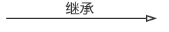
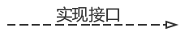
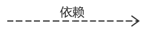
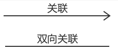
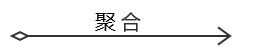
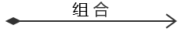
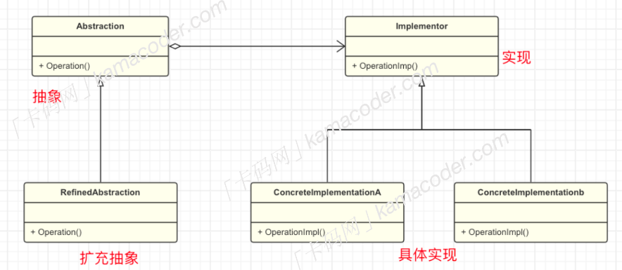
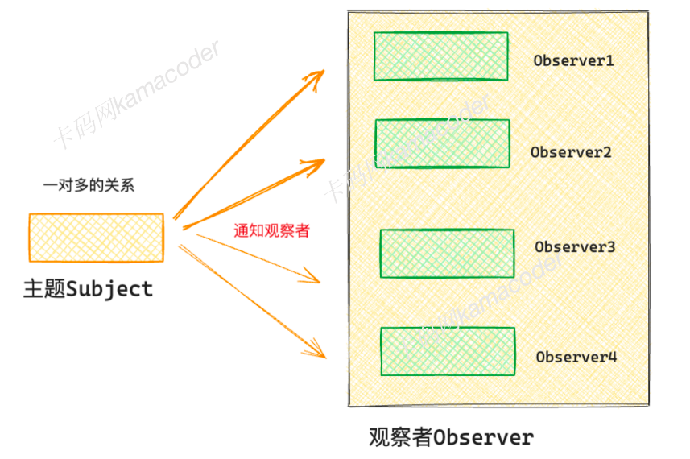
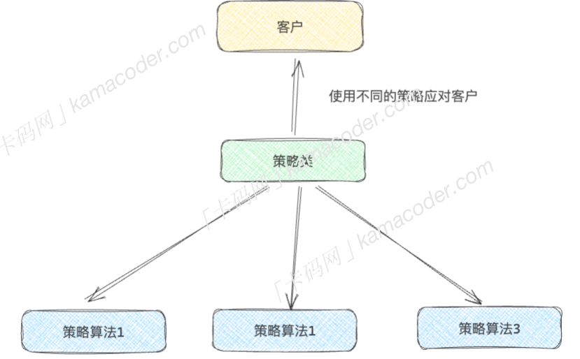

# UML以及设计模式

## UML

### UML类图

+ 继承：子类指向（继承)父类

+ 实现：，C++中一般指子类实现纯虚类

+ 依赖：A依赖B的实现，A指向B，一般指A中有成员变量B或者参数B

+ 关联：有1..n形式。如A属于B，则B指向A（B包含（关联）A)

+ 聚合：，弱关联关系，如玻璃和窗户，空心菱形指向整体

+ 组合：，强关联关系，如人体和血液，实心菱形指向整体


## 设计模式

### 创建型设计模式

#### 单例模式

全局内只有一份，通常用于管理全局信息（全局变量之类的，类似工作中自己定义的TaskHandler::get_user()，实现上就是static内嵌static）

```c++
#include <map>
#include <string>
#include <iostream>
class Manager
{
  public:
    static Manager* Instance(){
        static Manager manager;
        return &manager;
    }
     
    void register2manager(const std::string& type_name,int size){
        map_[type_name] += size;
    }
     
    void display(){
        for(const auto& elem:map_){
            std::cout << elem.first << " " << elem.second << std::endl;
        }
    }
     
  private:
    Manager() = default;
    std::map<std::string,int> map_;
};
 
int main(){
    Manager* manager = Manager::Instance();
    std::string type_name;
    int size;
    while(std::cin >> type_name >> size){
        manager->register2manager(type_name,size);
    }
    manager->display();
}
```

#### 工厂模式

工厂模式就是利用多态和继承的一个经典实例，工厂的instance返回类型是一个基类指针，实际使用时利用多态用基类指针管理具体的子类

```c++
#include <iostream>
 
#include <vector>
#include <memory>
 
class Block{
  public:
    virtual void produce() = 0;
    virtual ~Block() = default;
};
 
class CircleBlock:public Block
{
  public:
    void produce() override{
        std::cout << "Circle Block" << std::endl;
    }
};
 
class SquareBlock:public Block{
  public:
    void produce() override{
        std::cout << "Square Block" << std::endl;
    }
};
 
class Factory{
  public:
    static Block* instance(const std::string& type){
        if(type == "Circle"){
            return new CircleBlock();
        }else if(type == "Square"){
            return new SquareBlock();
        }else{
            return nullptr;
        }
    }
    virtual ~Factory() = default;
};
```

#### 抽象工厂

抽象工厂是简单工厂更高一层的抽象，对工厂也进行了具体的划分

```c++
class Furniture{
public:
    virtual void show() = 0;
    virtual ~Furniture() = default;
};
 
class MordernFurniture:public Furniture{
public:
    void show() override{
        std::cout << "modern chair\nmodern sofa" << std::endl;
    }
};
 
class ClassicFurniture:public Furniture{
public:
    void show() override{
        std::cout << "classical chair\nclassical sofa" << std::endl;
    }
};
 
class Factory{
public:
    virtual Furniture* instance() = 0;
    virtual ~Factory() = default;
};
 
class  MordernFac:public Factory{
public:
    Furniture* instance() override{
        return new MordernFurniture();
    }
};
 
class ClassFac:public Factory{
public:
    Furniture* instance() override{
        return new ClassicFurniture();
    }
};
```

#### 建造者模式

建造者模式主要是为了处理构造比较复杂的类，将不同的构造任务交给一个专门构造的类（联想自己对socket的封装），而原本比较复杂的类中，大多数成员可以由构造类进行托管。其中构造类称为指挥类，具体执行构造的称为工作类。注意，对于工作，也可以使用多态来管理，从而精简代码。最终目标对象，是由指挥类返回。指挥类其实是一个沟通者（类似muduo库中Loop与Poller和Channel的关系）

```c++
class Bike{
public:
    void setFrame(std::string_view frame){
        frame_ = frame;
    }

    void setTires(std::string tires){
        tires_ = tires;
    }

    void show(){
        std::cout << frame_ << " " << tires_ << std::endl;
    }
private:
    std::string frame_;
    std::string tires_;
};


class Builder{
public:
    virtual void buildFrame() = 0;
    virtual void buildTires() = 0;
    virtual Bike result() = 0;
    virtual ~Builder() = default;
};

class RodeBuilder:public Builder{
public:
    void buildFrame() override{
        bike_.setFrame("Carbon Frame");
    }

    void buildTires() override{
        bike_.setTires("Slim Tires");
    }

    Bike result() override{
        return bike_;
    }
private:
    Bike bike_;
};

class MountainBuilder:public Builder{
public:
    void buildFrame() override{
        bike_.setFrame("Aluminum Frame");
    }

    void buildTires() override{
        bike_.setTires("Knobby Tires");
    }

    Bike result() override{
        return bike_;
    }
private:
    Bike bike_;
};

class BikeCmder{
public:
    Bike constructor(Builder& blder){
        blder.buildFrame();
        blder.buildTires();
        return blder.result();
    }
};


int main() {
    int num ;
    cin >> num;
    BikeCmder cmd;
    for(int i = 0; i < num; ++i){
        std::string type;
        cin >> type;
        Builder* blder;
        if(type == "mountain"){
            blder = new MountainBuilder();
        }else{
            blder = new RodeBuilder();
        }

        cmd.constructor(*blder).show();
        delete blder;
    }
    return 0;
}
```

#### 原型模式

存在一个原型对象，被用作创建新对象的模板。新对象的创建通过复制对象的属性和状态进行创建。

该模式和建造者的目的一样，都是为了处理较为复杂的类的创建。

在原型对象中，需要声明一个clone函数，该函数会生成一个新的类对象，并且将原型的属性和状态存储到新对象中。一般的设计如下：

+ 抽象的`Prototype`类:仅声明一个`clone`函数
+ 具体的原型`ConcreatePrototype`:实现`clone`，复制当前对象并返回一个新对象

```cpp
class Prototype{
public:
    virtual Prototype* clone() = 0;
    virtual std::string data() const = 0;
    virtual ~Prototype() = default;
};

class ConcretePrototype:public Prototype{
public:
    ConcretePrototype(std::string_view data)
    :data_(data){}

    Prototype* clone() override{
        return new ConcretePrototype(data_);
    }

    std::string data() const override { return data_; }
private:
    std::string data_;
};

int main() {
    Prototype* orignal = new ConcretePrototype("Orignal data");
    Prototype* clone = orignal->clone();	// remember to delete
    std::cout << clone->data() << std::endl;
    return 0;
}
```

适用场景：当需要大量创建**相似**对象的时候

### 结构型设计模式

#### 适配器模式

将一个类的接口，转换为另一个类的接口，主要充当两个接口的桥梁，就像现实中的拓展坞

最经典的实现就是标准库中的迭代器，用户使用时就像一个指针一样

简单实现：

```c++
//被适配者
class Adaptee{
public:
    void specificRequest(){
        std::cout << "this is a specific request" << std::endl;
    }
};

//目标接口----->原始指针
class Target{
public:
    virtual void request() = 0;
    virtual ~Target() = default;
};

//适配器
class Adapter:public Target{
public:
    Adapter(Adaptee* adaptee)
    :adaptee_(adaptee)
    {}

    void request() override{
        adaptee_->specificRequest();
    }

    ~Adapter(){
        if(adaptee_ != nullptr){
            delete adaptee_;
            adaptee_ = nullptr;
        }
    }
private:
    Adaptee* adaptee_;
};

int main() {
    Target* target = new Adapter(new Adaptee());
    target->request();
    delete target;
    target = nullptr;
    return 0;
}
```

被适配的对象可以理解为各种插头，适配器就是拓展坞，创建一个适配器，并将被适配的插头插进去。输出的就是目标信号（`Target* target = new Adapter(new Adaptee())`）

#### 代理模式

代理模式实际上就是原始对象的封装，会对原始对象的访问进行限制和增强。可以说是最常使用的一种设计模式（比如自己封装的CmdHelper,Socket,InetAddress...）

优点是可以对真实对象进行增强和保护，缺点是当需要频繁访问真实对象的时候，性能会收到影响

简单示例：

```c++
class AbstractSub{
public:
    virtual void request() = 0;
    virtual ~AbstractSub() = default;
};

class RealSubject : public AbstractSub{
public:
    void request() override{
        std::cout << "real subject request" << std::endl;
    }
};

class Proxy :public AbstractSub{
public: 
    void request() override{
        std::cout << "Proxy request" << std::endl;
        if(real_subject_ == nullptr){
            real_subject_ = new RealSubject();
        }
        real_subject_->request();
    }

    ~Proxy(){
        if(real_subject_){
            delete real_subject_;
            real_subject_ = nullptr;
        }
    }

private:
    RealSubject* real_subject_{nullptr};
};

int main() {
    Proxy proxy;
    proxy.request();
    return 0;
}
```

平时使用可能没有使用多态，专业的代理模式会利用多态，其抽象类似：

> ​	ProxyClass--------->AbstractClass<-------RealClass

简单的代理模式没必要使用多态，直接使用基于对象的形式（即直接对真实对象封装）代码可读性更好

#### 装饰器模式

一般情况下，扩展类的功能是通过继承实现的，但是容易出现需要维护的类过多的情况。装饰器模式可以在不定义子类的情况下，动态的给对象添加额外的功能。具体做法就是将原始对象放入包含特殊行为的封装类（装饰类）中，从而为原始类动态的添加功能

> 适用场景可能就是某些类无法继承，对其二次封装以达到扩展功能的目的
>
> 直观感觉和代理类相似，都是对原始对象行为的增强

```c++
//被装饰类的抽象基类
class Component{
public:
    virtual void func() = 0;
    virtual ~Component() = default;
};

//具体被装饰类
class ConcreteComponent:public Component{
public:
    void func() override{
        std::cout << "ConcreteComponent" << std::endl;
    }
};

//装饰类基类
class Decorator:public Component{
public:
    explicit Decorator( std::unique_ptr<Component> ptr)
    :component_ptr_(std::move(ptr)){}

    void func() override{
        component_ptr_->func();
    }
protected:
    std::unique_ptr<Component> component_ptr_;
};

class ConcreteDecorator:public Decorator{
public:
    explicit ConcreteDecorator( std::unique_ptr<Component> ptr)
    :Decorator(std::move(ptr))
    {}

    void func() override{
        std::cout << "concrete decorator begin" << std::endl;
        Decorator::func();
        std::cout << "concrete decorator end" << std::endl;
    }
};

int main() {
    std::unique_ptr<Component> c;
    c = std::make_unique<ConcreteComponent>();
    c = std::make_unique<ConcreteDecorator>(std::move(c));
    c->func();
}
```

#### 外观模式

外观模式又称门面模式，简单来讲就是将多个独立的子系统整合为一个门面类提供给用户，这样做可以降低整个系统的耦合度，同时隐藏了子系统的复杂度。后续在更新系统的时候也仅需要再门面类进行调整，而不影响客户端的代码。

简单实现：

```c++
class Part1{
public:
    void func(){
        std::cout << "Part1" << std::endl;
    }
};

class Part2{
public:
    void func(){
        std::cout << "Part2" << std::endl;
    }
};

class Part3{
public:
    void func(){
        std::cout << "Part3" << std::endl;
    }
};


class Facade{
public:
    Facade()
    :part1_(new Part1)
    ,part2_(new Part2)
    ,part3_(new Part3)
    {}

    void func(){
        part1_->func();
        part2_->func();
        part3_->func();
    }
    ~Facade(){
        if(part1_){
            delete part1_;
            part1_ = nullptr;
        }
        if(part2_){
            delete part2_;
            part2_ = nullptr;
        }
        if(part3_){
            delete part3_;
            part3_ = nullptr;
        }
    }
private:
    Part1* part1_;
    Part2* part2_;
    Part3* part3_;
};
```

本质还是结构化，模块化的思想。联想工作中的CmdHelper，自己使用的时候可以只关注输入和输出，具体的实现甚至优化并不影响程序的整体流程。

#### 桥接模式

又称万能遥控器，核心是将抽象部分和实现部分分离开来，这样可以各自独立变化，从而降低系统耦合度。



抽象的说就是整体是由抽象类组成的，抽象类之间的关系也是基于抽象类的，是对多态的更高级的使用。

简单的实现如下：

```c++
//电视机类抽象
class TV{
public:
    virtual void on() = 0;
    virtual void off() = 0;
    virtual void turnChannel() = 0;
    virtual ~TV() = default;
};

class ATV:public TV{
public:
    void on() override{
        std::cout << "ATV on" << std::endl;
    }
    void off() override{
        std::cout << "ATV off" << std::endl;
    }
    void turnChannel() override{
        std::cout << "ATV turn" << std::endl;
    }
};

class BTV:public TV{
public:
    void on() override{
        std::cout << "BTV on" << std::endl;
    }
    void off() override{
        std::cout << "BTV off" << std::endl;
    }
    void turnChannel() override{
        std::cout << "BTV turn" << std::endl;
    }
};

//遥控器类抽象
class RemoteControl{
public:
    explicit RemoteControl(TV* tv)
    :tv_(tv){}

    virtual ~RemoteControl(){
        if(tv_){
            delete tv_;
            tv_ = nullptr;
        }
    };

    virtual void turnOn() = 0;
    virtual void turnOff() = 0;
    virtual void changeChannel() = 0;
protected:
    TV* tv_;
};

class BasicRC:public RemoteControl{
public:
    BasicRC(TV* tv)
    :RemoteControl(tv){}

    void turnOn() override{
        tv_->on();
    }

    void turnOff() override{
        tv_->off();
    }

    void changeChannel() override{
        tv_->turnChannel();
    }
};


int main() {

    TV* aTV = new ATV();
    TV* bTV = new BTV();

    RemoteControl* aCon = new BasicRC(aTV);
    RemoteControl* bCon = new BasicRC(bTV);

    aCon->turnOn();
    aCon->turnOff();
    aCon->changeChannel();
    delete aCon;

    bCon->turnOn();
    bCon->turnOff();
    bCon->changeChannel();
    delete bCon;
    return 0;
}
```

更考验架构的能力，当一个模块由多个类组成，并且类的功能可能需要不断的扩展时，可以将类都建立抽象基类，通过抽象基类来组成该模块。这样子可以很大程度的降低类之间的耦合性

#### 组合模式

简单总结，将一个树状图看做一个整体类，类中的各个节点看做组件类，整体类和组件类共用一个抽象基类。这样做可以为客户提供统一的接口。举个例子就是，在图形编辑器中，图形对象可以是点线圆（叶子），也可以是点线圆组合起来的团（树），而客户主需要获取形状进行绘制，无需自行组合。

简单实现：

```c++
//抽象组件接口
class Component{
public:
    virtual void operation() = 0;
};

class Leaf : public Component{
public:
    void operation() override{
        std::cout << "Leaf" << std::endl;
    }
};

class Tree : public Component{
public:
    void add(Component* com){
        leaves_.push_back(com);
    }

    void remove(Component* com){
        for(auto iter = leaves_.begin(); iter != leaves_.end(); ++iter){
            if(*iter == com){
                leaves_.erase(iter);
            }
        }
    }

    void operation() override{
        std::cout << "====Tree=======" << std::endl;
        for(const auto item:leaves_){
            item->operation();
        }
    }
private:
    std::vector<Component*> leaves_;
};


int main() {
    Leaf* l1 = new Leaf();
    Leaf* l2 = new Leaf();
    Tree tree;
    tree.add(l1);
    tree.add(l2);
    tree.operation();

    tree.remove(l1);
    tree.operation();

    delete l1;
    delete l2;
    return 0;
}
```

简单来讲就是组合类和细节类共同继承一个抽象基类，这样客户端可以使用统一的接口调用

也可以联想标准库中filesystem的实现

#### 享元模式

在享元模式中，对象被设计为可共享的，可以被多个上下文使用，而不必在每个上下文中都创建新的对象。其中内部状态指的是多个对象公用的，不变的部分，一般以数据成员的形式存储。外部状态则是个性化的部分，一般以参数的形式传递。

更像是组装技术。比如三方库，就可以看做是某一类软件的内部状态，而业务代码则是这一类软件的外部状态。

简单的实现：

```c++
// 享元接口
class Flyweight{
public:
    //外部状态
    virtual void fun(std::string_view str) = 0;
};

class ConcreteF:public Flyweight{
public:
    ConcreteF(std::string_view str)
    :str_(str)
    {}

    void fun(std::string_view str) override{
        std::cout << "inner state:" << str_ << " outter state:" << str << std::endl;
    }
private:
    std::string str_;
};

class FlyweightFac{
public:
    Flyweight* getter(std::string_view key){
        if(map_.find(key.data()) == map_.end()){
            map_[key.data()] = new ConcreteF(key);
        }
        return map_[key.data()];
    }
private:
    std::unordered_map<std::string,Flyweight*> map_;
};


int main() {
    FlyweightFac fac;
    Flyweight* f1 = fac.getter("f1 inner");
    f1->fun("f1 outter");
    Flyweight* f2 = fac.getter("f2 inner");
    f2->fun("f2 outter");
    //共用内部状态
    Flyweight* f3 = fac.getter("f1 inner");
    f3->fun("f3 outter");
}
```

### 行为型设计模式

#### 观察者模式

观察者模式又称为发布-订阅模式，定义了一种一对多的依赖关系，让多个观察者对象同时监听同一个主题对象。当主题对象状态发生变化的时候，所有观察者都得到通知，并自动更新。设计模式中有两个角色：

+ 主题(subject):被观察的对象，维护一组观察者，如果主题发生改变，将通知组内的观察者。主题需要负责**注册、删除和通知观察者**
+ 观察者(observer):当被观察的主题发生变化的时候，收到通知并执行反应任务



观察者模式的好处：将观察者和主题解耦，就类似研究生和导师，导师是一个主题，学生是观察者，导师有新的想法了，群里喊一声，所有的观察者开始执行反应任务，有的日夜颠倒，有的躺平睡觉，各自的操作导师并不知情。同样的，导师自己的工作内容观察者也并不知情。对于解耦就像是，导师可以随时让研究生滚蛋，找另一个研究生交接一下不会影响整体系统的工作。同样，研究生受不了导师，也可以换另一个导师，新的导师和自己的交互仍旧是任务发布的形式，自己卷还是躺对新的导师依旧没有直接影响，整个系统依旧可以正常工作

简单实现：

```c++
class AbstractOb;

class AbstractSub{
public:
    virtual void registerOb(AbstractOb*) = 0;
    virtual void removeOb(AbstractOb*) = 0;
    virtual void notifyOb() = 0;
};

class AbstractOb{
public:
    virtual void reaction(std::string_view info) = 0;
};

class Sub:public AbstractSub{
public:
    void registerOb(AbstractOb* ob) override{
        obs_.push_back(ob);
    }

    void removeOb(AbstractOb* ob) override{
        for(auto iter = obs_.begin(); iter != obs_.end() ; ++iter){
            if(*iter = ob){
                obs_.erase(iter);
            }
        }
    }

    void notifyOb() override{
        for(const auto ob: obs_){
            ob->reaction(info_);
        }
    }

    void updateInfo(std::string_view str){
        info_ = str;
        notifyOb();
    }

private:
    std::vector<AbstractOb*> obs_;
    std::string info_;
};

class Ob:public AbstractOb{
public:
    void reaction(std::string_view info) override{
        std::cout << "Ob" <<  this << " reaction: " << info << std::endl;
    }
};


int main() {
    AbstractSub* subject = new Sub();
    AbstractOb* ob1 = new Ob();
    AbstractOb* ob2 = new Ob();
    subject->registerOb(ob1);
    subject->registerOb(ob2);
    (dynamic_cast<Sub*>(subject))->updateInfo("SB");
}
```

#### 策略模式

简单来说，策略模式指的是对于同一个问题，提供不同的算法，但是完成的工作相同，即用户调用的是一个抽象接口，具体可以是任何一种策略实现

使用场景：

+ 当系统需要根据业务场景，需要在几种算法当中动态的选择时
+ 当代码中存在大量的条件判断，条件判断的区别仅仅在于行为，可以通过策略模式消除这些条件语句

结构应该如下：

+ 策略类：定义所有支持算法的公共接口
+ 具体策略类：实现具体的算法
+ 上下文类：包含一个策略实例，并在需要的时候调用策略对象的方法。



简单实现：

```c++
class AbstractStrategy{
public:
    virtual void interface() = 0;
};

class ConcreteStrategy1:public AbstractStrategy{
public:
    void interface() override{
        std::cout << "strategy 1" << std::endl;
    }
};

class ConcreteStrategy2:public AbstractStrategy{
public:
    void interface() override{
        std::cout << "strategy 2" << std::endl;
    }
};

class Context{
public:
    explicit Context(AbstractStrategy* strategy)
    :strategy_(strategy)
    {}

    void contextInterface(){
        strategy_->interface();
    }
private:
    AbstractStrategy* strategy_;
};


int main() {
    Context* CA = new Context(new ConcreteStrategy1());
    CA->contextInterface();
    Context* CB = new Context(new ConcreteStrategy2());
    CB->contextInterface();
}
```

#### 命令模式

命令模式可以抽象出三个主要组成：

+ 发起者：即命令的调用者
+ 命令：命令的抽象或者具体类，负责调用接受者，在该模式中主要负责模拟发起者发出的执行请求
+ 接受者：接收命令并执行，实际的执行者

本质是通过中间类（命令类）将发起者和接受者进行解耦，这样在新增命令的时候可以通过新增命令子类，而不需要改动发起者和接受者，复合开闭原则.

优点是：

+ 支持撤销
+ 队列请求，依次执行
+ 可扩展

简单实现：

```c++
class Command{
public:
    virtual void exec() = 0;
    virtual void undo() = 0;
};

class Receiver{
public:
    Receiver() = default;
    void action(){
        std::cout << "receiver action" << std::endl;
    }

    void undo(){
        std::cout << "receiver undo" << std::endl;
    }
};


class ConcreteCmd:public Command{
public:
    explicit ConcreteCmd(Receiver* recv)
    :recv_(recv)
    {}

    void exec() override{
        recv_->action();
    }

    void undo() override{
        recv_->undo();
    }
private:    
    Receiver* recv_;
};


//唤醒者可以维持一个队列，并且提供撤销操作
class Invoker{
public:
    explicit Invoker()
    {}

    //设置命令并且执行,同时更新队列和撤销栈
    void setAndExecCmd(Command* cmd){
        cmd->exec();
        cmd_que_.push_back(cmd);
        cmd_stack_.push(cmd);
    }

    void undoLastCmd(){
        if(!cmd_stack_.empty()){
            Command* last_cmd = cmd_stack_.top();
            cmd_stack_.pop();
            last_cmd->undo();
            cmd_que_.pop_back();
        }else{
            std::cout << "no cmd to undo" << std::endl;
        }
    }

    void execCmdQueue(){
        for(auto cmd:cmd_que_){
            cmd->exec();
        }
    }
private:
    /// @brief 任务队列
    std::deque<Command*> cmd_que_;
    /// @brief 撤销栈
    std::stack<Command*> cmd_stack_;
};


int main() {
    Receiver* rc = new Receiver();
    Command* cmd1 = new ConcreteCmd(rc);
    Invoker* iv = new Invoker();
    iv->setAndExecCmd(cmd1);
    iv->setAndExecCmd(cmd1);
    iv->undoLastCmd();
    iv->execCmdQueue();
}
//输出
receiver action
receiver action
receiver undo
receiver action
```

#### 中介者模式

中介者模式作用是可以将类之间的网状结构转化为星型结构，这样这些类之间就不需要相互引用，共同引用一个中介者就可以，降低系统的耦合性

简单实现如下：

```c++
class Colleague;
//抽象中介者
class Mediator{
public:
    virtual void add(Colleague* colleague) = 0;
    virtual void send(std::string_view msg,Colleague* c) = 0;
};


//抽象同事
class Colleague{
public:
    explicit Colleague(Mediator* m)
    :mediator_(m){}

    virtual void send(std::string_view msg) = 0;
    virtual void recv(std::string_view msg) = 0;
protected:
    Mediator* mediator_;
};

//具体中介
class ConcreteM:public Mediator{
public:
    void add(Colleague* c) override{
        list_.push_back(c);
    }

    void send(std::string_view msg,Colleague* c) override{
        for(auto elem : list_){
            if(elem != c){
                elem->recv(msg);
            }
        }
    }
private:
    std::vector<Colleague*> list_;
};


class ConcreteCA:public Colleague{
public:
    ConcreteCA(Mediator* m)
    :Colleague(m){}

    void send(std::string_view msg) override{
        mediator_->send(msg,this);
    }

    void recv(std::string_view msg) override{
        std::cout << "A recv:" << msg << std::endl;
    }
};

class ConcreteCB:public Colleague{
public:
    ConcreteCB(Mediator* m)
    :Colleague(m){}

    void send(std::string_view msg) override{
        mediator_->send(msg,this);
    }

    void recv(std::string_view msg) override{
        std::cout << "B recv:" << msg << std::endl;
    }
};


int main() {
    Mediator* m = new ConcreteM();

    Colleague* cA = new ConcreteCA(m);
    Colleague* cB = new ConcreteCB(m);

    m->add(cA);
    m->add(cB);

    cA->send("Hello from A");
    cB->send("Hello from B");
}
```

#### 备忘录模式

概念：允许在不暴露对象内部实现的情况下捕获对象内部的状态，并且可以在对象外部记录，以便后续恢复状态

基本结构：

+ 发起人：需要使用备忘录记录内部数据的对象。负责创建一个备忘录对象，记录自己部分或者全部的内部状态
+ 备忘录：存储发起人的内部状态，对外提供宽接口和窄接口，宽接口供发起者访问数据，窄结构供管理者管理（存储）备忘录
+ 管理者：负责存储备忘录对象，但是并不了解备忘录的内部结构，管理者可以存储多个备忘录对象
+ 客户端：在需要恢复状态的时候，客户端从管理者获取备忘录对象，并将其传递给发起人进行状态恢复。

简单实现：

```c++
//备忘录类
class Memento{
public:
    Memento(std::string_view state)
    :state_(state)
    {}
    std::string state(){
        return state_;
    }
private:
    std::string state_;
};
//发起人，可以创建备忘录对象
class Originator{
public:
    void setState(std::string_view state){
        state_ = state;
    }
    std::string getState(){
        return state_;
    }
    Memento* createMemnto(){
        return new Memento(state_);
    }
    void restore(Memento* mem){
        state_ = mem->state();
    }
private:
    std::string state_;
};

//管理者
class Caretaker{
public:
    void add(Memento* m){
        mem_.push_back(m);
    }
    Memento* get(int i){
        return mem_.at(i);
    }
private:
    std::vector<Memento*> mem_;
};

int main() {
    //发起者
    Originator* o = new Originator();
    o->setState("state 1");
    //管理者
    Caretaker* c = new Caretaker();
    //发起者创建备忘录并让管理者存储
    c->add(o->createMemnto());
    //发起者更改自己的状态
    o->setState("state 2");
    //再次保存发起者的状态
    c->add(o->createMemnto());
    //发起者恢复状态1
    o->restore(c->get(0));
    std::cout << "current state:" << o->getState() << std::endl;
}
```

#### 模板方法模式

该方法定义一个算法的骨架，将具体的实现**延迟**到子类。模版方法模式是的子类可以在不改变算法结构的情况下，重新定义算法中的某些步骤。
