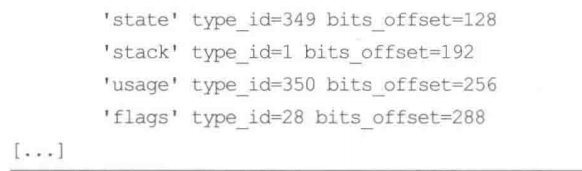
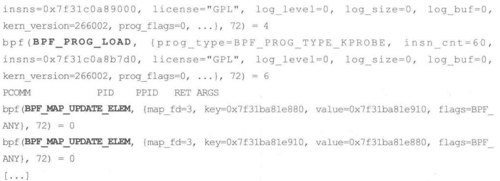
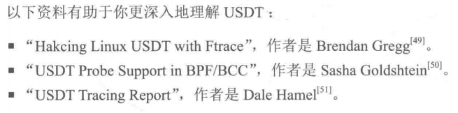

# BPF之巅

> 预期说是笔记，不如说是抄书，因为这个领域是完全陌生的，每一句话都需要仔细理解。

## 第一章 引言

### 1.1 BPF和eBPF是什么

简单来说，BPF提供了一种在各种内核事件和应用程序事件发生时运行一段小程序的机制（可以理解为钉子，钉在应用程序和内核事件之间）。

BPF由指令集、存储对象和辅助函数等几部分组成。由于它采用了虚拟指令集规范，因此也可将它视作一种虚拟机实现。这些指令由Linux内核的BPF运行时模块执行，具体来说，该运行时模块提供两种执行机制：一个解释器和一个将BPF指令动态转换为本地化指令的即时(JIT)编译器。在实际执行之前，BPF指令必须先通过验证器(verifer)的安全性检查，以确保BPF程序本身不会崩溃或者损坏内核。

扩展后的BPF(eBPF)，官方缩写依旧为BPF。实际上，在内核仍然只有一个执行引擎，即BPF，同时支持扩展后的BPF和“经典”的BPF

### 1.2 跟踪、嗅探、采样、剖析和可观测性都是什么

这些都是用来对分析技术和工具进行分类的术语

#### 跟踪(tracing)、嗅探

​	跟踪是基于事件的记录--这也是BPF工具所使用的监测方式。如Linux下的strace(1)，可以记录和打印系统调用事件的信息。也有像Linux中top(1)这种不跟踪事件，而是使用固定的计数器统计监测事件的频次，然后打印出摘要信息。一个**显著的特点**是，跟踪工具具备记录原始事件和事件元数据的能力。但是这类数据体量是庞大的，而BPF技术催生了可编程跟踪工具的出现，可以通过运行一段小程序来进行定制化的实时统计摘要或其他动作

​	常见工具有:strace,tcpdump以及Solaris系统中的各类嗅探器(snoop)

#### 采样(sampling)

​	通过获取全部观测量的子集来描绘目标的大致图像。也被称为profiling。有一个BPF工具就叫profile(8)，它基于计时器对运行中的代码进行定时采样。采样器的优点是，性能开销比跟踪工具小。缺点是，只提供了一个大致的图像，可能遗漏细节

#### 可观测性(observability)

​	通过全面观测来理解一个系统，可实现该目标的工具就可以归类为可观测性工具。包括跟踪、采样和基于固定计数器的工具。但是不包括基准测量(benchmark)工具，基准测量工具在系统上模拟业务负载，会更改系统的状态。BPF工具就属于可观测性工具，这些工具使用BPF技术进行可编程型跟踪分析。

> 总的来说，可观测性是跟踪采样的总体抽象

### 1.3 BCC、bpftrace和IO Visor

为了方便BPF程序的编写，在跟踪方面两个主流的前端：BCC和bpftrace

BCC（BPF编译器集合，BPF Compiler Collection）是最早用于开发BPF跟踪程序的高级框架。它提供了一个编写内核BPF程序的C语言环境，也为诸如Python、Lua和C++提供接口。也是libbcc和libbpf库的前身。这两个库提供了使用BPF程序对事件进行观测的库函数。BCC则是提供了70多个BPF工具。

bpftrace是一个新出现的前端，专门用于创建BPF工具的高级语言支持。bpftrace也是基于libbcc和libbpf库进行构建的

BCC和bpftrace的关系如图，bpftrace在编写功能强大的单行程序或者短小的脚步方面较强；BCC更适合开发复杂的脚本和作为后台进程使用，还可以调用其他的库支持(类比VS和vscode)：


嵌入式方面有一个ply的BPF前端，较为轻量化且依赖最小化。部分bpftrace工具在转为ply语法后就可以使用ply执行，但是ply尚不成熟。

BCC和bpftrace都不在内核代码仓库中，均属于GitHub中名为IO Visor的Linux基金会项目

+ [ply](https://github.com/iovisor/ply)
+ [bpftrace](https://github.com/bpftrace/bpftrace)
+ [BCC](https://github.com/iovisor/bcc)

### 1.5 BPF跟踪的能见度

无需重启，当我们需要对内核组件、设备、应用库进行检查时，可以立即使用BPF工具对其现场直播

### 1.6 动态插桩：kprobes和uprobes

动态插桩技术：在生产环境对于正在运行的软件插入观测点的能力。在未启用时，软件不受任何影响，动态插桩开销为零。其中kprobes值得是内核函数插桩，uprobes是用户态函数插桩，在bpftrace中使用的动态插桩示例如下：


### 1.7 静态插桩：tracepoint和USDT

>  tracepoint又称为内核跟踪点。

动态插桩技术有一大缺点：随着软件变更，被插桩的函数可能被重新命名，或者被移除。当内核或者应用软件升级后，BPF工具可能无法正常工作。这属于接口稳定性问题。并且在使用了编译器优化后，部分函数会被转换为内联函数(inline)函数，对于这些函数，就无法使用kprobes或者uprobes。

对于上述的问题，统一的解决方法是改用静态插桩技术。静态插桩会将稳定的事件名字编码到软件代码职工，由开发者进行维护。BPF工具支持内核的静态跟踪点插桩技术，也支持用户态的静态定义跟踪插桩技术USDT(user level statically defined tracing)。静态插桩技术的缺点显而易见，增加了开发者的维护成本，因此即使软件中存在静态插桩点，数量也十分有限。

上述缺点除非自己开发BPF工具，否则无需关注。如有需要，推荐先使用静态跟踪(跟踪点或者USDT)，不够用的话再使用动态插桩技术(kprobes或uprobes)。bpftrace中使用静态插桩技术的例子：


### 1.8 初识bpftrace：跟踪open()

> 需要注意的是，当使用系统调用的跟踪点的时候，需要再内核编译的时候，打开`CONFIG_FTRACE_SYSCALLS`选项

使用bpftrace跟踪系统调用open(2)，可以使用一个现有的静态插桩点(syscall:sys_enter_open)，使用bpftrace可以写一个单行程序，在调用open的时候输出进程的名字和传递给open系统调用的文件名：


其中bpftrace程序被定义在单引号内，编写后enter会立即编译执行，ctrl+c会结束同时移除BPF程序。也体现了BPF跟踪工具提供的按需插桩的工作方式：只在相关命令存活期间被激活。

open系统调用有很多的变体，可以通过命令选项`-l`使用统配符进行跟踪列出所有和open相关的跟踪点


实际上，openat这个变体使用的频率可能更高，可以使用bpftrace来验证一下：


上述的计算信息都是在内核态下高效计算出来的，当bpftrace定义的程序过长的时候，可以将其制作为一个脚本进行执行。

bpftrace提供了一个跟踪所有系统调用开始和结束位置的程序opensnoop.bt


### 1.9 再回到BCC：追踪open()

BCC版本的opensnoop


BCC提供的工具一般会提供更加复杂的功能：


这也就体现了BCC和bpftrace的差异：BCC自带工具很多，可以直接上手使用；而bpftrace则语法简单，更适合定制化开发

## 第二章 技术背景

### 2.1 图释BPF


### 2.2 BPF

BPF的工作方式：最终用户通过BPF虚拟机的指令集（也称为BPF字节码）定义过滤器表达式，然后传递给内核，有**解释器**执行。因此包过滤式在内核中直接执行的，避免了向用户态进程复制每个数据包。同时，BPF还提供了安全保障，用户自定义的过滤器首先需要通过安全性验证。tcpdump就使用了BPF过滤，其简要流程如下：


使用tcpdump -d 参数可以打印出过滤器表达式的BPF指令：


### 2.3 eBPF

Linux运行时各模块的架构如下图，该图展示了BPF指令如何通过BPF验证器验证，再有BPF虚拟机执行。BPF虚拟机包括一个解释器以及一个JIT(及时 just in time)编译器:JIT负责生成处理器可直接执行的机器指令。验证器则拒绝不安全的指令。

BPF可以通过辅助函数获取内核状态，利用BPF映射表进行存储。BPF程序在特定时间发生时执行，包括动态插桩（kprobes,uprobes）以及静态插桩(跟踪点)

#### 2.3.1 为什么性能工具需要BPF

BPF的与众不同之处在于，同时具备了高效率和生产环境安全性的特点，并且已经内置在了Linux内核中，有了BPF就可以直接使用BPF工具，无需新增内核组件。

#### 2.3.3 编写BPF程序

进行BPF编程的前端工具，从低级到高级排列如下：

+ LLVM：可以使用C语言或者LLVM中间表示形式(Intermediate Representation)进行编写，然后再编译为BPF，LLVM自带优化器，可以对它生成的BPF指令进行效率和体积上的优化
+ BCC：允许使用C语言编写BPF程序。内部实现仍然是使用LLVM中间表示形式和一个LLVM库来实现BPF编译
+ bpftrace：提供自己的高级语言。内部实现仍然是使用LLVM中间表示形式和一个LLVM库来实现BPF编译

虽然很少使用到直接通过BPF指令集进行编程的情况，但是在使用工具遇到问题的时候，会有查看指令的需求。接下来两个小节通过bpftool以及bpftrace进行示例

#### 2.3.4 使用BPF查看指令集：bpftool

Linux4.15添加了bpftool这个工具，可以用来查看和操作BPF对象，包括BPF程序和对应的映射表。源码位于Linux源码的tools/bpf/bpftool中

bpftools的默认输出展示了所操作的BPF对象：


对于每一个对象，都有一个专门的帮助文档：


**bpftools perf**显示了哪些BPF程序正在通过perf_event_open()进行挂载：


以上输出有3个不同的PID，分属不同的BPF程序

+ PID 1765 是Vecotr BPF PMDA大理，用来做实例性能分析(细节见17章)
+ PID 21993 是bpftrace版本的biolatency。它显示使用两个uprobes（用户态插桩）,即bpftrace中的BEGIN和END探针，还有两个kprobes(内核态插桩)用于对块IO的起始结束进行插桩（第9章有该程序的源码）
+ PID 25440 是BCC版本的biolatency，它正在对另一个块IO的起始函数进行插桩

offset字段显示了被插桩对象的偏移量。对于bpftrace，偏移量1781920匹配了bpftrace二进制文件中的BEGIN_trigger函数，偏移量1781927匹配了END_trigger函数(可以使用readelf -s bpftrace来进行验证)

prog_id是BPF程序ID，可以使用该命令进行打印：

```shell
bpftool prog show 
```


输出以程序ID开始（262 263），示例中是BCC的kprobe程序，该程序中带有BTF(BPF Type Format)信息，这可以从上面的输出显示的btf_id看出来。此时仅需要知道BTF是BPF版本的调试信息就可以了。

bpftool prog dump xlated

每个BPF程序都可以通过它的ID被打印出来。xlated模式将BPF指令翻译为汇编指令打印出来。示例中为程序234、bpftrace块IO完成跟踪程序的输出：


上述输出显示了可被BPF调用的受限的内核辅助函数之一：bpf_probe_read()

以下为比较上述输出（非黑体汇编）和观测块IO完成事件的程序（黑体）输出，该程序基于BTF编译，ID是263：


如果程序中包含了BTF信息，那么可以使用linum修饰符在输出中增加源代码文件和行信息（使用黑体标记）


使用opcodes可以输出包含BPF指令的opcode(黑体表示，操作码)：


修饰符visual,可以以DOT格式输出控制流信息，支持使用外部可视化软件打开。以下例子使用的是GraphVix软件和其绘制有向图工具dot(1):


以下为使用GraphVix中的osage对BPF程序可视化执行的结果：


bpftool prog dump jited

prog dump jited子命令显示了经过JIT编译之后的机器码。示例为x86_64体系结构下BCC的块IO完成跟踪程序：


bpftool btf

bpftool可以打印BTF的ID，如BTF ID 5 是BCC的块IO的完成事件的输出：



#### 2.3.5 使用bpftrace查看BPF指令集

tcpdump 的-d参数可以输出BPF指令，bpftrace也可以通过-v/-d参数达到该效果：


大多数人不是设计到BPF指令层次的修改或者错误排查，这些事情应该交给社区来管理，大咖也可以直接向社区提供补丁

#### 2.3.6 BPF API

**BPF辅助函数**

BPF不允许任意调用内核函数，内核为BPF提供了可以调用的辅助函数，以下为部分辅助函数：


辅助函数中的“current”是指的是当前正在运行的线程，也就是当前正在CPU上执行任务的线程。

在内核源文件的头文件中，一般会为函数提供注释，而Linux的源码文件可以从一些网站上浏览

**bpf_probe_read()**

bpf_probe_read()是一个十分重要的函数。BPF中内存访问权限仅限于BPF寄存器和栈空间以及通过辅助函数访问的BPF映射表。如果需要访问其他内存（如BPF之外的其他内核地址），就必须通过bpf_probe_read()来读取。

该函数会进行安全性检查并禁止缺页中断的发生，以保证在probe上下文中不会发生缺页中断。

此外，该函数还可以将用户空间的内容读取到内核空间。

**BPF系统调用命令**

部分系统调用：


其中第一列可以作为bpf系统调用的第一个参数进行传递，使用strace(1)可以看到。如下例可以看到BCC版本的execsnoop(8)工具用到了那些bpf(2)系统调用：



这里需要**注意**，应该避免直接使用strace，因为当前的ptrace()实现会严重降低目标进程的运行速度----->性能下降为不足原来的%1。这里使用仅仅是因为他已经支持bpf(2)系统调用的参数翻译，即将一个数字翻译为一个可读的字符串

**BPF程序类型**

不同的BPF程序类型定义了BPF程序可以挂载的事件类型，以及事件的参数。主要用于跟踪用途的BPF程序类型如下：


在bpf.h中还有一些程序类型用于网络以及其他用途，如下：


**BPF映射表类型**

定义了不同类型的映射表数据结构：


#### 2.3.7 BPF并发控制

在Linux5.1 增加辅助函数spin lock之前，BPF还不支持并发控制。

术语丢失的更新：在进行跟踪的时候，并行的多个线程可能会同时对映射表数据进行查找和更新，造成一个线程破坏另一个线程的数据，即由当前的读和写发生了重叠造成的（本质上还是数据竞态）

跟踪程序使用的BCC和bpftrace前端，使用了per-CPU的哈希和数组映射类型，以尽可能的避免冲突。他们为每个*逻辑*CPU创建了独享的数据结构实例，避免了并行的线程对共享的位置进行更新。例如，一个对事件进行计数的映射表，可以通过对每个CPU上的映射表数据结构进行更新，然后再将每个CPU对应的映射表中的值相加，以得到事件总数。

具体的例子，对单行bpftrace程序使用per-CPU哈希映射来计数：


而该单行bpftrace程序使用了普通的哈希映射来计数：


如果在一个8-CPU系统上同时运行这两个程序，结果如下：


可以看到，普通的哈希映射大概会丢掉0.01%的统计值

除了每个CPU专用的映射之外，还有其他一些机制进行并发控制，包括互斥的相加操作（BPF_XADD）、“映射中的映射”机制（可以对整个映射进行原子更新的操作），以及BPF的自旋锁等机制。使用bpf_map_update_elem()对常规的哈希和LRU映射进行操作也是原子性的，不会产生写竞争。在Linux5.1中引入的自旋锁，可以通过bpf_spin_lock()和bpf_spin_unlock()进行控制。

#### 2.3.8 BPF sysfs接口

在Linux4.4中，可以将BPF程序和BPF映射通过虚拟文件系统显露出来，位置通常位于/sys/fs/bpf。术语为“钉住”(pinning)。

该机制允许创建持续运行的BPF程序（像daemon程序那样），即使创建程序进程已经退出，程序仍然可以运行。该机制还提供了用户态程序和正在运行的BPF程序交互的另一种方式：用户态程序可以读取和修改BPF映射表。

#### 2.3.9 BPF类型格式(BTF BPF Type Format)

BTF(BPF Type Format)是一个元数据的格式，用来将BPF程序的源代码信息编码到调试信息中。调试信息包括BPF程序、映射结构等很多其他信息。BTF包含函数的信息，源代码/行信息，以及全局变量信息等。

BTF调试信息可以内嵌到vmlinux二进制文件中，或者随BPF程序一桶使用原生Clang编译生成，或通过LLVM JIT生成。这样BPF程序就更容易被加载器（eg. libbpf）或者工具(eg. bpftool)所使用。检测和跟踪工具，包括bpftool(8)和perf(1)，可以获取这些信息，以得到源代码标记的BPF程序，或者可以基于它们的C结构表示美观地打印映射表的键值，而不需要使用裸十六进制形式打印。

除了描述BPF程序外，BTF正在成为一个通用的、用来描述所有内核数据结构的格式。

BPF跟踪工具通常需要在机器上安装内核头文件（一般是通过linux-headers包），这样才可以访问各种C结构。

有时候这些头文件没有包含全部的内核结构定义，对有些BPF追踪工具来说比较困难：临时的解决方法是，在BPF工具中重新定义这些结构体。有时候，过于复杂的头文件无法被正确处理，bpftrace遇到这种情况会选择直接终止。BTF可以通过提供对所有数据结构的准确定义来解决这些问题。在未来，一个带着BTF信息的Linux啮合vmlinux二进制文件，将会是自描述的（这句话云里雾里的，理解不了）。

#### 2.3.10 BPF CO-RE

CO-RE(Compile Once - Run Everywhere)，即一次编译，到处运行。皆在将BPF程序一次性编译为字节码，然后其他机器执行的时候就不再需要安装BPF编译器，这对嵌入式系统尤为重要。

#### 2.3.11 BPF的局限性

BPF程序不能随意调用内核函数；只能调用在API中定义的BPF辅助函数。BPF程序在执行循环时也有限制：允许BPF将一个无限循环插入kprobes是不安全的，因为这些线程可能持有重要的锁，从而导致整个系统的死锁。解决方法包括循环展开，以及在使用循环的通用场景添加特定的辅助函数等。Linux5.3内核支持BPF受限循环，该循环的上限可以通过验证器验证。

BPF栈的大小设定不能超过MAX_BPF_STACK，值为512。当遇到空间不足的时候，解决方法是使用BPF映射存储空间，映射存储空间是有大小限制的。在bpftrace项目中，已经开始了将字符串的存储位置从栈空间转移到映射的工作。

Linux5.2内核以后，无需考虑BPF程序的总指令数量。但是在之前的内核，BPF程序的总指令数量限制为4096.

#### 2.3.12 BPF扩展阅读资料

+ 内核代码：Documentation/networking/filter.txt
+ 内核代码：Documentation/bpf/bpf_design_QA.txt
+ bpf(2) man 
+ bpf-helper(7) man
+ 《BPF:the universal in-kernel virtual machine》，作者Jonathan Corbet
+ 《BPF internals-II》，作者为Suchakra Sharma
+ Cilium项目的"BPF and XDP Reference Guide"

### 2.4 调用栈回溯

BPF提供了存储调用栈信息的专用映射表数据结构，可以保存基于帧指针或基于ORC的调用栈回溯信息。

#### 2.4.1 基于帧指针的调用栈回溯

帧指针技术依赖的是以下*惯例*：函数调用栈帧链表的头部，始终保存于某个寄存器中（在x86_64中，这个寄存器是RBP），并且函数调用的返回地址永远位于RBP的值指向的位置加上一个固定偏移量（+8）。这意味着任何调试器或者跟踪器都可以在中断程序执行后，通过读取RBP后遍历以RBP的值为头部的链表，同时在固定位置返回地址，从而轻松的进行栈回溯，过程如图：


AMD64 ABI中提到，RBP作为帧指针寄存器来使用是一种惯用做法，而非强制要求。为了节省函数前言(prologue)和结语(epilogue)的指令数量，也可以不将RBP用作帧指针寄存器，而是将其作为通用寄存器来使用。

目前，gcc编译器默认不启用函数帧指针，而将RBP作为通用寄存器来使用，这样就无法基于帧指针进行栈回溯。但是可以通过gcc的命令行参数-fno-omit-frame-pointer来改变这个默认行为。至于为什么不开启，一个是为了针对寄存器较少的机器进行性能提升，另一个是为了商业竞争（和Intel的icc比拼）

在x86_64中，这种优化提升的性能不足百分之一，甚至没有什么可观察提升。所以开启帧指针从而支持CPU剖析得到的性能优化提升潜力，远远超过了启用帧指针带来的小小的性能损失。

当然，帧指针并非进行栈回溯的唯一方法，还可以使用调试信息(debuginfo)、LBR以及ORC

#### 2.4.2 调试信息

软件的额外调试信息以软件的调试信息包(debuginfo package)的形式提供，这其中包含了DWARF格式的ELF调试信息。该调试信息中包含了供gdb(1)这样的调试器来做调用栈的文件段信息，这样即使没有启用帧指针寄存器也可以进行栈回溯。ELF中的调试相关文件是.eh_frame和.debug_frame

调试信息文件中的某些段也包含程序的源代码和行号信息，这就导致文件的调试信息远远大于被调试的原始二进制文件的尺寸，这也是为什么调试信息文件被称为DWARF的原因。

BPF目前还不支持这种栈回溯技术，因为太耗费处理器资源，而且需要读取可能并没有加载到内存中的ELF段信息。这使得在禁用中断的受限BPF上下文实现相关支持几乎不可能。

不过BCC和bpftrace是支持使用调试信息文件进行符号解析的

#### 2.4.3 最后分支记录LBR

最后分支记录(Last Brance Record,LBR)是Intel处理器的一项特性：程序分支，包含函数调用分支信息，被记录在硬件缓冲区中。该技术没有额外开销，可以用来进行调用栈重组。但是支持记录的深度有限制，根据型号不同，可记录分支数量在4-32个之间。

目前BPF并不支持LBR

#### 2.4.4 ORC

> 命名的故事：ORC（兽人）的提出是针对之前DWARF（矮人）提案的回应，而DWARF也和ELF（精灵）文件格式呼应

针对栈回溯需求专门设计了一种新的调试信息格式---Oops回滚能力（Oops Rewind Capability，ORC）。相比DWARF格式，该格式对处理器要求较低。ORC使用名为.orc_unwind和.orc_unwind_ip的ELF文件段，目前Linux内核已经实现了相关支持。在寄存器受限的体系结构上，可能会存在不开启帧指针的情况下编译内核，然后使用ORC技术进行栈回溯。

在内核中基于ORC的调用栈回溯可以通过perf_callchain_kernel()函数支持，BPF可以调用该函数，这意味着BPF也支持基于ORC的调用栈。目前还没有开发用户态对ORC调用栈的支持。

#### 2.4.5 符号

调用栈信息目前在内核中是以地址数组形式记录的，这些地址可以通过用户态的程序翻译为符号（如函数的名字[实例](https://panthema.net/2008/0901-stacktrace-demangled/)）。在收集和翻译两个操作之间，符号映射表可能发生变化，这会导致翻译无效或有些符号信息丢失。

### 2.5 火焰图

火焰图可以用来可视化来自任何剖析器或者跟踪所记录的调用栈信息

#### 2.5.1 调用栈信息

调用栈信息，也称为栈回溯跟踪或调用跟踪信息，是一串展示了代码流向的函数信息。其信息显示中，底部为起点（栈），顶部则是当前函数

#### 2.5.2 对调用栈信息的剖析

以定时采样方式收集调用栈信息，一般会收集很多信息。为了易于分析，Linux的perf(1)剖析器将其样本摘要为调用树格式，显示每个分支所占的百分比。BCC的profile(8)则是对每个独特的调用栈分别计数。如果有某个调用栈占用大部分的CPU运行时间，这两种工具可以很快识别出来。但是对于许多其他的分析场景，包括一些微小的新能回归测试，定位问题可能需要研究大量的剖析器输出。火焰图就是为了解决这个问题。

CPU剖析器简单输出示例：


其中，a->b->c这条代码路径调用了7次（c正在CPU上运行），a->b路径调用了2次（b正在CPU上运行），a->b->d->e调用了一次（e正在CPU上运行）

#### 2.5.3 火焰图

上述示例对应的火焰图则如下：


可以看到火焰图的特点：

+ 每个方块代表了调用栈中的一个函数
+ Y轴表示了栈深度，即栈帧的数量。其顺序依旧是栈的形式，顶部代表叶子，底部代表根。
+ X轴包括了全部的采样样本的数量。方块的长度代表该函数在剖析文件中出现次数的比重。

火焰图实际上是一个反转的冰柱布局图，这种布局图可以用于对一组栈的调用关系进行可视化。每个垂直方向，出现在顶部的函数就是正在CPU上运行的函数。

从上图可以看出，c函数在CPU上占据了大概70%左右的时间，b为20%，c为10%，剩下的函数则没有直接的运行采样。

### 2.6 事件源

部分可跟踪的事件源以及在Linux内核中的BPF绑定点：


### 2.7 kprobes

kprobes可以对任何内核函数进行插桩，还可以对函数内部的指令进行插桩。它可以实时在生产环境系统重启用，无需重启系统亦或者内核。

kprobes技术还有另外一个接口，即kretprobes，用来对内核函数返回时进行插桩以获取返回值。当用kprobes和kretprobes对同一个函数进行插桩时，可以使用时间戳来记录函数执行的时长。这是**性能分析中的一个重要指标**

#### 2.7.1 kprobes是如何工作的

使用kprobes对内核函数进行插桩的过程如下：

+ 对于一个kprobe插桩来说(流程类似硬中断的处理)：

  > + 将要插桩的目标地址中的字节内容复制并保存---->为的是给单步断点指令腾出位置
  > + 以单步中断指令覆盖目标地址：在x86_64上是int3指令。如果kprobes开启了优化，则使用jmp指令。
  > + 当指令流执行到断点时，断点处理函数会检查这个断点是否是由kprobes注册的，如果是，就会执行kprobes处理函数。
  > + 原始指令继续执行，指令流继续
  > + 当不需要kprobes时，原始的字节内容会被复制回目标地址上，这样这些指令就回到了他们的初始状态。

+ 如果这个kprobe是一个Ftrace已经做过插桩的地址（一般位于函数入口处），那么可以基于Ftrace进行kprobe优化，过程如下：

  > + 将一个Ftrace kprobe处理函数注册为对应函数的Ftrace处理器
  > + 当在函数起始处执行内建入口函数时(x86架构上的gcc4.6是\_\_fentry\_\_)，该函数会调用Ftrace，Ftrace接下来会调用kprobe处理函数
  > + 当kprobe不再被使用的时候，从Ftrace中移除Ftrace-kprobe处理函数

+ 如果是一个kretprobe:

  > + 对函数入口进行kprobe插桩
  > + 当函数入口被kprobe命中时，将返回地址保存并替换为一个“蹦床”(trampoline)函数地址
  > + 当函数最终返回时(ret指令)，CPU将控制交给蹦床函数处理
  > + 在kretprobe处理完成之后再返回到之前保存的地址
  > + 当不再需要kretprobe时，函数入口的kprobe就被移除

根据当前系统结构的体系结构，kprobe的处理过程可能需要禁止抢占或者禁止中断。

kprobe已经做了十分安全的防范措施。实际使用中最大的风险是在使用一个执行频率特别高的函数进行插桩的时候，每次函数调用的开销都将增加，这会对性能造成影响。

kprobes在某些ARM 64位系统上不能正常工作，因为这些平台上的内核代码区不允许被修改。

#### 2.7.2 kprobes接口

最初使用kprobes技术时，需要先写一个内核模块，通常用C书写入口处理函数和返回函数，再通过调用register_kprobe()注册。接下来加载该内核模块，使用printk()输出定制化信息。计数后，在调用unregister_kproce()作为结束。

现在有以下三种接口可访问kprobes：

+ kprobe API:如register_kprobe()等
+ 基于Ftrace的，通过/sys/kernel/debug/tracing/kprobe_events:通过向这个文件写入字符创，可以配置开启和停止kprobes
+ perf_event_open():与perf(1)工具所使用的一样，进来BPF耿总工具也开始使用这些函数。Linux内核4.17中接入了相关支持

最主要的使用方法还是借助前端追踪器，包括perf(1)、SystemTap以及BPF追踪器，如BCC和bpftrace

#### 2.7.3 BPF和kprobes

kprobes向BCC的bpftrace提供了内核动态插桩的机制，在很多工具中都用到了该机制。相关接口如下：

+ BCC:attach_kprobe()和attach_kretprobe()，支持对函数的开始或某一偏移量位置进行插桩。kretprobes都是在函数返回处进行动态插桩
+ bpftrace:kprobe和kretprobe探针类型，只支持在函数入口位置插桩。kretprobes都是在函数返回处进行动态插桩

简单的BCC例子：vfsstat(8)工具对VFS接口中的一些关键调用进行了插桩，每秒打印的概要信息：


可以在vfsstat源代码中查看kprobe跟踪了那些函数：


另一个bpftrace的例子，该单行程序通过匹配"vfs_"开头的函数，统计所有VFS函数的调用次数：


#### 2.7.4 关于kprobes的更多内容

参考：


### 2.8 uprobes

uprobes提供了用户态程序的动态插桩。其utrace接口和kprobes接口十分相似。uprobes在Linux内核3.5以上进行支持

uprobes与kprobes类似，只是在用户态程序使用。uprobes可以在用户态程序的函数入口、特定偏移处以及函数返回处进行插桩

uprobes也是基于文件的，当一个可执行文件中的一个函数被追踪时，所有使用到这个文件的进程都会被插桩，包括那些尚未启动的进程。这样就可以全系统范围内跟踪系统库调用。

#### 2.8.1 uprobes是如何工作的

与kprobes类似：将一个快速断点指令插入目标指令处，该指令将执行转交给uprobes处理函数。当不再需要uprobes时，目标指令会恢复成原来的样子。对于uretprobes，也是在函数入口处使用uprobe进行插桩，而在函数返回之前，则使用一个蹦床函数对返回地址进行劫持，和kprobes类似。

可以通过调试器看到该行为。比如从bash(1)中反汇编readline()函数：


而使用了uprobes(或者uretprobes)进行插桩：


注意，第一个指令已经被替换成int3单步中断。

可以使用一个bpftrace单行程序来对readline()进行插桩：

```shell
bpftrace -e 'uprobe:/bin/bash:readline { @ = count() }'
```

该程序对当前正在运行以及后续会运行的bash shell的readline()进行跟踪。打印出统计计数，使用`Ctrl+C`退出。当bpftrace停止运行时，uprobe会被移除，原始的指令被恢复回去。

#### 2.8.2 uprobes接口

+ 基于Ftrace的，通过向`/sys/kernel/debug/tracing/uprobe_events`配置文件中写入特定字符串打开或关闭uprobes
+ perf_event_open():和perf(1)工具的用法一样。相关支持已经加入内核4.17版本。

在内核中同时包含了register_uprobe_event()函数，和register_kprobe()类似，但是没有以API形式显露

#### 2.8.3 BPF与uprobes

uprobes为BCC和bpftrace提供了用户态程序的动态插桩支持，这在多个工具中都有使用。接口如下：

+ BCC:attach_uprobe()和attch_uretprobe()
+ bpftrace:uprobe和uretprobe探针类型

同kprobe一样，BCC支持在函数入口，指定偏移量处，函数返回处进行插桩。而bpftrace仅支持入口和返回处进行插桩、

举个BCC中的例子:gethostlatency(8)工具利用对库函数getaddrinfo(3)和gethostbyname(3)的插桩对主机名解析(DNS)访问进行跟踪


被跟踪的函数可以通过源代码看到：


bpftrace的例子，该单行程序列出并统计了libc系统库中gethost函数的调用次数：

```shell
bpftrace -l 'uprobe:/lib/x86_64-linux-gnu/libc.so.6:gethost*'
```


```shell
bpftrace -e 'uprobe:/lib/x86_64-linux-gnu/libc.so.6:gethost* { @[probe] = count(); }'
```


#### 2.8.4 uprobes的开销和未来的工作

uprobes可能会被挂载到高频事件上，比如malloc()和free()。此时可能会导致应用程序10倍以上的性能损耗。所以只能应用于测试环境中的故障排查过程。

目前正在讨论使用共享库来替换目前的、需要往返内核的uprobes实现，这样可以使BPF跟踪完全在用户态内进行。该技术已经被LTTng-UST使用了几年了，性能比当前实现相比快10-100倍

#### 2.8.5 扩展阅读


### 2.9 跟踪点(tracepoints)

跟踪点可以用来对内核进行静态插桩。内核开发正在内核函数特定逻辑位置处，有意放置了这些插桩点；这些跟踪点会被编译到内核的二进制文件中。在Linux内核2.6.32开始支持。kprobes和跟踪点比较：


对于内核开发者来说，跟踪点无疑增加了维护成本，并且其适用范围比kprobes要小很多。其有点是它的API比较稳定：即使内核升级了，大部分跟踪点依旧可以使用。但是kprobes的工具在内核版本升级时，如果被跟踪函数被重命名或者功能改变，则会导致不可用。

所以如果条件允许，应当先尝试使用跟踪点，再使用kprobes

跟踪点的格式为"子系统:事件名"(subsystem:eventname,如kmem:kmalloc)

格式的前半部分，不同跟踪工具有不同叫法：系统、子系统、类、提供商等。

#### 2.9.1 如何添加跟踪点

可以查看sched子系统中`sched:sched_process_exec`是如何被加入内核的

在内核源代码目录树`include/trace/events`下有跟踪点相关的头文件，以下是`sched.h`部分截取内容：

上述代码的信息也会在运行时通过/sys目录下的Ftrace框架显露出来，对于每一个跟踪点会有一个对应的格式文件，如：

```shell
cat /sys/kernel/debug/tracing/events/sched/sched_process_exec/format
```


各种跟踪器使用此格式文件来裂解跟踪点上绑定的元数据信息。下面的例子是在内核源代码`fs/exec.c`中通过`trace_sched_process_exec()`调用的


#### 2.9.2 跟踪点的工作原理

跟踪点处于不启动的状态时，性能开销要尽可能的小。Mathieu Desnoyers使用了一项叫做“静态跳转补丁”(static jump patching)的技术。该技术依赖一个编译选项，如下：

+ 在内核编译阶段会在跟踪点位置插入一条不做任何命令的指令。在x86_64架构上，这是一个5字节的nop指令。这个长度的选择是为了确保以后可以将其替换为一个5字节的jump指令

+ 在函数尾部插入一个跟踪点处理函数，也叫做蹦床函数（之所以叫这个名字，是因为在执行过程中函数会跳入，然后再跳出这个处理函数）。这个函数会便利一个存储跟踪点探针回调函数的数组。这样做会导致函数编译结果稍稍变大，有可能对指令缓存有一些小影响。

+ 在执行过程中，当某个跟踪器启用跟踪点时（该跟踪点可能已经被其他跟踪器所启用）：

  > + 在跟踪点回调函数数组中插入一条新的跟踪器回调函数，以RCU（Read-copy update，允许在更新的同时读取数据）形式进行同步更新
  > + 如果之前跟踪点处于禁用状态，nop指令的地址会重写为跳转到蹦床函数的指令

+ 当跟踪器禁用某个跟踪点时：

  > + 在跟踪点回调函数数组中删除该跟踪器的回调函数，并以RCU形式进行同步更新
  > + 如果最后一个回调函数也被去除了，那么jmp指令再重写为nop指令。

这样可以最小化处于禁用状态的跟踪点的性能开销，几乎可以忽略不计。

如果asm goto指令不可用，那么将不再用jmp来替换nop，改为使用一个从内存中读取一个变量的状态分支。

#### 2.9.3 跟踪点的接口

跟踪点有以下两个接口：

+ 基于Ftrace的接口，通过`/sys/kernel/debug/tracing/events`：每个跟踪点的系统有一个子目录，每个跟踪点则对应目录下的一个文件（通过向这些文件中写入内容开启或关闭跟踪点）
+ perf_event_open():这是perf(1)工具一直以来用的接口，进来BPF追踪也开始使用。（通过perf_tracepoint PMU）

#### 2.9.4 跟踪点和BPF

跟踪点为BCC和bpftrace提供了内核的静态插桩支持。接口如下：

+ BCC:TRACEPOINT_PROBE()
+ bpftrace:跟踪点探针类型

Linux在4.7后BPF才支持跟踪点，所以工具相对较少

BCC中使用跟踪点的一个例子是tcplife(8).该工具为每个TCP会话打印一行摘要信息(第10章详细叙述)：


作为bpftrace使用跟踪点的例子，下面单行程序会对之前的sched:sched_process_exec进行插桩：


#### 2.9.5 BPF原始追踪点

Alexei Starovoitov开发了一个新的跟踪点接口：BPF_RAW_TRACEPOINT,在2018加入Linux4.17。它向跟踪点显露原始参数，这样可以避免因为需要创建稳定的跟踪点参数而导致的开销，因为这些参数可能压根没必要。这有点像以kprobes方式使用跟踪点：最终得到了一个不稳定的API，但是可以访问更多字段，也不需要承担跟踪点的性能损失。该方式相比kprobes更加稳定，因为跟踪点探针的名字是稳定的，不稳定的是参数。

Alexei的压测结果证明了BPF_RAW_TRACEPOINT性能好于kprobes和标准跟踪点：


#### 2.9.6 扩展阅读


### 2.10 USDT

用户态预定义静态跟踪(user-level statically defined tracing,USDT)提供了一个用户空间版的跟踪点机制。

USDT和用户态软件的日志或者跟踪相关技术的不同在于，它依赖于外部的系统跟踪器来唤起。如果没有外部跟踪器，应用中的USDT不会做任何事，也不会开启。

许多应用默认不开启USDT，显示开启需要使用配置参数--enable-dtrace-probes或者--with-dtrace

#### 2.10.1 添加USDT探针

有两种方式给应用程序添加USDT探针：通过systemtap-sdt-dev包提供的头文件和工具，或者使用自定义的头文件。这些探针定义了可以被放置在代码中各个逻辑位置上的宏，以此生成USDT的探针。BCC项目中的examples/usdt_sample目录下包含了USDT示例。这个例子可以用systemtap-sdt-dev头文件，或者使用Facebook的FollyC++库。

**Folly**

使用Folly添加USDT探针的过程如下

+ 在目标代码中增加头文件：

  ```c++
  #include "folly/tracing/StaticTracepoint.h"
  ```

+ 在目标位置增加USDT探针，采用如下格式：

  ```c++
  FOLLY_SDT(provider,name,arg1,arg2,...)
  ```

  "provider"对探针进行分类，"name"是探针的名字，后面是可选的参数。在BCC的USDT代码中包含了：

  ```c++
  FOLLY_SDT(usdt_sample_lib1,operation_start,operationId,request_input().c_str());
  ```

  这定义了一个usdt_sample_lib1:operation_start探针，带有两个参数。USDT例子中包含了operation_end探针。

+ 编译软件。可以使用readelf(1)工具来确认USDT探针是否存在：

  

  readelf(1)的命令行参数-n打印了notes文件段（即文件注释信息，版本、构建时间、二进制程序接口等），这里显示了编译进去的USDT探针的信息。

+ 可选步骤：有时准备添加的参数，在探针的位置处没有现成的，必须使用耗费CPU的函数调用来构建。为了在这些探针未被使用时避免调用，可以在函数外面增加一个探针信号量：

  ```c++
  FOLLY_SDT_DEFINE_SEMAPHORE(provider,name)
  ```

  此时探针就变成了：

  ```c++
  if(FOLLY_SDT_IS_ENABLED(provider,name)){
      ...expensive argument processing...
      FOLLY_SDT_WITH_SEMAPHORE(provider,name,arg1,arg2,...);
  }
  ```

  这样昂贵的参数处理，只会在探针启用（激活）后才会发生。这个信号量地址可以通过readelf(1)查看，跟踪工具可以在探针启用的时候对它进行设定。

  注意：当信号量所保护的探针在使用时，这些跟踪工具通常需要指定一个PID，这样才可以设定该PID的信号量。

#### 2.10.2 USDT是如何工作的

当编译应用程序时，在USDT探针的地址放置一个nop指令。在插桩时，这个地址会由内核使用uprobes动态地将其修改为一个断点指令。

前面readelf(1)的输出中，探针的位置是0x6a2（？没找到？）。这是二进制段的偏移量，所以必须首先知道二进制段的起始位置在哪。如果采用了位置无关代码(PIE)技术，这项技术能够提高*地址空间排布随机化*(ASLR)的效果，那么这个值可能是变化的。


起始地址是0x55a75372a000。打印出起始位置加探针的偏移量(0x6a2)


将USDT探针激活后：


nop指令被修改为int3(x86_64上的断点指令)。当该断点被触发时，内核会执行相应的BPF程序，其中带有USDT探针的参数。当USDT探针被禁用后，nop指令会被替换回来。

#### 2.10.3 BPF与USDT

USDT为BCC和bpftrace提供了用户态的静态探针支持，接口如下：

+ BCC：USDT().enable_probe()
+ bpftrace:USDT探针类型

比如，对前一个例子（在哪？没找到啊，这写的云里雾里的）中的循环探针进行观测：


这个bpftrace单行程序也打印了传递给探针的整数参数。

#### 2.10.4 USDT的更多信息



### 2.11 动态USDT

前面介绍的USDT探针技术，是需要被添加到源代码并编译到最终的二进制文件中，在插桩点留下nop命令，在ELF notes段中存放元数据。但是有一些语言，如Jave/JVM，是在运行的时候解释或者编译的。动态USDT可以给Java代码增加插桩点。

JVM已经内置在C++代码中，并包含了许多USDT探针--比如对GC时间、类加载，以及其他高级行为。这些USDT探针会对JVM的函数进行插桩。但是USDT探针不能被添加到动态进行编译的Java代码中。USDT需要一个提前编译好的、带一个包含了探针描述的notes段的ELF文件，这对于以JIT方式编译的Java代码来说是不存在的。

动态USDT解决方案如下（简单说就是套娃）：

+ 预编译一个共享库，带着想要内置在函数中的USDT探针。这个共享库可以用C/C++语言编写，它其中有一个针对USDT探针的ELF notes区域。它可以像其他USDT探针一样被插桩。
+ 在需要时，使用dlopen(3)加载该动态库。
+ 针对目标语言增加对该共享库的调用。

### 2.12 性能监控计数器

性能监控计数器(Performance monitoring counter,PMC)还有一些其他名字，比如性能观测计数器(Performance instrumentation counter,PIC)、CPU性能计数器(CPU Performance Counter,CPC)、性能监控单元事件(performance monitoring unit event,PMU event)。这些名词都是同一个东西：处理器上的硬件可编程计数器。

PMC数量众多，Intel从中选择了7个作为“架构集合”，这些PMC会对一些核心功能提供全局预览。可以使用CPUID指令来确认这些“架构集”PMC是否存在于当前处理器中。下表列出该集合，可作为有用的PMC的例子：


PMC是性能分析领域至关重要的资源。只有通过PMC才能测量CPU指令执行的效率、CPU缓存的命中率、内存/数据互联和设备总线的利用率，以及阻塞的指令周期等。在性能分析方面使用这些方法可以进行各种细微的性能优化。

尽管有数百个可用的PMC，但任一时刻在CPU中只允许固定数量的寄存器（可能只有6个）进行读取。在实现中，需要选择通过这6个寄存器来读取哪些PMC，或者可以采用循环采样的方式覆盖多个PMC集合（Linux中的perf(1)工具可以自动支持这种循环采样）。其他软件类计数器则没有这种限制。

#### 2.12.1 PMC模式

PMC可以工作在以下两种模式中：

+ **计数**：在该模式下，PMC能够跟踪事件发生的频率。只要内核有需要，就可以随时读取，如每秒获取1次。这种模式开销几乎为0
+ **溢出采样**：在该模式下，PMC在所监控的事件发生到一定次数时通知内核，这样内核可以获取额外的状态。监控的事件可能会以每秒百万、亿级别的频率发生，如果每次事件都进行终端，会导致系统性能下降到不可用。解决方案就是利用一个可编程的计数器进行采样，具体来说，是当计数器溢出时，就向内核发信号。（比如，每10000次LLC缓存未命中事件，或者每100万次阻塞的指令始终周期）

采样模式对BPF跟踪来说更值得关注，因为它产生的事件给BPF程序提供了执行的时机。BCC和bpftrace都支持PMC事件跟踪。

#### 2.12.2 PEBS

由于存在中断延迟（俗称“打滑”）或者乱序执行，溢出采样可能不能正确地记录触发事件发生时的指令指针。对于CPU周期性能分析来说，打滑无关紧要，而且有些性能分析器会故意在采样周期中引入一些微小的不规则形，避免过锁步采样(lockstep sampling)（或者使用一个自带偏移量的采样频率，如99Hz）。但是对于测量如LLC的未命中率等，这样的采样指令就必须是精确的。

Intel开发了一种解决发难，叫精确事件采样（precise event-based sampling,PEBS）。PEBS使用硬件缓冲区来记录PMC事件发生时正确的指令指针。Linux的perf_events框架机制支持PEBS。

#### 2.12.3 云计算

许多云计算环境不提供对虚拟机上的PMC访问请求。这在技术上是有可能开启它的，如，Xen虚拟化内核中提供了vpmu命令行选项，可以支持将不同的PMC显露给客体机器。Amazon公司也对其Nitro虚拟化主机开启了许多PMC支持。

### 2.13 perf_events

perf_events是perf(1)命令所依赖的采样和跟踪机制，在Linux内核2.6.31版本并入。现在，BPF跟踪工具可以调用perf_events来使用它的特性。BCC和bpftrace先使用perf_events作为它们的环形缓冲区，然后又增加了对PMC的支持，现在又通过perf_event_open()来对所有的事件进行观测。

在BPF跟踪工具使用perf(1)的时候，perf(1)也开发了一个使用BPF的接口，这就让perf(1)成为有一个BPF跟踪器。与BCC和bpftrace不同，perf(1)的代码位于Linux内核代码树中，因此，perf(1)也是唯一内置在Linux中的BPF前端

### 2.14 小结

BPF性能工具用到了很多技术，包括：扩展板BPF，内核态和用户态下的动态插桩技术（kprobes和uprobes），内核态和用户态的静态跟踪技术(跟踪点和用户态标记)，以及perf_events第。BPF可以使用基于帧指针和ORC技术的调用栈回溯技术来获取调用栈，并可以通过火焰图进行可视化呈现。

## 第三章 性能分析
