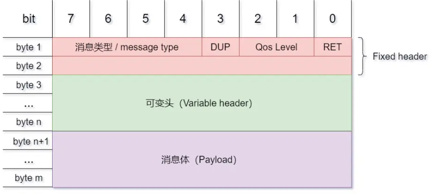
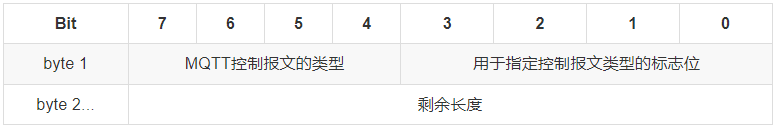
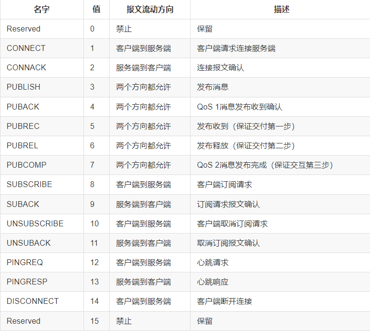
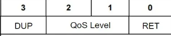
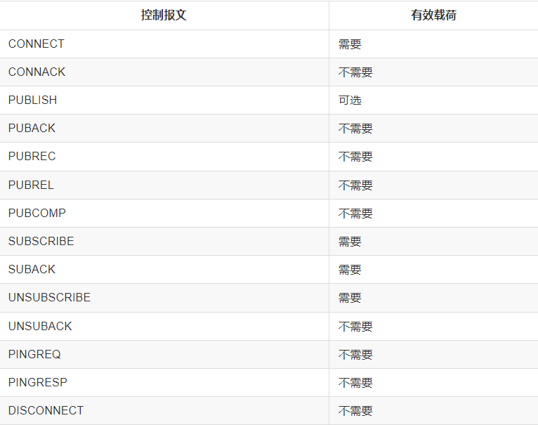
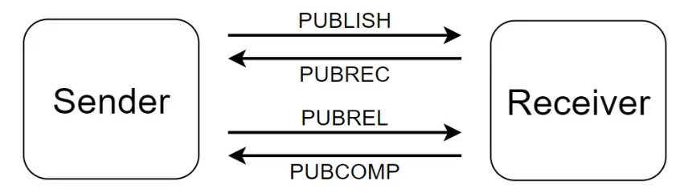

# MQTT理论基础

## 速刷

> 笔记总结自：[知乎：MQTT原理及案例](https://zhuanlan.zhihu.com/p/681713651)

### MQTT简介

MQTT全称Message Queuing Telemetry Transport即消息队列遥测传输，该协议基于TCP/IP协议栈构建的异步通信消息协议。是一种**轻量级**、**客户端服务端架构**、**发布/订阅**模式的消息传输协议。专门为低带宽、高延迟或不可靠的网络而设计的。

协议特点：

+ 简单易用，方便集成
+ 安全可靠，支持TLS/SSL加密和认证机制
+ 轻量级，占用带宽小，支持多种消息传输模式
+ 灵活性，可知道设备连接状态，可控数据传输质量

### MQTT原理

MQTT通信中使用的方式和ROS中的话题通信是一致的，每个客户端之间并不直接通信，而是通过server进行通信。通信的方式均为发布和订阅。整个通信流程中各个角色的作用：

+ 服务器：类似ros master，提供可靠性服务，接收所有客户端发送的信息并确保被正确投递
+ 客户端：类似rosnode，可以向服务器发布消息，也可以向服务器订阅数据
+ 主题：类似rostopic，通信消息体

发布和订阅这种方式的特点，相互独立(各个客户端不知道对方的存在)，时间异步（订阅和发布并非同步的），空间分离（通过网络连接）

### MQTT通信报文

#### 报文结构

MQTT报文由以下三部分组成：

+ 固定报头(Fixed header),所有MQTT都有，表示报文类型，以及报文的分组类表示。（类比TCP报文头）
+ 可变报头(Variable header)，部分MQTT报文有，报文类型决定了可变头是否存在以及其具体内容（类比TCP报文中可扩充字段）
+ 有效载荷/消息体(Payload)，部分报文有，存放报文的具体内容

#### 固定报头

##### 消息类型

位于第一字节的7-4位，表示MQTT报文类型，类型如下：

##### 标志位

位于第一字节的3-0位，没有使用的位都做保留位，如果接收端收到非协议中的标志位，则必须关闭连接

+ DUP：发布消息的副本
+ QoS：发布消息的质量
+ RETAIN：发布保留标识

##### 剩余长度

表示当前报文剩余部分的字节数，该字节使用了特殊的编码方式，允许应用发送最大256MB大小的控制报文

#### 可变报头

可变报头仅存在部分报文中，根据报文类型的不同而不同。可变报头的报文标识符(Packet Identifier)字段存在于多个类型的报文里

#### 有效载荷(Payload)

就是应用消息，但并非有所报文都携带有效载荷：

### QoS服务质量

MQTT提供三种服务质量：

+ QoS = 0:最多发一次
+ QoS = 1:最少发一次
+ QoS = 2:只分发一次

对于较为重要的消息使用QoS = 1和QoS = 2

#### QoS = 0最多发一次

该消息最多只发送一次，接受者不会发送响应，发送这也不会重试。消息可能没有送达

就类似快递员派件仍在了你的家门口，发送者并不知道接受者是否实际收件，或者丢件，发送者仅负责将快递按照地址放在门口，不确定快递派送结果的可靠性

#### QoS = 1最少发一次

确保消息至少**送达**一次。该报文需要PUBACK报文进行确认

该方式就好比卖家和买家之间的交互，卖家发货以后，必须等待买家确认收货，否则需要重新尝试送货，知道买家确定了收到货物

该方式可以确保货物最终一定到达，但是会增加一些延迟和工作量

#### QoS = 2 保证收一次

最高等级的服务质量，消息丢失和重复都是不可接受的。该方式会使用双重确认的方式，相应的也会带来额外的开销。

该方式就是卖家发顺丰，除了卖家和买家之间的确认意外，顺丰在派件的时候也会进行一次确认。

### MQTT心跳机制

客户端需要定期发送心跳包表明自己的存在，否则服务器会认为客户端出现异常或者离线。心跳机制是MQTT保证链路通畅的重要机制之一

### MQTT遗嘱

遗嘱的意思和字面意思一样，有心跳说明客户端还活着。遗嘱就是客户端没有心跳的时候，服务端就可以执行遗嘱了。

遗嘱是一种机制，允许客户端存活的时候设置并发送遗嘱，以便在客户端意外断线的时候由服务端公布。

