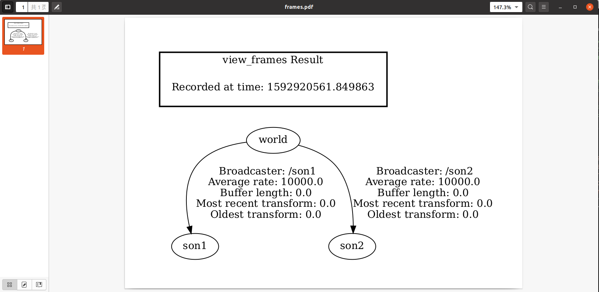
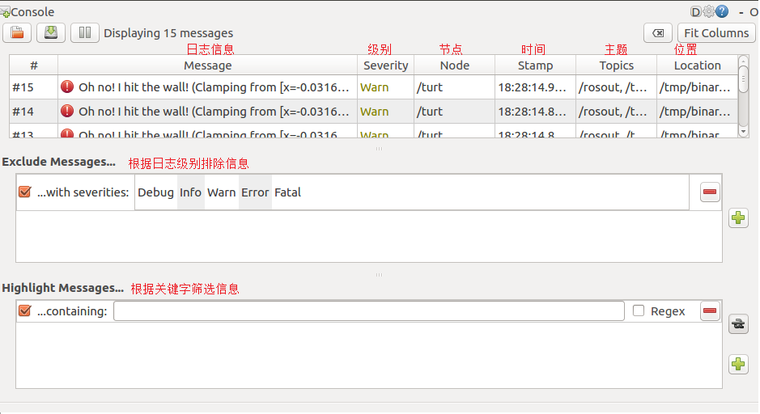
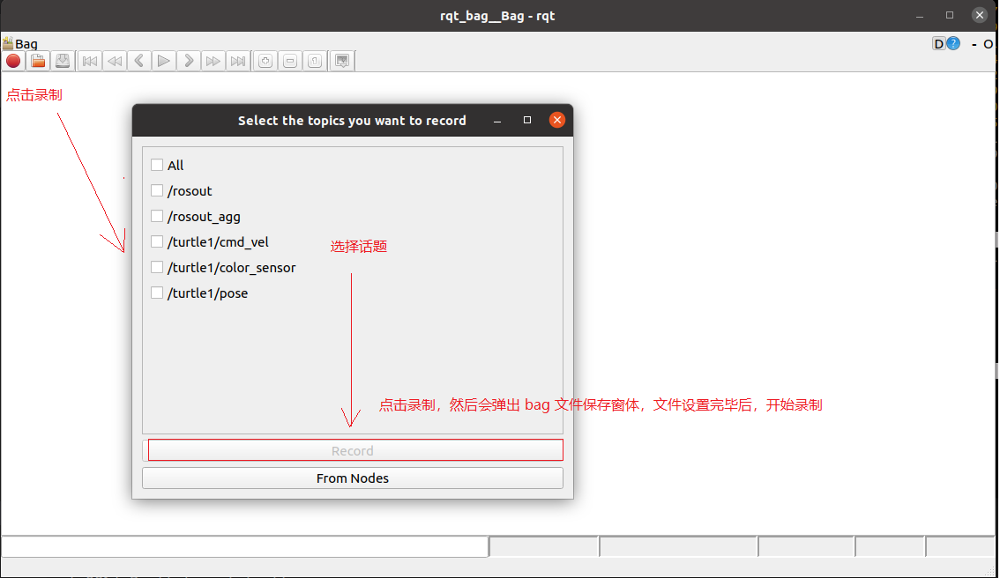
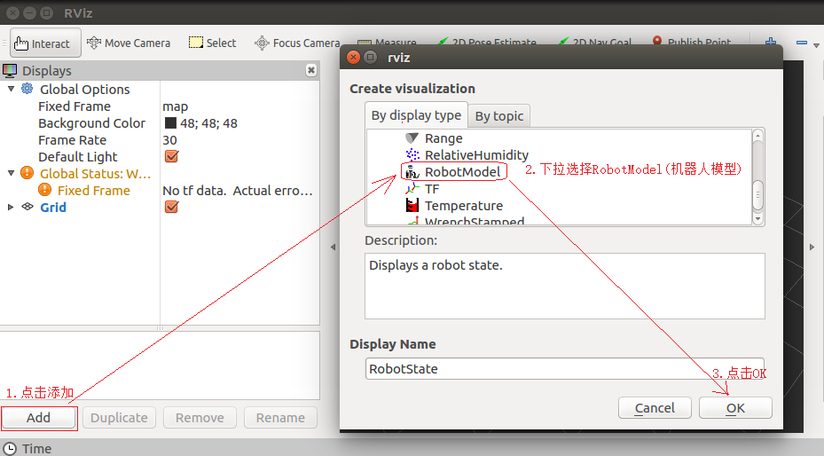
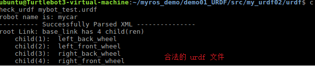

# 第一章 Hello ROS

## 初试牛刀

### 1.创建工作空间并初始化

```bash
mkdir -p workspace_name/src
cd workspace_name
catkin_make
```

### 2.进入src创建ros包并添加依赖

```bash
cd src
catkin_create_pkg helloros roscpp rospy std_msgs
```

### 3.C++版本

进入ros包中的src目录并创创建源文件：

```bash
cd  workspace_name/src/helloros/src
vim helloros.cc
```

```c++
#include "ros/ros.h"

int main(int argc, char *argv[])
{
    //执行 ros 节点初始化
    ros::init(argc,argv,"hello");
    //创建 ros 节点句柄(非必须)
    ros::NodeHandle n;
    //控制台输出 hello world
    ROS_INFO("hello ROS!");

    return 0;
}
```

更改CMake工程文件

```bash
cd ../		# 即 workspace_name/src/helloros下
vim CMakeLists.txt
```

将以下内容解除注释：

```cmake
add_executable(步骤3的源文件名
  src/步骤3的源文件名.cpp
)
target_link_libraries(步骤3的源文件名
  ${catkin_LIBRARIES}
)
```

进入工作空间目录并编译

```bash
cd workspace_name
catkin_make
```

执行

新建终端，启动ros核心服务

```bash
roscore
```

在工作空间执行：

```bash
cd workspace_name
source ./devel/setup.bash	# 基本固定，为了修改环境变量
rosrun helloros helloros	# rosrun 包名 C++节点
```

如果想让项目的环境变量永久生效，可以对`.bashrc`文件更改

```bash
vim .bashrc # source ~/工作空间/devel/setup.bash加至末尾
source -bashrc
```

## 开发环境搭建

### Terminator终端安装

```bash
sudo apt install terminator
```

常用快捷键,在同一个标签内的操作

```cmd
Alt+Up                          //移动到上面的终端
Alt+Down                        //移动到下面的终端
Alt+Left                        //移动到左边的终端
Alt+Right                       //移动到右边的终端
Ctrl+Shift+O                    //水平分割终端
Ctrl+Shift+E                    //垂直分割终端
Ctrl+Shift+Right                //在垂直分割的终端中将分割条向右移动
Ctrl+Shift+Left                 //在垂直分割的终端中将分割条向左移动
Ctrl+Shift+Up                   //在水平分割的终端中将分割条向上移动
Ctrl+Shift+Down                 //在水平分割的终端中将分割条向下移动
Ctrl+Shift+S                    //隐藏/显示滚动条
Ctrl+Shift+F                    //搜索
Ctrl+Shift+C                    //复制选中的内容到剪贴板
Ctrl+Shift+V                    //粘贴剪贴板的内容到此处
Ctrl+Shift+W                    //关闭当前终端
Ctrl+Shift+Q                    //退出当前窗口，当前窗口的所有终端都将被关闭
Ctrl+Shift+X                    //最大化显示当前终端
Ctrl+Shift+Z                    //最大化显示当前终端并使字体放大
Ctrl+Shift+N or Ctrl+Tab        //移动到下一个终端
Ctrl+Shift+P or Ctrl+Shift+Tab  //Crtl+Shift+Tab 移动到之前的一个终端
```

在不同标签之间的操作

```cmd
F11                             //全屏开关
Ctrl+Shift+T                    //打开一个新的标签
Ctrl+PageDown                   //移动到下一个标签
Ctrl+PageUp                     //移动到上一个标签
Ctrl+Shift+PageDown             //将当前标签与其后一个标签交换位置
Ctrl+Shift+PageUp               //将当前标签与其前一个标签交换位置
Ctrl+Plus (+)                   //增大字体
Ctrl+Minus (-)                  //减小字体
Ctrl+Zero (0)                   //恢复字体到原始大小
Ctrl+Shift+R                    //重置终端状态
Ctrl+Shift+G                    //重置终端状态并clear屏幕
Super+g                         //绑定所有的终端，以便向一个输入能够输入到所有的终端
Super+Shift+G                   //解除绑定
Super+t                         //绑定当前标签的所有终端，向一个终端输入的内容会自动输入到其他终端
Super+Shift+T                   //解除绑定
Ctrl+Shift+I                    //打开一个窗口，新窗口与原来的窗口使用同一个进程
Super+i                         //打开一个新窗口，新窗口与原来的窗口使用不同的进程
```

### 使用VSCode开发

创建ROS工作空间

```bash
mkdir -p xxx_ws/src	# (必须得有 src)
cd xxx_ws
catkin_make
```

启动VSCode

```bash
cd xxx_ws
code .
```

`Ctrl`+`Shift`+`B`，选择`catkin_make:build`后面的小齿轮,将配置文件更改如下：

```json
{
// 有关 tasks.json 格式的文档，请参见
    // https://go.microsoft.com/fwlink/?LinkId=733558
    "version": "2.0.0",
    "tasks": [
        {
            "label": "catkin_make:debug", //代表提示的描述性信息
            "type": "shell",  //可以选择shell或者process,如果是shell代码是在shell里面运行一个命令，如果是process代表作为一个进程来运行
            "command": "catkin_make",//这个是我们需要运行的命令
            "args": [],//如果需要在命令后面加一些后缀，可以写在这里，比如-DCATKIN_WHITELIST_PACKAGES=“pac1;pac2”
            "group": {"kind":"build","isDefault":true},
            "presentation": {
                "reveal": "always"//可选always或者silence，代表是否输出信息
            },
            "problemMatcher": "$msCompile"
        }
    ]
}
```

> 此时`Ctrl`+`Shift`+`B`会默认使用`catkin_make:build`进行编译

创建ROS功能包：

选中src右击----->create catkin package

设置包名（如：hello_vscode），添加依赖（如：roscpp rospy std_msgs）

接下来在包内的src文件下即可编写代码。

+ 如果没有提示，需要修改` .vscode/c_cpp_properties.json`,设置` "cppStandard": "c++17"`

+ 如果输出的中文乱码,在函数中加入以下语句任意一句：

  ```c++
  setlocale(LC_CTYPE, "zh_CN.utf8");
  setlocale(LC_ALL, "");
  ```

### launch文件

> 每次启动节点都需要使用rosrun，效率不高。官方给出的优化策略是使用launch文件，可以一次性启动多个ROS节点。launch本质上是一个xml文件

操作步骤：

+ 选定功能包右击---->添加launch文件夹

+ 选定launch文件夹右击---->添加launch文件

+ 编辑文件内容(该实例是运行ros自带的demo)

  ```xml
  <launch>
      <!-- <node pkg="helloros" type="helloros" name="helloros" output="screen" /> -->
      <node pkg="turtlesim" type="turtlesim_node" name="turtle_GUI"/>
      <node pkg="turtlesim" type="turtle_teleop_key" name="turtle_key" />
  </launch>
  ```

  - node ---> 包含的某个节点
  - pkg -----> 功能包
  - type ----> 被运行的节点文件
  - name --> 为节点命名
  - output-> 设置日志的输出目标

+ 运行launch文件

  ```bash
  source ./devel/setup.bash
  roslaunch 包名 launch文件名
  ```

## ROS架构

可以从设计者、维护者、系统结构和自身结构四个角度描述ROS结构：

### 设计者角度

ROS = Plumbing + Tools + Capabilities + Ecosystem即通讯，工具，功能，生态

+ Plumbing :**通讯机制（实现ROS不同节点之间的交互）**
+ Tools:**工具软件包(ROS中的开发和调试工具)**
+ Capabilities:机器人高层技能（ROS中某些功能的集合，如：导航）
+ Ecosystem:机器人生态系统（跨地域、跨软件与硬件的ROS联盟）

### 维护者角度

立足**维护者**的角度: ROS 架构可划分为两大部分

- main：核心部分，主要由Willow Garage 和一些开发者设计、提供以及维护。它提供了一些分布式计算的基本工具，以及整个ROS的核心部分的程序编写。
- universe：全球范围的代码，有不同国家的ROS社区组织开发和维护。
  - 一种是库的代码，如OpenCV、PCL等；（三方库）
  - 库的上一层是从功能角度提供的代码，如人脸识别，他们调用下层的库；（三方库封好的功能）
  - 最上层的代码是应用级的代码，让机器人完成某一确定的功能。（应用层）

### 系统架构角度

立足系统架构: ROS 可以划分为三层

- OS 层，也即经典意义的操作系统

  ROS 只是元操作系统，需要依托真正意义的操作系统，目前兼容性最好的是 Linux 的 Ubuntu，Mac、Windows 也支持 ROS 的较新版本

- 中间层

  是 ROS 封装的关于机器人开发的中间件，比如:

  - 基于 TCP/UDP 继续封装的 TCPROS/UDPROS 通信系统
  - 用于进程间通信 Nodelet，为数据的实时性传输提供支持
  - 另外，还提供了大量的机器人开发实现库，如：数据类型定义、坐标变换、运动控制....

- 应用层

  功能包，以及功能包内的节点，比如: master(roscore)、turtlesim的控制与运动节点...

### 自身结构角度

就 ROS 自身实现而言: 也可以划分为三层

- **文件系统**

  ROS文件系统级指的是在硬盘上面查看的ROS源代码的组织形式

- **计算图**

  ROS 分布式系统中不同进程需要进行数据交互，计算图可以以点对点的网络形式表现数据交互过程，计算图中的重要概念: 节点(Node)、消息(message)、通信机制_主题(topic)、通信机制_服务(service)（联系gRPC的机制理解）

- 开源社区

  ROS的社区级概念是ROS网络上进行代码发布的一种表现形式

  - 发行版（Distribution）　ROS发行版是可以独立安装、带有版本号的一系列综合功能包。ROS发行版像Linux发行版一样发挥类似的作用。这使得ROS软件安装更加容易，而且能够通过一个软件集合维持一致的版本。
  - **软件库**（Repository）　ROS依赖于共享开源代码与软件库的网站或主机服务，在这里不同的机构能够发布和分享各自的机器人软件与程序。
  - ROS维基（ROS Wiki）　ROS Wiki是用于记录有关ROS系统信息的主要论坛。任何人都可以注册账户、贡献自己的文件、提供更正或更新、编写教程以及其他行为。网址是http://wiki.ros.org/。
  - Bug提交系统（Bug Ticket System）如果你发现问题或者想提出一个新功能，ROS提供这个资源去做这些。
  - 邮件列表（Mailing list）　ROS用户邮件列表是关于ROS的主要交流渠道，能够像论坛一样交流从ROS软件更新到ROS软件使用中的各种疑问或信息。网址是http://lists.ros.org/。
  - **ROS问答**（ROS Answer）用户可以使用这个资源去提问题。网址是https://answers.ros.org/questions/。
  - 博客（Blog）你可以看到定期更新、照片和新闻。网址是https://www.ros.org/news/，不过博客系统已经退休，ROS社区取而代之，网址是https://discourse.ros.org/。

## ROS文件系统

### 工程结构


```text
WorkSpace --- 自定义的工作空间

    |--- build:编译空间，用于存放CMake和catkin的缓存信息、配置信息和其他中间文件。

    |--- devel:开发空间，用于存放编译后生成的目标文件，包括头文件、动态&静态链接库、可执行文件等。

    |--- src: 源码

        |-- package：功能包(ROS基本单元)包含多个节点、库与配置文件，包名所有字母小写，只能由字母、数字与下划线组成

            |-- CMakeLists.txt 配置编译规则，比如源文件、依赖项、目标文件

            |-- package.xml 包信息，比如:包名、版本、作者、依赖项...(以前版本是 manifest.xml)

            |-- scripts 存储python文件

            |-- src 存储C++源文件

            |-- include 头文件

            |-- msg 消息通信格式文件		---->通信机制（核心）

            |-- srv 服务通信格式文件		---->通信机制（核心）

            |-- action 动作格式文件		  ---->通信机制（核心）

            |-- launch 可一次性运行多个节点 

            |-- config 配置信息

        |-- CMakeLists.txt: 编译的基本配置
```

#### package.xml

该文件定义有关软件包的属性，例如软件包名称，版本号，作者，维护者以及对其他catkin软件包的依赖性

```xml
<?xml version="1.0"?>
<!-- 格式: 以前是 1，推荐使用格式 2 -->
<package format="2">
  <!-- 包名 -->
  <name>demo01_hello_vscode</name>
  <!-- 版本 -->
  <version>0.0.0</version>
  <!-- 描述信息 -->
  <description>The demo01_hello_vscode package</description>

  <!-- One maintainer tag required, multiple allowed, one person per tag -->
  <!-- Example:  -->
  <!-- <maintainer email="jane.doe@example.com">Jane Doe</maintainer> -->
  <!-- 维护人员 -->
  <maintainer email="xuzuo@todo.todo">xuzuo</maintainer>


  <!-- One license tag required, multiple allowed, one license per tag -->
  <!-- Commonly used license strings: -->
  <!--   BSD, MIT, Boost Software License, GPLv2, GPLv3, LGPLv2.1, LGPLv3 -->
  <!-- 许可证信息，ROS核心组件默认 BSD -->
  <license>TODO</license>


  <!-- Url tags are optional, but multiple are allowed, one per tag -->
  <!-- Optional attribute type can be: website, bugtracker, or repository -->
  <!-- Example: -->
  <!-- <url type="website">http://wiki.ros.org/demo01_hello_vscode</url> -->


  <!-- Author tags are optional, multiple are allowed, one per tag -->
  <!-- Authors do not have to be maintainers, but could be -->
  <!-- Example: -->
  <!-- <author email="jane.doe@example.com">Jane Doe</author> -->


  <!-- The *depend tags are used to specify dependencies -->
  <!-- Dependencies can be catkin packages or system dependencies -->
  <!-- Examples: -->
  <!-- Use depend as a shortcut for packages that are both build and exec dependencies -->
  <!--   <depend>roscpp</depend> -->
  <!--   Note that this is equivalent to the following: -->
  <!--   <build_depend>roscpp</build_depend> -->
  <!--   <exec_depend>roscpp</exec_depend> -->
  <!-- Use build_depend for packages you need at compile time: -->
  <!--   <build_depend>message_generation</build_depend> -->
  <!-- Use build_export_depend for packages you need in order to build against this package: -->
  <!--   <build_export_depend>message_generation</build_export_depend> -->
  <!-- Use buildtool_depend for build tool packages: -->
  <!--   <buildtool_depend>catkin</buildtool_depend> -->
  <!-- Use exec_depend for packages you need at runtime: -->
  <!--   <exec_depend>message_runtime</exec_depend> -->
  <!-- Use test_depend for packages you need only for testing: -->
  <!--   <test_depend>gtest</test_depend> -->
  <!-- Use doc_depend for packages you need only for building documentation: -->
  <!--   <doc_depend>doxygen</doc_depend> -->
  <!-- 依赖的构建工具，这是必须的 -->
  <buildtool_depend>catkin</buildtool_depend>

  <!-- 指定构建此软件包所需的软件包 -->
  <build_depend>roscpp</build_depend>
  <build_depend>rospy</build_depend>
  <build_depend>std_msgs</build_depend>

  <!-- 指定根据这个包构建库所需要的包 -->
  <build_export_depend>roscpp</build_export_depend>
  <build_export_depend>rospy</build_export_depend>
  <build_export_depend>std_msgs</build_export_depend>

  <!-- 运行该程序包中的代码所需的程序包 -->  
  <exec_depend>roscpp</exec_depend>
  <exec_depend>rospy</exec_depend>
  <exec_depend>std_msgs</exec_depend>


  <!-- The export tag contains other, unspecified, tags -->
  <export>
    <!-- Other tools can request additional information be placed here -->

  </export>
</package>
```

### 相关命令

> ROS 的文件系统本质上都还是操作系统文件，我们可以使用Linux命令来操作这些文件，不过，在ROS中为了更好的用户体验，ROS专门提供了一些类似于Linux的命令，这些命令较之于Linux原生命令，更为简介、高效。文件操作，无外乎就是增删改查与执行等操作

#### 1.增

catkin_create_pkg 自定义包名 依赖包 === 创建新的ROS功能包

sudo apt install xxx === 安装 ROS功能包

#### 2.删

sudo apt purge xxx ==== 删除某个功能包

#### 3.查

rospack list === 列出所有功能包

rospack find 包名 === 查找某个功能包是否存在，如果存在返回安装路径

roscd 包名 === 进入某个功能包

rosls 包名 === 列出某个包下的文件

apt search xxx === 搜索某个功能包

#### 4.改

rosed 包名 文件名 === 修改功能包文件

需要安装 vim

**比如:**rosed turtlesim Color.msg

#### 5.执行

##### 5.1roscore

**roscore ===** 是 ROS 的系统先决条件节点和程序的集合， 必须运行 roscore 才能使 ROS 节点进行通信。

roscore 将启动:

- ros master
- ros 参数服务器
- rosout 日志节点

用法:

```bash
roscore
```

或(指定端口号)

```bash
roscore -p xxxx	# 不常用
```

##### 5.2rosrun

**rosrun 包名 可执行文件名** === 运行指定的ROS节点

**比如:**`rosrun turtlesim turtlesim_node`

##### 5.3roslaunch

**roslaunch 包名 launch文件名** === 执行某个包下的 launch 文件


## ROS计算图

> 前面介绍的是ROS文件结构，是磁盘上 ROS 程序的存储结构，是静态的，而 ros 程序运行之后，不同的节点之间是错综复杂的，ROS 中提供了一个实用的工具:rqt_graph。
>
> rqt_graph能够创建一个显示当前系统运行情况的动态图形。ROS 分布式系统中不同进程需要进行数据交互，计算图可以以点对点的网络形式表现数据交互过程。rqt_graph是rqt程序包中的一部分。

### 计算图安装

如果前期把所有的功能包（package）都已经安装完成，则直接在终端窗口中输入

rosrun rqt_graph rqt_graph

如果未安装则在终端（terminal）中输入

```bash
$ sudo apt install ros-<distro>-rqt
$ sudo apt install ros-<distro>-rqt-common-plugins
```

请使用你的ROS版本名称（比如:kinetic、melodic、Noetic等）来替换掉<distro>。

例如当前版本是 Noetic,就在终端窗口中输入

```bash
$ sudo apt install ros-noetic-rqt
$ sudo apt install ros-noetic-rqt-common-plugins
```

### 计算图演示

接下来以 ROS 内置的小乌龟案例来演示计算图

首先，按照前面所示，运行案例

然后，启动新终端

```bash
rqt_graph # 或 rosrun rqt_graph rqt_graph
```

可以看到类似下图的网络拓扑图，该图可以显示不同节点之间的关系:


turtle_key:录入键盘信息

turtle1/cmd_vel:消息形式，存储键盘信息

turtle_GUI:图形化界面

# 第二章 ROS通信机制

机器人是一种高度复杂的系统性实现，在机器人上可能集成各种传感器(雷达、摄像头、GPS...)以及运动控制实现，为了解耦合，在ROS中每一个功能点都是一个单独的进程，每一个进程都是独立运行的。更确切的讲，**ROS是进程（也称为*****Nodes*****）的分布式框架。** 因为这些进程甚至还可分布于不同主机，不同主机协同工作，从而分散计算压力

ROS 中的基本通信机制主要有如下三种实现策略:

- 话题通信(发布订阅模式)

  > 发布方通过发布内容到话题，订阅方通过话题获取内容。抽象的例子:比如自己关注机器人教学UP主（假设UP只负责机器人教学），那么机器人教学就是话题。UP上传视频，就是发布内容。自己从该话题中观看视频，就是订阅者接收内容的形式。

- 服务通信(请求响应模式)

  > 常规的服务器客户端模型。经典的例子就是在浏览器输入网址，服务器返回网页内容

- 参数服务器(参数共享模式)

  > P2P的思想或者共享内存的概念类似。有一片共享的区域，所有的节点都访问这一片区域来获取所需要的内容

## 2.1 话题通信

话题通信是ROS中使用频率最高的一种通信模式，话题通信是基于**发布订阅**模式的，也即:一个节点发布消息，另一个节点订阅该消息。话题通信的应用场景也极其广泛，比如下面一个常见场景:

> 机器人在执行导航功能，使用的传感器是激光雷达，机器人会采集激光雷达感知到的信息并计算，然后生成运动控制信息驱动机器人底盘运动。

在上述场景中，就不止一次使用到了话题通信。

- 以激光雷达信息的采集处理为例，在 ROS 中有一个节点需要时时的发布当前雷达采集到的数据，导航模块中也有节点会订阅并解析雷达数据。
- 再以运动消息的发布为例，导航模块会根据传感器采集的数据时时的计算出运动控制信息并发布给底盘，底盘也可以有一个节点订阅运动信息并最终转换成控制电机的脉冲信号。

以此类推，像雷达、摄像头、GPS.... 等等一些传感器数据的采集，也都是使用了话题通信，换言之，**话题通信适用于不断更新的数据传输相关的应用场景**

### 2.1.1 理论模型


该模型如图所示,该模型中涉及到三个角色:

- ROS Master (管理者)
- Talker (发布者) 
- Listener (订阅者)

其实就是RPC+TCP的模型，类似gRPC，ROSMaster就是服务提供者，而Talker和Listener就是就是Stub和Skeleton

整个流程由以下步骤实现:

#### 0.Talker注册

Talker启动后，会通过RPC在 ROS Master 中注册自身信息，其中包含所发布消息的话题名称。ROS Master 会将节点的注册信息加入到注册表中。

#### 1.Listener注册

Listener启动后，也会通过RPC在 ROS Master 中注册自身信息，包含需要订阅消息的话题名。ROS Master 会将节点的注册信息加入到注册表中。

#### 2.ROS Master实现信息匹配

ROS Master 会根据注册表中的信息匹配Talker 和 Listener，并通过 RPC 向 Listener 发送 Talker 的 RPC 地址信息。

#### 3.Listener向Talker发送请求

Listener 根据接收到的 RPC 地址，通过 RPC 向 Talker 发送连接请求，传输订阅的话题名称、消息类型以及通信协议(TCP/UDP)。

#### 4.Talker确认请求

Talker 接收到 Listener 的请求后，也是通过 RPC 向 Listener 确认连接信息，并发送自身的 TCP 地址信息。

#### 5.Listener与Talker件里连接

Listener 根据步骤4 返回的消息使用 TCP 与 Talker 建立网络连接。

#### 6.Talker向Listener发送消息

连接建立后，Talker 开始向 Listener 发布消息。

> 注意1:上述实现流程中，前五步使用的 RPC协议，最后两步使用的是 TCP 协议
>
> 注意2: Talker 与 Listener 的启动无先后顺序要求
>
> 注意3: Talker 与 Listener 都可以有**多个**
>
> 注意4: Talker 与 Listener 连接建立后，不再需要 ROS Master。也即，即便关闭ROS Master，Talker 与 Listern 照常通信。（已经建立了可靠连接）

### 2.1.2 基本操作

在模型实现中，ROS master 不需要实现，而连接的建立也已经被封装了，需要关注的关键点有三个:

1. 发布方
2. 接收方
3. 数据(此处为普通文本)

创建话题通信功能包，编写发布者代码：

```c++
/*
    需求: 实现基本的话题通信，一方发布数据，一方接收数据，
         实现的关键点:
         1.发送方
         2.接收方
         3.数据(此处为普通文本)

         PS: 二者需要设置相同的话题


    消息发布方:
        循环发布信息:HelloWorld 后缀数字编号

    实现流程:
        1.包含头文件 
        2.初始化 ROS 节点:命名(唯一)
        3.实例化 ROS 句柄
        4.实例化 发布者 对象
        5.组织被发布的数据，并编写逻辑发布数据

*/
// 1.包含头文件 
#include "ros/ros.h"
#include "std_msgs/String.h" //普通文本类型的消息
#include <sstream>

int main(int argc, char  *argv[])
{   
    //设置编码
    setlocale(LC_ALL,"");

    //2.初始化 ROS 节点:命名(唯一)
    // 参数1和参数2 后期为节点传值会使用
    // 参数3 是节点名称，是一个标识符，需要保证运行后，在 ROS 网络拓扑中唯一
    ros::init(argc,argv,"talker");
    //3.实例化 ROS 句柄
    ros::NodeHandle nh;//该类封装了 ROS 中的一些常用功能

    //4.实例化 发布者 对象
    //泛型: 发布的消息类型
    //参数1: 要发布到的话题
    //参数2: 队列中最大保存的消息数，超出此阀值时，先进的先销毁(时间早的先销毁)
    ros::Publisher pub = nh.advertise<std_msgs::String>("chatter",10);

    //5.组织被发布的数据，并编写逻辑发布数据
    //数据(动态组织)
    std_msgs::String msg;
    // msg.data = "你好啊！！！";
    std::string msg_front = "Hello 你好！"; //消息前缀
    int count = 0; //消息计数器

    //逻辑(一秒10次)
    ros::Rate r(10);

    //节点不死
    while (ros::ok())
    {
        //使用 stringstream 拼接字符串与编号
        std::stringstream ss;
        ss << msg_front << count;
        msg.data = ss.str();
        //发布消息
        pub.publish(msg);
        //加入调试，打印发送的消息
        ROS_INFO("发送的消息:%s",msg.data.c_str());

        //根据前面制定的发送贫频率自动休眠 休眠时间 = 1/频率；
        r.sleep();
        count++;//循环结束前，让 count 自增
        //暂无应用,官方建议，用来处理回调函数，但是这里没有回调函数
        ros::spinOnce();
    }
    return 0;
}
```

编写订阅者代码：

```c++
/*
    需求: 实现基本的话题通信，一方发布数据，一方接收数据，
         实现的关键点:
         1.发送方
         2.接收方
         3.数据(此处为普通文本)


    消息订阅方:
        订阅话题并打印接收到的消息

    实现流程:
        1.包含头文件 
        2.初始化 ROS 节点:命名(唯一)
        3.实例化 ROS 句柄
        4.实例化 订阅者 对象
        5.处理订阅的消息(回调函数)
        6.设置循环调用回调函数

*/
// 1.包含头文件 
#include "ros/ros.h"
#include "std_msgs/String.h"

void doMsg(const std_msgs::String::ConstPtr& msg_p){
    ROS_INFO("我听见:%s",msg_p->data.c_str());
    // ROS_INFO("我听见:%s",(*msg_p).data.c_str());
}
int main(int argc, char  *argv[])
{
    setlocale(LC_ALL,"");
    //2.初始化 ROS 节点:命名(唯一)
    ros::init(argc,argv,"listener");
    //3.实例化 ROS 句柄
    ros::NodeHandle nh;

    //4.实例化 订阅者 对象
    ros::Subscriber sub = nh.subscribe<std_msgs::String>("chatter",10,doMsg);
    //5.处理订阅的消息(回调函数)

    //     6.设置循环调用回调函数
    ros::spin();//循环读取接收的数据，并调用回调函数处理

    return 0;
}
```

配置CMakeLists

```cmake
add_executable(Hello_pub
  src/Hello_pub.cpp
)
add_executable(Hello_sub
  src/Hello_sub.cpp
)

target_link_libraries(Hello_pub
  ${catkin_LIBRARIES}
)
target_link_libraries(Hello_sub
  ${catkin_LIBRARIES}
)
```

注意，执行的时候如果先启动订阅者，再启动发布者，可能出现前几条信息丢失的情况。

原因是发送前几条数据的时候，发布者还没有在roscore中注册完毕

解决方法是注册以后，在发布者中加入休眠时间`ros::Duration(3.0).sleep()`；以此延迟前几条数据的发送

最后，ros的通信机制和gRPC一样，是可以跨语言的。

### 2.1.3 自定义msg

**流程:**

1. 按照固定格式创建 msg 文件
2. 编辑配置文件
3. 编译生成可以被 Python 或 C++ 调用的中间文件

#### 1.定义msg文件

功能包下新建 msg 目录，添加文件 Person.msg

```
string name
uint16 age
float64 height
```

#### 2.编辑配置文件

**package.xml**中添加编译依赖与执行依赖

```xml
  <build_depend>message_generation</build_depend>
  <exec_depend>message_runtime</exec_depend>
  <!-- 
  exce_depend 以前对应的是 run_depend 现在非法
  -->
```

**CMakeLists.txt**编辑 msg 相关配置

```cmake
find_package(catkin REQUIRED COMPONENTS
  roscpp
  rospy
  std_msgs
  message_generation
)
# 需要加入 message_generation,必须有 std_msgs

## 配置 msg 源文件
add_message_files(
  FILES
  Person.msg
)

# 生成消息时依赖于 std_msgs
generate_messages(
  DEPENDENCIES
  std_msgs
)

#执行时依赖
catkin_package(
#  INCLUDE_DIRS include
#  LIBRARIES demo02_talker_listener
  CATKIN_DEPENDS roscpp rospy std_msgs message_runtime
#  DEPENDS system_lib
)
```

#### 3.编译

编译后，C++头文件在/workspace/devel/include/package_name/xxx.h:


python则在/workspace/devel/lib/python3/dist-packages/package_name/msg:


#### 4.使用

为了方便代码提示以及避免误抛异常，需要先配置 vscode，将前面生成的 head 文件路径配置进 c_cpp_properties.json 的 includepath属性:

```json
{
    "configurations": [
        {
            "browse": {
                "databaseFilename": "",
                "limitSymbolsToIncludedHeaders": true
            },
            "includePath": [
                "/opt/ros/noetic/include/**",
                "/usr/include/**",
                "/xxx/yyy工作空间/devel/include/**" //配置 head 文件的路径 
            ],
            "name": "ROS",
            "intelliSenseMode": "gcc-x64",
            "compilerPath": "/usr/bin/gcc",
            "cStandard": "c11",
            "cppStandard": "c++17"
        }
    ],
    "version": 4
}
```

发布方代码：

```c++
/*
    需求: 循环发布人的信息

*/

#include "ros/ros.h"
#include "demo02_talker_listener/Person.h"

int main(int argc, char *argv[])
{
    setlocale(LC_ALL,"");

    //1.初始化 ROS 节点
    ros::init(argc,argv,"talker_person");

    //2.创建 ROS 句柄
    ros::NodeHandle nh;

    //3.创建发布者对象
    ros::Publisher pub = nh.advertise<demo02_talker_listener::Person>("chatter_person",1000);

    //4.组织被发布的消息，编写发布逻辑并发布消息
    demo02_talker_listener::Person p;
    p.name = "sunwukong";
    p.age = 2000;
    p.height = 1.45;

    ros::Rate r(1);
    while (ros::ok())
    {
        pub.publish(p);
        p.age += 1;
        ROS_INFO("我叫:%s,今年%d岁,高%.2f米", p.name.c_str(), p.age, p.height);

        r.sleep();	// 为了然让发布频率生效
        ros::spinOnce();
    }
    return 0;
}
```

订阅方代码

```c++
/*
    需求: 订阅人的信息

*/

#include "ros/ros.h"
#include "demo02_talker_listener/Person.h"

void doPerson(const demo02_talker_listener::Person::ConstPtr& person_p){
    ROS_INFO("订阅的人信息:%s, %d, %.2f", person_p->name.c_str(), person_p->age, person_p->height);
}

int main(int argc, char *argv[])
{   
    setlocale(LC_ALL,"");

    //1.初始化 ROS 节点
    ros::init(argc,argv,"listener_person");
    //2.创建 ROS 句柄
    ros::NodeHandle nh;
    //3.创建订阅对象
    ros::Subscriber sub = nh.subscribe<demo02_talker_listener::Person>("chatter_person",10,doPerson);

    //4.回调函数中处理 person

    //5.ros::spin();
    ros::spin();    
    return 0;
}
```

修改CMakeLists文件

```cmake
add_executable(person_talker src/person_talker.cpp)
add_executable(person_listener src/person_listener.cpp)


# 该依赖视为了统一自定义msg和源文件的编译，如果已经编译好了自定义msg，则该选项不是必须的，但是依旧建议加上
add_dependencies(person_talker ${PROJECT_NAME}_generate_messages_cpp)
add_dependencies(person_listener ${PROJECT_NAME}_generate_messages_cpp)


target_link_libraries(person_talker
  ${catkin_LIBRARIES}
)
target_link_libraries(person_listener
  ${catkin_LIBRARIES}
)
```

## 2.2 服务通信

服务通信也是ROS中一种极其常用的通信模式，服务通信是基于**请求响应**模式的，是一种应答机制。也即: 一个节点A向另一个节点B发送请求，B接收处理请求并产生响应结果返回给A。比如如下场景:

> 机器人巡逻过程中，控制系统分析传感器数据发现可疑物体或人... 此时需要拍摄照片并留存。

在上述场景中，就使用到了服务通信。

- 一个节点需要向相机节点发送拍照请求，相机节点处理请求，并返回处理结果

与上述应用类似的，**服务通信更适用于对时时性有要求、具有一定逻辑处理的应用场景**。

### 2.2.1 理论模型


该模型中涉及到三个角色:

- ROS master(管理者)
- Server(服务端)
- Client(客户端)

ROS Master 负责保管 Server 和 Client 注册的信息，并匹配话题相同的 Server 与 Client ，帮助 Server 与 Client 建立连接，连接建立后，Client 发送请求信息，Server 返回响应信息。

整个流程由以下步骤实现:

#### 0.Server注册

Server 启动后，会通过RPC在 ROS Master 中注册自身信息，其中包含提供的服务的名称。ROS Master 会将节点的注册信息加入到注册表中。

#### 1.Client注册

Client 启动后，也会通过RPC在 ROS Master 中注册自身信息，包含需要请求的服务的名称。ROS Master 会将节点的注册信息加入到注册表中。

#### 2.ROS Master实现信息匹配

ROS Master 会根据注册表中的信息匹配Server和 Client，并通过 RPC 向 Client 发送 Server 的 **TCP** 地址信息。

#### 3.Client发送请求

Client 根据步骤2 响应的信息，使用 TCP 与 Server 建立网络连接，并发送请求数据。

#### 4.Server发送响应

Server 接收、解析请求的数据，并产生响应结果返回给 Client。

> 注意:
>
> 1.客户端请求被处理时，需要保证服务器已经启动；
>
> 2.服务端和客户端都可以存在多个。

### 2.2.2 自定义通信消息结构srv

注意，srv文件是服务器客户端通信的载体的基本定义，文件中应该包含请求和响应。

**流程:**

srv 文件内的可用数据类型与 msg 文件一致，且定义 srv 实现流程与自定义 msg 实现流程类似:

1. 按照固定格式创建srv文件
2. 编辑配置文件
3. 编译生成中间文件

#### 1.定义srv文件

服务通信中，数据分成两部分，请求与响应，在 srv 文件中请求和响应使用`---`分割，具体实现如下:

功能包下新建 srv 目录，添加 xxx.srv 文件，内容:

```
# 客户端请求时发送的两个数字
int32 num1
int32 num2
---
# 服务器响应发送的数据
int32 sum
```

#### 2.编辑配置文件

**package.xml**中添加编译依赖与执行依赖

```xml
  <build_depend>message_generation</build_depend>
  <exec_depend>message_runtime</exec_depend>
  <!-- 
  exce_depend 以前对应的是 run_depend 现在非法
  -->
```

**CMakeLists.txt**编辑 srv 相关配置

```cmake
find_package(catkin REQUIRED COMPONENTS
  roscpp
  rospy
  std_msgs
  message_generation
)
# 需要加入 message_generation,必须有 std_msgs

add_service_files(
  FILES
  AddInts.srv
)

generate_messages(
  DEPENDENCIES
  std_msgs
)

#执行时依赖    注意: 官网没有在 catkin_package 中配置 message_runtime,经测试配置也可以
catkin_package(
#  INCLUDE_DIRS include
#  LIBRARIES demo02_talker_listener
  CATKIN_DEPENDS roscpp rospy std_msgs message_runtime
#  DEPENDS system_lib
)
```

#### 3.编译

编译后的中间文件查看（和自定义msg是一样的）:

C++ 需要调用的中间文件(.../工作空间/devel/include/包名/xxx.h)

Python 需要调用的中间文件(.../工作空间/devel/lib/python3/dist-packages/包名/srv)

#### 4.使用

##### 0.vscode配置

需要像之前自定义 msg 实现一样配置c_cpp_properies.json 文件，如果以前已经配置且没有变更工作空间，可以忽略，如果需要配置，配置方式与之前相同:

```json
{
    "configurations": [
        {
            "browse": {
                "databaseFilename": "",
                "limitSymbolsToIncludedHeaders": true
            },
            "includePath": [
                "/opt/ros/noetic/include/**",
                "/usr/include/**",
                "/xxx/yyy工作空间/devel/include/**" //配置 head 文件的路径 
            ],
            "name": "ROS",
            "intelliSenseMode": "gcc-x64",
            "compilerPath": "/usr/bin/gcc",
            "cStandard": "c11",
            "cppStandard": "c++17"
        }
    ],
    "version": 4
}
```

##### 1.服务端

```cpp
/*
    需求: 
        编写两个节点实现服务通信，客户端节点需要提交两个整数到服务器
        服务器需要解析客户端提交的数据，相加后，将结果响应回客户端，
        客户端再解析

    服务器实现:
        1.包含头文件
        2.初始化 ROS 节点
        3.创建 ROS 句柄
        4.创建 服务 对象
        5.回调函数处理请求并产生响应
        6.由于请求有多个，需要调用 ros::spin()

*/
#include "ros/ros.h"
#include "demo03_server_client/AddInts.h"

// bool 返回值由于标志是否处理成功
bool doReq(demo03_server_client::AddInts::Request& req,
          demo03_server_client::AddInts::Response& resp){
    int num1 = req.num1;
    int num2 = req.num2;

    ROS_INFO("服务器接收到的请求数据为:num1 = %d, num2 = %d",num1, num2);

    //逻辑处理
    if (num1 < 0 || num2 < 0)
    {
        ROS_ERROR("提交的数据异常:数据不可以为负数");
        return false;
    }

    //如果没有异常，那么相加并将结果赋值给 resp
    resp.sum = num1 + num2;
    return true;


}

int main(int argc, char *argv[])
{
    setlocale(LC_ALL,"");
    // 2.初始化 ROS 节点
    ros::init(argc,argv,"AddInts_Server");
    // 3.创建 ROS 句柄
    ros::NodeHandle nh;
    // 4.创建 服务 对象
    ros::ServiceServer server = nh.advertiseService("AddInts",doReq);
    ROS_INFO("服务已经启动....");
    //     5.回调函数处理请求并产生响应
    //     6.由于请求有多个，需要调用 ros::spin()
    ros::spin();
    return 0;
}
```

##### 2.客户端

```cpp
/*
    需求: 
        编写两个节点实现服务通信，客户端节点需要提交两个整数到服务器
        服务器需要解析客户端提交的数据，相加后，将结果响应回客户端，
        客户端再解析

    服务器实现:
        1.包含头文件
        2.初始化 ROS 节点
        3.创建 ROS 句柄
        4.创建 客户端 对象
        5.请求服务，接收响应

*/
// 1.包含头文件
#include "ros/ros.h"
#include "demo03_server_client/AddInts.h"

int main(int argc, char *argv[])
{
    setlocale(LC_ALL,"");

    // 调用时动态传值,如果通过 launch 的 args 传参，需要传递的参数个数 +3
    if (argc != 3)
    // if (argc != 5)//launch 传参(0-文件路径 1传入的参数 2传入的参数 3节点名称 4日志路径)
    {
        ROS_ERROR("请提交两个整数");
        return 1;
    }


    // 2.初始化 ROS 节点
    ros::init(argc,argv,"AddInts_Client");
    // 3.创建 ROS 句柄
    ros::NodeHandle nh;
    // 4.创建 客户端 对象
    ros::ServiceClient client = nh.serviceClient<demo03_server_client::AddInts>("AddInts");
    //等待服务启动成功
    //方式1
    ros::service::waitForService("AddInts");
    //方式2
    // client.waitForExistence();
    // 5.组织请求数据
    demo03_server_client::AddInts ai;
    ai.request.num1 = atoi(argv[1]);
    ai.request.num2 = atoi(argv[2]);
    // 6.发送请求,返回 bool 值，标记是否成功
    bool flag = client.call(ai);
    // 7.处理响应
    if (flag)
    {
        ROS_INFO("请求正常处理,响应结果:%d",ai.response.sum);
    }
    else
    {
        ROS_ERROR("请求处理失败....");
        return 1;
    }

    return 0;
}
```

##### 3.配置 CMakeLists.txt

```cmake
add_executable(AddInts_Server src/AddInts_Server.cpp)
add_executable(AddInts_Client src/AddInts_Client.cpp)


add_dependencies(AddInts_Server ${PROJECT_NAME}_gencpp)
add_dependencies(AddInts_Client ${PROJECT_NAME}_gencpp)


target_link_libraries(AddInts_Server
  ${catkin_LIBRARIES}
)
target_link_libraries(AddInts_Client
  ${catkin_LIBRARIES}
)
```

##### 4.执行

**流程:**

- 需要先启动服务:`rosrun 包名 服务`
- 然后再调用客户端 :`rosrun 包名 客户端 参数1 参数2`

**结果:**

会根据提交的数据响应相加后的结果。

**注意:**

如果先启动客户端，那么会导致运行失败

**优化:**

在客户端发送请求前添加:`client.waitForExistence();`

或:`ros::service::waitForService("AddInts");`

这是一个阻塞式函数，只有服务启动成功后才会继续执行

此处可以使用 launch 文件优化，但是需要注意 args 传参特点

## 2.3 参数服务器

参数服务器在ROS中主要用于实现不同节点之间的数据共享。参数服务器相当于是独立于所有节点的一个公共容器，可以将数据存储在该容器中，被不同的节点调用，当然不同的节点也可以往其中存储数据，关于参数服务器的典型应用场景如下:

> 导航实现时，会进行路径规划，比如: 全局路径规划，设计一个从出发点到目标点的大致路径。本地路径规划，会根据当前路况生成时时的行进路径

上述场景中，全局路径规划和本地路径规划时，就会使用到参数服务器：

- 路径规划时，需要参考小车的尺寸，我们可以将这些尺寸信息存储到参数服务器，全局路径规划节点与本地路径规划节点都可以从参数服务器中调用这些参数

**参数服务器，一般适用于存在数据共享的一些应用场景。**

### 2.3.1 参数服务器理论模型


该模型中涉及到三个角色:

- ROS Master (管理者)
- Talker (参数设置者)
- Listener (参数调用者)

整个流程由以下步骤实现:

#### 1.Talker 设置参数

Talker 通过 RPC 向参数服务器发送参数(包括参数名与参数值)，ROS Master 将参数保存到参数列表中。

#### 2.Listener 获取参数

Listener 通过 RPC 向参数服务器发送参数查找请求，请求中包含要查找的参数名。

#### 3.ROS Master 向 Listener 发送参数值

ROS Master 根据步骤2请求提供的参数名查找参数值，并将查询结果通过 RPC 发送给 Listener。

------

参数可使用数据类型:

- 32-bit integers ：4字节int
- booleans
- strings
- doubles
- iso8601 dates：时间数据
- lists
- base64-encoded binary data
- 字典：键值对

> 注意:参数服务器不是为高性能而设计的，因此最好用于存储静态的非二进制的简单数据

### 2.3.2 操作

在 C++ 中实现参数服务器数据的增删改查，可以通过两套 API 实现:

- ros::NodeHandle
- ros::param

下面为具体操作演示

#### 1.参数服务器新增(修改)参数

```cpp
/*
    参数服务器操作之新增与修改(二者API一样)_C++实现:
    在 roscpp 中提供了两套 API 实现参数操作
    ros::NodeHandle
        setParam("键",值)
    ros::param
        set("键","值")

    示例:分别设置整形、浮点、字符串、bool、列表、字典等类型参数
        修改(相同的键，不同的值)

*/
#include "ros/ros.h"

int main(int argc, char *argv[])
{
    ros::init(argc,argv,"set_update_param");

    std::vector<std::string> stus;
    stus.push_back("zhangsan");
    stus.push_back("李四");
    stus.push_back("王五");
    stus.push_back("孙大脑袋");

    std::map<std::string,std::string> friends;
    friends["guo"] = "huang";
    friends["yuang"] = "xiao";

    //NodeHandle--------------------------------------------------------
    ros::NodeHandle nh;
    nh.setParam("nh_int",10); //整型
    nh.setParam("nh_double",3.14); //浮点型
    nh.setParam("nh_bool",true); //bool
    nh.setParam("nh_string","hello NodeHandle"); //字符串
    nh.setParam("nh_vector",stus); // vector
    nh.setParam("nh_map",friends); // map

    //修改演示(相同的键，不同的值)
    nh.setParam("nh_int",10000);

    //param--------------------------------------------------------
    ros::param::set("param_int",20);
    ros::param::set("param_double",3.14);
    ros::param::set("param_string","Hello Param");
    ros::param::set("param_bool",false);
    ros::param::set("param_vector",stus);
    ros::param::set("param_map",friends);

    //修改演示(相同的键，不同的值)
    ros::param::set("param_int",20000);

    return 0;
}
```

#### 2.参数服务器获取参数

```cpp
/*
    参数服务器操作之查询_C++实现:
    在 roscpp 中提供了两套 API 实现参数操作
    ros::NodeHandle

        param(键,默认值) 
            存在，返回对应结果，否则返回默认值

        getParam(键,存储结果的变量)
            存在,返回 true,且将值赋值给参数2
            若果键不存在，那么返回值为 false，且不为参数2赋值

        getParamCached键,存储结果的变量)--提高变量获取效率
            存在,返回 true,且将值赋值给参数2
            若果键不存在，那么返回值为 false，且不为参数2赋值

        getParamNames(std::vector<std::string>)
            获取所有的键,并存储在参数 vector 中 

        hasParam(键)
            是否包含某个键，存在返回 true，否则返回 false

        searchParam(参数1，参数2)
            搜索键，参数1是被搜索的键，参数2存储搜索结果的变量

    ros::param ----- 与 NodeHandle 类似


*/

#include "ros/ros.h"

int main(int argc, char *argv[])
{
    setlocale(LC_ALL,"");
    ros::init(argc,argv,"get_param");

    //NodeHandle--------------------------------------------------------
    /*
    ros::NodeHandle nh;
    // param 函数
    int res1 = nh.param("nh_int",100); // 键存在
    int res2 = nh.param("nh_int2",100); // 键不存在
    ROS_INFO("param获取结果:%d,%d",res1,res2);

    // getParam 函数
    int nh_int_value;
    double nh_double_value;
    bool nh_bool_value;
    std::string nh_string_value;
    std::vector<std::string> stus;
    std::map<std::string, std::string> friends;

    nh.getParam("nh_int",nh_int_value);
    nh.getParam("nh_double",nh_double_value);
    nh.getParam("nh_bool",nh_bool_value);
    nh.getParam("nh_string",nh_string_value);
    nh.getParam("nh_vector",stus);
    nh.getParam("nh_map",friends);

    ROS_INFO("getParam获取的结果:%d,%.2f,%s,%d",
            nh_int_value,
            nh_double_value,
            nh_string_value.c_str(),
            nh_bool_value
            );
    for (auto &&stu : stus)
    {
        ROS_INFO("stus 元素:%s",stu.c_str());        
    }

    for (auto &&f : friends)
    {
        ROS_INFO("map 元素:%s = %s",f.first.c_str(), f.second.c_str());
    }

    // getParamCached()
    nh.getParamCached("nh_int",nh_int_value);
    ROS_INFO("通过缓存获取数据:%d",nh_int_value);

    //getParamNames()
    std::vector<std::string> param_names1;
    nh.getParamNames(param_names1);
    for (auto &&name : param_names1)
    {
        ROS_INFO("名称解析name = %s",name.c_str());        
    }
    ROS_INFO("----------------------------");

    ROS_INFO("存在 nh_int 吗? %d",nh.hasParam("nh_int"));
    ROS_INFO("存在 nh_intttt 吗? %d",nh.hasParam("nh_intttt"));

    std::string key;
    nh.searchParam("nh_int",key);
    ROS_INFO("搜索键:%s",key.c_str());
    */
    //param--------------------------------------------------------
    ROS_INFO("++++++++++++++++++++++++++++++++++++++++");
    int res3 = ros::param::param("param_int",20); //存在
    int res4 = ros::param::param("param_int2",20); // 不存在返回默认
    ROS_INFO("param获取结果:%d,%d",res3,res4);

    // getParam 函数
    int param_int_value;
    double param_double_value;
    bool param_bool_value;
    std::string param_string_value;
    std::vector<std::string> param_stus;
    std::map<std::string, std::string> param_friends;

    ros::param::get("param_int",param_int_value);
    ros::param::get("param_double",param_double_value);
    ros::param::get("param_bool",param_bool_value);
    ros::param::get("param_string",param_string_value);
    ros::param::get("param_vector",param_stus);
    ros::param::get("param_map",param_friends);

    ROS_INFO("getParam获取的结果:%d,%.2f,%s,%d",
            param_int_value,
            param_double_value,
            param_string_value.c_str(),
            param_bool_value
            );
    for (auto &&stu : param_stus)
    {
        ROS_INFO("stus 元素:%s",stu.c_str());        
    }

    for (auto &&f : param_friends)
    {
        ROS_INFO("map 元素:%s = %s",f.first.c_str(), f.second.c_str());
    }

    // getParamCached()
    ros::param::getCached("param_int",param_int_value);
    ROS_INFO("通过缓存获取数据:%d",param_int_value);

    //getParamNames()
    std::vector<std::string> param_names2;
    ros::param::getParamNames(param_names2);
    for (auto &&name : param_names2)
    {
        ROS_INFO("名称解析name = %s",name.c_str());        
    }
    ROS_INFO("----------------------------");

    ROS_INFO("存在 param_int 吗? %d",ros::param::has("param_int"));
    ROS_INFO("存在 param_intttt 吗? %d",ros::param::has("param_intttt"));

    std::string key;
    ros::param::search("param_int",key);
    ROS_INFO("搜索键:%s",key.c_str());

    return 0;
}
```

#### 3.参数服务器删除参数

```cpp
/* 
    参数服务器操作之删除_C++实现:

    ros::NodeHandle
        deleteParam("键")
        根据键删除参数，删除成功，返回 true，否则(参数不存在)，返回 false

    ros::param
        del("键")
        根据键删除参数，删除成功，返回 true，否则(参数不存在)，返回 false


*/
#include "ros/ros.h"


int main(int argc, char *argv[])
{   
    setlocale(LC_ALL,"");
    ros::init(argc,argv,"delete_param");

    ros::NodeHandle nh;
    bool r1 = nh.deleteParam("nh_int");
    ROS_INFO("nh 删除结果:%d",r1);

    bool r2 = ros::param::del("param_int");
    ROS_INFO("param 删除结果:%d",r2);

    return 0;
}
```

## 2.4 常用命令

> 官方：http://wiki.ros.org/ROS/CommandLineTools

常用的命令如下:

- rosnode : 操作节点
- rostopic : 操作话题（话题通信）
- rosservice : 操作服务
- rosmsg : 操作msg消息
- rossrv : 操作srv消息（服务通信）
- rosparam : 操作参数（参数服务器）

需要注意的是，区别于文件系统的操作命令是静态的，操作磁盘上的文件。这些命令式动态的，即可以在节点运行时获取相关信息。

### 2.4.1 rosnode：获取节点信息

```bash
rosnode ping  /name		# 测试name节点的连接状态
rosnode list			# 列出活动节点
rosnode info   /name	  # 打印节点信息
rosnode machine  /machine_name  # 列出指定设备上节点
rosnode kill  /name  # 杀死某个节点
rosnode cleanup    # 清除不可连接的节点
```

- rosnode ping

  测试到节点的连接状态

- rosnode list

  列出活动节点

- rosnode info

  打印节点信息

- rosnode machine

  列出指定设备上的节点

- rosnode kill

  杀死某个节点

- rosnode cleanup

  清除无用节点。比如：启动乌龟节点，然后 ctrl + c 关闭，该节点并没被彻底清除，可以使用 cleanup 清除节点

### 2.4.2 rostopic：话题信息

```bash
rostopic bw     显示主题使用的带宽
rostopic delay  显示带有 header 的主题延迟
rostopic echo   打印消息到屏幕
rostopic find   根据类型查找主题
rostopic hz     显示主题的发布频率
rostopic info   显示主题相关信息
rostopic list   显示所有活动状态下的主题
rostopic pub    将数据发布到主题
rostopic type   打印主题类型
```

- **rostopic list**(-v)

  直接调用即可，控制台将打印当前运行状态下的主题名称

  rostopic list -v : 获取话题详情(比如列出：发布者和订阅者个数...)

- **rostopic pub**

  可以直接调用命令向订阅者发布消息

  为roboware 自动生成的 发布/订阅 模型案例中的 订阅者 发布一条字符串

  ```bash
  rostopic pub /主题名称 消息类型 消息内容
  rostopic pub /chatter std_msgs gagaxixi
  ```

  为 小乌龟案例的 订阅者 发布一条运动信息

  ```bash
  rostopic pub /turtle1/cmd_vel geometry_msgs/Twist
   "linear:
    x: 1.0
    y: 0.0
    z: 0.0
  angular:
    x: 0.0
    y: 0.0
    z: 2.0"
  //只发布一次运动信息
  
  rostopic pub -r 10 /turtle1/cmd_vel geometry_msgs/Twist
   "linear:
    x: 1.0
    y: 0.0
    z: 0.0
  angular:
    x: 0.0
    y: 0.0
    z: 2.0"
  // 以 10HZ 的频率循环发送运动信息
  ```

- **rostpic echo**

  获取指定话题当前发布的消息

- **rostopic info**

  获取当前话题的小关信息

  消息类型

  发布者信息

  订阅者信息

- **rostopic type**

  列出话题的消息类型

- **rostopic find 消息类型**

  根据消息类型查找话题

- **rostopic delay**

  列出消息头信息

- **rostopic hz**

  列出消息发布频率

- **rostopic bw**

  列出消息发布带宽

### 2.4.3 rosservice：服务信息

rosservice包含用于列出和查询ROS[Services](http://wiki.ros.org/Services)的rosservice命令行工具。

调用部分服务时，如果对相关工作空间没有配置 path，需要进入工作空间调用 source ./devel/setup.bash

```shell
rosservice args 打印服务参数
rosservice call    使用提供的参数调用服务
rosservice find    按照服务类型查找服务
rosservice info    打印有关服务的信息
rosservice list    列出所有活动的服务
rosservice type    打印服务类型
rosservice uri    打印服务的 ROSRPC uri
```

- rosservice list

  列出所有活动的 service

  ```bash
  ~ rosservice list
  /clear
  /kill
  /listener/get_loggers
  /listener/set_logger_level
  /reset
  /rosout/get_loggers
  /rosout/set_logger_level
  /rostopic_4985_1578723066421/get_loggers
  /rostopic_4985_1578723066421/set_logger_level
  /rostopic_5582_1578724343069/get_loggers
  /rostopic_5582_1578724343069/set_logger_level
  /spawn
  /turtle1/set_pen
  /turtle1/teleport_absolute
  /turtle1/teleport_relative
  /turtlesim/get_loggers
  /turtlesim/set_logger_level
  ```

- rosservice args

  打印服务参数

  ```bash
  rosservice args /spawn
  x y theta name
  ```

- rosservice call

  调用服务(扮演客户端，就像rostopic中的pub命令)

  为小乌龟的案例生成一只新的乌龟

  ```bash
  rosservice call /spawn "x: 1.0
  y: 2.0
  theta: 0.0
  name: 'xxx'"
  name: "xxx"
  
  //生成一只叫 xxx 的乌龟
  ```

- rosservice find

  根据消息类型获取话题

- rosservice info

  获取服务话题详情

- rosservice type

  获取消息类型

- rosservice uri

  获取服务器 uri

### 2.4.4 rosmsg：话题通信中消息相关

**rosmsg 演示**

```shell
rosmsg show    显示消息描述
rosmsg info    显示消息信息
rosmsg list    列出所有消息
rosmsg md5    显示 md5 加密后的消息
rosmsg package    显示某个功能包下的所有消息
rosmsg packages    列出包含消息的功能包
```

- rosmsg list

  会列出当前 ROS 中的**所有** msg

  查找具体信息，需要自己使用管道过滤

  ```bash
  rosmsg list | grep -i msg_name
  ```

- rosmsg packages

  列出包含消息的所有包

- rosmsg package

  列出某个包下的所有msg

  ```bash
  //rosmsg package 包名 
  rosmsg package turtlesim
  ```

- rosmsg show

  显示消息描述

  ```bash
  //rosmsg show 消息名称
  rosmsg show turtlesim/Pose
  结果:
  float32 x
  float32 y
  float32 theta
  float32 linear_velocity
  float32 angular_velocity
  ```

- rosmsg info

  作用与 rosmsg show 一样

- rosmsg md5 (资料:[http://wiki.ros.org/ROS/Technical%20Overview#Message_serialization_and_msg_MD5_sums](http://wiki.ros.org/ROS/Technical Overview#Message_serialization_and_msg_MD5_sums))

  一种校验算法，保证数据传输的一致性

### 2.4.5 rossrv：服务通信中消息相关

rossrv是用于显示有关ROS服务类型的信息的命令行工具，与 rosmsg 使用语法高度雷同。

```bash
rossrv show    显示服务消息详情
rossrv info    显示服务消息相关信息
rossrv list    列出所有服务信息
rossrv md5    显示 md5 加密后的服务消息
rossrv package    显示某个包下所有服务消息
rossrv packages    显示包含服务消息的所有包
```

- rossrv list

  会列出当前 ROS 中的所有 srv 消息

- rossrv packages

  列出包含服务消息的所有包

- rossrv package

  列出某个包下的所有msg

  ```bash
  //rossrv package 包名 
  rossrv package turtlesim
  ```

- rossrv show

  显示消息描述

  ```bash
  //rossrv show 消息名称
  rossrv show turtlesim/Spawn
  结果:
  float32 x
  float32 y
  float32 theta
  string name
  ---
  string name
  ```

- rossrv info

  作用与 rossrv show 一致

- rossrv md5

  对 service 数据使用 md5 校验(加密)

### 2.4.6 rossparam：参数通信中的消息相关

rosparam包含rosparam命令行工具，用于使用YAML编码文件在参数服务器上获取和设置ROS参数(序列化协议为YAML)。

```bash
rosparam set    设置参数
rosparam get    获取参数
rosparam load    从外部文件加载参数
rosparam dump    将参数写出到外部文件
rosparam delete    删除参数
rosparam list    列出所有参数
```

- rosparam list

  列出所有参数

  ```bash
  rosparam list
  
  //默认结果
  /rosdistro
  /roslaunch/uris/host_helloros_virtual_machine__42911
  /rosversion
  /run_id
  ```

- rosparam set

  设置参数

  ```bash
  rosparam set name huluwa
  
  //再次调用 rosparam list 结果
  /name
  /rosdistro
  /roslaunch/uris/host_helloros_virtual_machine__42911
  /rosversion
  /run_id
  ```

- rosparam get

  获取参数

  ```bash
  rosparam get name
  
  //结果
  huluwa
  ```

- rosparam delete

  删除参数

  ```bash
  rosparam delete name
  
  //结果
  //去除了name
  ```

- rosparam load(先准备 yaml 文件)

  从外部文件加载参数

  ```bash
  rosparam load xxx.yaml
  ```

- rosparam dump

  将参数写出到外部文件

  ```bash
  rosparam dump yyy.yaml
  ```

## 2.5 通信机制比较

三种通信机制中，参数服务器是一种数据共享机制，可以在不同的节点之间共享数据，话题通信与服务通信是在不同的节点之间传递数据的，三者是ROS中最基础也是应用最为广泛的通信机制。

这其中，话题通信和服务通信有一定的相似性也有本质上的差异，在此将二者做一下简单比较:

二者的实现流程是比较相似的，都是涉及到四个要素:

- 要素1: 消息的发布方/客户端(Publisher/Client)
- 要素2: 消息的订阅方/服务端(Subscriber/Server)
- 要素3: 话题名称(Topic/Service)
- 要素4: 数据载体(msg/srv)

可以概括为: 两个节点通过话题关联到一起，并使用某种类型的数据载体实现数据传输。

二者的实现也是有本质差异的，具体比较如下:

|          | Topic(话题)                           | Service(服务)                                |
| :------- | :------------------------------------ | :------------------------------------------- |
| 通信模式 | 发布/订阅                             | 请求/响应                                    |
| 同步性   | 异步                                  | 同步                                         |
| 底层协议 | ROSTCP/ROSUDP                         | ROSTCP/ROSUDP                                |
| 缓冲区   | 有                                    | 无                                           |
| 时时性   | 弱                                    | 强                                           |
| 节点关系 | 多对多                                | 一对多(一个 Server)                          |
| 通信数据 | msg                                   | srv                                          |
| 使用场景 | 连续高频的数据发布与接收:雷达、里程计 | 偶尔调用或执行某一项特定功能：拍照、语音识别 |

不同通信机制有一定的互补性，都有各自适应的应用场景。尤其是话题与服务通信，需要结合具体的应用场景与二者的差异，选择合适的通信机制。

## 2.6 常用API

### 初始化

```c++
/** @brief ROS初始化函数。
 *
 * 该函数可以解析并使用节点启动时传入的参数(通过参数设置节点名称、命名空间...) 
 *
 * 该函数有多个重载版本，如果使用NodeHandle建议调用该版本。 
 *
 * \param argc 参数个数
 * \param argv 参数列表
 * \param name 节点名称，需要保证其唯一性，不允许包含命名空间
 * \param options 节点启动选项，被封装进了ros::init_options
 *
 */
void init(int &argc, char **argv, const std::string& name, uint32_t options = 0);
```

### 话题和服务相关对象

在 roscpp 中，话题和服务的相关对象一般由 NodeHandle 创建。

#### 1.发布对象

##### 对象获取:

```cpp
/**
* \brief 根据话题生成发布对象
*
* 在 ROS master 注册并返回一个发布者对象，该对象可以发布消息
*
* 使用示例如下:
*
*   ros::Publisher pub = handle.advertise<std_msgs::Empty>("my_topic", 1);
*
* \param topic 发布消息使用的话题
*
* \param queue_size 等待发送给订阅者的最大消息数量
*
* \param latch (optional) 如果为 true,该话题发布的最后一条消息将被保存，并且后期当有订阅者连接时会将该消息发送给订阅者
*
* \return 调用成功时，会返回一个发布对象
*
*
*/
template <class M>
Publisher advertise(const std::string& topic, uint32_t queue_size, bool latch = false)
```

##### 消息发布函数:

```cpp
/**
* 发布消息          
*/
template <typename M>
void publish(const M& message) const
```

#### 2.订阅对象

##### 对象获取:

```cpp
/**
   * \brief 生成某个话题的订阅对象
   *
   * 该函数将根据给定的话题在ROS master 注册，并自动连接相同主题的发布方，每接收到一条消息，都会调用回调
   * 函数，并且传入该消息的共享指针，该消息不能被修改，因为可能其他订阅对象也会使用该消息。
   * 
   * 使用示例如下:

void callback(const std_msgs::Empty::ConstPtr& message)
{
}

ros::Subscriber sub = handle.subscribe("my_topic", 1, callback);

   *
* \param M [template] M 是指消息类型
* \param topic 订阅的话题
* \param queue_size 消息队列长度，超出长度时，头部的消息将被弃用
* \param fp 当订阅到一条消息时，需要执行的回调函数
* \return 调用成功时，返回一个订阅者对象，失败时，返回空对象
* 

void callback(const std_msgs::Empty::ConstPtr& message){...}
ros::NodeHandle nodeHandle;
ros::Subscriber sub = nodeHandle.subscribe("my_topic", 1, callback);
if (sub) // Enter if subscriber is valid
{
...
}

*/
template<class M>
Subscriber subscribe(const std::string& topic, uint32_t queue_size, void(*fp)(const boost::shared_ptr<M const>&), const TransportHints& transport_hints = TransportHints())
```

#### 3.服务对象

##### 对象获取:

```cpp
/**
* \brief 生成服务端对象
*
* 该函数可以连接到 ROS master，并提供一个具有给定名称的服务对象。
*
* 使用示例如下:
\verbatim
bool callback(std_srvs::Empty& request, std_srvs::Empty& response)
{
return true;
}

ros::ServiceServer service = handle.advertiseService("my_service", callback);
\endverbatim
*
* \param service 服务的主题名称
* \param srv_func 接收到请求时，需要处理请求的回调函数
* \return 请求成功时返回服务对象，否则返回空对象:
\verbatim
bool Foo::callback(std_srvs::Empty& request, std_srvs::Empty& response)
{
return true;
}
ros::NodeHandle nodeHandle;
Foo foo_object;
ros::ServiceServer service = nodeHandle.advertiseService("my_service", callback);
if (service) // Enter if advertised service is valid
{
...
}
\endverbatim

*/
template<class MReq, class MRes>
ServiceServer advertiseService(const std::string& service, bool(*srv_func)(MReq&, MRes&))
```

#### 4.客户端对象

##### 对象获取:

```cpp
/** 
  * @brief 创建一个服务客户端对象
  *
  * 当清除最后一个连接的引用句柄时，连接将被关闭。
  *
  * @param service_name 服务主题名称
  */
 template<class Service>
 ServiceClient serviceClient(const std::string& service_name, bool persistent = false, 
                             const M_string& header_values = M_string())
```

##### 请求发送函数:

```cpp
/**
   * @brief 发送请求
   * 返回值为 bool 类型，true，请求处理成功，false，处理失败。
   */
  template<class Service>
  bool call(Service& service)
```

##### 等待服务函数1:

```cpp
/**
 * ros::service::waitForService("addInts");
 * \brief 等待服务可用，否则一致处于阻塞状态
 * \param service_name 被"等待"的服务的话题名称
 * \param timeout 等待最大时常，默认为 -1，可以永久等待直至节点关闭
 * \return 成功返回 true，否则返回 false。
 */
ROSCPP_DECL bool waitForService(const std::string& service_name, ros::Duration timeout = ros::Duration(-1));
```

##### 等待服务函数2:

```cpp
/**
* client.waitForExistence();
* \brief 等待服务可用，否则一致处于阻塞状态
* \param timeout 等待最大时常，默认为 -1，可以永久等待直至节点关闭
* \return 成功返回 true，否则返回 false。
*/
bool waitForExistence(ros::Duration timeout = ros::Duration(-1));
```

### 回旋函数

在ROS程序中，频繁的使用了 ros::spin() 和 ros::spinOnce() 两个回旋函数，可以用于处理回调函数。

#### 1.spinOnce()

```cpp
/**
 * \brief 处理一轮回调
 *
 * 一般应用场景:
 *     在循环体内，处理所有可用的回调函数
 * 
 */
ROSCPP_DECL void spinOnce();
```

#### 2.spin()

```cpp
/** 
 * \brief 进入循环处理回调 
 */
ROSCPP_DECL void spin();
```

#### 3.二者比较

**相同点:**二者都用于处理回调函数；

**不同点:**ros::spin() 是进入了循环执行回调函数，而 ros::spinOnce() 只会执行一次回调函数(没有循环)，在 ros::spin() 后的语句不会执行到，而 ros::spinOnce() 后的语句可以执行。

### 时间

##### 1.时刻

获取时刻，或是设置指定时刻:

```cpp
ros::init(argc,argv,"hello_time");
ros::NodeHandle nh;//必须创建句柄，否则时间没有初始化，导致后续API调用失败
ros::Time right_now = ros::Time::now();//将当前时刻封装成对象
ROS_INFO("当前时刻:%.2f",right_now.toSec());//获取距离 1970年01月01日 00:00:00 的秒数
ROS_INFO("当前时刻:%d",right_now.sec);//获取距离 1970年01月01日 00:00:00 的秒数

ros::Time someTime(100,100000000);// 参数1:秒数  参数2:纳秒
ROS_INFO("时刻:%.2f",someTime.toSec()); //100.10
ros::Time someTime2(100.3);//直接传入 double 类型的秒数
ROS_INFO("时刻:%.2f",someTime2.toSec()); //100.30
```

##### 2.持续时间

设置一个时间区间(间隔):

```cpp
ROS_INFO("当前时刻:%.2f",ros::Time::now().toSec());
ros::Duration du(10);//持续10秒钟,参数是double类型的，以秒为单位
du.sleep();//按照指定的持续时间休眠
ROS_INFO("持续时间:%.2f",du.toSec());//将持续时间换算成秒
ROS_INFO("当前时刻:%.2f",ros::Time::now().toSec());
```

##### 3.持续时间与时刻运算

为了方便使用，ROS中提供了时间与时刻的运算:

```cpp
ROS_INFO("时间运算");
ros::Time now = ros::Time::now();
ros::Duration du1(10);
ros::Duration du2(20);
ROS_INFO("当前时刻:%.2f",now.toSec());
//1.time 与 duration 运算
ros::Time after_now = now + du1;
ros::Time before_now = now - du1;
ROS_INFO("当前时刻之后:%.2f",after_now.toSec());
ROS_INFO("当前时刻之前:%.2f",before_now.toSec());

//2.duration 之间相互运算
ros::Duration du3 = du1 + du2;
ros::Duration du4 = du1 - du2;
ROS_INFO("du3 = %.2f",du3.toSec());
ROS_INFO("du4 = %.2f",du4.toSec());
//PS: time 与 time 不可以运算
// ros::Time nn = now + before_now;//异常
```

##### 4.设置运行频率

```cpp
ros::Rate rate(1);//指定频率
while (true)
{
    ROS_INFO("-----------code----------");
    rate.sleep();//休眠，休眠时间 = 1 / 频率。
}
```

##### 5.定时器

ROS 中内置了专门的定时器，可以实现与 ros::Rate 类似的效果:

```cpp
ros::NodeHandle nh;//必须创建句柄，否则时间没有初始化，导致后续API调用失败

 // ROS 定时器
 /**
* \brief 创建一个定时器，按照指定频率调用回调函数。
*
* \param period 时间间隔
* \param callback 回调函数
* \param oneshot 如果设置为 true,只执行一次回调函数，设置为 false,就循环执行。
* \param autostart 如果为true，返回已经启动的定时器,设置为 false，需要手动启动。
*/
 //Timer createTimer(Duration period, const TimerCallback& callback, bool oneshot = false,
 //                bool autostart = true) const;

 // ros::Timer timer = nh.createTimer(ros::Duration(0.5),doSomeThing);
 ros::Timer timer = nh.createTimer(ros::Duration(0.5),doSomeThing,true);//只执行一次

 // ros::Timer timer = nh.createTimer(ros::Duration(0.5),doSomeThing,false,false);//需要手动启动
 // timer.start();
 ros::spin(); //必须 spin
```

定时器的回调函数:

```cpp
void doSomeThing(const ros::TimerEvent &event){
    ROS_INFO("-------------");
    ROS_INFO("event:%s",std::to_string(event.current_real.toSec()).c_str());
}
```

### 其他函数

#### 1.节点状态判断

```cpp
/** \brief 检查节点是否已经退出
 *
 *  ros::shutdown() 被调用且执行完毕后，该函数将会返回 false
 *
 * \return true 如果节点还健在, false 如果节点已经火化了。
 */
bool ok();
```

#### 2.节点关闭函数

```cpp
/*
*   关闭节点
*/
void shutdown();
```

#### 3.日志函数

使用示例

```cpp
ROS_DEBUG("hello,DEBUG"); //不会输出
ROS_INFO("hello,INFO"); //默认白色字体
ROS_WARN("Hello,WARN"); //默认黄色字体
ROS_ERROR("hello,ERROR");//默认红色字体
ROS_FATAL("hello,FATAL");//默认红色字体
```

## 2.7 ROS中CMake添加功能包

### 添加头文件以及可执行文件

#### 1.头文件

在功能包下的 include/功能包名 目录下新建头文件: hello.h，示例内容如下:

```cpp
#ifndef _HELLO_H
#define _HELLO_H

namespace hello_ns{

class HelloPub {

public:
    void run();
};

}

#endif
```

**注意:**

在 VScode 中，为了后续包含头文件时不抛出异常，请配置 .vscode 下 c_cpp_properties.json 的 includepath属性

```json
"/home/用户/工作空间/src/功能包/include/**"
```

#### 2.可执行文件

在 src 目录下新建文件:hello.cpp，示例内容如下:

```cpp
#include "ros/ros.h"
#include "test_head/hello.h"

namespace hello_ns {

void HelloPub::run(){
    ROS_INFO("自定义头文件的使用....");
}

}

int main(int argc, char *argv[])
{
    setlocale(LC_ALL,"");
    ros::init(argc,argv,"test_head_node");
    hello_ns::HelloPub helloPub;
    helloPub.run();
    return 0;
}
```

#### 3.配置文件

配置CMakeLists.txt文件，头文件相关配置如下:

```cmake
include_directories(
include
  ${catkin_INCLUDE_DIRS}
)
```

可执行配置文件配置方式与之前一致:

```cmake
add_executable(hello src/hello.cpp)

add_dependencies(hello ${${PROJECT_NAME}_EXPORTED_TARGETS} ${catkin_EXPORTED_TARGETS})

target_link_libraries(hello
  ${catkin_LIBRARIES}
)
```

最后，编译并执行，控制台可以输出自定义的文本信息。

### 添加自定义库

#### 1.头文件

在功能包下的 include/功能包名 目录下新建头文件: haha.h，示例内容如下:

```cpp
#ifndef _HAHA_H
#define _HAHA_H

namespace hello_ns {

class My {

public:
    void run();

};

}

#endif
```

**注意:**

在 VScode 中，为了后续包含头文件时不抛出异常，请配置 .vscode 下 c_cpp_properties.json 的 includepath属性

```json
"/home/用户/工作空间/src/功能包/include/**"
```

#### 2.源文件

在 src 目录下新建文件:haha.cpp，示例内容如下:

```cpp
#include "test_head_src/haha.h"
#include "ros/ros.h"

namespace hello_ns{

void My::run(){
    ROS_INFO("hello,head and src ...");
}

}
```

#### 3.可执行文件

在 src 目录下新建文件: use_head.cpp，示例内容如下:

```cpp
#include "ros/ros.h"
#include "test_head_src/haha.h"

int main(int argc, char *argv[])
{
    ros::init(argc,argv,"hahah");
    hello_ns::My my;
    my.run();
    return 0;
}
```

#### 4.配置文件

头文件与源文件相关配置:

```cmake
include_directories(
include
  ${catkin_INCLUDE_DIRS}
)

## 声明C++库
add_library(head
  include/test_head_src/haha.h
  src/haha.cpp
)

add_dependencies(head ${${PROJECT_NAME}_EXPORTED_TARGETS} ${catkin_EXPORTED_TARGETS})

target_link_libraries(head
  ${catkin_LIBRARIES}
)
```

可执行文件配置:

```cmake
add_executable(use_head src/use_head.cpp)

add_dependencies(use_head ${${PROJECT_NAME}_EXPORTED_TARGETS} ${catkin_EXPORTED_TARGETS})

#此处需要添加之前设置的 head 库
target_link_libraries(use_head
  head
  ${catkin_LIBRARIES}
)
```

# 第三章 ROS运行管理

## 3.1 元功能包

### 概念

MetaPackage是Linux的一个文件管理系统的概念。是ROS中的一个虚包，里面没有实质性的内容，但是它依赖了其他的软件包，通过这种方法可以把其他包组合起来，我们可以认为它是一本书的目录索引，告诉我们这个包集合中有哪些子包，并且该去哪里下载。

例如：

- sudo apt install ros-noetic-desktop-full 命令安装ros时就使用了元功能包，该元功能包依赖于ROS中的其他一些功能包，安装该包时会一并安装依赖。

还有一些常见的MetaPackage：navigation moveit! turtlebot3 ....

### 作用

方便用户的安装，我们只需要这一个包就可以把其他相关的软件包组织到一起安装了。

### 实现

**首先:**新建一个功能包

**然后:**修改**package.xml** ,内容如下:

```xml
 <exec_depend>待打包的功能包</exec_depend>
 .....
 <export>
   <metapackage />
 </export>
```

**最后:**修改 CMakeLists.txt,内容如下（其他内容可以清除掉）:

```cmake
cmake_minimum_required(VERSION 3.0.2)
project(demo)
find_package(catkin REQUIRED)
catkin_metapackage()
```

PS:CMakeLists.txt 中不可以有换行。

> 具体实例可以看ros navigation的码仓

## 3.2 launch文件

**概念**

launch 文件是一个 XML 格式的文件，可以启动本地和远程的多个节点，还可以在参数服务器中设置参数。

**作用**

简化节点的配置与启动，提高ROS程序的启动效率。

**使用**

以 turtlesim 为例演示

1.新建launch文件

在功能包下添加 launch目录, 目录下新建 xxxx.launch 文件，编辑 launch 文件

```xml
<launch>
    <node pkg="turtlesim" type="turtlesim_node"     name="myTurtle" output="screen" />
    <node pkg="turtlesim" type="turtle_teleop_key"  name="myTurtleContro" output="screen" />
</launch>
```

2.调用 launch 文件

```bash
roslaunch 包名 xxx.launch
```

**注意:**roslaunch 命令执行launch文件时，首先会判断是否启动了 roscore,如果启动了，则不再启动，否则，会自动调用 roscore

### 3.2.1 launch标签

`<launch>`标签是所有 launch 文件的根标签，充当其他标签的容器

#### 1.属性

- `deprecated = "弃用声明"`

  告知用户当前 launch 文件已经弃用

#### 2.子级标签

所有其它标签都是launch的子级

### 3.2.2 node标签

`<node>`标签用于指定 ROS 节点，是最常见的标签，需要注意的是: roslaunch 命令不能保证按照 node 的声明顺序来启动节点(节点的启动是多进程的)

#### 1.属性

- pkg="包名"

  节点所属的包

- type="nodeType"

  节点类型(与之相同名称的可执行文件)

- name="nodeName"

  节点名称(在 ROS 网络拓扑中节点的名称)

- args="xxx xxx xxx" (可选)

  将参数传递给节点

- machine="机器名"

  在指定机器上启动节点

- respawn="true | false" (可选)

  如果节点退出，是否自动重启

- respawn_delay=" N" (可选)

  如果 respawn 为 true, 那么延迟 N 秒后启动节点

- required="true | false" (可选)

  该节点是否必须，如果为 true,那么如果该节点退出，将杀死整个 roslaunch

- ns="xxx" (可选)

  在指定命名空间 xxx 中启动节点

- clear_params="true | false" (可选)

  在启动前，删除节点的私有空间的所有参数

- output="log | screen" (可选)

  日志发送目标，可以设置为 log 日志文件，或 screen 屏幕,默认是 log

#### 2.子级标签

- env 环境变量设置
- remap 重映射节点名称
- rosparam 参数设置
- param 参数设置

### 3.2.3 include标签

`include`标签用于将另一个 xml 格式的 launch 文件导入到当前文件

#### 1.属性

- file="$(find 包名)/xxx/xxx.launch"

  要包含的文件路径

- ns="xxx" (可选)

  在指定命名空间导入文件

#### 2.子级标签

- env 环境变量设置
- arg 将参数传递给被包含的文件

### 3.2.4 remap标签

用于话题重命名

#### 1.属性

- from="xxx"

  原始话题名称

- to="yyy"

  目标名称

#### 2.子级标签

- 无

示例：

```xml
<launch>
	<node pkg="turtlesim" type="turtlesim_node" name="my_turtle" output="screen">
        <!-- 这里意思为使用ROS库中的键盘控制发布者，而不是turtlesim中的发布者 -->
    	<remap from="/turtle/cmd_vel" to="/cmd_vel" />
    </node>
    <node pkg="turtlesim" type="tyrtle_teleop_key" name="my_key" output="screen" />
</launch>
```


### 3.2.5 param标签

`<param>`标签主要用于在参数服务器上设置参数，参数源可以在标签中通过 value 指定；也可以通过外部文件加载，在`<node>`标签中时，相当于私有命名空间。即两种定义方式，一种直接在node标签中以子标签定义，另一种可以单独建立一个param标签。两种方式的区别就是作用域的区别。

#### 1.属性

- name="命名空间/参数名"

  参数名称，可以包含命名空间

- value="xxx" (可选)

  定义参数值，如果此处省略，必须指定外部文件作为参数源

- type="str | int | double | bool | yaml" (可选)

  指定参数类型，如果未指定，roslaunch 会尝试确定参数类型，规则如下:

  - 如果包含 '.' 的数字解析为浮点型，否则为整型
  - "true" 和 "false" 是 bool 值(不区分大小写)
  - 其他是字符串

#### 2.子级标签

- 无

### 3.2.6 rosparam标签

`<rosparam>`标签可以从 YAML 文件导入参数，或将参数导出到 YAML 文件，也可以用来删除参数，`<rosparam>`标签在`<node>`标签中时被视为私有。和param一样，也是两种方式，区别还是作用域的问题

#### 1.属性

- command="load | dump | delete" (可选，默认 load)

  加载、导出或删除参数

  > 需要注意的是，dump操作优先级较高，在launch文件中，会先dump，再执行其他标签
  >
  > 如果想要对当前launch中的参数进行记录，需要新建一个launch文件，专门用来dump

- file="$(find xxxxx)/xxx/yyy...."

  加载或导出到的 yaml 文件

- param="参数名称"

- ns="命名空间" (可选)

#### 2.子级标签

- 无

### 3.2.7 group标签

`<group>`标签可以对节点分组，具有 ns 属性，可以让节点归属某个命名空间

#### 1.属性

- ns="名称空间" (可选)

- clear_params="true | false" (可选)

  启动前，是否删除组名称空间的所有参数(慎用....此功能危险)

#### 2.子级标签

- 除了launch 标签外的其他标签

### 3.2.8 arg标签

`<arg>`标签是用于动态传参，类似于函数的参数，可以增强launch文件的灵活性

#### 1.属性

- name="参数名称"

- default="默认值" (可选)

- value="数值" (可选)

  不可以与 default 并存

- doc="描述"

  参数说明

#### 2.子级标签

- 无

#### 3.示例

- launch文件传参语法实现,hello.lcaunch

  ```xml
  <launch>
      <arg name="xxx" />
      <param name="param" value="$(arg xxx)" />
  </launch>
  ```

- 命令行调用launch传参

  ```bash
  roslaunch hello.launch xxx:=值
  ```

## 3.3 命名空间覆盖

所谓工作空间覆盖，是指不同工作空间中，存在重名的功能包的情形。

> ROS 开发中，会自定义工作空间且自定义工作空间可以同时存在多个，可能会出现一种情况: 虽然特定工作空间内的功能包不能重名，但是自定义工作空间的功能包与内置的功能包可以重名或者不同的自定义的工作空间中也可以出现重名的功能包，那么调用该名称功能包时，会调用哪一个呢？比如：自定义工作空间A存在功能包 turtlesim，自定义工作空间B也存在功能包 turtlesim，当然系统内置空间也存在turtlesim，如果调用turtlesim包，会调用哪个工作空间中的呢？

------

### **实现**

0.新建工作空间A与工作空间B，两个工作空间中都创建功能包: turtlesim。

1.在 ~/.bashrc 文件下**追加**当前工作空间的 bash 格式如下:

```bash
source /home/用户/路径/工作空间A/devel/setup.bash
source /home/用户/路径/工作空间B/devel/setup.bash
```

2.新开命令行:`source .bashrc`加载环境变量

3.查看ROS环境环境变量`echo $ROS_PACKAGE_PATH`

结果:自定义工作空间B:自定义空间A:系统内置空间

4.调用命令:`roscd turtlesim`会进入自定义工作空间B

### **原因**

ROS 会解析 .bashrc 文件，并生成 ROS_PACKAGE_PATH ROS包路径，该变量中按照 .bashrc 中配置设置工作空间优先级，在设置时需要遵循一定的原则:ROS_PACKAGE_PATH 中的值，和 .bashrc 的配置顺序相反--->后配置的优先级更高，如果更改自定义空间A与自定义空间B的source顺序，那么调用时，将进入工作空间A。

### **结论**

功能包重名时，会按照 ROS_PACKAGE_PATH 查找，配置在前的会优先执行。

### **隐患**

存在安全隐患，比如当前工作空间B优先级更高，意味着当程序调用 turtlesim 时，不会调用工作空间A也不会调用系统内置的 turtlesim，如果工作空间A在实现时有其他功能包依赖于自身的 turtlesim，而按照ROS工作空间覆盖的涉及原则，那么实际执行时将会调用工作空间B的turtlesim，从而导致执行异常，出现安全隐患。

------

BUG 说明:

> 当在 .bashrc 文件中 source 多个工作空间后，可能出现的情况，在 ROS PACKAGE PATH 中只包含两个工作空间，可以删除自定义工作空间的 build 与 devel 目录，重新 catkin_make，然后重新载入 .bashrc 文件，问题解决。

## 3.4 节点空间重名

> 场景:ROS 中创建的节点是有名称的，C++初始化节点时通过API:`ros::init(argc,argv,"xxxx");`来定义节点名称。在ROS的网络拓扑中，是不可以出现重名的节点的，因为假设可以重名存在，那么调用时会产生混淆，这也就意味着，不可以启动重名节点或者同一个节点启动多次，的确，在ROS中如果启动重名节点的话，之前已经存在的节点会被直接关闭

在ROS中给出的解决策略是使用命名空间或名称重映射。

------

命名空间就是为名称添加前缀，名称重映射是为名称起别名。这两种策略都可以解决节点重名问题，两种策略的实现途径有多种:

- rosrun 命令
- launch 文件
- 编码实现

以上三种途径都可以通过命名空间或名称重映射的方式，来避免节点重名，本节将对三者的使用逐一演示，三者要实现的需求类似。

### 3.4.1 rosrun设置命名空间与重映射

#### 1.rosrun设置命名空间

##### 1.1设置命名空间演示

语法: rosrun 包名 节点名 __ns:=新名称

```bash
rosrun turtlesim turtlesim_node __ns:=/xxx
rosrun turtlesim turtlesim_node __ns:=/yyy
```

两个节点都可以正常运行

##### 1.2运行结果

`rosnode list`查看节点信息,显示结果:

```bash
/xxx/turtlesim
/yyy/turtlesim
```

#### 2.rosrun名称重映射

##### 2.1为节点起别名

语法: rosrun 包名 节点名 __name:=新名称

```bash
rosrun turtlesim  turtlesim_node __name:=t1 |  rosrun turtlesim   turtlesim_node /turtlesim:=t1
rosrun turtlesim  turtlesim_node __name:=t2 |  rosrun turtlesim   turtlesim_node /turtlesim:=t2
```

两个节点都可以运行

##### 2.2运行结果

`rosnode list`查看节点信息,显示结果:

```bash
/t1
/t2
```

#### 3.rosrun命名空间与名称重映射叠加

##### 3.1设置命名空间同时名称重映射

语法: rosrun 包名 节点名 __ns:=新名称 __name:=新名称

```bash
rosrun turtlesim turtlesim_node __ns:=/xxx __name:=tn
```

##### 3.2运行结果

`rosnode list`查看节点信息,显示结果:

```bash
/xxx/tn
```

> 使用环境变量也可以设置命名空间,启动节点前在终端键入如下命令:
>
> export ROS_NAMESPACE=xxxx

### 3.4.2 launch文件设置命名空间与重映射

launch 文件中，在 node 标签中有两个属性: name 和 ns，二者分别是用于实现名称重映射与命名空间设置的。

#### 1.launch文件

```xml
<launch>

    <node pkg="turtlesim" type="turtlesim_node" name="t1" />
    <node pkg="turtlesim" type="turtlesim_node" name="t2" />
    <node pkg="turtlesim" type="turtlesim_node" name="t1" ns="hello"/>

</launch>
```

在 node 标签中，name 属性是必须的，ns 可选。

#### 2.运行

`rosnode list`查看节点信息,显示结果:

```
/t1
/t2
/hello/t1
```

### 3.4.3 代码设置命名空间和重映射

如果自定义节点实现，那么可以更灵活的设置命名空间与重映射实现。

------

#### 1.重映射

##### 1.1名称别名设置

核心代码:`ros::init(argc,argv,"zhangsan",ros::init_options::AnonymousName);`

##### 1.2执行

会在名称后面添加时间戳。

#### 2.命名空间

##### 2.1命名空间设置

核心代码

```cpp
  std::map<std::string, std::string> map;
  map["__ns"] = "xxxx";
  ros::init(map,"wangqiang");
```

##### 2.2执行

节点名称设置了命名空间。

## 3.5 话题名称设置

在ROS中节点名称可能出现重名的情况，同理话题名称也可能重名。

> 在 ROS 中节点终端，不同的节点之间通信都依赖于话题，话题名称也可能出现重复的情况，这种情况下，系统虽然不会抛出异常，但是可能导致订阅的消息非预期的，从而导致节点运行异常。这种情况下需要将两个节点的话题名称由相同修改为不同。
>
> 又或者，两个节点是可以通信的，两个节点之间使用了相同的消息类型，但是由于，话题名称不同，导致通信失败。这种情况下需要将两个节点的话题名称由不同修改为相同。

在实际应用中，按照逻辑，有些时候可能需要将相同的话题名称设置为不同，也有可能将不同的话题名设置为相同。在ROS中给出的解决策略与节点名称重命类似，也是使用名称重映射或为名称添加前缀。根据前缀不同，有全局、相对、和私有三种类型之分。

- 全局(参数名称直接参考ROS系统，与节点命名空间平级，即根目录为前缀，和节点无任何关系)
- 相对(参数名称参考的是节点的命名空间，与节点名称平级，即相对于节点命名空间的位置，如果节点为/xxx/node,则话题为/xxx/topic)
- 私有(参数名称参考节点名称，是节点名称的子级，即节点为前缀,现在的话题是在节点下面，而不是和节点平行，如果节点是/xxx/node，则话题是/xxx/node/topic)

------

名称重映射是为名称起别名，为名称添加前缀，该实现比节点重名更复杂些，不单是使用命名空间作为前缀、还可以使用节点名称最为前缀。两种策略的实现途径有多种:

- rosrun 命令
- launch 文件
- 编码实现

### 3.5.1 rosrun设置话题重映射

**rosrun名称重映射语法: rorun 包名 节点名 话题名:=新话题名称**

在ROS中提供了一个比较好用的键盘控制功能包: ros-noetic-teleop-twist-keyboard，该功能包，可以控制机器人的运动，作用类似于乌龟的键盘控制节点，可以使用 sudo apt install ros-noetic-teleop-twist-keyboard 来安装该功能包，然后执行: rosrun teleop_twist_keyboard teleop_twist_keyboard.py，在启动乌龟显示节点，不过此时前者不能控制乌龟运动，因为，二者使用的话题名称不同，前者使用的是 `cmd_vel`话题，后者使用的是 `/turtle1/cmd_vel`话题。需要将话题名称修改为一致，才能使用，实现teleop_twist_keyboard与乌龟显示节点通信方案由两种：

##### 1.方案1：更改发布者的话题名称

将 teleop_twist_keyboard 节点的话题设置为`/turtle1/cmd_vel`

启动键盘控制节点:`rosrun teleop_twist_keyboard teleop_twist_keyboard.py /cmd_vel:=/turtle1/cmd_vel`

启动乌龟显示节点: `rosrun turtlesim turtlesim_node`

二者可以实现正常通信

##### 2.方案2：更改订阅者的话题名称

将乌龟显示节点的话题设置为 `/cmd_vel`

启动键盘控制节点:`rosrun teleop_twist_keyboard teleop_twist_keyboard.py`

启动乌龟显示节点: `rosrun turtlesim turtlesim_node /turtle1/cmd_vel:=/cmd_vel`

二者可以实现正常通信

### 3.5.2 launch文件设置话题重映射

**launch 文件设置话题重映射语法:**

```xml
<node pkg="xxx" type="xxx" name="xxx">
    <remap from="原话题" to="新话题" />
</node>
```

实现teleop_twist_keyboard与乌龟显示节点通信方案由两种：

##### 1.方案1：更改发布者的话题名称

将 teleop_twist_keyboard 节点的话题设置为`/turtle1/cmd_vel`

```xml
<launch>

    <node pkg="turtlesim" type="turtlesim_node" name="t1" />
    <node pkg="teleop_twist_keyboard" type="teleop_twist_keyboard.py" name="key">
        <remap from="/cmd_vel" to="/turtle1/cmd_vel" />
    </node>

</launch>
```

二者可以实现正常通信

##### 2.方案2：更改订阅者的话题名称

将乌龟显示节点的话题设置为 `/cmd_vel`

```xml
<launch>
    <node pkg="turtlesim" type="turtlesim_node" name="t1">
        <remap from="/turtle1/cmd_vel" to="/cmd_vel" />
    </node>
    <node pkg="teleop_twist_keyboard" type="teleop_twist_keyboard.py" name="key" />

</launch>
```

二者可以实现正常通信

### 3.5.3 代码设置话题名称

话题名称大致可以分为三种类型:

- 全局(话题参考ROS系统，与节点命名空间平级)
- 相对(话题参考的是节点的命名空间，与节点名称平级)
- 私有(话题参考节点名称，是节点名称的子级)

------

#### 实现

1.初始化节点设置一个节点名称

```cpp
ros::init(argc,argv,"hello")
```

2.设置不同类型的话题

3.启动节点时，传递一个 __ns:= xxx

4.节点启动后，使用 rostopic 查看话题信息

#### 1.1全局名称

**格式:**以`/`开头的名称，和节点名称无关

**比如:**/xxx/yyy/zzz

**示例1:**`ros::Publisher pub = nh.advertise<std_msgs::String>("/chatter",1000);`

**结果1:**`/chatter`

**示例2:**`ros::Publisher pub = nh.advertise<std_msgs::String>("/chatter/money",1000);`

**结果2:**`/chatter/money`

> 注意，这是话题信息，rostopic list的结果。和rosnode list，即节点信息无关

#### 1.2相对名称

**格式:**非`/`开头的名称,参考命名空间(与节点名称平级)来确定话题名称

**示例1:**`ros::Publisher pub = nh.advertise<std_msgs::String>("chatter",1000);`

**结果1:**`xxx/chatter`

**示例2:**`ros::Publisher pub = nh.advertise<std_msgs::String>("chatter/money",1000);`

**结果2:**`xxx/chatter/money`

> 注意此时的相对才是相对于节点的命名空间，在进行rosrun的时候添加了__ns=xxx,则节点名称为/xxx/hello，话题则为/xxx/chatter

#### 1.3私有名称

**格式:**以`~`开头的名称

**示例1:**

```cpp
ros::NodeHandle nh("~");
ros::Publisher pub = nh.advertise<std_msgs::String>("chatter",1000);
```

**结果1:**`/xxx/hello/chatter`

**示例2:**

```cpp
ros::NodeHandle nh("~");
ros::Publisher pub = nh.advertise<std_msgs::String>("chatter/money",1000);
```

**结果2:**`/xxx/hello/chatter/money`

> 即，现在的话题是在节点下面，而不是和节点平行，如果节点是/xxx/node，则话题是/xxx/node/topic

*PS:当使用*`~`*,而话题名称有时*`/`*开头时，那么话题名称是绝对的*

**示例3:**

```cpp
ros::NodeHandle nh("~");
ros::Publisher pub = nh.advertise<std_msgs::String>("/chatter/money",1000);
```

**结果3:**`/chatter/money`

## 3.6 参数名称设置

关于参数重名的处理，没有重映射实现，为了尽量的避免参数重名，都是使用为参数名添加前缀的方式，实现类似于话题名称，有全局、相对、和私有三种类型之分。

- 全局(参数名称直接参考ROS系统，与节点命名空间平级)
- 相对(参数名称参考的是节点的命名空间，与节点名称平级)
- 私有(参数名称参考节点名称，是节点名称的子级)

------

设置参数的方式也有三种:

- rosrun 命令
- launch 文件
- 编码实现

### 3.6.1 rosrun设置参数

rosrun 在启动节点时，也可以设置参数:

**语法:** rosrun 包名 节点名称 _参数名:=参数值

#### 1.设置参数

启动乌龟显示节点，并设置参数 A = 100

```bash
rosrun turtlesim turtlesim_node _A:=100
```

#### 2.运行

`rosparam list`查看节点信息,显示结果:

```bash
/turtlesim/A
/turtlesim/background_b
/turtlesim/background_g
/turtlesim/background_r
```

结果显示，参数A前缀节点名称，也就是说rosrun执行设置参数参数名使用的是私有模式

### 3.6.2 launch文件设置参数

通过 launch 文件设置参数，可以在 node 标签外，或 node 标签中通过 param 或 rosparam 来设置参数。在 node 标签外设置的参数是全局性质的，前缀是 / ，在 node 标签中设置的参数是私有性质的，前缀是 /命名空间/节点名称。

#### 1.设置参数

以 param 标签为例，设置参数

```xml
<launch>

    <param name="p1" value="100" />
    <node pkg="turtlesim" type="turtlesim_node" name="t1">
        <param name="p2" value="100" />
    </node>

</launch>
```

#### 2.运行

`rosparam list`查看节点信息,显示结果:

```bash
/p1
/t1/p1
```

运行结果与预期一致。

### 3.6.3 代码设置参数

在 C++ 中，可以使用 ros::param 或者 ros::NodeHandle 来设置参数。

#### 1.1ros::param设置参数

设置参数调用API是ros::param::set，该函数中，参数1传入参数名称，参数2是传入参数值，参数1中参数名称设置时，如果以 / 开头，那么就是全局参数，如果以 ~ 开头，那么就是私有参数，既不以 / 也不以 ~ 开头，那么就是相对参数。代码示例:

```cpp
ros::param::set("/set_A",100); //全局,和命名空间以及节点名称无关
ros::param::set("set_B",100); //相对,参考命名空间
ros::param::set("~set_C",100); //私有,参考命名空间与节点名称
```

运行时，假设设置的 namespace 为 xxx，节点名称为 yyy，使用 rosparam list 查看:

```bash
/set_A
/xxx/set_B
/xxx/yyy/set_C
```

#### 1.2ros::NodeHandle设置参数

设置参数时，首先需要创建 NodeHandle 对象，然后调用该对象的 setParam 函数，该函数参数1为参数名，参数2为要设置的参数值，如果参数名以 / 开头，那么就是全局参数，如果参数名不以 / 开头，那么，该参数是相对参数还是私有参数与NodeHandle 对象有关，如果NodeHandle 对象创建时如果是调用的默认的无参构造，那么该参数是相对参数，如果NodeHandle 对象创建时是使用:

ros::NodeHandle nh("~")，那么该参数就是私有参数。代码示例:

```cpp
ros::NodeHandle nh;
nh.setParam("/nh_A",100); //全局,和命名空间以及节点名称无关

nh.setParam("nh_B",100); //相对,参考命名空间

ros::NodeHandle nh_private("~");
nh_private.setParam("nh_C",100);//私有,参考命名空间与节点名称
```

运行时，假设设置的 namespace 为 xxx，节点名称为 yyy，使用 rosparam list 查看:

```bash
/nh_A
/xxx/nh_B
/xxx/yyy/nh_C
```

## 3.7 分布式通信

ROS是一个分布式计算环境。一个运行中的ROS系统可以包含分布在多台计算机上多个节点。根据系统的配置方式，任何节点可能随时需要与任何其他节点进行通信。

因此，ROS对网络配置有某些要求：

- 所有端口上的所有机器之间必须有完整的双向连接。
- 每台计算机必须通过所有其他计算机都可以解析的名称来公告自己。

#### **实现**

##### 1.准备

先要保证不同计算机处于同一网络中，最好分别设置固定IP，如果为虚拟机，需要将网络适配器改为桥接模式；

##### 2.配置文件修改

分别修改不同计算机的 /etc/hosts 文件，在该文件中加入对方的IP地址和计算机名:

主机端:

```
从机的IP    从机计算机名
```

从机端:

```
主机的IP    主机计算机名
```

设置完毕，可以通过 ping 命令测试网络通信是否正常。

> IP地址查看名: ifconfig
>
> 计算机名称查看: hostname

##### 3.配置主机IP

配置主机的 IP 地址

~/.bashrc 追加

```shell
export ROS_MASTER_URI=http://主机IP:11311
export ROS_HOSTNAME=主机IP
```

##### 4.配置从机IP

配置从机的 IP 地址，从机可以有多台，每台都做如下设置:

~/.bashrc 追加

```shell
export ROS_MASTER_URI=http://主机IP:11311
export ROS_HOSTNAME=从机IP
```

#### **测试**

1.主机启动 roscore(必须)

2.主机启动订阅节点，从机启动发布节点，测试通信是否正常

3.反向测试，主机启动发布节点，从机启动订阅节点，测试通信是否正常

# 第四章 ROS常用组件

## 4.1 TF坐标变换

### 4.1.1 坐标msg

订阅发布模型中数据载体 msg 是一个重要实现，首先需要了解一下，在坐标转换实现中常用的 msg:`geometry_msgs/TransformStamped`和`geometry_msgs/PointStamped`

前者用于传输坐标系相关位置信息，后者用于传输某个坐标系内坐标点的信息。在坐标变换中，频繁的需要使用到坐标系的相对关系以及坐标点信息。(即，前者是两个坐标之间的相对偏移信息，后者代表坐标系中的某个坐标点)

#### 1.geometry_msgs/TransformStamped

命令行键入:`rosmsg info geometry_msgs/TransformStamped`

```bash
std_msgs/Header header                     #头信息
  uint32 seq                                #|-- 序列号
  time stamp                                #|-- 时间戳
  string frame_id                            #|-- 坐标 ID
string child_frame_id                    #子坐标系的 id
geometry_msgs/Transform transform        #坐标信息
  geometry_msgs/Vector3 translation        #偏移量
    float64 x                                #|-- X 方向的偏移量
    float64 y                                #|-- Y 方向的偏移量
    float64 z                                #|-- Z 方向上的偏移量
  geometry_msgs/Quaternion rotation        #四元数
    float64 x                                
    float64 y                                
    float64 z                                
    float64 w
```

四元数用于表示坐标的相对姿态

#### 2.geometry_msgs/PointStamped

命令行键入:`rosmsg info geometry_msgs/PointStamped`

```bash
std_msgs/Header header                    #头
  uint32 seq                                #|-- 序号
  time stamp                                #|-- 时间戳
  string frame_id                            #|-- 所属坐标系的 id
geometry_msgs/Point point                #点坐标
  float64 x                                    #|-- x y z 坐标
  float64 y
  float64 z
```

------

**参考文档:**

- http://docs.ros.org/en/api/geometry_msgs/html/msg/TransformStamped.html
- http://docs.ros.org/en/api/geometry_msgs/html/msg/PointStamped.html

### 4.1.2 静态坐标变换

所谓静态坐标变换，是指两个坐标系之间的相对位置是固定的。

**需求描述:**

现有一机器人模型，核心构成包含主体与雷达，各对应一坐标系，坐标系的原点分别位于主体与雷达的物理中心，已知雷达原点相对于主体原点位移关系如下: x 0.2 y0.0 z0.5。当前雷达检测到一障碍物，在雷达坐标系中障碍物的坐标为 (2.0 3.0  5.0),请问，该障碍物相对于主体的坐标是多少？

**结果演示:**

#### 1.创建功能包

创建项目功能包依赖于 tf2、tf2_ros、tf2_geometry_msgs、roscpp rospy std_msgs geometry_msgs

#### 2.发布方

```cpp
/* 
    静态坐标变换发布方:
        发布关于 laser 坐标系的位置信息 

    实现流程:
        1.包含头文件
        2.初始化 ROS 节点
        3.创建静态坐标转换广播器
        4.创建坐标系信息
        5.广播器发布坐标系信息
        6.spin()
*/


// 1.包含头文件
#include "ros/ros.h"
#include "tf2_ros/static_transform_broadcaster.h"
#include "geometry_msgs/TransformStamped.h"
#include "tf2/LinearMath/Quaternion.h"

int main(int argc, char *argv[])
{
    setlocale(LC_ALL,"");
    // 2.初始化 ROS 节点
    ros::init(argc,argv,"static_brocast");
    // 3.创建静态坐标转换广播器
    tf2_ros::StaticTransformBroadcaster broadcaster;
    // 4.创建坐标系信息
    geometry_msgs::TransformStamped ts;
    //----设置头信息
    ts.header.seq = 100;
    ts.header.stamp = ros::Time::now();
    ts.header.frame_id = "base_link";
    //----设置子级坐标系
    ts.child_frame_id = "laser";
    //----设置子级相对于父级的偏移量
    ts.transform.translation.x = 0.2;
    ts.transform.translation.y = 0.0;
    ts.transform.translation.z = 0.5;
    //----设置四元数:将 欧拉角数据转换成四元数
    tf2::Quaternion qtn;
    qtn.setRPY(0,0,0);
    ts.transform.rotation.x = qtn.getX();
    ts.transform.rotation.y = qtn.getY();
    ts.transform.rotation.z = qtn.getZ();
    ts.transform.rotation.w = qtn.getW();
    // 5.广播器发布坐标系信息
    broadcaster.sendTransform(ts);
    ros::spin();
    return 0;
}
```

#### 3.订阅方

```cpp
/*  
    订阅坐标系信息，生成一个相对于 子级坐标系的坐标点数据，转换成父级坐标系中的坐标点

    实现流程:
        1.包含头文件
        2.初始化 ROS 节点
        3.创建 TF 订阅节点
        4.生成一个坐标点(相对于子级坐标系)
        5.转换坐标点(相对于父级坐标系)
        6.spin()
*/
//1.包含头文件
#include "ros/ros.h"
#include "tf2_ros/transform_listener.h"
#include "tf2_ros/buffer.h"
#include "geometry_msgs/PointStamped.h"
#include "tf2_geometry_msgs/tf2_geometry_msgs.h" //注意: 调用 transform 必须包含该头文件

int main(int argc, char *argv[])
{
    setlocale(LC_ALL,"");
    // 2.初始化 ROS 节点
    ros::init(argc,argv,"tf_sub");
    ros::NodeHandle nh;
    // 3.创建 TF 订阅节点
    tf2_ros::Buffer buffer;
    tf2_ros::TransformListener listener(buffer);

    ros::Rate r(1);
    while (ros::ok())
    {
    // 4.生成一个坐标点(相对于子级坐标系)
        geometry_msgs::PointStamped point_laser;
        point_laser.header.frame_id = "laser";
        point_laser.header.stamp = ros::Time::now();
        point_laser.point.x = 1;
        point_laser.point.y = 2;
        point_laser.point.z = 7.3;
    // 5.转换坐标点(相对于父级坐标系)
        //新建一个坐标点，用于接收转换结果  
        //--------------使用 try 语句或休眠，否则可能由于缓存接收延迟而导致坐标转换失败------------------------
        try
        {
            geometry_msgs::PointStamped point_base;
            point_base = buffer.transform(point_laser,"base_link");
            ROS_INFO("转换后的数据:(%.2f,%.2f,%.2f),参考的坐标系是:",point_base.point.x,point_base.point.y,point_base.point.z,point_base.header.frame_id.c_str());

        }
        catch(const std::exception& e)
        {
            // std::cerr << e.what() << '\n';
            ROS_INFO("程序异常.....");
        }


        r.sleep();  
        ros::spinOnce();
    }


    return 0;
}
```

#### 4.执行

可以使用命令行或launch文件的方式分别启动发布节点与订阅节点，如果程序无异常，控制台将输出，坐标转换后的结果。

#### 补充1:

当坐标系之间的相对位置固定时，那么所需参数也是固定的: 父系坐标名称、子级坐标系名称、x偏移量、y偏移量、z偏移量、x 翻滚角度、y俯仰角度、z偏航角度，实现逻辑相同，参数不同，那么 ROS 系统就已经封装好了专门的节点，使用方式如下:

```
rosrun tf2_ros static_transform_publisher x偏移量 y偏移量 z偏移量 z偏航角度 y俯仰角度 x翻滚角度 父级坐标系 子级坐标系
```

示例:`rosrun tf2_ros static_transform_publisher 0.2 0 0.5 0 0 0 /baselink /laser`

也建议使用该种方式直接实现静态坐标系相对信息发布。

#### 补充2:

可以借助于rviz显示坐标系关系，具体操作:

- 新建窗口输入命令:rviz;
- 在启动的 rviz 中设置Fixed Frame 为 base_link;
- 点击左下的 add 按钮，在弹出的窗口中选择 TF 组件，即可显示坐标关系。

------

**另请参考:**

- [http://wiki.ros.org/tf2/Tutorials/Writing%20a%20tf2%20static%20broadcaster%20%28C%2B%2B%29](http://wiki.ros.org/tf2/Tutorials/Writing a tf2 static broadcaster (C%2B%2B))
- [http://wiki.ros.org/tf2/Tutorials/Writing%20a%20tf2%20static%20broadcaster%20%28Python%29](http://wiki.ros.org/tf2/Tutorials/Writing a tf2 static broadcaster (Python))
- [http://wiki.ros.org/tf2/Tutorials/Writing%20a%20tf2%20listener%20%28C%2B%2B%29](http://wiki.ros.org/tf2/Tutorials/Writing a tf2 listener (C%2B%2B))
- [http://wiki.ros.org/tf2/Tutorials/Writing%20a%20tf2%20listener%20%28Python%29]

### 4.1.3 动态坐标变换

**需求描述:**

启动 turtlesim_node,该节点中窗体有一个世界坐标系(左下角为坐标系原点)，乌龟是另一个坐标系，键盘控制乌龟运动，将两个坐标系的相对位置动态发布。

**结果演示:**


**实现分析:**

1. 乌龟本身不但可以看作坐标系，也是世界坐标系中的一个坐标点
2. 订阅 turtle1/pose,可以获取乌龟在世界坐标系的 x坐标、y坐标、偏移量以及线速度和角速度
3. 将 pose 信息转换成 坐标系相对信息并发布

#### 1.创建功能包

创建项目功能包依赖于 tf2、tf2_ros、tf2_geometry_msgs、roscpp rospy std_msgs geometry_msgs、turtlesim

#### 2.发布方

> 该案例中代表发布方。实际上，该源文件订阅/turtle1/pose节点的信息，在回调函数中进行发布两个坐标系的相对信息

```cpp
/*  
    动态的坐标系相对姿态发布(一个坐标系相对于另一个坐标系的相对姿态是不断变动的)

    需求: 启动 turtlesim_node,该节点中窗体有一个世界坐标系(左下角为坐标系原点)，乌龟是另一个坐标系，键盘
    控制乌龟运动，将两个坐标系的相对位置动态发布

    实现分析:
        1.乌龟本身不但可以看作坐标系，也是世界坐标系中的一个坐标点
        2.订阅 turtle1/pose,可以获取乌龟在世界坐标系的 x坐标、y坐标、偏移量以及线速度和角速度
        3.将 pose 信息转换成 坐标系相对信息并发布

    实现流程:
        1.包含头文件
        2.初始化 ROS 节点
        3.创建 ROS 句柄
        4.创建订阅对象
        5.回调函数处理订阅到的数据(实现TF广播)
            5-1.创建 TF 广播器
            5-2.创建 广播的数据(通过 pose 设置)
            5-3.广播器发布数据
        6.spin
*/
// 1.包含头文件
#include "ros/ros.h"
#include "turtlesim/Pose.h"
#include "tf2_ros/transform_broadcaster.h"
#include "geometry_msgs/TransformStamped.h"
#include "tf2/LinearMath/Quaternion.h"

void doPose(const turtlesim::Pose::ConstPtr& pose){
    //  5-1.创建 TF 广播器
    static tf2_ros::TransformBroadcaster broadcaster;
    //  5-2.创建 广播的数据(通过 pose 设置)
    geometry_msgs::TransformStamped tfs;
    //  |----头设置
    tfs.header.frame_id = "world";
    tfs.header.stamp = ros::Time::now();

    //  |----坐标系 ID
    tfs.child_frame_id = "turtle1";

    //  |----坐标系相对信息设置
    tfs.transform.translation.x = pose->x;
    tfs.transform.translation.y = pose->y;
    tfs.transform.translation.z = 0.0; // 二维实现，pose 中没有z，z 是 0
    //  |--------- 四元数设置
    tf2::Quaternion qtn;
    qtn.setRPY(0,0,pose->theta);
    tfs.transform.rotation.x = qtn.getX();
    tfs.transform.rotation.y = qtn.getY();
    tfs.transform.rotation.z = qtn.getZ();
    tfs.transform.rotation.w = qtn.getW();


    //  5-3.广播器发布数据
    broadcaster.sendTransform(tfs);
}

int main(int argc, char *argv[])
{
    setlocale(LC_ALL,"");
    // 2.初始化 ROS 节点
    ros::init(argc,argv,"dynamic_tf_pub");
    // 3.创建 ROS 句柄
    ros::NodeHandle nh;
    // 4.创建订阅对象
    ros::Subscriber sub = nh.subscribe<turtlesim::Pose>("/turtle1/pose",1000,doPose);
    //     5.回调函数处理订阅到的数据(实现TF广播)
    //        
    // 6.spin
    ros::spin();
    return 0;
}
```

#### 3.订阅方

```cpp
//1.包含头文件
#include "ros/ros.h"
#include "tf2_ros/transform_listener.h"
#include "tf2_ros/buffer.h"
#include "geometry_msgs/PointStamped.h"
#include "tf2_geometry_msgs/tf2_geometry_msgs.h" //注意: 调用 transform 必须包含该头文件

int main(int argc, char *argv[])
{
    setlocale(LC_ALL,"");
    // 2.初始化 ROS 节点
    ros::init(argc,argv,"dynamic_tf_sub");
    ros::NodeHandle nh;
    // 3.创建 TF 订阅节点
    tf2_ros::Buffer buffer;
    tf2_ros::TransformListener listener(buffer);

    ros::Rate r(1);
    while (ros::ok())
    {
    // 4.生成一个坐标点(相对于子级坐标系)
        geometry_msgs::PointStamped point_laser;
        point_laser.header.frame_id = "turtle1";
        point_laser.header.stamp = ros::Time();
        point_laser.point.x = 1;
        point_laser.point.y = 1;
        point_laser.point.z = 0;
    // 5.转换坐标点(相对于父级坐标系)
        //新建一个坐标点，用于接收转换结果  
        //--------------使用 try 语句或休眠，否则可能由于缓存接收延迟而导致坐标转换失败------------------------
        try
        {
            geometry_msgs::PointStamped point_base;
            point_base = buffer.transform(point_laser,"world");
            ROS_INFO("坐标点相对于 world 的坐标为:(%.2f,%.2f,%.2f)",point_base.point.x,point_base.point.y,point_base.point.z);
        }
        catch(const std::exception& e)
        {
            // std::cerr << e.what() << '\n';
            ROS_INFO("程序异常:%s",e.what());
        }
        r.sleep();  
        ros::spinOnce();
    }
    return 0;
}
```

#### 4.执行

可以使用命令行或launch文件的方式分别启动发布节点与订阅节点，如果程序无异常，与演示结果类似。

可以使用 rviz 查看坐标系相对关系。

### 4.1.4 多坐标变换

**需求描述:**

现有坐标系统，父级坐标系统 world,下有两子级系统 son1，son2，son1 相对于 world，以及 son2 相对于 world 的关系是已知的，求 son1原点在 son2中的坐标，又已知在 son1中一点的坐标，要求求出该点在 son2 中的坐标

**实现分析:**

1. 首先，需要发布 son1 相对于 world，以及 son2 相对于 world 的坐标消息
2. 然后，需要订阅坐标发布消息，并取出订阅的消息，借助于 tf2 实现 son1 和 son2 的转换
3. 最后，还要实现坐标点的转换

#### 1.创建功能包

创建项目功能包依赖于 tf2、tf2_ros、tf2_geometry_msgs、roscpp rospy std_msgs geometry_msgs、turtlesim

#### 2.发布方

为了方便，使用静态坐标变换发布

```xml
<launch>
    <node pkg="tf2_ros" type="static_transform_publisher" name="son1" args="0.2 0.8 0.3 0 0 0 /world /son1" output="screen" />
    <node pkg="tf2_ros" type="static_transform_publisher" name="son2" args="0.5 0 0 0 0 0 /world /son2" output="screen" />
</launch>
```

#### 3.订阅方

```cpp
/*

需求:
    现有坐标系统，父级坐标系统 world,下有两子级系统 son1，son2，
    son1 相对于 world，以及 son2 相对于 world 的关系是已知的，
    求 son1 与 son2中的坐标关系，又已知在 son1中一点的坐标，要求求出该点在 son2 中的坐标
实现流程:
    1.包含头文件
    2.初始化 ros 节点
    3.创建 ros 句柄
    4.创建 TF 订阅对象
    5.解析订阅信息中获取 son1 坐标系原点在 son2 中的坐标
      解析 son1 中的点相对于 son2 的坐标
    6.spin

*/
//1.包含头文件
#include "ros/ros.h"
#include "tf2_ros/transform_listener.h"
#include "tf2/LinearMath/Quaternion.h"
#include "tf2_geometry_msgs/tf2_geometry_msgs.h"
#include "geometry_msgs/TransformStamped.h"
#include "geometry_msgs/PointStamped.h"

int main(int argc, char *argv[])
{   setlocale(LC_ALL,"");
    // 2.初始化 ros 节点
    ros::init(argc,argv,"sub_frames");
    // 3.创建 ros 句柄
    ros::NodeHandle nh;
    // 4.创建 TF 订阅对象
    tf2_ros::Buffer buffer; 
    tf2_ros::TransformListener listener(buffer);
    // 5.解析订阅信息中获取 son1 坐标系原点在 son2 中的坐标
    ros::Rate r(1);
    while (ros::ok())
    {
        try
        {
        //   解析 son1 中的点相对于 son2 的坐标
            geometry_msgs::TransformStamped tfs = buffer.lookupTransform("son2","son1",ros::Time(0));
            ROS_INFO("Son1 相对于 Son2 的坐标关系:父坐标系ID=%s",tfs.header.frame_id.c_str());
            ROS_INFO("Son1 相对于 Son2 的坐标关系:子坐标系ID=%s",tfs.child_frame_id.c_str());
            ROS_INFO("Son1 相对于 Son2 的坐标关系:x=%.2f,y=%.2f,z=%.2f",
                    tfs.transform.translation.x,
                    tfs.transform.translation.y,
                    tfs.transform.translation.z
                    );

            // 坐标点解析
            geometry_msgs::PointStamped ps;
            ps.header.frame_id = "son1";
            ps.header.stamp = ros::Time::now();
            ps.point.x = 1.0;
            ps.point.y = 2.0;
            ps.point.z = 3.0;

            geometry_msgs::PointStamped psAtSon2;
            psAtSon2 = buffer.transform(ps,"son2");
            ROS_INFO("在 Son2 中的坐标:x=%.2f,y=%.2f,z=%.2f",
                    psAtSon2.point.x,
                    psAtSon2.point.y,
                    psAtSon2.point.z
                    );
        }
        catch(const std::exception& e)
        {
            // std::cerr << e.what() << '\n';
            ROS_INFO("异常信息:%s",e.what());
        }


        r.sleep();
        // 6.spin
        ros::spinOnce();
    }
    return 0;
}
```

#### 4.执行

可以使用命令行或launch文件的方式分别启动发布节点与订阅节点，如果程序无异常，将输出换算后的结果。

### 4.1.5 坐标关系查看

#### 准备

首先调用`rospack find tf2_tools`查看是否包含该功能包，如果没有，请使用如下命令安装:

```bash
sudo apt install ros-noetic-tf2-tools
```

#### 使用

##### 1 生成 pdf 文件

启动坐标系广播程序之后，运行如下命令:

```bash
rosrun tf2_tools view_frames.py
```

会产生类似于下面的日志信息:

```shell
[INFO] [1592920556.827549]: Listening to tf data during 5 seconds...
[INFO] [1592920561.841536]: Generating graph in frames.pdf file...
```

查看当前目录会生成一个 frames.pdf 文件

##### 2查看文件

可以直接进入目录打开文件，或者调用命令查看文件:`evince frames.pdf`

内如如图所示:

------

**参考:**

- http://wiki.ros.org/tf2_tools

### 4.1.6 实操

**需求描述:**

程序启动之初: 产生两只乌龟，中间的乌龟(A) 和 左下乌龟(B), B 会自动运行至A的位置，并且键盘控制时，只是控制 A 的运动，但是 B 可以跟随 A 运行

**结果演示:**


**实现分析:**

乌龟跟随实现的核心，是乌龟A和B都要发布相对世界坐标系的坐标信息，然后，订阅到该信息需要转换获取A相对于B坐标系的信息，最后，再生成速度信息，并控制B运动。

1. 启动乌龟显示节点
2. 在乌龟显示窗体中生成一只新的乌龟(需要使用服务)
3. 编写两只乌龟发布坐标信息的节点
4. 编写订阅节点订阅坐标信息并生成新的相对关系生成速度信息

**准备工作:**

1.创建第二只乌龟，且不受键盘控制

创建第二只乌龟需要使用rosservice,话题使用的是 spawn

```bash
rosservice call /spawn "x: 1.0
y: 1.0
theta: 1.0
name: 'turtle_flow'" 
name: "turtle_flow"
```

键盘是无法控制第二只乌龟运动的，因为使用的话题: /第二只乌龟名称/cmd_vel,对应的要控制乌龟运动必须发布对应的话题消息

2.获取两只乌龟的坐标

是通过话题 /乌龟名称/pose 来获取的

```
x: 1.0 //x坐标
y: 1.0 //y坐标
theta: -1.21437060833 //角度
linear_velocity: 0.0 //线速度
angular_velocity: 1.0 //角速度
```

#### 1.创建功能包

创建项目功能包依赖于 tf2、tf2_ros、tf2_geometry_msgs、roscpp rospy std_msgs geometry_msgs、turtlesim

#### 2.服务客户端(生成乌龟)

```cpp
/* 
    创建第二只小乌龟
 */
#include "ros/ros.h"
#include "turtlesim/Spawn.h"

int main(int argc, char *argv[])
{

    setlocale(LC_ALL,"");

    //执行初始化
    ros::init(argc,argv,"create_turtle");
    //创建节点
    ros::NodeHandle nh;
    //创建服务客户端
    ros::ServiceClient client = nh.serviceClient<turtlesim::Spawn>("/spawn");

    ros::service::waitForService("/spawn");
    turtlesim::Spawn spawn;
    spawn.request.name = "turtle2";
    spawn.request.x = 1.0;
    spawn.request.y = 2.0;
    spawn.request.theta = 3.12415926;
    bool flag = client.call(spawn);
    if (flag)
    {
        ROS_INFO("乌龟%s创建成功!",spawn.response.name.c_str());
    }
    else
    {
        ROS_INFO("乌龟2创建失败!");
    }

    ros::spin();

    return 0;
}
```

#### 3.发布方(发布两只乌龟的坐标信息)

可以订阅乌龟的位姿信息，然后再转换成坐标信息，两只乌龟的实现逻辑相同，只是订阅的话题名称，生成的坐标信息等稍有差异，可以将差异部分通过参数传入:

- 该节点需要启动两次
- 每次启动时都需要传入乌龟节点名称(第一次是 turtle1 第二次是 turtle2)

```cpp
/*  
    该文件实现:需要订阅 turtle1 和 turtle2 的 pose，然后广播相对 world 的坐标系信息

    注意: 订阅的两只 turtle,除了命名空间(turtle1 和 turtle2)不同外,
          其他的话题名称和实现逻辑都是一样的，
          所以我们可以将所需的命名空间通过 args 动态传入

    实现流程:
        1.包含头文件
        2.初始化 ros 节点
        3.解析传入的命名空间
        4.创建 ros 句柄
        5.创建订阅对象
        6.回调函数处理订阅的 pose 信息
            6-1.创建 TF 广播器
            6-2.将 pose 信息转换成 TransFormStamped
            6-3.发布
        7.spin

*/
//1.包含头文件
#include "ros/ros.h"
#include "turtlesim/Pose.h"
#include "tf2_ros/transform_broadcaster.h"
#include "tf2/LinearMath/Quaternion.h"
#include "geometry_msgs/TransformStamped.h"
//保存乌龟名称
std::string turtle_name;


void doPose(const turtlesim::Pose::ConstPtr& pose){
    //  6-1.创建 TF 广播器 ---------------------------------------- 注意 static
    static tf2_ros::TransformBroadcaster broadcaster;
    //  6-2.将 pose 信息转换成 TransFormStamped
    geometry_msgs::TransformStamped tfs;
    tfs.header.frame_id = "world";
    tfs.header.stamp = ros::Time::now();
    tfs.child_frame_id = turtle_name;
    tfs.transform.translation.x = pose->x;
    tfs.transform.translation.y = pose->y;
    tfs.transform.translation.z = 0.0;
    tf2::Quaternion qtn;
    qtn.setRPY(0,0,pose->theta);
    tfs.transform.rotation.x = qtn.getX();
    tfs.transform.rotation.y = qtn.getY();
    tfs.transform.rotation.z = qtn.getZ();
    tfs.transform.rotation.w = qtn.getW();
    //  6-3.发布
    broadcaster.sendTransform(tfs);

} 

int main(int argc, char *argv[])
{
    setlocale(LC_ALL,"");
    // 2.初始化 ros 节点
    ros::init(argc,argv,"pub_tf");
    // 3.解析传入的命名空间
    if (argc != 2)
    {
        ROS_ERROR("请传入正确的参数");
    } else {
        turtle_name = argv[1];
        ROS_INFO("乌龟 %s 坐标发送启动",turtle_name.c_str());
    }

    // 4.创建 ros 句柄
    ros::NodeHandle nh;
    // 5.创建订阅对象
    ros::Subscriber sub = nh.subscribe<turtlesim::Pose>(turtle_name + "/pose",1000,doPose);
    //     6.回调函数处理订阅的 pose 信息
    //         6-1.创建 TF 广播器
    //         6-2.将 pose 信息转换成 TransFormStamped
    //         6-3.发布
    // 7.spin
    ros::spin();
    return 0;
}
```

#### 4.订阅方(解析坐标信息并生成速度信息)

```cpp
/*  
    订阅 turtle1 和 turtle2 的 TF 广播信息，查找并转换时间最近的 TF 信息
    将 turtle1 转换成相对 turtle2 的坐标，在计算线速度和角速度并发布

    实现流程:
        1.包含头文件
        2.初始化 ros 节点
        3.创建 ros 句柄
        4.创建 TF 订阅对象
        5.处理订阅到的 TF
        6.spin

*/
//1.包含头文件
#include "ros/ros.h"
#include "tf2_ros/transform_listener.h"
#include "geometry_msgs/TransformStamped.h"
#include "geometry_msgs/Twist.h"

int main(int argc, char *argv[])
{
    setlocale(LC_ALL,"");
    // 2.初始化 ros 节点
    ros::init(argc,argv,"sub_TF");
    // 3.创建 ros 句柄
    ros::NodeHandle nh;
    // 4.创建 TF 订阅对象
    tf2_ros::Buffer buffer;
    tf2_ros::TransformListener listener(buffer);
    // 5.处理订阅到的 TF

    // 需要创建发布 /turtle2/cmd_vel 的 publisher 对象

    ros::Publisher pub = nh.advertise<geometry_msgs::Twist>("/turtle2/cmd_vel",1000);

    ros::Rate rate(10);
    while (ros::ok())
    {
        try
        {
            //5-1.先获取 turtle1 相对 turtle2 的坐标信息
            geometry_msgs::TransformStamped tfs = buffer.lookupTransform("turtle2","turtle1",ros::Time(0));

            //5-2.根据坐标信息生成速度信息 -- geometry_msgs/Twist.h
            geometry_msgs::Twist twist;
            twist.linear.x = 0.5 * sqrt(pow(tfs.transform.translation.x,2) + pow(tfs.transform.translation.y,2));
            twist.angular.z = 4 * atan2(tfs.transform.translation.y,tfs.transform.translation.x);

            //5-3.发布速度信息 -- 需要提前创建 publish 对象
            pub.publish(twist);
        }
        catch(const std::exception& e)
        {
            // std::cerr << e.what() << '\n';
            ROS_INFO("错误提示:%s",e.what());
        }


        rate.sleep();
        // 6.spin
        ros::spinOnce();
    }

    return 0;
}
```

#### 5.运行

使用 launch 文件组织需要运行的节点，内容示例如下:

```xml
<!--
    tf2 实现小乌龟跟随案例
-->
<launch>
    <!-- 启动乌龟节点与键盘控制节点 -->
    <node pkg="turtlesim" type="turtlesim_node" name="turtle1" output="screen" />
    <node pkg="turtlesim" type="turtle_teleop_key" name="key_control" output="screen"/>
    <!-- 启动创建第二只乌龟的节点 -->
    <node pkg="demo_tf2_test" type="Test01_Create_Turtle2" name="turtle2" output="screen" />
    <!-- 启动两个坐标发布节点 -->
    <node pkg="demo_tf2_test" type="Test02_TF2_Caster" name="caster1" output="screen" args="turtle1" />
    <node pkg="demo_tf2_test" type="Test02_TF2_Caster" name="caster2" output="screen" args="turtle2" />
    <!-- 启动坐标转换节点 -->
    <node pkg="demo_tf2_test" type="Test03_TF2_Listener" name="listener" output="screen" />
</launch>
```

## 4.2 rosbag

机器人传感器获取到的信息，有时我们可能需要时时处理，有时可能只是采集数据，事后分析，比如:

> 机器人导航实现中，可能需要绘制导航所需的全局地图，地图绘制实现，有两种方式，方式1：可以控制机器人运动，将机器人传感器感知到的数据实时处理，生成地图信息。方式2：同样是控制机器人运动，将机器人传感器感知到的数据留存，事后，再重新读取数据，生成地图信息。两种方式比较，显然方式2使用上更为灵活方便。

在ROS中关于数据的留存以及读取实现，提供了专门的工具: rosbag。

> rosbag本质也是ros的节点，当录制时，rosbag是一个订阅节点，可以订阅话题消息并将订阅到的数据写入磁盘文件；当重放时，rosbag是一个发布节点，可以读取磁盘文件，发布文件中的话题消息。

### 4.2.1 命令行使用

**需求:**

ROS 内置的乌龟案例并操作，操作过程中使用 rosbag 录制，录制结束后，实现重放

**实现:**

1.准备

创建目录保存录制的文件

```
mkdir ./xxx
cd xxx
Copy
```

2.开始录制

```
rosbag record -a -O 目标文件
Copy
```

操作小乌龟一段时间，结束录制使用 ctrl + c，在创建的目录中会生成bag文件。

3.查看文件

```
rosbag info 文件名
Copy
```

4.回放文件

```
rosbag play 文件名
Copy
```

重启乌龟节点，会发现，乌龟按照录制时的轨迹运动。

------

**另请参考:**

- http://wiki.ros.org/rosbag/Commandline

### 4.2.2 代码中使用

#### 1.写 bag

```cpp
#include "ros/ros.h"
#include "rosbag/bag.h"
#include "std_msgs/String.h"


int main(int argc, char *argv[])
{
    ros::init(argc,argv,"bag_write");
    ros::NodeHandle nh;
    //创建bag对象
    rosbag::Bag bag;
    //打开
    bag.open("/home/rosdemo/demo/test.bag",rosbag::BagMode::Write);
    //写
    std_msgs::String msg;
    msg.data = "hello world";
    bag.write("/chatter",ros::Time::now(),msg);
    bag.write("/chatter",ros::Time::now(),msg);
    bag.write("/chatter",ros::Time::now(),msg);
    bag.write("/chatter",ros::Time::now(),msg);
    //关闭
    bag.close();

    return 0;
}
```

#### 2.读bag

```cpp
/*  
    读取 bag 文件：

*/
#include "ros/ros.h"
#include "rosbag/bag.h"
#include "rosbag/view.h"
#include "std_msgs/String.h"
#include "std_msgs/Int32.h"

int main(int argc, char *argv[])
{

    setlocale(LC_ALL,"");

    ros::init(argc,argv,"bag_read");
    ros::NodeHandle nh;

    //创建 bag 对象
    rosbag::Bag bag;
    //打开 bag 文件
    bag.open("/home/rosdemo/demo/test.bag",rosbag::BagMode::Read);
    //读数据
    for (rosbag::MessageInstance const m : rosbag::View(bag))
    {
        std_msgs::String::ConstPtr p = m.instantiate<std_msgs::String>();
        if(p != nullptr){
            ROS_INFO("读取的数据:%s",p->data.c_str());
        }
    }

    //关闭文件流
    bag.close();
    return 0;
}
```

## 4.3 rqt工具箱

rqt 工具箱组成有三大部分

- rqt——核心实现，开发人员无需关注
- rqt_common_plugins——rqt 中常用的工具套件
- rqt_robot_plugins——运行中和机器人交互的插件(比如: rviz)

**参考:**

- http://wiki.ros.org/rqt

### 4.3.1 rqt安装与基本使用

#### 1.安装

```bash
$ sudo apt-get install ros-noetic-rqt
$ sudo apt-get install ros-noetic-rqt-common-plugins
```

#### 2.启动

- 方式1:`rqt`
- 方式2:`rosrun rqt_gui rqt_gui`

#### 3.基本使用

启动 rqt 之后，可以通过 plugins 添加所需的插件

### 4.3.2 rqt_graph

**简介:**可视化显示计算图

**启动:**可以在 rqt 的 plugins 中添加，或者使用`rqt_graph`启动


### 4.3.3 rqt_console

**简介:**rqt_console 是 ROS 中用于显示和过滤日志的图形化插件

**准备:**编写 Node 节点输出各个级别的日志信息

```cpp
/*  
    ROS 节点:输出各种级别的日志信息

*/
#include "ros/ros.h"

int main(int argc, char *argv[])
{
    ros::init(argc,argv,"log_demo");
    ros::NodeHandle nh;

    ros::Rate r(0.3);
    while (ros::ok())
    {
        ROS_DEBUG("Debug message d");
        ROS_INFO("Info message oooooooooooooo");
        ROS_WARN("Warn message wwwww");
        ROS_ERROR("Erroe message EEEEEEEEEEEEEEEEEEEE");
        ROS_FATAL("Fatal message FFFFFFFFFFFFFFFFFFFFFFFFFFFFF");
        r.sleep();
    }


    return 0;
}
```

**启动:**

可以在 rqt 的 plugins 中添加，或者使用`rqt_console`启动

### 4.3.4 rqt_plot

**简介:**图形绘制插件，可以以 2D 绘图的方式绘制发布在 topic 上的数据

**准备:**启动 turtlesim 乌龟节点与键盘控制节点，通过 rqt_plot 获取乌龟位姿

**启动:**可以在 rqt 的 plugins 中添加，或者使用`rqt_plot`启动

### 4.3.5 rqt_bag

**简介:**录制和重放 bag 文件的图形化插件

**准备:**启动 turtlesim 乌龟节点与键盘控制节点

**启动:**可以在 rqt 的 plugins 中添加，或者使用`rqt_bag`启动

**录制:**

**重放:**

# 第五章 机器人仿真

## 5.1 概述

**机器人系统仿真：**是通过计算机对实体机器人系统进行模拟的技术，在 ROS 中，仿真实现涉及的内容主要有三:对机器人建模(URDF)、创建仿真环境(Gazebo)以及感知环境(Rviz)等系统性实现。

**仿真优势:**

1.**低成本:**仿真可以大大降低成本，减小风险

2.**高效:**搭建的环境更为多样且灵活，可以提高测试效率以及测试覆盖率

3.**高安全性:**仿真环境下，无需考虑耗损问题

**仿真缺陷:**

1.仿真器所使用的物理引擎目前还不能够完全精确模拟真实世界的物理情况

2.仿真器构建的是关节驱动器（电机&齿轮箱）、传感器与信号通信的绝对理想情况，目前不支持模拟实际硬件缺陷或者一些临界状态等情形

### 相关组件

#### URDF

**URDF**是 Unified Robot Description Format 的首字母缩写，直译为**统一(标准化)机器人描述格式**，可以以一种 XML 的方式描述机器人的部分结构，比如底盘、摄像头、激光雷达、机械臂以及不同关节的自由度.....,该文件可以被 C++ 内置的解释器转换成可视化的机器人模型，是 ROS 中实现机器人仿真的重要组件

#### rviz

RViz 是 ROS Visualization Tool 的首字母缩写，直译为**ROS的三维可视化工具**。它的主要目的是以三维方式显示ROS消息，可以将 数据进行可视化表达。例如:可以显示机器人模型，可以无需编程就能表达激光测距仪（LRF）传感器中的传感 器到障碍物的距离，RealSense、Kinect或Xtion等三维距离传感器的点云数据（PCD， Point Cloud Data），从相机获取的图像值等

以“ros- [ROS_DISTRO] -desktop-full”命令安装ROS时，RViz会默认被安装。

运行使用命令`rviz`或`rosrun rviz rviz`

***如果rviz没有安装，请调用如下命令自行安装:***

```bash
sudo apt install ros-[ROS_DISTRO]-rviz
```

#### gazebo

Gazebo是一款3D动态模拟器，用于显示机器人模型并创建仿真环境,能够在复杂的室内和室外环境中准确有效地模拟机器人。与游戏引擎提供高保真度的视觉模拟类似，Gazebo提供高保真度的物理模拟，其提供一整套传感器模型，以及对用户和程序非常友好的交互方式。

以“ros- [ROS_DISTRO] -desktop-full”命令安装ROS时，gzebo会默认被安装。

运行使用命令`gazebo`或`rosrun gazebo_ros gazebo`

**注意1:*****在 Ubuntu20.04 与 ROS Noetic 环境下，gazebo 启动异常以及解决***

- **问题1:**VMware: vmw_ioctl_command error Invalid argument(无效的参数)

  **解决:**

  `echo "export SVGA_VGPU10=0" >> ~/.bashrc`

  `source .bashrc`

- **问题2:**[Err] [REST.cc:205] Error in REST request

  **解决:**`sudo gedit ~/.ignition/fuel/config.yaml`

  然后将`url : https://api.ignitionfuel.org`使用 # 注释

  再添加`url: https://api.ignitionrobotics.org`

- **问题3:**启动时抛出异常:`[gazebo-2] process has died [pid xxx, exit code 255, cmd.....`

  **解决:**`killall gzserver`和`killall gzclient`

**注意2:*****如果 gazebo没有安装，请自行安装:***

1.添加源:

```bash
sudo sh -c 'echo "deb http://packages.osrfoundation.org/gazebo/ubuntu-stable `lsb_release -cs` main" 
>
 /etc/apt/sources.list.d/gazebo-stable.list'
wget http://packages.osrfoundation.org/gazebo.key -O - | sudo apt-key add -
```

2.安装：

```bash
sudo apt update
sudo apt install gazebo11 
sudo apt install libgazebo11-dev
```

素材：https://github.com/zx595306686/sim_demo.git

## 5.2 UEDF集成Rviz基本流程

1. 准备:新建功能包，导入依赖
2. 核心:编写 urdf 文件
3. 核心:在 launch 文件集成 URDF 与 Rviz
4. 在 Rviz 中显示机器人模型

加入需要在Rviz中显示一个盒状机器人：


### 1.创建功能包，导入依赖

创建一个新的功能包，名称自定义，导入依赖包:`urdf`与`xacro`

在当前功能包下，再新建几个目录:

`urdf`: 存储 urdf 文件的目录

`meshes`:机器人模型渲染文件(暂不使用)

`config`: 配置文件

`launch`: 存储 launch 启动文件

### 2.编写 URDF 文件

新建一个子级文件夹:`urdf`(可选)，文件夹中添加一个`.urdf`文件,复制如下内容:

```xml
<robot name="mycar">
    <link name="base_link">
        <visual>
            <geometry>
                <box size="0.5 0.2 0.1" />
            </geometry>
        </visual>
    </link>
</robot>
```

### 3.在 launch 文件中集成 URDF 与 Rviz

在`launch`目录下，新建一个 launch 文件，该 launch 文件需要启动 Rviz，并导入 urdf 文件，Rviz 启动后可以自动载入解析`urdf`文件，并显示机器人模型，核心问题:如何导入 urdf 文件? 在 ROS 中，可以将 urdf 文件的路径设置到参数服务器，使用的参数名是:`robot_description`,示例代码如下:

```xml
<launch>

    <!-- 设置参数 -->
    <param name="robot_description" textfile="$(find 包名)/urdf/urdf/urdf01_HelloWorld.urdf" />

    <!-- 启动 rviz -->
    <node pkg="rviz" type="rviz" name="rviz" />

</launch>
```

### 4.在 Rviz 中显示机器人模型

rviz 启动后，会发现并没有盒装的机器人模型，这是因为默认情况下没有添加机器人显示组件，需要手动添加，添加方式如下:设置完毕后，可以正常显示了

### 5.优化 rviz 启动

重复启动`launch`文件时，Rviz 之前的组件配置信息不会自动保存，需要重复执行步骤4的操作，为了方便使用，可以使用如下方式优化:

首先，将当前配置保存进`config`目录然后，`launch`文件中 Rviz 的启动配置添加参数:`args`,值设置为`-d 配置文件路径`

```xml
<launch>
    <param name="robot_description" textfile="$(find 包名)/urdf/urdf/urdf01_HelloWorld.urdf" />
    <node pkg="rviz" type="rviz" name="rviz" args="-d $(find 报名)/config/rviz/show_mycar.rviz" />
</launch>
```

## 5.3 URDF语法

### 5.3.1 robot

#### robot

所有的 link 和 joint 以及其他标签都必须包含在 robot 标签内,在该标签内可以通过 name 属性设置机器人模型的名称

#### 1.属性

name: 指定机器人模型的名称

#### 2.子标签

其他标签都是子级标签

### 5.3.2 link

#### link

urdf 中的 link 标签用于描述机器人某个部件(也即刚体部分)的外观和物理属性，比如: 机器人底座、轮子、激光雷达、摄像头...每一个部件都对应一个 link, 在 link 标签内，可以设计该部件的形状、尺寸、颜色、惯性矩阵、碰撞参数等一系列属性

> link就代表所有的实体，实体之间使用joint进行关联

#### 1.属性

- name ---> 为连杆命名

#### 2.子标签

- visual ---> 描述外观(对应的数据是可视的)
  - geometry 设置连杆的形状
    - 标签1: box(盒状)
      - 属性:size=长(x) 宽(y) 高(z)
    - 标签2: cylinder(圆柱)
      - 属性:radius=半径 length=高度
    - 标签3: sphere(球体)
      - 属性:radius=半径
    - 标签4: mesh(为连杆添加皮肤)
      - 属性: filename=资源路径(格式:`package://<packagename>/<path>/文件`)
  - origin 设置偏移量与倾斜弧度
    - 属性1: xyz=x偏移 y便宜 z偏移
    - 属性2: rpy=x翻滚 y俯仰 z偏航 (单位是弧度)
  - metrial 设置材料属性(颜色)
    - 属性: name
    - 标签: color
      - 属性: rgba=红绿蓝权重值与透明度 (每个权重值以及透明度取值[0,1])
- collision ---> 连杆的碰撞属性
- Inertial ---> 连杆的惯性矩阵

在此，只演示`visual`使用。

#### 3.案例

**需求:**分别生成长方体、圆柱与球体的机器人部件

```xml
    <link name="base_link">
        <visual>
            <!-- 形状 -->
            <geometry>
                <!-- 长方体的长宽高 -->
                <!-- <box size="0.5 0.3 0.1" /> -->
                <!-- 圆柱，半径和长度 -->
                <!-- <cylinder radius="0.5" length="0.1" /> -->
                <!-- 球体，半径-->
                <!-- <sphere radius="0.3" /> -->
			   <!-- 皮肤 -->
                <mesh filename="package://packageName/meshes/filename.stl"/>
            </geometry>
            <!-- xyz坐标 rpy翻滚俯仰与偏航角度(3.14=180度 1.57=90度) -->
            <origin xyz="0 0 0" rpy="0 0 0" />
            <!-- 颜色: r=red g=green b=blue a=alpha -->
            <material name="black">
                <color rgba="0.7 0.5 0 0.5" />
            </material>
        </visual>
    </link>
```

### 5.3.3 joint

joint标签对应的数据在模型中是不可见的

#### 1.属性

- name ---> 为关节命名
- type ---> 关节运动形式
  - continuous: 旋转关节，可以绕单轴无限旋转
  - revolute: 旋转关节，类似于 continues,但是有旋转角度限制
  - prismatic: 滑动关节，沿某一轴线移动的关节，有位置极限
  - planer: 平面关节，允许在平面正交方向上平移或旋转
  - floating: 浮动关节，允许进行平移、旋转运动
  - fixed: 固定关节，不允许运动的特殊关节

#### 2.子标签

- parent(必需的)

  parent link的名字是一个强制的属性：

  - link:父级连杆的名字，是这个link在机器人结构树中的名字。

- child(必需的)

  child link的名字是一个强制的属性：

  - link:子级连杆的名字，是这个link在机器人结构树中的名字。

- origin

  - 属性: xyz=各轴线上的偏移量 rpy=各轴线上的偏移弧度。

- axis

  - 属性: xyz用于设置围绕哪个关节轴运动。

#### 3.案例

**需求:**创建机器人模型，底盘为长方体，在长方体的前面添加一摄像头，摄像头可以沿着 Z 轴 360 度旋转。

**URDF文件示例如下:**

```xml
<!-- 
    需求: 创建机器人模型，底盘为长方体，
         在长方体的前面添加一摄像头，
         摄像头可以沿着 Z 轴 360 度旋转

 -->
<robot name="mycar">
    <!-- 底盘 -->
    <link name="base_link">
        <visual>
            <geometry>
                <box size="0.5 0.2 0.1" />
            </geometry>
            <origin xyz="0 0 0" rpy="0 0 0" />
            <material name="blue">
                <color rgba="0 0 1.0 0.5" />
            </material>
        </visual>
    </link>

    <!-- 摄像头 -->
    <link name="camera">
        <visual>
            <geometry>
                <box size="0.02 0.05 0.05" />
            </geometry>
            <origin xyz="0 0 0" rpy="0 0 0" />
            <material name="red">
                <color rgba="1 0 0 0.5" />
            </material>
        </visual>
    </link>

    <!-- 关节 -->
    <joint name="camera2baselink" type="continuous">
        <parent link="base_link"/>
        <child link="camera" />
        <!-- 需要计算两个 link 的物理中心之间的偏移量 -->
        <origin xyz="0.2 0 0.075" rpy="0 0 0" />
        <axis xyz="0 0 1" />
    </joint>

</robot>
```

**launch文件示例如下:**

```xml
<launch>

    <param name="robot_description" textfile="$(find urdf_rviz_demo)/urdf/urdf/urdf03_joint.urdf" />
    <node pkg="rviz" type="rviz" name="rviz" args="-d $(find urdf_rviz_demo)/config/helloworld.rviz" /> 

    <!-- 添加关节状态发布节点 -->
    <node pkg="joint_state_publisher" type="joint_state_publisher" name="joint_state_publisher" />
    <!-- 添加机器人状态发布节点 -->
    <node pkg="robot_state_publisher" type="robot_state_publisher" name="robot_state_publisher" />
    <!-- 可选:用于控制关节运动的节点 -->
    <node pkg="joint_state_publisher_gui" type="joint_state_publisher_gui" name="joint_state_publisher_gui" />

</launch>
```

PS:

1.状态发布节点在此是必须的:

```xml
    <!-- 添加关节状态发布节点 -->
    <node pkg="joint_state_publisher" type="joint_state_publisher" name="joint_state_publisher" />
    <!-- 添加机器人状态发布节点 -->
    <node pkg="robot_state_publisher" type="robot_state_publisher" name="robot_state_publisher" />
```

2.关节运动控制节点(可选)，会生成关节控制的UI，用于测试关节运动是否正常。

```xml
    <!-- 可选:用于控制关节运动的节点 -->
    <node pkg="joint_state_publisher_gui" type="joint_state_publisher_gui" name="joint_state_publisher_gui" />
```

#### 4.base_footprint优化urdf

前面实现的机器人模型是半沉到地下的，因为默认情况下: 底盘的中心点位于地图原点上，所以会导致这种情况产生，可以使用的优化策略，将初始 link 设置为一个尺寸极小的 link(比如半径为 0.001m 的球体，或边长为 0.001m 的立方体)，然后再在初始 link 上添加底盘等刚体，这样实现，虽然仍然存在初始link半沉的现象，但是基本可以忽略了。这个初始 link 一般称之为 base_footprint

> 注意，虽然可以通过调整link的xyz来实现合适的偏移，但是会导致坐标轴错乱的问题，一般情况下，link的坐标不变，通过调整joint的坐标进行位置偏移

```xml
<!--

    使用 base_footprint 优化

-->
<robot name="mycar">
    <!-- 设置一个原点(机器人中心点的投影) -->
    <link name="base_footprint">
        <visual>
            <geometry>
                <sphere radius="0.001" />
            </geometry>
        </visual>
    </link>

    <!-- 添加底盘 -->
    <link name="base_link">
        <visual>
            <geometry>
                <box size="0.5 0.2 0.1" />
            </geometry>
            <origin xyz="0 0 0" rpy="0 0 0" />
            <material name="blue">
                <color rgba="0 0 1.0 0.5" />
            </material>
        </visual>
    </link>
    
    <!-- 底盘与原点连接的关节 -->
    <joint name="base_link2base_footprint" type="fixed">
        <parent link="base_footprint" />
        <child link="base_link" />
        <origin xyz="0 0 0.05" />
    </joint>

    <!-- 添加摄像头 -->
    <link name="camera">
        <visual>
            <geometry>
                <box size="0.02 0.05 0.05" />
            </geometry>
            <origin xyz="0 0 0" rpy="0 0 0" />
            <material name="red">
                <color rgba="1 0 0 0.5" />
            </material>
        </visual>
    </link>
    <!-- 关节 -->
    <joint name="camera2baselink" type="continuous">
        <parent link="base_link"/>
        <child link="camera" />
        <origin xyz="0.2 0 0.075" rpy="0 0 0" />
        <axis xyz="0 0 1" />
    </joint>

</robot>
```

launch 文件内容不变。

#### 5.遇到问题以及解决

**问题1:**

命令行输出如下错误提示

```shell
UnicodeEncodeError: 'ascii' codec can't encode characters in position 463-464: ordinal not in range(128)
[joint_state_publisher-3] process has died [pid 4443, exit code 1, cmd /opt/ros/melodic/lib/joint_state_publisher/joint_state_publisher __name:=joint_state_publisher __log:=/home/rosmelodic/.ros/log/b38967c0-0acb-11eb-aee3-0800278ee10c/joint_state_publisher-3.log].
log file: /home/rosmelodic/.ros/log/b38967c0-0acb-11eb-aee3-0800278ee10c/joint_state_publisher-3*.log
```

rviz中提示坐标变换异常，导致机器人部件显示结构异常

**原因:**编码问题导致的

**解决:**去除URDF中的中文注释

**问题2:**[ERROR] [1584370263.037038]: Could not find the GUI, install the 'joint_state_publisher_gui' package

**解决:**`sudo apt install ros-noetic-joint-state-publisher-gui`

### 5.3.4 练习

**需求描述:**

创建一个四轮圆柱状机器人模型，机器人参数如下,底盘为圆柱状，半径 10cm，高 8cm，四轮由两个驱动轮和两个万向支撑轮组成，两个驱动轮半径为 3.25cm,轮胎宽度1.5cm，两个万向轮为球状，半径 0.75cm，底盘离地间距为 1.5cm(与万向轮直径一致)

**结果演示:****实现流程:**

创建机器人模型可以分步骤实现

1. 新建 urdf 文件，并与 launch 文件集成
2. 搭建底盘
3. 在底盘上添加两个驱动轮
4. 在底盘上添加两个万向轮

#### 1.新建urdf以及launch文件

urdf 文件:基本实现

```xml
<robot name="mycar">
    <!-- 设置 base_footprint  -->
    <link name="base_footprint">
        <visual>
            <geometry>
                <sphere radius="0.001" />
            </geometry>
        </visual>
    </link>

    <!-- 添加底盘 -->


    <!-- 添加驱动轮 -->


    <!-- 添加万向轮(支撑轮) -->

</robot>
```

launch 文件:

```xml
<launch>
    <!-- 将 urdf 文件内容设置进参数服务器 -->
    <param name="robot_description" textfile="$(find demo01_urdf_helloworld)/urdf/urdf/test.urdf" />

    <!-- 启动 rivz -->
    <node pkg="rviz" type="rviz" name="rviz_test" args="-d $(find demo01_urdf_helloworld)/config/helloworld.rviz" />

    <!-- 启动机器人状态和关节状态发布节点 -->
    <node pkg="robot_state_publisher" type="robot_state_publisher" name="robot_state_publisher" />
    <node pkg="joint_state_publisher" type="joint_state_publisher" name="joint_state_publisher" />

    <!-- 启动图形化的控制关节运动节点 -->
    <node pkg="joint_state_publisher_gui" type="joint_state_publisher_gui" name="joint_state_publisher_gui" />

</launch>
```

#### 2.底盘搭建

```xml
<!-- 
        参数
            形状:圆柱 
            半径:10     cm 
            高度:8      cm 
            离地:1.5    cm

    -->
    <link name="base_link">
        <visual>
            <geometry>
                <cylinder radius="0.1" length="0.08" />
            </geometry>
            <origin xyz="0 0 0" rpy="0 0 0" />
            <material name="yellow">
                <color rgba="0.8 0.3 0.1 0.5" />
            </material>
        </visual>
    </link>

    <joint name="base_link2base_footprint" type="fixed">
        <parent link="base_footprint" />
        <child link="base_link"/>
        <origin xyz="0 0 0.055" />
    </joint>
```

#### 3.添加驱动轮

```xml
<!-- 添加驱动轮 -->
    <!--
        驱动轮是侧翻的圆柱
        参数
            半径: 3.25 cm
            宽度: 1.5  cm
            颜色: 黑色
        关节设置:
            x = 0
            y = 底盘的半径 + 轮胎宽度 / 2
            z = 离地间距 + 底盘长度 / 2 - 轮胎半径 = 1.5 + 4 - 3.25 = 2.25(cm)
            axis = 0 1 0
    -->
    <link name="left_wheel">
        <visual>
            <geometry>
                <cylinder radius="0.0325" length="0.015" />
            </geometry>
            <origin xyz="0 0 0" rpy="1.5705 0 0" />
            <material name="black">
                <color rgba="0.0 0.0 0.0 1.0" />
            </material>
        </visual>

    </link>

    <joint name="left_wheel2base_link" type="continuous">
        <parent link="base_link" />
        <child link="left_wheel" />
        <origin xyz="0 0.1 -0.0225" />
        <axis xyz="0 1 0" />
    </joint>


    <link name="right_wheel">
        <visual>
            <geometry>
                <cylinder radius="0.0325" length="0.015" />
            </geometry>
            <origin xyz="0 0 0" rpy="1.5705 0 0" />
            <material name="black">
                <color rgba="0.0 0.0 0.0 1.0" />
            </material>
        </visual>

    </link>

    <joint name="right_wheel2base_link" type="continuous">
        <parent link="base_link" />
        <child link="right_wheel" />
        <origin xyz="0 -0.1 -0.0225" />
        <axis xyz="0 1 0" />
    </joint>
```

#### 4.添加万向轮

```xml
<!-- 添加万向轮(支撑轮) -->
    <!--
        参数
            形状: 球体
            半径: 0.75 cm
            颜色: 黑色

        关节设置:
            x = 自定义(底盘半径 - 万向轮半径) = 0.1 - 0.0075 = 0.0925(cm)
            y = 0
            z = 底盘长度 / 2 + 离地间距 / 2 = 0.08 / 2 + 0.015 / 2 = 0.0475 
            axis= 1 1 1

    -->
    <link name="front_wheel">
        <visual>
            <geometry>
                <sphere radius="0.0075" />
            </geometry>
            <origin xyz="0 0 0" rpy="0 0 0" />
            <material name="black">
                <color rgba="0.0 0.0 0.0 1.0" />
            </material>
        </visual>
    </link>

    <joint name="front_wheel2base_link" type="continuous">
        <parent link="base_link" />
        <child link="front_wheel" />
        <origin xyz="0.0925 0 -0.0475" />
        <axis xyz="1 1 1" />
    </joint>

    <link name="back_wheel">
        <visual>
            <geometry>
                <sphere radius="0.0075" />
            </geometry>
            <origin xyz="0 0 0" rpy="0 0 0" />
            <material name="black">
                <color rgba="0.0 0.0 0.0 1.0" />
            </material>
        </visual>
    </link>

    <joint name="back_wheel2base_link" type="continuous">
        <parent link="base_link" />
        <child link="back_wheel" />
        <origin xyz="-0.0925 0 -0.0475" />
        <axis xyz="1 1 1" />
    </joint>
```

### 5.3.5 URDF工具

在 ROS 中，提供了一些工具来方便 URDF 文件的编写，比如:

- `check_urdf`命令可以检查复杂的 urdf 文件是否存在语法问题
- `urdf_to_graphiz`命令可以查看 urdf 模型结构，显示不同 link 的层级关系

安装命令:`sudo apt install liburdfdom-tools`

#### 1.check_urdf 语法检查

进入urdf文件所属目录，调用:`check_urdf urdf文件`，如果不抛出异常，说明文件合法,否则非法




#### 2.urdf_to_graphiz 结构查看

进入urdf文件所属目录，调用:`urdf_to_graphiz urdf文件`，当前目录下会生成 pdf 文件

```bash
evince filename.pdf	# 查看pdf
```


# 第六章 机器人导航

## 6.1 概述

### 6.1.1 导航模块简介

关键技术有如下五点:

1. 全局地图（定位+路径规划）
2. 自身定位（依赖里程计或者环境感知）
3. 路径规划（全局路径规划和局部路径规划）
4. 运动控制（速度方向的控制）
5. 环境感知（传感器感知）

#### 1.全局地图

在现实生活中，当我们需要实现导航时，可能会首先参考一张全局性质的地图，然后根据地图来确定自身的位置、目的地位置，并且也会根据地图显示来规划一条大致的路线.... 对于机器人导航而言，也是如此，在机器人导航中地图是一个重要的组成元素，当然如果要使用地图，首先需要绘制地图。关于地图建模技术不断涌现，这其中有一门称之为 SLAM 的理论脱颖而出:

1. **SLAM**(simultaneous localization and mapping),也称为CML (Concurrent Mapping and Localization), 即时定位与地图构建，或并发建图与定位。SLAM问题可以描述为: 机器人在未知环境中从一个未知位置开始移动,在移动过程中根据位置估计和地图进行自身定位，同时在自身定位的基础上建造增量式地图，以绘制出外部环境的完全地图。
2. 在 ROS 中，较为常用的 SLAM 实现也比较多，比如: gmapping、hector_slam、cartographer、rgbdslam、ORB_SLAM ....
3. 当然如果要完成 SLAM ，机器人必须要具备感知外界环境的能力，尤其是要具备获取周围环境深度信息的能力。感知的实现需要依赖于传感器，比如: 激光雷达、摄像头、RGB-D摄像头...
4. SLAM 可以用于地图生成，而生成的地图还需要被保存以待后续使用，在 ROS 中保存地图的功能包是 map_server

另外注意: SLAM 虽然是机器人导航的重要技术之一，但是 二者并不等价，确切的讲，SLAM 只是实现地图构建和即时定位。

#### 2.自身定位

导航伊始和导航过程中，机器人都需要确定当前自身的位置，如果在室外，那么 GPS 是一个不错的选择，而如果室内、隧道、地下或一些特殊的屏蔽 GPS 信号的区域，由于 GPS 信号弱化甚至完全不可用，那么就必须另辟蹊径了，比如前面的 SLAM 就可以实现自身定位，除此之外，ROS 中还提供了一个用于定位的功能包: amcl

**amcl**(adaptiveMonteCarloLocalization)自适应的蒙特卡洛定位,是用于2D移动机器人的概率定位系统。它实现了自适应（或KLD采样）蒙特卡洛定位方法，该方法使用粒子过滤器根据已知地图跟踪机器人的姿态。

#### 3.路径规划

导航就是机器人从A点运动至B点的过程，在这一过程中，机器人需要根据目标位置计算全局运动路线，并且在运动过程中，还需要时时根据出现的一些动态障碍物调整运动路线，直至到达目标点，该过程就称之为路径规划。在 ROS 中提供了 move_base 包来实现路径规则,该功能包主要由两大规划器组成:

1. 全局路径规划(gloable_planner)

   根据给定的目标点和全局地图实现总体的路径规划，使用 Dijkstra 或 A* 算法进行全局路径规划，计算最优路线，作为全局路线

2. 本地时时规划(local_planner)

   在实际导航过程中，机器人可能无法按照给定的全局最优路线运行，比如:机器人在运行中，可能会随时出现一定的障碍物... 本地规划的作用就是使用一定算法(Dynamic Window Approaches) 来实现障碍物的规避，并选取当前最优路径以尽量符合全局最优路径

全局路径规划与本地路径规划是相对的，全局路径规划侧重于全局、宏观实现，而本地路径规划侧重与当前、微观实现。

#### 4.运动控制

导航功能包集假定它可以通过话题"cmd_vel"发布`geometry_msgs/Twist`类型的消息，这个消息基于机器人的基座坐标系，它传递的是运动命令。这意味着必须有一个节点订阅"cmd_vel"话题， 将该话题上的速度命令转换为电机命令并发送。

#### 5.环境感知

感知周围环境信息，比如: 摄像头、激光雷达、编码器...，摄像头、激光雷达可以用于感知外界环境的深度信息，编码器可以感知电机的转速信息，进而可以获取速度信息并生成里程计信息。

在导航功能包集中，环境感知也是一重要模块实现，它为其他模块提供了支持。其他模块诸如: SLAM、amcl、move_base 都需要依赖于环境感知。
