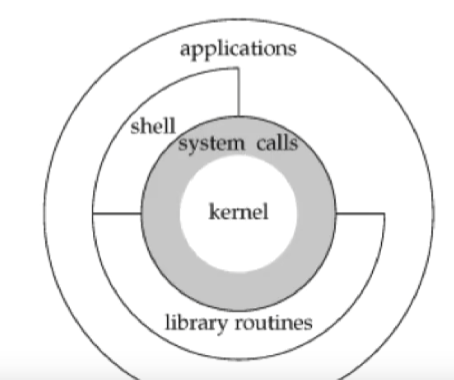

> 课程地址：https://stevens.netmeister.org/631/

# Lecture 001：大纲

+ Unix编程基础
+ 文件I/O，文件共享
+ 文件和目录
+ 文件系统，系统数据文件，时间以及日期
+ Unix工具：make，gdb，版本控制
+ 进程环境、进程控制
+ 进程组，会话，信号
+ 进程间通信
+ 守护进程，共享库（动态库）
+ 进阶I/O：非阻塞I/O，Polling和记录锁
+ 加密
+ 代码阅读，代码风格，代码实践
+ 回顾

# Lecture 003：Unix基础

经典Linux设计：



```bash
echo $? # 当运行一个程序后，查看该程序的返回值
echo $$ # 查看shell的pid
```

使用原生的编译器，可以在shell里添加环境变量以及命名别名来简化操作

```bash
vim ~/.bashrc
# 加入以下内容
CFLAGS='-Wall -Werror -Wextra'
alias gcc='gcc ${CFLAGS}'
alias g++='g++ ${CFLAGS}'
# wq
source ~/.bashrc
```

查找目录下头文件和源文件的代码数量并统计时间：

```bash
time find /dir -name '*.[ch]' -exec cat {} \;| wc -l
# 或者使用xargs更快
time find /dir -name '*.[ch]' -print | xargs cat | wc -l
```

I/O一般分为带缓冲和不带缓冲的

+ 带缓冲的一般是系统调用：如open,read,write,lseek,close
+ 不带缓冲的一般是库函数：如fopen,fread,fwrite,getc,putc

## 课堂练习以及示例

资源获取：

```bash
curl https://stevens.netmeister.org/631/apue-code.tat.gz
```


welcome.c

```c
#include <stdio.h>
#include <unistd.h>

int main(){
    printf("hello UNIX:%s\n",getlogin());	//getlogin():返回终端用户名。
}
```

simple-shell.c

```c
*
 * World's simplest shell.
 * Loops, reads input and tries to execute it.
 * Note: no tokenization, can be ^C'd, but does look at PATH
 *
 * ./simple-shell
 * $$ ls
 * $$ ls -l # error
 * $$ ^C
 *
 */

#include <sys/types.h>
#include <sys/wait.h>

#include <errno.h>
#include <stdio.h>
#include <stdlib.h>
#include <string.h>
#include <sysexits.h>
#include <unistd.h>

char* getinput(char *buffer, size_t buflen) {
	printf("$$ ");
	return fgets(buffer, buflen, stdin);
}

int main(int argc, char **argv) {
	char buf[BUFSIZ];
	pid_t pid;
	int status;

	/* cast to void to silence compiler warnings */
	(void)argc;
	(void)argv;

	while (getinput(buf, sizeof(buf))) {
		buf[strlen(buf) - 1] = '\0';

		if((pid=fork()) == -1) {
			fprintf(stderr, "shell: can't fork: %s\n",
					strerror(errno));
			continue;
		} else if (pid == 0) {   /* child */
			execlp(buf, buf, (char *)0);
			fprintf(stderr, "shell: couldn't exec %s: %s\n", buf,
					strerror(errno));
			exit(EX_UNAVAILABLE);
		}

		/* parent waits */
		if ((pid=waitpid(pid, &status, 0)) < 0) {
			fprintf(stderr, "shell: waitpid error: %s\n",
					strerror(errno));
		}
	}

	exit(EX_OK);
}
```

simple-shell2.c

```c
/*
 * World's 2nd simplest shell
 * Same as simple-shell.c, but with a SIGINT signal handler.
 * Feed EOF (^D) to exit.
 *
 * Also illustrates forward declaration of a function prototype.
 */

#include <sys/types.h>
#include <sys/wait.h>
#include <errno.h>
#include <signal.h>
#include <stdio.h>
#include <stdlib.h>
#include <string.h>
#include <sysexits.h>
#include <unistd.h>

char *
getinput(char *buffer, size_t buflen) {
	printf("$$ ");
	return fgets(buffer, buflen, stdin);
}

void
sig_int(int signo) {
	printf("\nCaught SIGINT (Signal #%d)!\n$$ ", signo);
	(void)fflush(stdout);
}

int
main(int argc, char **argv) {
	char buf[BUFSIZ];
	pid_t pid;
	int status;

	/* cast to void to silence compiler warnings */
	(void)argc;
	(void)argv;

	if (signal(SIGINT, sig_int) == SIG_ERR) {
		fprintf(stderr, "signal error: %s\n", strerror(errno));
		exit(1);
	}

	while (getinput(buf, sizeof(buf))) {
		buf[strlen(buf) - 1] = '\0';

		if((pid=fork()) == -1) {
			fprintf(stderr, "shell: can't fork: %s\n",
					strerror(errno));
			continue;
		} else if (pid == 0) {   /* child */
			execlp(buf, buf, (char *)0);
			fprintf(stderr, "shell: couldn't exec %s: %s\n", buf,
					strerror(errno));
			exit(EX_UNAVAILABLE);
		}

		/* parent waits */
		if ((pid=waitpid(pid, &status, 0)) < 0) {
			fprintf(stderr, "shell: waitpid error: %s\n",
					strerror(errno));
		}
	}

	exit(EX_OK);
}
```

simple-ls.c

```c
/*
 * simple-ls.c
 * Extremely low-power ls clone.
 * ./simple-ls .
 */

#include <sys/types.h>

#include <errno.h>
#include <dirent.h>
#include <stdio.h>
#include <stdlib.h>
#include <string.h>

int
main(int argc, char **argv) {

	DIR *dp;
	struct dirent *dirp;

	if (argc != 2) {
		fprintf(stderr, "usage: %s dir_name\n", argv[0]);
		exit(EXIT_FAILURE);
	}

	if ((dp = opendir(argv[1])) == NULL) {
		fprintf(stderr, "Unable to open '%s': %s\n",
					argv[1], strerror(errno));
		exit(EXIT_FAILURE);
	}

	while ((dirp = readdir(dp)) != NULL) {
		printf("%s\n", dirp->d_name);
	}

	(void)closedir(dp);
	return EXIT_SUCCESS;
}
```

simple-cat.c

```c
/*
 * Stripped down version of 'cat', using unbuffered I/O.
 * ./simple-cat < simple-cat.c
 *
 * Guess what, this is also a primitive version of 'cp':
 * ./simple-cat <simple-cat.c >simple-cat.copy
 */

#include <errno.h>
#include <stdio.h>
#include <stdlib.h>
#include <string.h>
#include <unistd.h>

#ifndef BUFFSIZE
#define BUFFSIZE 32768
#endif

int
main(int argc, char **argv) {
	int n;
	char buf[BUFFSIZE];

	/* cast to void to silence compiler warnings */
	(void)argc;
	(void)argv;

	while ((n = read(STDIN_FILENO, buf, BUFFSIZE)) > 0) {
		if (write(STDOUT_FILENO, buf, n) != n) {
			fprintf(stderr, "Unable to write: %s\n",
strerror(errno));
			exit(EXIT_FAILURE);
		}
	}

	if (n < 0) {
		fprintf(stderr, "Unable to read: %s\n", strerror(errno));
		exit(EXIT_FAILURE);
	}

	return(EXIT_SUCCESS);
}
```

> 可以利用重定向使用：./a.out < filename

simple-cat2.c

```c
/*
 * Stripped down version of 'cat', buffered version.
 * Guess what, this is also a primitive version of 'cp':
 * ./simple-cat <simple-cat.c >simple-cat.copy
 */

#include <errno.h>
#include <stdio.h>
#include <stdlib.h>
#include <string.h>
#include <unistd.h>

int
main(int argc, char **argv) {
	int c;

	/* cast to void to silence compiler warnings */
	(void)argc;
	(void)argv;

	while ((c = getc(stdin)) != EOF) {
		if (putc(c, stdout) == EOF) {
			fprintf(stderr, "Unable to write: %s\n",
					strerror(errno));
			exit(EXIT_FAILURE);
		}
	}

	if (ferror(stdin)) {
		fprintf(stderr, "Unable to read: %s\n",
					strerror(errno));
		exit(EXIT_FAILURE);
	}

	return(EXIT_SUCCESS);
}
```

# Lecture 004：文件描述符

获取一个进程可以打开的文件描述符数量，最好使用sysconf库函数和getrlimit系统调用

sysconf(_SC_OPEN_MAX)：OPEN_MAX代表当前用户所能打开的最大文件数量，在程序中如果这个值没有被定义，则使用sysconf(_SC_OPEN_MAX)获取当前进程所能打开的最大进程数

getrlimit和setrlimit：这两个函数可以获取和设定资源使用限制。每种资源都有相关的软硬限制，软限制是内核强加给相应资源的限制值，硬限制是软限制的最大值

openmax.c

```c
/*
 * This trivial program attempts to determine how many
 * open files a process can have.  It illustrates the
 * use of pre-processor directives and sysconf(3) to
 * identify a resource that can be changed at system
 * run time.
 *
 * This program also asks getconf(1) and explicitly
 * asks getrlimit(2).  Look at the source code for
 * getconf(1) and sysconf(3) to show how they are
 * implemented, as well as manual page and
 * implementation of getdtablesize(3).
 *
 * Run this once, then use 'ulimit -n' to change the
 * limit and run again.
 *
 * If you (as root) set 'ulimit -n unlimited', what
 * value will you get?  Why?
 *
 * What happens if you set this limit to, say, 0?
 * Why?
 */

#include <sys/resource.h>
#include <sys/stat.h>

#include <errno.h>
#include <fcntl.h>
#include <limits.h>
#include <stdio.h>
#include <stdlib.h>
#include <string.h>
#include <unistd.h>

int
countOpenFiles(int num) {
	struct stat stats;
	int count = 0;
	for (int i = 0; i < num; i++) {
		if (fstat(i, &stats) == 0) {
			printf("Currently open: fd #%d (inode %ld)\n", i,
					stats.st_ino);
			count++;
		}
	}

	return count;
}

void
openFiles(int num) {
	int count, fd;

	count = countOpenFiles(num);

	printf("Currently open files: %d\n", count);

	for (int i = count; i <= num ; i++) {
		if ((fd = open("/dev/null", O_RDONLY)) < 0) {
			if (errno == EMFILE) {
				printf("Opened %d additional files, then failed: %s (%d)\n", i - count, strerror(errno), errno);
				break;
			} else {
				fprintf(stderr, "Unable to open '/dev/null' on fd#%d: %s (errno %d)\n",
						i, strerror(errno), errno);
				break;
			}
		}
	}
}

int
main() {
	int openmax;
	struct rlimit rlp;

#ifdef OPEN_MAX
	printf("OPEN_MAX is defined as %d.\n", OPEN_MAX);
#else
	printf("OPEN_MAX is not defined on this platform.\n");
#endif


	printf("'getconf OPEN_MAX' says: ");
	(void)fflush(stdout);
	(void)system("getconf OPEN_MAX");

	/* see also: getdtablesize(3), notably the HISTORY section */
	errno = 0;
	if ((openmax = sysconf(_SC_OPEN_MAX)) < 0) {
		if (errno == 0) {
			fprintf(stderr, "sysconf(3) considers _SC_OPEN_MAX unsupported?\n");
		} else {
			fprintf(stderr, "sysconf(3) error for _SC_OPEN_MAX: %s\n",
					strerror(errno));
		}
		exit(EXIT_FAILURE);
		/* NOTREACHED */
	}
	printf("sysconf(3) says this process can open %d files.\n", openmax);

	if (getrlimit(RLIMIT_NOFILE, &rlp) != 0) {
		fprintf(stderr, "Unable to get per process rlimit: %s\n", strerror(errno));
		exit(EXIT_FAILURE);
	}
	openmax = (int)rlp.rlim_cur;
	printf("getrlimit(2) says this process can open %d files.\n", openmax);

	printf("Which one is it?\n\n");

	openFiles(openmax);

	return EXIT_SUCCESS;
}
```

# Lecture 005：open(2)和close(3)

